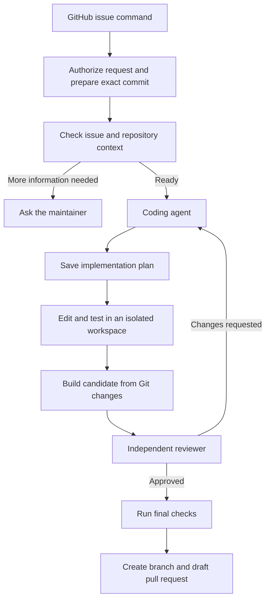
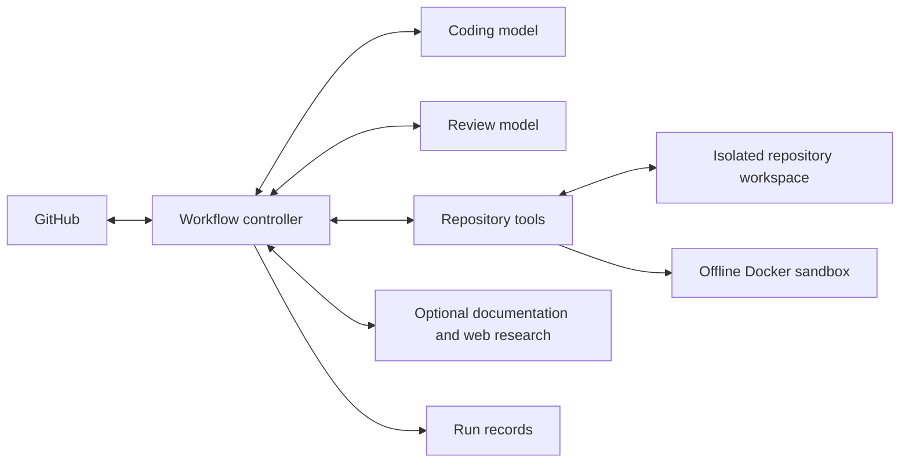

# Sage

Sage turns GitHub issues into draft pull requests. It studies the codebase,
plans the change, writes and tests the code in an isolated workspace, and sends
the result through an independent review. If an issue lacks key information,
Sage asks for clarification before making changes. It never merges code.

## Architecture

