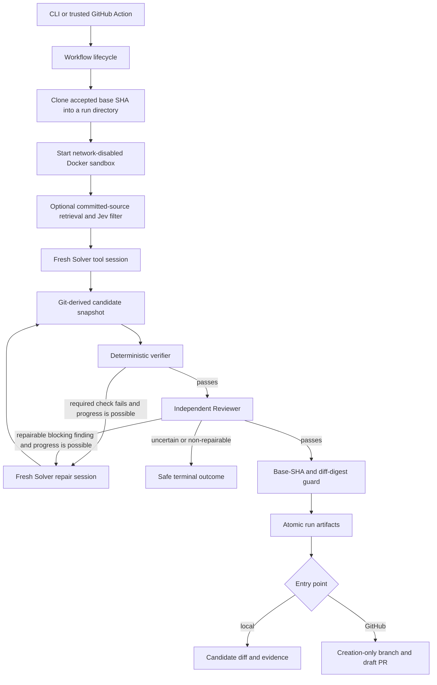
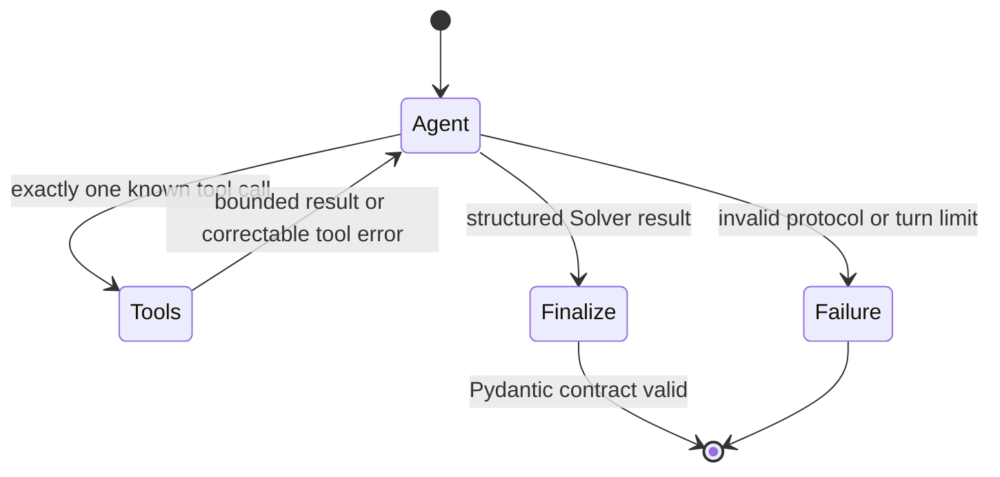
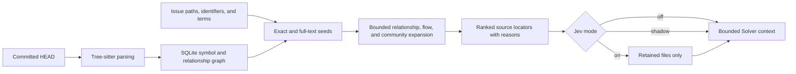

# Sage

Sage is an issue-to-draft-PR system. It accepts a repository revision and
an Issue, lets an OpenAI-backed Solver inspect and edit an isolated checkout,
verifies the resulting Git candidate with deterministic commands, and asks an
independent Gemini-backed Reviewer to judge the actual diff. The local workflow
returns a candidate and run evidence; the GitHub workflow can publish a
creation-only branch and draft pull request.

There is one supported solve architecture. Deterministic Python owns workflow
state, routing, verification, and publication; LangGraph is used only for each
bounded Solver tool session.

## Requirements

- Python 3.14 or newer
- `uv`
- Git
- Docker with a reachable daemon for sandboxed and live solves
- OpenAI and Gemini credentials for live solves

Repository retrieval itself is local and requires no model credentials. Jev,
LangSmith tracing, and GitHub automation are optional integrations.

## Installation

Install the locked backend environment from the repository root:

```bash
make setup
```

To install the Sage GitHub workflow in another repository, run this from that
repository's root:

```bash
curl -fsSL \
  https://raw.githubusercontent.com/24aysh/sage/e5534e4d5130e1229979ed85b53648d8ac40c4b2/.github/workflows/sage.yml \
  -o .github/workflows/sage.yml
```

The URL pins the workflow to an immutable Sage commit. Upgrade it by replacing
the SHA only after reviewing the newer workflow.

For the complete setup procedure, Docker image preparation, and platform notes,
use the [setup and testing guide](docs/testing.md#setup-and-complete-gate). GitHub
installation is documented separately in
[GitHub publication and installation](docs/testing.md#github-publication-and-installation).

## Configuration

Create a local configuration file without overwriting an existing one:

```bash
make env
```

For a live solve, set `OPENAI_API_KEY` and `GEMINI_API_KEY` in `.env` and keep
secret values out of version control. The main optional controls are defined in
[`.env.example`](.env.example):

| Area | Settings |
| --- | --- |
| Models | `SOLVER_MODEL`, `REVIEWER_MODEL`, `OPENAI_MAX_RETRIES` |
| Runtime bounds | `SAGE_MAX_TURNS`, `SAGE_COMMAND_TIMEOUT_SECONDS`, `SAGE_MAX_TOOL_OUTPUT_CHARS` |
| Verification | `SAGE_VERIFICATION_COMMANDS_JSON`, `SAGE_VERIFICATION_PREFLIGHT` |
| Retrieval and Jev | `SAGE_RETRIEVAL_INITIAL_CONTEXT_CHARS`, `SAGE_JEV_NAVIGATION_MODE`, `TYPESAFE_API_KEY` |
| Observability | `LANGSMITH_TRACING`, `LANGSMITH_API_KEY`, `LANGSMITH_PROJECT` |

`sage/config.py` is the only backend environment-loading boundary. The GitHub
workflow keeps non-secret values in `.github/workflows/sage.yml` and credentials
in GitHub Secrets. Add `OPENAI_API_KEY` and `GEMINI_API_KEY` as repository or
environment Secrets. `TYPESAFE_API_KEY` is required only when Jev mode is
`shadow` or `on`; `LANGSMITH_API_KEY` is required only when tracing is enabled.
Configure non-secret GitHub settings in the workflow's top-level `env:` block.
See [GitHub publication and installation](docs/testing.md#github-publication-and-installation)
for permissions, optional settings, and validation commands.

## Local solve

```bash
make bootstrap
uv run --env-file .env --project apps/agent sage solve \
  --repo /absolute/repository \
  --issue-file /absolute/issue.md \
  --base-ref HEAD
```

Add `--index-file /absolute/index/graph.sqlite3` to bind a ready retrieval index
and supply Issue-ranked structural context. Without that option, the Solver uses
repository tools without a retrieval index.

## Architecture

The controller keeps model judgment behind deterministic boundaries. The Issue
and saved plan define intent, Git defines what changed, and retrieval supplies
navigation hints only.


```mermaid
flowchart TD
    A[CLI or trusted GitHub Action] --> B[Workflow lifecycle]
    B --> C[Clone accepted base SHA into a run directory]
    C --> D[Start network-disabled Docker sandbox]
    D --> E[Optional committed-source retrieval and Jev filter]
    E --> F[Fresh Solver tool session]
    F --> G[Git-derived candidate snapshot]
    G --> H[Deterministic verifier]
    H -- required check fails and progress is possible --> R[Fresh Solver repair session]
    R --> G
    H -- passes --> I[Independent Reviewer]
    I -- repairable blocking finding and progress is possible --> R
    I -- uncertain or non-repairable --> T[Safe terminal outcome]
    I -- passes --> J[Base-SHA and diff-digest guard]
    J --> K[Atomic run artifacts]
    K --> L{Entry point}
    L -- local --> M[Candidate diff and evidence]
    L -- GitHub --> N[Creation-only branch and draft PR]
```

The main dependency direction is:

```text
CLI / GitHub interface
        ↓
workflows (resource lifetimes)
        ↓
orchestration (solve, verify, review, repair)
        ↓
agents + typed capabilities
        ↓
domain contracts, repository, verification, providers, artifacts
```

`composition.py` is the only production construction map. Workflows own startup
and cleanup; orchestration owns decisions; agents receive narrow capabilities;
provider and GitHub-specific data do not become core domain state. Architectural
tests enforce acyclic imports and prevent inner layers from reaching back into
CLI, workflow, integration, or sandbox implementations.

## Execution path

One solve proceeds in this order:

1. The CLI or GitHub controller validates the request, resolves the base ref to
   an exact commit, and clones it into a unique run directory.
2. `RunArtifacts` records the request, accepted SHA, Issue, settings metadata,
   and later evidence using atomic file replacement.
3. The workflow starts the network-disabled Docker sandbox and optionally
   checks verification tooling.
4. A retrieval-enabled run builds or refreshes a graph from committed `HEAD`,
   validates its repository/SHA provenance, and retrieves bounded Issue context.
   The optional Jev filter runs at this point, before the first Solver call.
5. The Solver starts a fresh bounded tool session. It must persist a typed plan
   before any mutation tool is allowed.
6. When the Solver reports implementation, the controller ignores its file
   claims and derives the changed paths, complete diff, and digest from Git.
7. The verifier runs `git diff --check HEAD --`, up to three configured checks,
   and allowlisted optional commands proposed in the plan. Required failures or
   timeouts can produce a fresh repair session.
8. After verification passes, the Reviewer receives the Issue, saved plan,
   actual changed files and diff, verification result, and Solver summary. It has
   no repository mutation tools.
9. A passing review must cover every planned acceptance criterion. The
   controller then confirms that both `HEAD` and the diff digest are unchanged.
10. The workflow writes terminal evidence and always closes the sandbox and
    retrieval session. GitHub publication, when used, happens only after a
    completed non-empty candidate.

## Solver and Reviewer orchestration

### Solver tool loop

Each initial solve or repair is a new, checkpoint-free LangGraph session. Its
in-memory state contains only the message history, model-turn count, pending
structured output, and validated final output.


```mermaid
stateDiagram-v2
    [*] --> Agent
    Agent --> Tools: exactly one known tool call
    Tools --> Agent: bounded result or correctable tool error
    Agent --> Finalize: structured Solver result
    Agent --> Failure: invalid protocol or turn limit
    Finalize --> [*]: Pydantic contract valid
    Failure --> [*]
```

The model may make one tool call per turn; parallel tool calls are disabled. A
known repository error or invalid tool arguments are returned to the model as
bounded correction feedback. Mixed tool/output responses, unknown tools,
multiple calls, missing structured output, and exhausted turn budgets terminate
the session instead of executing ambiguous work.

The Solver can inspect the tree, search and read source, inspect or switch Git
branches, use the five solve-profile graph tools when retrieval is available,
edit through structured file operations, view the diff, and run policy-approved
verification commands. `save_plan` or `revise_plan` controls the mutation gate;
a missing or blocked plan cannot authorize writes.

### Review and repair

The Reviewer is a separate provider call with a typed result: `pass`, `fail`, or
`uncertain`. A pass is rejected unless each saved acceptance criterion appears
exactly once and is satisfied. An uncertain review stops with
`human_required_after_start`.

Implementation, planning, and verification findings can start a repair. Repair
does not continue the old Solver transcript: it starts a fresh tool loop with
the Issue, latest saved plan, current Git diff, and blocking findings. The plan
session and workspace remain run-scoped, so a repair can revise the plan and
edit the same candidate without inheriting stale model conversation.

## Context management

Context is assembled at explicit boundaries rather than accumulated in a global
conversation:

| Context | Construction and limits |
| --- | --- |
| Role policy | Static Solver and Reviewer prompts in `agents/prompts.py`, supplied with each role call. |
| Initial Solver input | Accepted base SHA, the Issue in an untrusted-data envelope, and optional bounded retrieval context. |
| Tool results | Current source reads and searches with output caps; file reads return at most 300 numbered lines. Retrieval enrichment is separately budgeted and deduplicated. |
| Repair input | Issue, latest plan, current diff, blocking findings, and unchanged accepted-base retrieval locators. |
| Reviewer input | Issue, plan, Git-derived changed files and diff, deterministic verification, and Solver summary. |

The static role prompts are supplied on every invocation, including repairs and
rereviews. There is no implicit summarizer or additional model call. Input caps
fail explicitly rather than silently truncating the authoritative review or
repair packet.

Retrieval visibility belongs to one Solver history. A repair resets visibility
and deduplication, while the run-level accounting remains intact. Once a file is
edited or moved, its accepted-base locator is invalidated so stale line ranges
are not reintroduced as current evidence. Direct current-source reads retain
priority over derived graph context.

## State and evidence

Sage has no cross-run agent memory or global state engine. State is divided by
authority and lifetime:

| State | Lifetime | Authority |
| --- | --- | --- |
| `PreparedRun` / `SolveContext` | One solve | Frozen run identity, accepted SHA, dependencies, settings, and capabilities |
| LangGraph `AgentState` | One Solver session | Ephemeral message and turn state; no checkpointing |
| `SolverPlanSession` | One solve | Latest typed plan revision; every revision is persisted |
| `RetrievalSession` | One solve | Base-snapshot graph binding, visibility, invalidation, budgets, and usage |
| Git workspace | One solve | Authoritative `HEAD`, changed files, and complete candidate diff |
| `ModelCalls` | One solve | Deadline, retries, model/tool usage, timing, and command provenance |
| `RunArtifacts` | Durable run evidence | Atomic JSON, Markdown, patch, and verification-log records |

Typical evidence includes the Issue and request, solver plan revisions, Solver
final output, candidate snapshot, verification passes and logs, versioned
reviews, model/tool usage, retrieval and relevance reports, terminal outcome,
changed-file list, and `diff.patch`. Model-authored summaries never replace Git
or verification evidence.

The retrieval SQLite database is also not agent memory. It is a rebuildable
index of committed source with repository identity, indexed SHA, parser version,
and schema provenance. GitHub creates a fresh runner-owned index for each solve;
it is neither cached nor uploaded.

## Retrieval

Retrieval is a local lexical and structural navigation layer. It has no embedding
backend, model-provider dependency, or remote store.


```mermaid
flowchart LR
    A[Committed HEAD] --> B[Tree-sitter parsing]
    B --> C[SQLite symbol and relationship graph]
    D[Issue paths, identifiers, and terms] --> E[Exact and full-text seeds]
    C --> E
    E --> F[Bounded relationship, flow, and community expansion]
    F --> G[Ranked source locators with reasons]
    G --> H{Jev mode}
    H -- off --> I[Bounded Solver context]
    H -- shadow --> I
    H -- on --> J[Retained files only]
    J --> I
```

`RepositoryIndex` inventories blobs with Git, parses supported source files, and
chooses a full, incremental, or no-change build. The graph records symbols and
relationships such as containment, imports, calls, inheritance, tests, routes,
events, and configuration references. Ranking extracts bounded signals from the
Issue, finds exact and full-text candidates, expands structurally, and emits
source locations, scores, and selection reasons rather than whole-file content.

Preparation verifies that the graph repository identity and indexed SHA match
the accepted base. Its runtime outcomes are:

| Status | Solver behavior |
| --- | --- |
| `used` | Receives initial context and five read-only graph tools: lexical search, relationship query, flow, community, and impact. |
| `no_match` | Continues with normal source tools and no graph packet or graph tools. |
| `unavailable` | Continues with normal source tools and records an explicit fallback artifact. |

Graph responses are bounded, validated, and read-only; the model cannot submit
SQL or choose an arbitrary database. Retrieval context can suggest where to
inspect, but it cannot satisfy an acceptance criterion, authorize mutation, or
override current source.

## Jev relevance filtering

Jev is an optional one-shot filter between deterministic retrieval and initial
Solver context. It does not replace retrieval and cannot call tools.

`harness/jev/filter.py` groups retrieved symbols by file and supplies bounded
metadata—path, language, symbol kind/name, signature, location, and retrieval
reasons. `harness/jev/provider.py` sends one batched TypeSafe request containing
one independent score question per file over the same Issue state. Responses
must contain the exact candidate IDs, valid probability distributions, a
consistent weighted score on the 0–3 relevance scale, confidence, and token
usage.

| `SAGE_JEV_NAVIGATION_MODE` | Behavior |
| --- | --- |
| `off` | Default. Use deterministic lexical/graph selection and make no Jev request. |
| `shadow` | Score once and record what would be discarded, but keep lexical selection. |
| `on` | Keep a file only when score is at least `2.0` and confidence is at least `0.5`, unless configured otherwise. |

The complete Issue is limited to 6,000 characters and the encoded request to
16,000 bytes. The call has a maximum two-second timeout and no retry. In `on`
mode, a timeout, invalid response, oversized request, or insufficient remaining
time withholds unjudged context and records why; it is not mislabeled as a Jev
rejection. The Solver can still use ordinary source tools. Jev never becomes a
file-access allowlist; when filtered retrieval remains `used`, explicit graph
tools remain available. An all-rejected result is a valid empty selection.

Jev runs at most once per solve. Repairs reuse unchanged retained locators, and
automatic retrieval enrichment is disabled in `on` mode so discarded files are
not immediately reintroduced. `relevance-filter.json` records thresholds,
decisions, omissions, latency, and token usage. The evaluator under
`evals/retrieval/` reuses the production shortlist and filter without running a
Solver, Reviewer, sandbox, or publication workflow.

## Failure containment and stalled runs

Sage does not claim to detect every hallucination. Instead, it prevents
model-authored claims from becoming authority without independent evidence:

| Condition | Control and terminal behavior |
| --- | --- |
| Solver invents changed files or reports implementation without a candidate | Changed paths and diff come from Git; an empty or inconsistent candidate is rejected. |
| Solver claims tests passed | Claims are retained only as metadata; the controller runs its own verification plan in the sandbox. |
| Model returns malformed or contradictory output | Pydantic and cross-field contracts reject it as `invalid_model_output` or `unresolved`. |
| Solver tries to mutate before planning or requests a disallowed command | The plan gate and verification-command allowlist reject the operation. |
| Verification fails | A fresh repair is allowed only while the candidate/failure fingerprint changes and time remains. |
| Reviewer finds a repairable problem | A fresh repair session receives the actual diff and blocking findings, followed by a new verification and review. |
| Reviewer is uncertain or reports ambiguity/environment failure | The controller stops for human or environment action instead of guessing. |
| Repair repeats the same diff and failure fingerprint | The controller stops with `verification_failed` or `review_failed`; it does not loop indefinitely. |
| Solver exhausts its turn budget or violates the tool protocol | The session stops as `unresolved`; a defensive graph recursion limit is separate from the model-turn limit. |
| Provider is rate-limited or unavailable | Reviewer calls have one bounded eligible retry and one schema-repair attempt; deadlines, retry-after limits, and a failure circuit preserve finalization time. OpenAI retry behavior is bounded by `OPENAI_MAX_RETRIES`. |
| Retrieval or Jev is unavailable | The failure is visible in artifacts; solving can continue through current-source tools. |
| Process is interrupted | Partial usage and interruption evidence are written when possible, then sandbox and retrieval resources are closed. |

The sandbox has networking disabled, command execution is timed and bounded,
verification logs redact common credential forms, and candidate drift is checked
both during verification and after review. These controls reduce the blast
radius of model or provider failures; the draft PR still requires human review.

## GitHub workflow

The installed workflow responds only to an exact `/sage solve` Issue comment.
The gate accepts repository permissions `write` and `admin`, rejects pull-request
comments and duplicate Sage branches/PRs, and records the exact default-branch
SHA before model construction. The solve job rechecks authorization and
duplicate state, checks out that SHA without persisted credentials, and builds a
fresh sandbox and retrieval index.

Publication revalidates the solve base, creates the deterministic
`sage/issue-<number>` branch with creation-only push semantics, and opens a draft
PR. It never force-updates an existing branch. If PR creation is ambiguous after
the push, the controller tries to reconcile the matching PR and otherwise
reports the preserved orphan branch. A final workflow job repairs missing
terminal status after interruption.

## Repository structure

```text
.
├── .github/
│   ├── actions/               # Composite authorization and solve controllers
│   └── workflows/sage.yml     # /sage solve workflow and permissions
├── apps/
│   ├── agent/
│   │   ├── src/sage/          # Production Python package
│   │   ├── tests/             # Tests mirrored by production responsibility
│   │   ├── pyproject.toml     # Package metadata and dependency boundaries
│   │   └── uv.lock            # Locked Python environment
├── docker/sandbox/            # Network-disabled execution image
├── docs/
│   ├── architecture.md        # Detailed ownership and extension guide
│   └── testing.md             # Setup, testing, live-solve, and canary procedures
├── evals/retrieval/           # Offline dataset handling and live Jev evaluation
├── specs/                     # Retained design and implementation history
├── .env.example               # Safe configuration template
├── Makefile                   # Setup, retrieval, artifact, and check commands
└── README.md                  # Architectural entry point
```

## Backend module ownership

Production paths below are relative to `apps/agent/src/sage/`.

| Module | Responsibility |
| --- | --- |
| `cli/` | Argument parsing, output rendering, exit policy, and command dispatch |
| `composition.py` | Concrete construction of Solver, Reviewer, retrieval, and optional Jev adapters |
| `config.py` | Typed environment loading and validation |
| `workflows/` | Local/GitHub resource lifetimes, setup, cleanup, and use-case boundaries |
| `orchestration/` | Deterministic solve → verify → review → repair routing and candidate guards |
| `agents/` | Solver and Reviewer roles, prompts, plan/mutation gate, and bounded LangGraph loop |
| `harness/context/` | Message envelopes, run capabilities, and tool exposure |
| `harness/retrieval/` | Committed-source indexing, SQLite graph queries, ranking, context, and run visibility |
| `harness/jev/` | One-shot file relevance filter and TypeSafe transport |
| `domain/` | Provider-neutral typed solve, plan, review, verification, retrieval, relevance, and usage contracts |
| `repository/` | Validated filesystem, search, Git, branch, and command capabilities |
| `verification/` | Conservative command discovery, preflight, execution, logs, and failure fingerprints |
| `providers/` | OpenAI/Gemini boundaries, normalized failures, retries, deadlines, and usage accounting |
| `sandbox/` | Disposable Docker execution with resource and network controls |
| `artifacts/` | Atomic run-scoped evidence persistence |
| `integrations/github/` | GitHub events, authorization, status, diagnostics, API transport, and publication |

For deeper ownership rules and supported extension points, read
[`docs/architecture.md`](docs/architecture.md).

## Verification and development checks

The complete model-free backend gate is:

```bash
make check
```

Additional canonical checks are:

```bash
make graph
make github-smoke
make github-doctor
```

`make graph` prints Mermaid generated from the compiled Solver loop.
`github-smoke` exercises publication without model or network calls, and
`github-doctor` diagnoses the installed workflow without printing secret values.
Focused retrieval, Jev, Docker, live-solve, GitHub, and evaluation procedures
are documented in [`docs/testing.md`](docs/testing.md).
