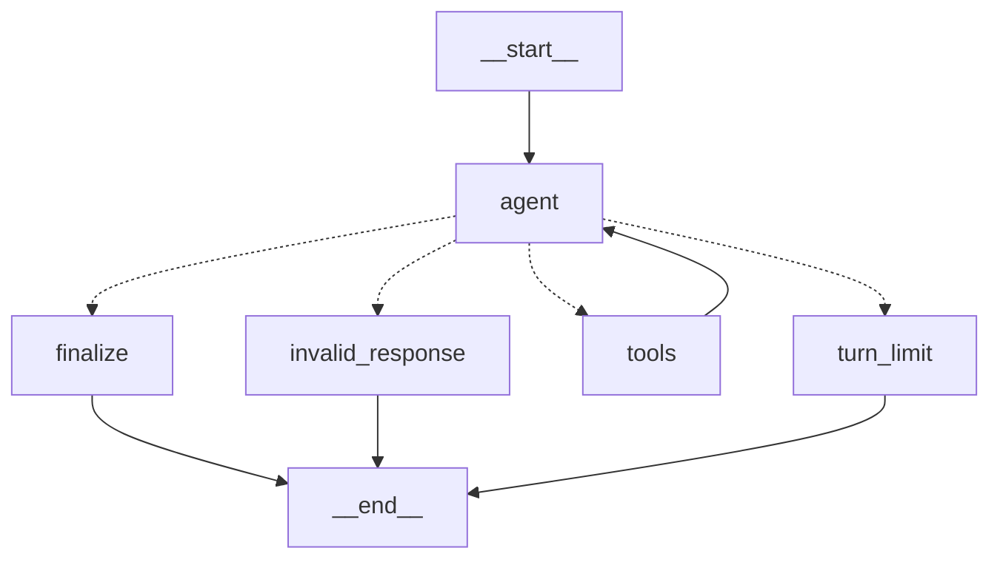

# V0.1 Backend Implementation

## Status

V0.1 is implemented as a local, single-agent issue solver. It accepts a local Git
repository and a written issue, creates an isolated clone at a committed
revision, lets one coding agent inspect and modify that clone through bounded
repository tools, and saves the resulting Git patch and run metadata.

V0 is intentionally local. It does not publish branches, open pull requests,
receive GitHub events, or mutate the source checkout.

The implementation uses the default Python version available in the development
environment, Python 3.14.

The current tree uses the Sage project, package, CLI, configuration, sandbox,
and artifact identifiers. This naming migration does not alter the V0 workflow
or its safety boundaries.

## Implemented behavior

Given:

- a path to a local Git repository;
- a Markdown or text issue file;
- an optional committed base reference;
- a built Docker sandbox image; and
- an OpenAI API key;

the controller performs the following work:

1. Validates configuration, paths, Git, Docker, the Docker daemon, and the
   requested sandbox image.
2. Resolves the requested base reference to a commit SHA.
3. Allocates a unique run directory.
4. Clones the source repository without hardlinks and checks out the resolved
   commit in detached-HEAD mode.
5. Persists the request, issue, and initial metadata.
6. Starts a disposable, network-disabled Docker container with only the cloned
   repository mounted at `/workspace`.
7. Runs one project-owned LangGraph coding agent with a fixed set of
   project-owned repository tools.
8. Derives the changed-file list and complete binary-capable patch from Git.
9. Persists the model's structured final response and the authoritative Git
   results.
10. Stops and removes the Docker container, including when the runtime fails.

Uncommitted changes in the source checkout are not copied. The solve always
starts from the committed revision selected by `--base-ref`.

## Architecture

```text
repository + issue file
          │
          ▼
     sage CLI
     validation/config
          │
          ▼
  provider-neutral workflow
     ┌────┴───────────────┐
     │                    │
     ▼                    ▼
AgentRuntime          workspace preparation
protocol              isolated Git clone
     │                    │
     ▼                    ▼
LangGraph StateGraph ─► RepositoryTools façade
runtime               tree/search/read/patch/
                      command/diff operations
                            │
                            ▼
                    disposable Docker sandbox
                    /workspace, no network
                            │
                            ▼
                    authoritative Git results
                    + filesystem artifacts
```

The important boundary is the project-owned `AgentRuntime` protocol. Workflow,
domain models, repository operations, sandboxing, and artifact persistence do
not depend on LangGraph or provider response types. `LangGraphRuntime` owns the
reasoning loop behind that boundary.

## Source layout

```text
apps/agent/
  pyproject.toml
  uv.lock
  src/sage/
    cli.py                         command-line boundary
    config.py                      typed environment configuration
    errors.py                      application exception hierarchy
    domain/
      requests.py                  solve and prepared-run inputs
      results.py                   agent and solve outputs
      runtime.py                   provider-neutral runtime contract
    workflow/
      solve.py                     solve lifecycle orchestration
    repository/
      __init__.py                  RepositoryTools façade
      workspace.py                 isolated clone preparation
      paths.py                     workspace path validation
      tree.py                      bounded tree listing
      search.py                    literal ripgrep search
      files.py                     bounded text reads
      patch.py                     validated patch application
      commands.py                  bounded sandbox commands
      git.py                       authoritative status and diff operations
      output.py                    shared output truncation
    sandbox/
      base.py                      sandbox protocol and command result
      docker.py                    Docker CLI implementation
    runtimes/langgraph/
      graph.py                     state, nodes, routing, and topology
      runtime.py                   AgentRuntime and model adapter
      prompt.py                    coding-agent instructions and input
      tools.py                     thin LangChain tool wrappers
    artifacts/
      store.py                     atomic filesystem persistence
  tests/                            focused unit tests by responsibility
docker/sandbox/Dockerfile           default execution environment
examples/issue.md                   issue input template
.env.example                        supported configuration
```

## Domain contracts

The core models are deliberately small and provider-neutral.

### `SolveRequest`

Represents one requested solve:

- `repo_path`: source repository path;
- `issue_path`: Markdown or text issue path;
- `base_ref`: committed Git reference, defaulting to `HEAD`;
- `sandbox_image`: optional per-run image override.

### `PreparedRun`

Records trusted workspace preparation results:

- unique run ID;
- normalized source repository path;
- run artifact directory;
- isolated workspace path;
- requested base reference;
- resolved base commit SHA.

### `AgentFinalOutput`

The runtime must return structured output containing:

- a summary;
- files the model believes it changed;
- remaining uncertainties or blockers.

The model's changed-file claim is stored for inspection but is not authoritative.

### `SolveResult`

The workflow returns:

- run ID and base SHA;
- model summary and remaining uncertainty;
- actual changed files derived from Git;
- the complete Git diff;
- run and workspace paths.

### `AgentRuntime`

`AgentRuntime` is an async protocol with one operation:

```python
async def solve(
    *,
    issue_text: str,
    context: RuntimeContext,
) -> AgentFinalOutput: ...
```

`RuntimeContext` provides the prepared run, sandbox, repository-tool façade,
and validated settings. A future runtime can implement this contract without
changing the solve workflow.

## Configuration

Configuration is loaded once from the host environment by the immutable
Pydantic `Settings` model. Secrets are not passed to the repository container.

| Environment variable | Default | Purpose |
| --- | --- | --- |
| `OPENAI_API_KEY` | required | API credential used by the host runtime |
| `OPENAI_MODEL` | `gpt-5.3-codex` | model used by the V0 coding agent |
| `SAGE_MAX_TURNS` | `30` | maximum SDK agent turns |
| `SAGE_RUNS_DIR` | `.sage/runs` | local artifact root |
| `SAGE_SANDBOX_IMAGE` | `sage-sandbox:v0` | default Docker image |
| `SAGE_COMMAND_TIMEOUT_SECONDS` | `60` | maximum repository-command duration |
| `SAGE_MAX_TOOL_OUTPUT_CHARS` | `12000` | maximum returned tool output |

Turn counts and timeouts must be at least one. The tool output cap must be at
least 1,000 characters. Invalid values fail at the configuration boundary.

V0 does not add a dotenv dependency. Environment loading remains explicit and
uses the standard library.

## CLI

Install the locked Python environment from the repository root:

```bash
uv sync --project apps/agent
```

Build the default sandbox image:

```bash
docker build \
  -t sage-sandbox:v0 \
  -f docker/sandbox/Dockerfile \
  .
```

Set the required credential and, optionally, select a different model:

```bash
export OPENAI_API_KEY="your-key"
export OPENAI_MODEL="gpt-5.3-codex"
```

Run a solve:

```bash
uv run --project apps/agent sage solve \
  --repo /absolute/path/to/repository \
  --issue-file /absolute/path/to/issue.md
```

Supported options are:

- `--base-ref <ref>`: selects a commit, branch, or tag resolving to a commit;
- `--sandbox-image <image>`: overrides the configured image for this run;
- `--debug`: enables debug logging and tracebacks for failures.

The process exit codes are:

- `0`: the runtime completed and Git found a non-empty diff;
- `1`: validation, workspace, sandbox, runtime, artifact, or unexpected failure;
- `2`: the runtime completed without a repository change.

## Workspace preparation

Every run receives a sortable identifier containing a UTC timestamp and random
suffix, for example:

```text
20260816T120000Z-a1b2c3d4
```

The controller resolves the source repository's top-level directory, verifies
the base reference with `git rev-parse`, and creates:

```text
.sage/runs/<run-id>/repo/
```

The clone uses `--no-hardlinks --no-checkout`, followed by a detached checkout
of the resolved SHA. This isolates candidate changes from the original working
tree and makes the base revision explicit and reproducible.

## Docker sandbox

The default image is based on Ubuntu 24.04 and contains only the basic tooling
needed for repository inspection and common verification:

- Bash;
- Git;
- Python 3;
- ripgrep;
- core and file utilities;
- CA certificates.

The container is started with these constraints:

- no network access;
- two CPU limit;
- 4 GiB memory limit;
- 256-process limit;
- all Linux capabilities dropped;
- `no-new-privileges` enabled;
- only the isolated workspace bind-mounted;
- `/workspace` as the working directory;
- no OpenAI key or Docker socket;
- `HOME=/tmp`.

Commands use both an in-container GNU `timeout` and a host-side subprocess
timeout. Timeout results are returned as structured `CommandResult` values with
exit code 124 where applicable. Container removal is attempted in the
workflow's `finally` path.

The default image is intentionally generic. Repositories needing additional
language runtimes or build tools can provide a compatible image with
`--sandbox-image`.

## Repository tools

The agent receives exactly six SDK-visible capabilities. SDK wrappers contain
no repository business logic; they delegate to `RepositoryTools`.

| Tool | Implemented behavior and bounds |
| --- | --- |
| `list_tree` | Lists a repository subtree with depth 0–4 and at most 500 entries; skips common generated directories. |
| `search_text` | Performs fixed-string ripgrep search, returns at most 100 requested matches, and ignores generated/vendor paths. |
| `read_file` | Reads UTF-8 text with line numbers, at most 300 lines per call; rejects binary input. |
| `apply_patch` | Validates unified-diff paths, rejects workspace escape and `.git` access, and applies through `git apply`. |
| `show_diff` | Returns bounded Git status, diff statistics, and textual diff. |
| `run_command` | Executes a command in Docker, caps command length at 4,000 characters, caps timeout, and returns bounded structured output. |

All path-based operations reject:

- absolute paths;
- `..` traversal outside the workspace;
- direct `.git` access;
- symlink resolution outside the workspace;
- symlinks resolving into Git internals.

Tool output is truncated from the middle when necessary so useful context from
both the beginning and end is retained. Tool calls also emit timing-aware log
records without logging secrets.

`run_command` intentionally allows a general shell command, but it executes only
inside the constrained repository container. The command timeout requested by
the agent can reduce the configured maximum but cannot increase it.

## Patch handling and authoritative results

Patches are supplied as unified Git diffs. Before applying a patch, the
controller extracts paths from `diff --git`, `---`, and `+++` headers and checks
every target against workspace safety rules. Patch data is written temporarily
under the clone's `.git` directory, consumed with `git apply`, and removed in a
`finally` block.

After the runtime finishes, the workflow does not trust its claimed file list.
It runs Git operations in the sandbox to derive:

- `git status --short --untracked-files=all`;
- diff statistics;
- a bounded display diff;
- the complete `git diff --binary` patch;
- a NUL-delimited changed-file list.

Before diffing, untracked files are marked with Git intent-to-add so new files
are included in the authoritative patch without staging their content as a
candidate commit.

## LangGraph runtime

`LangGraphRuntime` is the concrete V0.1 implementation. It constructs a
host-side `ChatOpenAI` model, binds the same six repository tools and
`AgentFinalOutput` response schema, and compiles a fresh graph for every solve.
The graph explicitly owns five nodes:

- `agent`: makes one asynchronous model decision and increments model turns;
- `tools`: executes exactly one project-owned repository tool through
  `ToolNode`;
- `finalize`: validates the provider-parsed value with Pydantic;
- `turn_limit`: fails before executing a tool that cannot receive a subsequent
  model decision; and
- `invalid_response`: rejects missing, mixed, multiple, or unknown responses.

`tools` loops back to `agent`; all other routes are terminal. The explicit
model-turn limit remains `SAGE_MAX_TURNS`, and LangGraph receives the
secondary recursion limit `(2 * max_turns) + 4`. No checkpointer or persistent
message history is configured.

The executable graph currently renders as:



The runtime input contains the resolved base SHA, exact issue text, and an
explicit instruction to work only through provided tools. Model, graph,
routing, recursion, and validation failures become `AgentRuntimeError` at the
adapter boundary.

The coding instructions require inspection before editing, bounded tool use,
minimal coherent changes, actual diff review, no credential or host-file
access, and a concrete blocker when the issue cannot be solved responsibly.
Repository content is explicitly treated as untrusted data rather than as
instructions to the agent.

## Workflow lifecycle

The provider-neutral `solve_issue` orchestration is responsible for lifecycle,
not coding policy:

1. Apply a per-request sandbox image override when provided.
2. Read the issue as UTF-8.
3. Prepare the isolated clone.
4. Initialize run artifacts.
5. Start the sandbox.
6. Build the repository-tool façade and runtime context.
7. Await the configured runtime.
8. Read the full diff and changed files from Git.
9. Build and persist the solve result.
10. Stop the sandbox in `finally`.

Factories for the sandbox, repository tools, and artifact store are injectable.
This keeps routing and cleanup behavior deterministically testable without a
live model or Docker daemon.

## Run artifacts

Each invocation leaves a local record under:

```text
.sage/runs/<run-id>/
  request.json
  metadata.json
  issue.md
  agent-final.json
  changed-files.json
  diff.patch
  repo/
```

The files contain:

- `request.json`: normalized solve input;
- `metadata.json`: run ID, timestamp, base ref/SHA, model, and sandbox image;
- `issue.md`: exact issue text supplied to the runtime;
- `agent-final.json`: structured summary, claimed files, and uncertainties;
- `changed-files.json`: authoritative changed paths derived from Git;
- `diff.patch`: complete binary-capable patch derived from Git;
- `repo/`: inspectable candidate checkout with the applied changes.

JSON and text artifacts are written through temporary sibling files and then
atomically replaced. The API key and complete host environment are not stored.

## Error handling and observability

Expected failures use an application exception hierarchy rooted at
`SageError`. Specific types distinguish configuration, workspace,
repository, path safety, command execution, command timeout, patch, sandbox,
runtime, and artifact failures.

The CLI converts expected errors to concise messages and exit code 1. Debug mode
adds tracebacks. Unexpected exceptions are also contained at the CLI boundary.

Structured logging records major lifecycle transitions, including workspace
preparation, artifact persistence, sandbox start/stop, repository-tool duration,
command exit status, and timeout state. Secrets and complete sensitive payloads
are not deliberately logged.

## Dependencies

Production dependencies are limited to:

- `langgraph` for the explicit state graph and `ToolNode`;
- `langchain-core` for messages, tools, and runnable contracts;
- `langchain-openai` for the host-side `ChatOpenAI` adapter;
- `pydantic` for typed settings and domain models.

The package uses Hatchling for builds, uv for the locked environment, and
pytest as its development test dependency. Repository and Docker operations use
the Python standard library and installed command-line tools instead of adding
wrapper libraries.

## Verification implemented

The deterministic test suite covers:

- complete environment configuration and validation failures;
- committed-revision-only workspace cloning;
- workspace path traversal, symlink escape, and `.git` protection;
- bounded tree, search, file-reading, command, and output behavior;
- binary-file rejection and read limits;
- patch path validation and temporary-file cleanup;
- inclusion of new untracked files in Git results;
- Docker isolation arguments and timeout behavior;
- the exact six runtime tools exposed to the model;
- pure graph routes, node behavior, compiled topology, and Mermaid rendering;
- complete fake-model tool loops, termination, and failure paths;
- model-turn and defensive recursion limits;
- provider, graph, tool, and structured-output failure translation;
- artifact persistence without storing the API key;
- workflow use of authoritative Git results;
- sandbox cleanup after success and runtime failure.

The following checks were run against the implemented V0.1:

```bash
uv run --project apps/agent pytest
uv run --project apps/agent python -m compileall -q apps/agent/src
uv run --project apps/agent sage --help
```

The test suite completed with 68 passing tests. The default Docker image also
built successfully, and a start/execute/stop smoke test completed successfully.
No paid live OpenAI solve was run as part of deterministic verification. A
separate live `gpt-5.4-mini` calculator solve later completed successfully
through the Responses API and passed both documented addition assertions.

## Deliberate V0 boundaries

V0 does not implement:

- GitHub authentication, webhooks, issue retrieval, branch publishing, or pull
  request creation;
- a GitHub Actions workflow;
- an HTTP API, database, queue, or distributed worker;
- multiple cooperating agents, handoffs, graph orchestration, or review loops;
- persistent memory beyond local run artifacts;
- automatic commits in the candidate repository;
- source-working-tree edits;
- host network or credential access from repository commands;
- unbounded commands, output, reads, searches, turns, or agent recursion.

These boundaries keep V0 focused on validating the core issue-to-patch loop and
provide explicit seams for later GitHub integration and multi-agent
orchestration.
