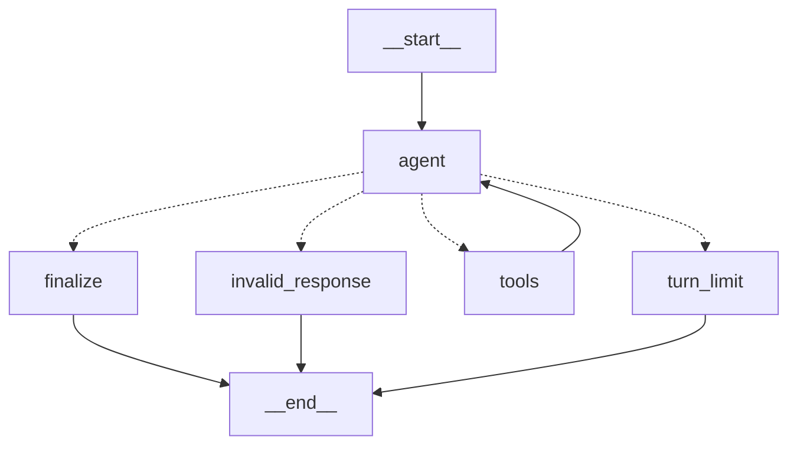

# V0.1 LangGraph As-Built Implementation Specification

## Document status

This document records the V0.1 implementation as it exists after the LangGraph
runtime migration. It describes shipped behavior, module ownership, runtime
contracts, graph semantics, tooling, verification, compatibility, and known
limitations.

This is an as-built record, not a proposal:

- [`04_V0.1_design.md`](04_V0.1_design.md) contains the V0.1 design context;
- [`05_V0.1_langgraph_implementation.md`](05_V0.1_langgraph_implementation.md)
  contains the implementation plan and acceptance criteria;
- [`06_V0.1_testing.md`](06_V0.1_testing.md) contains the end-user setup and
  manual testing walkthrough; and
- this document explains what was actually implemented and how the pieces fit
  together.

Frontend presentation is intentionally outside this document. The scope is the
Python agent, LangGraph runtime, deterministic repository and sandbox
boundaries, developer tooling, and supporting documentation.

## 1. Delivered outcome

V0.1 replaces the temporary OpenAI Agents SDK adapter with a project-owned
LangGraph state machine while preserving the V0 issue-to-patch workflow.

The delivered system:

- accepts one local Git repository, one issue file, and one committed base ref;
- creates an isolated clone without modifying the source checkout;
- starts a network-disabled Docker sandbox for repository commands;
- creates one host-side OpenAI chat model per runtime instance;
- exposes exactly six existing repository capabilities to that model;
- owns tool routing, structured completion, turn limits, and invalid-response
  handling in an explicit `StateGraph`;
- validates the final model result into a provider-neutral Pydantic model;
- derives changed files and the complete patch from Git rather than trusting
  model claims;
- persists the same run artifacts as V0;
- guarantees sandbox cleanup through the existing workflow; and
- provides a single Make command for configuration, setup, sandbox build,
  checks, and a live solve.

V0.1 remains a local, single-agent milestone. It does not add GitHub
integration, multi-agent handoffs, persistent graph memory, a service API, or a
background worker.

## 2. Change traceability

The implementation was divided into logical signed commits:

| Commit | Purpose |
| --- | --- |
| `bf30e6c` | Added the V0.1 design and LangGraph implementation specifications. |
| `e1d5271` | Replaced the Agents SDK runtime with LangGraph, migrated dependencies, and added focused tests. |
| `1cd4ee5` | Added the all-in-one Make workflow and V0.1 manual testing guide. |
| `6ad11ff` | Updated current architecture and runtime documentation to describe V0.1. |
| `5efc9be` | Selected the Responses API explicitly and added request-construction regression coverage. |
| `482c689` | Returned expected repository tool failures to the model for bounded correction. |

The runtime implementation and its tests are kept together so the behavior
change is independently understandable and verifiable.

## 3. Reused V0 architecture

The migration deliberately retained the trusted V0 controller and repository
execution layers. The following responsibilities were reused rather than
reimplemented:

| Existing responsibility | Reused implementation |
| --- | --- |
| Request and prepared-run models | `issue_agent.domain.requests` |
| Provider-neutral runtime contract | `issue_agent.domain.runtime.AgentRuntime` |
| Structured agent result | `issue_agent.domain.results.AgentFinalOutput` |
| Authoritative solve result | `issue_agent.domain.results.SolveResult` |
| Central environment configuration | `issue_agent.config.Settings` |
| Run workspace preparation | `issue_agent.repository.workspace.prepare_run` |
| Repository inspection and mutation | `issue_agent.repository.RepositoryTools` |
| Docker isolation | `issue_agent.sandbox.docker.DockerSandbox` |
| Run artifact persistence | `issue_agent.artifacts.ArtifactStore` |
| Solve lifecycle and cleanup | `issue_agent.workflow.solve_issue` |
| CLI request validation and rendering | `issue_agent.cli` |

This reuse preserves the core trust boundary: the model decides which bounded
capability to request, while project-owned deterministic code performs the
actual repository operation.

## 4. Replaced and added components

### Removed

The following temporary runtime was removed:

```text
apps/agent/src/issue_agent/runtimes/openai_agents/
```

The `openai-agents` production dependency and its old tool-adapter test were
also removed.

### Added

The active runtime is now:

```text
apps/agent/src/issue_agent/runtimes/langgraph/
  __init__.py
  graph.py
  prompt.py
  runtime.py
  tools.py
```

Focused tests mirror those responsibilities:

```text
apps/agent/tests/runtimes/
  test_langgraph_graph.py
  test_langgraph_runtime.py
  test_langgraph_tools.py
```

The root `Makefile` was extended with `first-run` and `graph`, and the existing
testing commands were retained.

## 5. Runtime architecture

The system separates the outer solve lifecycle from the inner reasoning graph:

```text
CLI
  |
  v
Settings + SolveRequest
  |
  v
solve_issue workflow
  |-- prepare isolated clone
  |-- initialize artifacts
  |-- start Docker sandbox
  |-- build RepositoryTools
  |
  v
AgentRuntime protocol
  |
  v
LangGraphRuntime
  |-- bind six tools to ChatOpenAI
  |-- request AgentFinalOutput
  |-- compile fresh StateGraph
  |-- invoke graph with issue and base SHA
  |
  v
authoritative Git diff + changed files
  |
  v
persist result and stop sandbox
```

The workflow knows only the `AgentRuntime` protocol. It does not import
LangGraph or provider response types. Conversely, the graph receives a trusted
`RuntimeContext` whose repository façade already enforces workspace, output,
command, patch, and sandbox limits.

## 6. Runtime contracts

### 6.1 `AgentRuntime`

The existing provider-neutral protocol remains:

```python
async def solve(
    *,
    issue_text: str,
    context: RuntimeContext,
) -> AgentFinalOutput: ...
```

The workflow can therefore accept a different runtime or a test double without
changing repository preparation, artifact persistence, or cleanup behavior.

### 6.2 `RuntimeContext`

One immutable dataclass carries trusted controller-owned dependencies into the
runtime:

| Field | Meaning |
| --- | --- |
| `prepared_run` | Run identifier, source path, clone path, base ref, and resolved SHA. |
| `sandbox` | The active sandbox abstraction. |
| `repository` | The bounded project-owned repository façade. |
| `settings` | Validated host configuration for the run. |

Tool adapters close over this context. No module-level mutable runtime context
is introduced.

### 6.3 `AgentFinalOutput`

The model-facing completion schema remains provider-neutral:

| Field | Type | Purpose |
| --- | --- | --- |
| `summary` | `str` | Concise model summary of the outcome. |
| `changed_files_claimed` | `list[str]` | Informational model claim, not authoritative. |
| `remaining_uncertainty` | `list[str]` | Unresolved questions or blockers. |

The workflow separately constructs `SolveResult` from the real Git workspace.
This prevents a model response from inventing or omitting authoritative file
changes.

## 7. Provider and model construction

`LangGraphRuntime` accepts validated `Settings` and an optional `BaseChatModel`.
The injectable model keeps graph and runtime tests deterministic.

When no model is injected, the runtime constructs:

```python
ChatOpenAI(
    model=settings.openai_model,
    api_key=settings.openai_api_key,
    use_responses_api=True,
)
```

The API key stays at the host-side provider boundary. It is not passed to the
Docker sandbox, repository tools, graph state, persisted artifacts, or logs.

At solve time the model is bound to the six runtime tools with:

```python
response_format=AgentFinalOutput
parallel_tool_calls=False
strict=False
```

These options mean:

- the provider is asked for the project-owned completion schema;
- the Responses API is selected explicitly so supported OpenAI models do not
  fall into Chat Completions parsing with incompatible non-strict tools;
- the provider is asked not to emit parallel tool calls;
- optional and defaulted repository tool inputs retain their existing schemas;
- the graph still defensively rejects multiple calls even if a provider emits
  them; and
- the final value is always revalidated by Pydantic at project boundaries.

## 8. Graph identity and lifecycle

The compiled graph name is stable:

```text
issue_agent_v0_1
```

A new tool set and graph are built for every `solve()` invocation. V0.1 does
not configure a LangGraph checkpointer, store, thread identifier, or resume
path. Message history exists only in memory for the current invocation.

This choice keeps one issue solve isolated from every other solve and preserves
the V0 artifact model as the only persistent run record.

## 9. Graph state

### 9.1 Input state

`GraphInput` accepts:

| Field | Initial value |
| --- | --- |
| `messages` | One `HumanMessage` containing the base SHA and exact issue text. |
| `model_turns` | `0` |

### 9.2 Internal state

`AgentState` contains:

| Field | Behavior |
| --- | --- |
| `messages` | Accumulated with LangGraph's `add_messages` reducer. |
| `model_turns` | Count of completed `agent` node executions. |
| `pending_output` | Provider-parsed structured value awaiting validation. |
| `final_output` | Validated `AgentFinalOutput` produced only by `finalize`. |

Tool request and tool result messages are retained in `messages`, so a later
model decision can consume the result of the exact prior operation.

### 9.3 Output state

`GraphOutput` exposes only:

```text
final_output: AgentFinalOutput
```

Internal messages, tool calls, and provider payloads do not leave the graph as
the runtime result and are not persisted by the workflow.

## 10. Initial model context

`build_initial_message()` creates the only initial human message. It contains:

- the resolved committed base SHA;
- the exact issue text; and
- an explicit instruction to work only through the supplied repository tools.

The static system instructions are prepended by the `agent` node on every model
decision. They require inspection before editing, minimal changes, real diff
review, bounded command use, repository prompt-injection resistance, no host or
credential access, and a concrete blocker instead of invented behavior.

Repository files remain untrusted data. Content found inside the target
repository cannot override the system instructions or the user's issue.

## 11. Graph nodes

The graph has five explicitly named nodes.

### 11.1 `agent`

The `agent` node performs exactly one asynchronous model decision:

1. verifies another model turn is available;
2. prepends the system instructions to accumulated messages;
3. calls `model.ainvoke()`;
4. requires an `AIMessage` result;
5. increments `model_turns`;
6. reads provider-parsed output from `additional_kwargs["parsed"]`;
7. appends the response to graph state; and
8. logs bounded operational metadata.

It does not execute tools, validate the final domain model, persist messages,
or derive Git results.

### 11.2 `tools`

The `tools` node is LangGraph's `ToolNode` configured with the six
project-owned adapters. Routing guarantees that only one known tool request can
reach this node.

After execution, the resulting `ToolMessage` is added to state and the graph
always returns to `agent`. This gives the model an opportunity to interpret the
actual tool result before choosing another action or finishing.

### 11.3 `finalize`

The `finalize` node accepts only a non-null `pending_output`. It validates that
value with `AgentFinalOutput.model_validate()` and writes `final_output`.

Missing or invalid structured output becomes `AgentRuntimeError`; unvalidated
provider data is never returned to the workflow.

### 11.4 `turn_limit`

The `turn_limit` node raises a clear `AgentRuntimeError` when the model requests
a tool on the final allowed model turn.

The tool is deliberately not executed because no later model turn would remain
to consume its result. This prevents partial, misleading graph termination.

### 11.5 `invalid_response`

The `invalid_response` node rejects protocol violations with a specific reason.
Covered cases include:

- the latest state item is not an AI message;
- structured output and a tool call are mixed in one response;
- multiple tool calls are requested;
- an unknown tool name is requested; and
- neither a tool call nor structured output is present.

## 12. Routing rules

`route_after_agent()` is a pure function. It can be tested without a provider,
sandbox, or graph execution.

Routing is evaluated in this order:

| Condition | Route |
| --- | --- |
| Latest message is not an `AIMessage` | `invalid_response` |
| Parsed output and tool calls are both present | `invalid_response` |
| Parsed output is present without tool calls | `finalize` |
| Tool-call count is not exactly one | `invalid_response` |
| Requested tool is not registered | `invalid_response` |
| Tool requested at or beyond the model-turn budget | `turn_limit` |
| One known tool is requested with a future turn available | `tools` |

There is no fallback route that guesses model intent.

## 13. Compiled topology

The executable graph is:



The failure nodes have terminal edges for a complete topology, but they raise
application errors rather than returning successful terminal state.

## 14. Turn and recursion limits

`ISSUE_AGENT_MAX_TURNS` controls model decisions, not raw graph steps. One
execution of `agent` consumes one model turn. Tool execution does not consume a
model turn.

For `max_turns = N`, the runtime supplies a secondary LangGraph recursion limit:

```text
(2 * N) + 4
```

The explicit model-turn guard owns expected product behavior. The recursion
limit is a defensive invariant for unexpected topology or routing failures.

Example with the default `N = 30`:

| Limit | Value |
| --- | --- |
| Maximum model decisions | `30` |
| Defensive graph-step recursion limit | `64` |

The runtime does not retry deterministic validation, routing, or turn-limit
errors.

## 15. Repository tool surface

V0.1 preserves exactly the six V0 capabilities:

| Tool | Inputs and defaults | Deterministic delegate |
| --- | --- | --- |
| `list_tree` | `path="."`, `max_depth=2` | `RepositoryTools.list_tree` |
| `search_text` | required `query`, `path="."`, `max_results=50` | `RepositoryTools.search_text` |
| `read_file` | required `path`, `start_line=1`, `end_line=None` | `RepositoryTools.read_file` |
| `apply_patch` | required unified `patch` | `RepositoryTools.apply_patch` |
| `show_diff` | no arguments | `RepositoryTools.show_diff` |
| `run_command` | required `command`, `timeout_seconds=None` | `RepositoryTools.run_command` and `format_command_result` |

The LangChain adapters are intentionally thin. They do not duplicate path
validation, patch validation, command execution, output truncation, or Git
logic.

Internal authoritative helpers such as `get_complete_diff()` and
`get_changed_files()` are not exposed as model tools. The trusted workflow uses
them only after the model runtime completes.

## 16. Error behavior

Expected runtime failures use the existing `AgentRuntimeError` application
boundary.

| Failure source | Resulting behavior |
| --- | --- |
| Model returns a non-AI graph message | Clear `AgentRuntimeError`. |
| Invalid model/tool protocol | Specific `AgentRuntimeError` from the failure node. |
| Missing or invalid structured output | Pydantic failure translated to `AgentRuntimeError`. |
| Explicit model-turn exhaustion | `AgentRuntimeError` without executing an unusable tool call. |
| LangGraph recursion exhaustion | Translated to a concise recursion-limit `AgentRuntimeError`. |
| Expected repository tool error | Returned as an error `ToolMessage` so the model can correct the request on its next bounded turn. |
| Unexpected provider, graph, or tool exception | Wrapped as `AgentRuntimeError` with exception type and chained cause. |
| Existing `AgentRuntimeError` | Preserved without double wrapping. |
| `asyncio.CancelledError` | Re-raised unchanged so cancellation semantics remain correct. |

The CLI maps expected application errors to exit code `1`. It prints a concise
message by default and includes a traceback only when `--debug` is selected.

## 17. Observability

The runtime uses standard project logging rather than `print()`.

At graph start it records:

- run identifier;
- stable graph name;
- configured model name; and
- maximum model turns.

For each model decision it records:

- turn number;
- whether structured output was present;
- tool-call count;
- a single tool name when applicable;
- decision latency; and
- total tokens when the provider reports usage metadata.

Completion records a terminal category. Failures record bounded categories such
as protocol, recursion limit, or exception class.

The implementation does not deliberately log the API key, full issue text,
system prompt, repository file contents, patch contents, complete provider
payloads, or complete tool arguments.

## 18. Security and isolation invariants

The LangGraph migration preserves these V0 controls:

- the source checkout is never modified;
- only the selected committed revision is cloned into the run workspace;
- repository paths are resolved within the isolated clone;
- symlink and `.git` escapes are rejected by project-owned path logic;
- patches are validated before application;
- repository commands execute inside Docker rather than on the host;
- the sandbox has no network, drops capabilities, prevents privilege
  escalation, and applies CPU, memory, process, and timeout limits;
- tool output is bounded before returning to the model;
- the OpenAI credential stays on the host;
- graph message history is ephemeral; and
- sandbox shutdown occurs in the workflow's `finally` block after success or
  failure.

LangGraph coordinates decisions; it does not weaken or replace deterministic
repository and sandbox enforcement.

## 19. Outer workflow compatibility

`solve_issue()` was reused unchanged. The lifecycle remains:

1. apply any request-specific sandbox image override;
2. read the UTF-8 issue file;
3. resolve the committed base and prepare an isolated clone;
4. initialize run artifacts;
5. start the Docker sandbox;
6. build bounded repository tools;
7. invoke the runtime through `AgentRuntime`;
8. derive the complete diff and changed files from Git;
9. build `SolveResult`;
10. persist final artifacts; and
11. stop the sandbox in all cases.

The model's `changed_files_claimed` field remains informational. The CLI and
artifacts use Git-derived file paths and patch content.

## 20. CLI compatibility

The CLI now constructs `LangGraphRuntime(settings)` but retains the V0 command
surface:

```text
issue-agent solve \
  --repo <path> \
  --issue-file <path> \
  [--base-ref <ref>] \
  [--sandbox-image <image>] \
  [--debug]
```

Exit codes remain:

| Code | Meaning |
| --- | --- |
| `0` | Solve completed and the authoritative Git diff is non-empty. |
| `1` | Configuration, workspace, sandbox, runtime, repository, or unexpected failure. |
| `2` | Solve completed successfully but produced no repository change. |

The printed `IssueAgent V0` label is retained for CLI compatibility even though
the internal runtime milestone is V0.1.

## 21. Persisted artifacts

A successful run continues to produce:

```text
<runs-dir>/<run-id>/
  request.json
  metadata.json
  issue.md
  agent-final.json
  changed-files.json
  diff.patch
  repo/
```

No LangGraph checkpoint or raw message transcript was added. The artifact model
therefore remains compatible with V0 consumers.

## 22. Configuration

Configuration still enters through the single `Settings.from_env()` boundary.

| Environment variable | Default | Validation or purpose |
| --- | --- | --- |
| `OPENAI_API_KEY` | none | Required, stripped, and excluded from model repr. |
| `OPENAI_MODEL` | `gpt-5.3-codex` | Host-side chat model name. |
| `ISSUE_AGENT_MAX_TURNS` | `30` | Integer greater than or equal to one. |
| `ISSUE_AGENT_RUNS_DIR` | `.issue-agent/runs` | Host artifact and clone root. |
| `ISSUE_AGENT_SANDBOX_IMAGE` | `issue-agent-sandbox:v0` | Docker image used for repository commands. |
| `ISSUE_AGENT_COMMAND_TIMEOUT_SECONDS` | `60` | Positive command timeout ceiling. |
| `ISSUE_AGENT_MAX_TOOL_OUTPUT_CHARS` | `12000` | Tool-output bound, minimum `1000`. |

V0.1 did not add graph-specific environment variables. The graph derives its
model-turn and recursion controls from the existing maximum-turn setting.

## 23. Dependency migration

The backend requires the default available Python compatible with the project
constraint:

```text
Python >= 3.14
```

The locked direct dependency set at implementation time is:

| Dependency | Locked version | Responsibility |
| --- | --- | --- |
| `langgraph` | `1.2.11` | State graph, compilation, routing, and `ToolNode`. |
| `langchain-core` | `1.5.6` | Messages, tools, runnable contracts, and schemas. |
| `langchain-openai` | `1.5.1` | Host-side `ChatOpenAI` provider adapter. |
| `pydantic` | `2.13.4` | Configuration and domain validation. |
| `pytest` | `9.1.1` | Deterministic development tests. |

`openai-agents` is no longer a direct or transitive dependency in the locked
environment.

## 24. Makefile workflows

### 24.1 One-command first run

The new entry point is:

```bash
make first-run REPO=/absolute/repository ISSUE=/absolute/issue.md
```

It performs six ordered stages:

1. sync the locked Python environment;
2. build the configured Docker sandbox image;
3. smoke-test Git, Python, and ripgrep in a disposable network-disabled
   container;
4. run prerequisite checks;
5. run the deterministic backend suite and source compilation; and
6. start the live solve.

`REPO` and `ISSUE` are validated before expensive setup starts.

If `.env` exists, it is loaded. An already exported `OPENAI_API_KEY` takes
precedence over the file value. If no key is available and stdin is an
interactive terminal, the command prompts with hidden input and exports the key
only for that process tree. Non-interactive use fails with recovery guidance
rather than hanging on a prompt.

Child Make processes receive the effective environment while using
`ENV_FILE=/dev/null`, preventing repeated or inconsistent file loading during
the six-stage run.

### 24.2 Deterministic checks

```bash
make check
```

runs pytest with `LANGSMITH_TRACING=false` and then compiles all backend source.
No provider call is required.

### 24.3 Graph visualization

```bash
make graph
```

prints Mermaid from the real compiled graph using the deterministic graph test
fixture. It does not construct a live provider client or call OpenAI.

### 24.4 Existing operational helpers

The Makefile retains:

| Target | Purpose |
| --- | --- |
| `env` | Create `.env` from the example without overwriting. |
| `setup` | Sync the locked backend environment. |
| `bootstrap` | Setup, build, smoke-test, and diagnose prerequisites. |
| `doctor` | Validate tools, Docker daemon, image, API key, and environment. |
| `sandbox-build` | Build the configured sandbox image. |
| `sandbox-smoke` | Verify required tools inside an isolated disposable container. |
| `new-issue` | Copy the issue template without overwriting. |
| `solve` | Run a live solve and treat CLI no-change code `2` as a warning. |
| `solve-debug` | Run a live solve with debug logging. |
| `run-status` | Validate artifacts and inspect candidate Git state. |
| `run-test` | Execute a chosen command in a fresh isolated candidate sandbox. |

## 25. Automated test coverage

### 25.1 Tool adapters

`test_langgraph_tools.py` verifies:

- the exact six-tool capability surface;
- stable tool ordering and names;
- optional argument defaults and required fields;
- unchanged delegation of arguments and return values; and
- repository exceptions remain visible to the graph for bounded recovery.

### 25.2 Pure graph behavior

`test_langgraph_graph.py` verifies:

- every router branch;
- system prompt placement and asynchronous invocation;
- model-turn accounting;
- final-output validation;
- explicit failure nodes;
- stable compiled topology and Mermaid output;
- completion on the first model turn;
- tool result delivery before the next model decision;
- multiple sequential tool decisions;
- mutation followed by authoritative diff inspection;
- invalid, mixed, multiple, and unknown model responses;
- refusal to execute a tool on the last model turn; and
- recovery from expected repository failures while propagating unexpected
  model and tool failures.

The traversal tests use a scripted fake model and recording repository. They
exercise the real graph without network or paid model use.

### 25.3 Runtime adapter

`test_langgraph_runtime.py` verifies:

- explicit model name and API-key construction;
- construction of the locked `ChatOpenAI` Responses request with all six tools
  and the structured text format;
- tool binding options;
- initial graph input;
- model-turn and recursion limits;
- graph name stability;
- structured output validation;
- preservation of application errors;
- translation and chaining of graph/provider failures; and
- cancellation propagation.

### 25.4 Existing regression coverage

The retained V0 suite continues to verify:

- settings validation;
- safe workspace cloning from committed state;
- path and symlink confinement;
- bounded reads, searches, tree listings, commands, and output;
- patch validation and temporary-file cleanup;
- complete Git diffs including untracked files;
- sandbox isolation and timeout behavior;
- artifact persistence without the API key;
- authoritative workflow results; and
- sandbox cleanup after success and runtime failure.

## 26. Verification evidence

The following checks were run successfully against the current implemented
V0.1 content:

| Check | Recorded result |
| --- | --- |
| Full backend pytest suite | `67 passed` |
| Focused runtime tests | `42 passed` |
| `make check` | Tests and Python compilation passed. |
| `make graph` | Printed the expected five-node compiled Mermaid graph. |
| Python `compileall` | Passed. |
| CLI help and solve help | Passed. |
| Removed Agents SDK source/import audit | No active matches. |
| Dependency audit | LangGraph packages present; `openai-agents` absent. |
| Docker sandbox build and smoke test | Passed. |
| Live `gpt-5.4-mini` calculator solve through the Responses API | Passed and persisted the authoritative one-file patch. |
| Generated candidate acceptance assertions in Docker | `add(2, 3) == 5` and `add(-1, 1) == 0` passed. |
| Git whitespace validation | Passed. |

The live solve was a separate environment-specific verification using the
user's configured credentials and model access; it is not part of the
deterministic test suite.

## 27. File-by-file implementation record

| File or area | As-built responsibility |
| --- | --- |
| `apps/agent/pyproject.toml` | Replaced Agents SDK with LangGraph/LangChain dependencies. |
| `apps/agent/uv.lock` | Locked the migrated dependency graph. |
| `apps/agent/src/issue_agent/runtimes/langgraph/__init__.py` | Exports `LangGraphRuntime`. |
| `apps/agent/src/issue_agent/runtimes/langgraph/prompt.py` | Owns static instructions and initial human message construction. |
| `apps/agent/src/issue_agent/runtimes/langgraph/tools.py` | Adapts the six repository capabilities to LangChain tools. |
| `apps/agent/src/issue_agent/runtimes/langgraph/graph.py` | Owns state schemas, nodes, routing, topology, and graph compilation. |
| `apps/agent/src/issue_agent/runtimes/langgraph/runtime.py` | Owns provider construction, binding, graph invocation, limits, and exception translation. |
| `apps/agent/src/issue_agent/cli.py` | Selects `LangGraphRuntime` behind the unchanged workflow contract. |
| `apps/agent/src/issue_agent/domain/runtime.py` | Describes the active provider-neutral runtime contract. |
| `apps/agent/tests/runtimes/test_langgraph_tools.py` | Characterizes and verifies the tool surface. |
| `apps/agent/tests/runtimes/test_langgraph_graph.py` | Verifies routing, nodes, topology, and complete fake traversals. |
| `apps/agent/tests/runtimes/test_langgraph_runtime.py` | Verifies provider request construction, binding, and runtime boundary behavior. |
| `Makefile` | Adds one-command setup/solve and graph inspection. |
| `specs/03_V0_testing.md` | Adds V0.1 migration checks to the retained V0 workflow guide. |
| `specs/06_V0.1_testing.md` | Provides the dedicated user-friendly V0.1 manual guide. |

## 28. Deliberate implementation decisions

### One explicit graph instead of agent framework defaults

Routing, termination, invalid-response behavior, and limits are visible in
project code and directly testable.

### One tool call per model decision

Sequential tool use makes state ordering and failure behavior deterministic.
Provider-side parallel calls are disabled, and the router independently rejects
multiple calls.

### No checkpointer in V0.1

The V0 artifact store remains the persistent record. Resume semantics, message
retention policy, and checkpoint migration are deferred until they have an
explicit product requirement.

### Project-owned turn semantics

Users configure model decisions rather than framework recursion steps. The
framework recursion limit exists only as a defensive secondary guard.

### Structured completion through the same model binding

Tools and the final response schema are bound together. The router
distinguishes a single tool request from parsed structured completion and
rejects ambiguous mixed responses.

### Git remains authoritative

The final model schema is useful for summary and uncertainty, but the workflow
continues to derive changed files and patch content directly from the isolated
repository.

## 29. Known limitations and non-goals

V0.1 intentionally does not implement:

- multiple specialized agents or agent-to-agent handoffs;
- planner, reviewer, or repair subgraphs;
- graph checkpointing, pause/resume, or cross-run memory;
- automatic retries or backoff for provider errors;
- per-node configurable timeouts beyond existing provider and command behavior;
- token-budget enforcement beyond the configured model-turn limit;
- GitHub issue ingestion, branch publication, or pull-request creation;
- remote repositories as direct solve input;
- a daemon, web API, queue, scheduler, or database;
- runtime provider selection beyond the implemented OpenAI adapter; or
- automatic installation of arbitrary target-repository dependencies.

The default sandbox contains a minimal execution toolchain. Target projects
that need additional languages or dependencies require an explicitly built
custom sandbox image.

## 30. Safe extension points

### Add a repository tool

1. implement deterministic behavior in the existing repository layer;
2. add a thin adapter in `runtimes/langgraph/tools.py`;
3. preserve explicit inputs, bounded output, and useful errors;
4. update exact tool-surface and schema tests;
5. add graph traversal coverage when routing behavior is affected; and
6. update the manual testing guide.

Do not put repository business logic directly into the LangChain adapter.

### Change graph routing

1. define the new state or route contract explicitly;
2. keep the router side-effect free;
3. add pure branch tests;
4. update compiled topology tests and Mermaid documentation;
5. add success and failure traversal tests; and
6. review turn and recursion calculations.

### Add another provider

Keep provider construction and response-shape handling behind a runtime or
provider adapter. The workflow, repository tools, domain outputs, and artifacts
should continue to depend only on project-owned contracts.

### Add persistence

Define retention, secret handling, thread identity, resume behavior, schema
migration, cleanup, and authorization before adding a checkpointer. Do not
persist raw messages by default.

## 31. Operational handoff

For a first run, use:

```bash
make first-run \
  REPO=/absolute/path/to/committed/repository \
  ISSUE=/absolute/path/to/issue.md
```

For deterministic verification only:

```bash
make check
make graph
make sandbox-smoke
```

For complete setup, artifact inspection, failure recovery, and candidate test
instructions, follow [`06_V0.1_testing.md`](06_V0.1_testing.md).

## 32. Completion assessment

The V0.1 implementation satisfies the intended migration boundary:

- [x] The Agents SDK runtime and dependency were removed.
- [x] The CLI selects the project-owned LangGraph runtime.
- [x] Existing workflow, repository, sandbox, artifact, and domain boundaries were reused.
- [x] Graph state, nodes, routes, limits, and termination are explicit.
- [x] Exactly six existing repository capabilities are exposed.
- [x] Structured output is validated into `AgentFinalOutput`.
- [x] Git remains authoritative for changed files and patch content.
- [x] Model-turn exhaustion cannot execute an unusable final tool request.
- [x] Runtime failures are translated at the application boundary.
- [x] Cancellation is preserved.
- [x] Runtime behavior is covered by deterministic fake-model tests.
- [x] The full V0 regression suite remains green.
- [x] A one-command setup, verification, sandbox, and live-solve workflow exists.
- [x] User-friendly manual testing and troubleshooting documentation exists.
- [x] A paid live solve completed in the authorized local environment.

V0.1 is therefore complete as a local, project-owned, single-agent LangGraph
runtime while intentionally leaving GitHub integration, multi-agent roles, and
persistent graph memory for later milestones.
