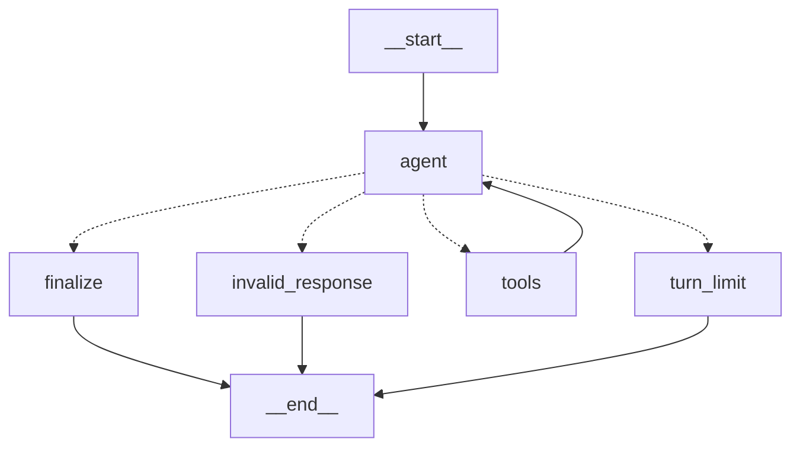
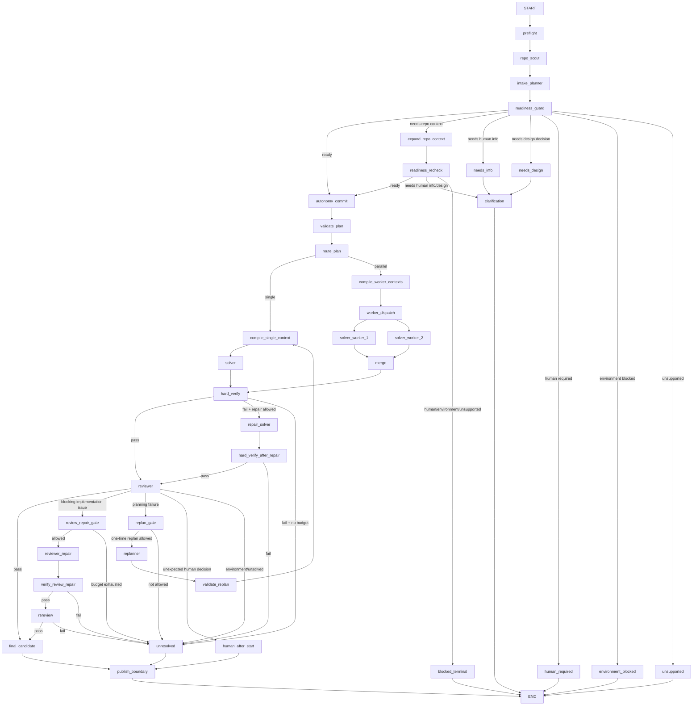
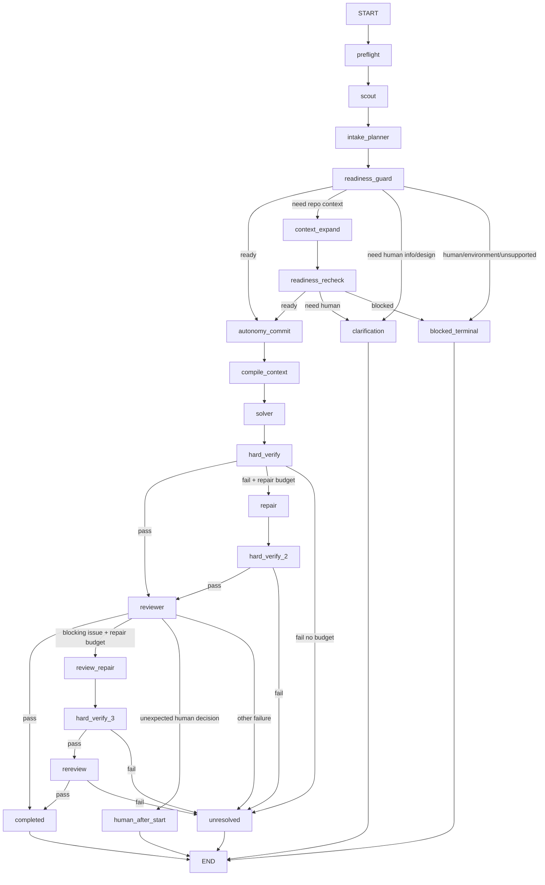
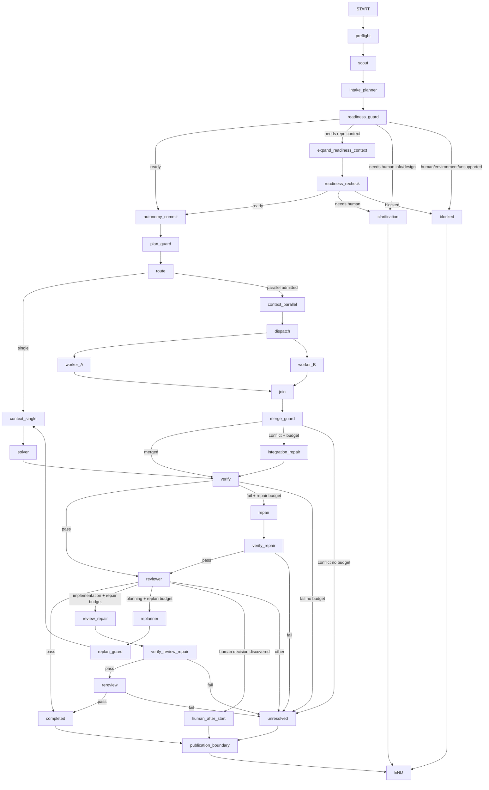

# Sage V2.0 — Provisional Design Specification

> **Status:** Historical, superseded prototype design. It is not the current
> architecture and must not be used as an implementation target. Use
> [`../docs/architecture.md`](../docs/architecture.md) for current behavior.
>
> **Research snapshot:** 23 August 2026
>
> **Provider-policy update:** The executable prototype no longer uses Anthropic.
> Planner and Reviewer now default to `google/gemini-3.5-flash`, Solver defaults
> to `openai/gpt-5.4-mini`, and all role model names are environment-configurable.
> Claude/Anthropic discussion below is retained only as historical research.
>
> **Update:** Mandatory Autonomy Admission / Issue-readiness classification added after research on coding-agent task suitability, ambiguity, and clarification behavior.
>
> **Purpose:** Define a concrete, reviewable V2 architecture that evolves the working V1.0 single-agent Sage into a resource-aware multi-agent coding system while preserving V1's GitHub-native security and publication guarantees.

## 1. Executive Summary

Sage V2.0 should **not** become a collection of LLMs freely talking to one another.

The proposed V2 architecture is:

```text
LLMs make bounded semantic decisions.
Deterministic application code owns execution.
Git remains the source of truth for code.
Docker remains the untrusted repository boundary.
GitHub Actions remains the trusted ephemeral execution environment.
```

The primary V2 roles are:

```text
Intake Planner / Autonomy Classifier → Gemini
Solver / Implementer                 → OpenAI GPT-5.4 mini
Reviewer                             → Claude
```

However, models do **not** directly control graph topology, create other agents, merge code, publish branches, or decide whether security boundaries can be bypassed.

LangGraph and ordinary Python code control those operations.

The most important V2 constraint is **resource efficiency**. The default successful run should require only:

```text
1 Gemini planning call
1 OpenAI implementation call
1 Claude review call
──────────────────────────────
3 semantic model calls
```

Repository discovery, file ranking, context assembly, Git operations, merging, deterministic verification, GitHub publication, and failure routing should not require extra LLM calls.

A repair happens only when evidence shows it is needed.

The graph has hard call, token, repair, concurrency, and wall-clock budgets. A ready Issue still targets three semantic calls. An under-specified Issue should normally spend only the Gemini intake/planning call and stop.


---

## 2. V1.0 Baseline

V1.0 is already working and should be treated as the stable product shell.

V1 provides:

```text
GitHub Issue
      ↓
/sage solve
      ↓
GitHub authorization gate
      ↓
GitHub-hosted runner
      ↓
trusted Sage controller
      ↓
credential-free Docker sandbox
      ↓
single LangGraph coding agent
      ↓
candidate diff
      ↓
sage/issue-<number>
      ↓
draft Pull Request
      ↓
human review
```

The current V1 agent graph is:



V1 is effectively a tool-using single-agent loop:

```text
agent
  ↕
tools
```

That works, but a hard Issue can require many model turns while the model discovers repository context, opens files, edits, receives tool results, tests, and iterates.

V2 should preserve V1's external GitHub behavior while replacing the solve core with a more deliberate and resource-efficient graph.


---

## 3. V2.0 Goals

V2 should:

1. **Improve reasoning quality** by separating planning, implementation, and independent review.
2. **Preserve the V1 GitHub experience**: `/sage solve` still leads to a draft PR.
3. **Minimize LLM calls**: target three semantic calls on the happy path.
4. **Minimize tokens per call** through role-specific context packets.
5. **Survive free-tier / low-tier quotas and 429s** without blind retry loops.
6. **Preserve V1 security boundaries**: repository remains untrusted; provider/GitHub secrets stay outside Docker.
7. **Use adaptive multi-agent execution** only where it helps.
8. **Avoid infinite repair/reviewer loops** through explicit budgets and terminal states.
9. **Keep providers replaceable** so the graph does not depend on one vendor forever.
10. **Measure V2 against V1** on success, calls, tokens, latency, and repair count rather than assuming multi-agent is automatically better.
11. **Mandatory autonomy admission:** never begin code mutation until Sage has classified the Issue as solvable without human intervention inside the run.
12. **Ask once, before execution:** when human-owned context is missing, produce one consolidated clarification request and end the run instead of discovering the ambiguity halfway through implementation.
13. **Exhaust machine-obtainable context first:** distinguish “I need more repository evidence” from “I need a human decision.” Sage retrieves the former itself and asks only for the latter.

### Non-goals for initial V2

The first V2 does not require:

- recursive agent spawning;
- workers chatting with workers;
- unlimited parallelism;
- an LLM manager controlling graph topology;
- Postgres/Redis/Kubernetes;
- cloud sandbox providers;
- a vector database for the whole repo;
- automatic merge;
- long-term memory across unrelated Issues;
- unlimited conflict resolution;
- arbitrary background services.


---

## 4. Research Correction: “Free OpenAI + Gemini + Claude”

The requested model strategy needs an important correction based on current official provider documentation.

### Gemini

The Gemini Developer API currently has genuine free-tier input/output for multiple Flash models, including current families such as:

- `gemini-3.7-flash`
- `gemini-3.6-flash`
- `gemini-3.5-flash`
- `gemini-3.5-flash-lite`
- `gemini-2.5-flash`
- `gemini-2.5-flash-lite`

Free-tier RPM/TPM/RPD limits vary by model/project and should be observed from Google AI Studio rather than hard-coded.

### Task readiness, ambiguity, and clarification

GitHub Copilot — cloud-agent task best practices:
https://docs.github.com/en/copilot/tutorials/cloud-agent/get-the-best-results

GitHub Copilot — optimizing AI usage:
https://docs.github.com/en/copilot/tutorials/optimize-ai-usage

GitHub Copilot Plan mode:
https://docs.github.com/en/copilot/how-tos/chat-with-copilot/chat-in-ide

OpenHands Planning Mode:
https://www.openhands.dev/blog/openhands-product-update---march-2026

Anthropic — Measuring AI agent autonomy in practice:
https://www.anthropic.com/research/measuring-agent-autonomy

What Makes a GitHub Issue Ready for Copilot?:
https://arxiv.org/abs/2512.21426

Key design evidence used:
- clear, well-scoped tasks with acceptance criteria are better autonomous-agent inputs;
- ambiguous/open-ended tasks are poor autonomous candidates;
- vague prompts increase exploration, retries, scope drift, and token use;
- planning systems surface questions before implementation;
- clarification frequency rises with task complexity;
- issue quality and supplied implementation/repository guidance correlate with better agent PR outcomes.

### OpenAI

`gpt-5.4-mini` is **not supported on the OpenAI API Free tier**.

It requires paid API access. It is still a good Solver choice because V2 is designed to call it very few times.

### Claude

Claude has a consumer Free chat plan, but consumer Free access is not a permanent free programmable Anthropic API tier.

Anthropic API usage is separately billed. New users may receive limited credits, but Sage must not depend on those credits existing forever.

### Required consequence

V2 supports two profiles.

#### Preferred cross-provider profile

```text
Planner:  Gemini free-tier Flash
Solver:   GPT-5.4 mini
Reviewer: Claude when Anthropic API credit/access exists
```

This is **low-cost**, not guaranteed zero-cost.

#### Strict-zero-cost profile

```text
Planner:  Gemini free-tier model
Solver:   Gemini free-tier model
Reviewer: Gemini free-tier model
```

This loses cross-provider evaluator independence but is actually sustainable with no OpenAI/Claude token spend, subject to Gemini quotas and data-use terms.


---

## 5. Recommended Model Assignment

### Planner — primary

```text
gemini-3.7-flash
```

Reasons:

- current stable Flash model;
- explicitly positioned for agentic workflows;
- free-tier input/output currently available;
- large context ceiling;
- structured outputs;
- function calling;
- only one planning call normally needed.

The 1M context ceiling is an emergency ceiling, **not** permission to dump the repository into the prompt.

### Planner fallback

```text
gemini-3.5-flash-lite
```

Use for degraded/rate-constrained operation and lightweight classification.

### Solver — primary

```text
gpt-5.4-mini
```

Reasons:

- optimized for coding/subagents;
- structured outputs and tool support;
- 400k context ceiling;
- cheaper than full frontier OpenAI models.

V2 treats this as a **high-value implementation call**, not a long chat loop.

### Solver strict-free fallback

```text
gemini-3.6-flash
```

Fallback must be explicit because changing provider changes behavior.

### Reviewer — constrained-credit default

```text
claude-haiku-4-5
```

Reasons:

- fast;
- cheaper than Sonnet;
- 200k context is more than enough because Reviewer context is intentionally small;
- independent provider from the Solver.

### Reviewer higher-quality optional mode

```text
claude-sonnet-5
```

Use for high-risk/architectural Issues when credits/budget permit.

### Reviewer fallback

```text
gemini-3.5-flash
```

or:

```text
gemini-3.5-flash-lite
```

if Anthropic API access is unavailable.


---

## 6. Providers Are Configuration, Not Topology

Graph nodes should be named by role:

```text
planner
solver
reviewer
```

not:

```text
gemini_node
openai_node
claude_node
```

Conceptual configuration:

```yaml
models:
  planner:
    provider: google
    model: gemini-3.7-flash

  solver:
    provider: openai
    model: gpt-5.4-mini

  reviewer:
    provider: anthropic
    model: claude-haiku-4-5

fallbacks:
  planner:
    - google/gemini-3.5-flash-lite

  solver:
    - google/gemini-3.6-flash

  reviewer:
    - google/gemini-3.5-flash
```

The architecture must survive model replacement.


---

## 7. Recommended V2 Graph

The graph has two phases:

```text
PHASE A — AUTONOMY ADMISSION
read-only / no code mutation / may terminate with questions

PHASE B — AUTONOMOUS EXECUTION
no human interaction expected until the run ends
```



### Core rules

> **LLMs propose semantic decisions. Deterministic code controls execution.**

> **Sage must earn autonomy before it starts implementation.**

Once `autonomy_commit` is crossed, the run assumes no human will answer until it terminates. If Solver or Reviewer later discovers a genuinely human-owned choice, the correct outcome is `human_required_after_start`, not an in-session pause.

---

## 8. V1 → V2 Migration Boundary

Do **not** rewrite the working V1 GitHub shell.

Preserve:

- Issue-comment trigger;
- `/sage solve`;
- `/sage fix`;
- write/admin authorization;
- duplicate-run gate;
- exact base SHA;
- bounded GitHub Issue context;
- GitHub-hosted runner;
- trusted controller;
- Docker security boundary;
- Issue status lifecycle;
- deterministic branch publication;
- draft PR creation;
- `github-actions[bot]` publication identity;
- finalizer;
- artifact policy;
- no automatic merge.

Migration occurs at the solve runtime boundary.

```text
V1:
GitHub controller
      ↓
SingleAgentRuntime
      ↓
candidate

V2:
GitHub controller
      ↓
V2GraphRuntime
      ↓
candidate
```

Everything before and after the runtime should remain stable where practical.


---

## 9. Deterministic Preflight

Before any model call:

- validate exact base SHA;
- ensure checkout/workspace exists;
- ensure sandbox can start;
- validate configured model/profile secrets exist;
- validate run budget;
- validate Issue context is usable;
- reject fatal environment/configuration failures.

If preflight fails:

```text
0 model calls
```

Do not spend quota to discover deterministic setup failures.


---

## 10. Repository Scout

A major V2 improvement is deterministic repository discovery **before** the Planner call.

The Scout creates a compact `RepositoryMap` containing information such as:

- languages;
- top-level directories;
- tracked-file count;
- manifests;
- test directories;
- CI/build files;
- README/architecture files;
- likely entry points;
- Issue-term filename matches;
- bounded lexical code matches;
- file sizes;
- relevant Git path metadata when useful.

Use ordinary deterministic tooling:

```text
git
ripgrep
filesystem metadata
manifest parsing
```

No LLM call is required.

### Why

V1 may spend turns asking:

```text
What files exist?
Where is auth?
Where are tests?
What build system is used?
```

V2 should answer these cheaply before the first semantic call.


---

## 11. Retrieval Policy — No Required Vector Database

Initial V2 retrieval order:

```text
1. exact paths in Issue
2. exact symbols/identifiers
3. filenames
4. ripgrep lexical matches
5. nearby tests
6. cheap direct references/imports
7. architecture/readme/manifests
```

Do not vectorize the whole repository by default.

Embeddings can be evaluated later only if deterministic retrieval proves inadequate.


---

## 12. Intake Planner / Autonomy Classifier

The first Gemini role combines **task-readiness classification** and **planning** in one call whenever possible. This avoids adding a classifier call to every ready Issue.

It is read-only and receives:

- normalized Issue title/body;
- bounded Issue discussion up to the invoking command;
- exact base metadata;
- compact RepositoryMap;
- bounded search excerpts;
- repository constraints;
- available sandbox capabilities;
- verification capabilities;
- run budget;
- latest unresolved Sage clarification packet, if this is a retry after clarification.

It cannot edit code, spawn workers, or publish.

### 12.1 Mandatory readiness question

Before producing an executable plan it must answer:

> Can Sage complete this task autonomously, inside the available sandbox and current repository scope, without requiring a human decision or unavailable external information after implementation begins?

### 12.2 Typed dispositions

```text
READY_AUTONOMOUS
NEEDS_REPOSITORY_CONTEXT
NEEDS_HUMAN_INFORMATION
NEEDS_HUMAN_DESIGN_DECISION
HUMAN_REQUIRED
ENVIRONMENT_BLOCKED
UNSUPPORTED
```

#### READY_AUTONOMOUS

The Issue is sufficiently specified. The same Gemini call also returns the ExecutionPlan and candidate acceptance contract.

#### NEEDS_REPOSITORY_CONTEXT

Sage needs information it can retrieve itself, such as a symbol definition, existing API behavior, nearby tests, config format, caller relationship, or repository convention. The result contains bounded retrieval requests. **Do not ask the maintainer for repository facts Sage can fetch itself.**

#### NEEDS_HUMAN_INFORMATION

A factual input known by the maintainer/product owner is missing and cannot be reliably inferred from code/docs—for example reproduction conditions, expected output, compatibility target, or external behavior not represented in the repo.

#### NEEDS_HUMAN_DESIGN_DECISION

Multiple reasonable implementations would create materially different public/product/data behavior and the repository does not establish the intended choice. Examples include public API shape, migration semantics, backward compatibility, auth policy, UX behavior, new dependency policy, or cross-repository protocol choices.

#### HUMAN_REQUIRED

The task is understandable but inherently requires human action or judgment during completion: production incident judgment, manual product approval, irreversible migration approval, legal/compliance choice, privileged external action, or unavailable cross-team coordination.

#### ENVIRONMENT_BLOCKED

The requested change cannot be completed or materially verified in the sandbox because a required private service, network-only integration, hardware device, private registry, or credential is unavailable.

#### UNSUPPORTED

The task is outside Sage's current coding-agent capability/policy.

### 12.3 Readiness dimensions

Do not gate on one vague confidence number. Evaluate explicit fields:

```text
objective_clarity
expected_behavior_clarity
acceptance_testability
scope_boundedness
repository_evidence_sufficiency
design_choice_closed
external_dependency_availability
sandbox_compatibility
permission_or_credential_independence
cross_repository_dependency
human_approval_dependency
```

Each should be a small typed status such as:

```text
sufficient
insufficient
unknown
not_applicable
```

Confidence may be metadata, but confidence alone never grants autonomy.

### 12.4 Ready-plan contract

For `READY_AUTONOMOUS`, the same call produces:

```text
ExecutionPlan
├── task_summary
├── acceptance_contract[]
├── safe_assumptions[]
├── route_proposal
├── tasks[]
├── retrieval_requests[]
├── verification_hints[]
├── risks[]
└── non_blocking_uncertainties[]
```

This preserves the normal one-Gemini-call intake path.

### 12.5 Autonomy admission policy

`/sage solve` means:

> **Assess whether Sage can solve this autonomously; if yes, proceed. If no, explain exactly what blocks autonomous execution.**

Before `autonomy_commit` only read-only reconnaissance, classification, bounded context expansion, planning, and clarification are allowed.

After `autonomy_commit`, implementation/verification/review may begin.

Sage may decide ordinary local implementation details—helper names, local control flow, test structure, use of an existing internal abstraction—when external behavior is already determined.

Sage must not invent product intent when ambiguity changes externally meaningful behavior.

A useful rule is:

> If two competent maintainers could reasonably implement two materially different externally observable behaviors from the same Issue, and the repository does not resolve the difference, Sage should ask for a human design decision.

### 12.6 Machine context before human questions

If disposition is `NEEDS_REPOSITORY_CONTEXT`, the classifier returns bounded path/symbol/search requests. The deterministic Context Compiler fulfills them, followed by one readiness recheck.

Recommended:

```text
MAX_READINESS_CONTEXT_EXPANSIONS = 1
```

The recheck must become `READY_AUTONOMOUS` or a terminal/human disposition. It cannot create an unlimited browsing loop.

Normal ready path:

```text
1 Gemini intake/planning call
```

Context-expansion path:

```text
1 Gemini intake call
+ deterministic retrieval
+ 1 Gemini readiness recheck
```

### 12.7 Consolidated clarification packet

If a human is required, ask **all currently known blocking questions at once**.

Recommended:

```text
MAX_BLOCKING_QUESTIONS_PER_CLARIFICATION = 3
```

Each question should include:

1. missing information/decision;
2. why it blocks autonomous execution;
3. relevant repository evidence where available;
4. concrete options if the repo suggests a small option set;
5. whether a proposed default is acceptable.

Example:

```text
Sage needs more information before it can solve this Issue autonomously.

1. Backward compatibility
   The existing API returns null for a missing session, but the Issue asks for
   an error and does not say whether current callers must remain compatible.

   A. Preserve null for existing callers.
   B. Change the public API to raise SessionNotFound.

2. Token invalidation
   Should all refresh tokens be revoked or only the current session token?

After answering these blocking questions in a new Issue comment, post
/sage solve again.
```

Do not ask one question per run when several blockers are already visible.

### 12.8 Clarification is a new run, not a paused run

The hosted runner/sandbox must never wait for a maintainer:

```text
/sage solve
  ↓
readiness = needs human
  ↓
post clarification
  ↓
terminal Needs Information
  ↓
runner ends
```

The maintainer answers on the Issue and posts `/sage solve` again. The next invocation starts fresh from the current exact base and current Issue discussion.

### 12.9 Preserve clarification context across invocations

V2 context filtering must distinguish:

```text
generic Sage status comment      → exclude
Sage command comment             → exclude
latest Sage clarification packet → include
human clarification replies      → include
```

Otherwise a reply like “Use option B” becomes meaningless if the question defining option B is filtered out.

### 12.10 Clarification-round budget

Recommended:

```text
MAX_CLARIFICATION_ROUNDS_PER_ISSUE = 2
```

If Sage still cannot admit the task after two clarification rounds, return:

```text
NEEDS_MAINTAINER_REWRITE
```

and ask the maintainer to revise the Issue/design instead of continuing a costly clarify/retry loop.

### 12.11 Autonomy Contract

Crossing `autonomy_commit` freezes an `AutonomyContract` containing:

```text
task summary
acceptance contract
safe assumptions
allowed write scope
known non-blocking uncertainty
available/forbidden capabilities
verification expectations
provider/call budget
```

If a later stage discovers a missing human-owned choice, do not improvise and do not wait. Terminate as `human_required_after_start`.

### 12.12 Why this is mandatory

Current coding-agent evidence strongly supports this gate:

- GitHub recommends clear, well-scoped cloud-agent tasks with acceptance criteria and identifies ambiguous/open-ended tasks as poor autonomous-agent candidates.
- GitHub also notes vague prompts increase exploration, retries, scope drift, and token usage.
- OpenHands Planning Mode asks requirement questions on vague prompts before coding.
- Anthropic's 2026 autonomy study found clarification requests rise with task complexity; common stop reasons include presenting design choices, clarifying incomplete requests, missing access, and approval needs.
- The empirical study *What Makes a GitHub Issue Ready for Copilot?* found merged agent PRs were associated with shorter, well-scoped Issues with clear guidance and relevant artifacts.

Because Sage intentionally cannot rely on a human response inside an ephemeral sandboxed run, readiness classification is part of execution safety and resource control—not merely UX.

---

## 13. Freeze the Acceptance Contract

After deterministic plan validation, freeze:

```text
acceptance_contract
```

It becomes the primary contract for Solver and Reviewer.

Reviewer findings are:

```text
blocking
optional
```

Only blocking findings can trigger repair.

A Reviewer may flag an obvious regression/security defect not literally written in the Issue, but must provide concrete evidence.

This prevents goalpost movement such as:

```text
fix bug
→ now refactor architecture
→ now add unrelated docs
→ now redesign dependencies
```


---

## 14. Deterministic Plan Validation

Controller validates both readiness and plan structure.

For admission it validates:

- disposition is an allowed typed value;
- `READY_AUTONOMOUS` includes a complete plan and acceptance criteria;
- `NEEDS_REPOSITORY_CONTEXT` contains bounded machine-retrievable requests;
- human-needed dispositions contain concrete blockers/questions;
- question count is within policy;
- a task cannot be simultaneously ready and human-blocked.

For executable plans it validates:

- task count;
- task IDs;
- dependency DAG;
- relative/allowed paths;
- forbidden paths;
- retrieval request count;
- non-empty acceptance criteria;
- obvious overlap in proposed parallel write scopes;
- worker cap;
- no privileged operations.

Invalid structured output receives at most one bounded schema-repair attempt, then fallback/terminal behavior.


---

## 15. Routing and Parallel Admission

Default:

```text
single
```

Parallel is admitted only if all relevant conditions hold:

1. at least two genuinely independent tasks;
2. no dependency edge between them;
3. write scopes are disjoint;
4. likely changed files do not overlap;
5. task boundaries are concrete;
6. provider/call budget permits extra Solver calls;
7. rate-limit manager allows it;
8. system worker cap is respected.

Recommended first hard cap:

```text
SYSTEM_MAX_SOLVER_WORKERS = 2
```

V2 should parallelize to reduce difficult iteration/context pressure, not merely because multiple agents sound faster.


---

## 16. Independent Clones, Not Git Worktrees, for Initial Parallelism

The research notes proposed worktrees.

For the first V2 design, use **independent credential-free clones/workspaces** instead.

```text
exact base SHA
      │
      ├── worker clone A → Docker A
      └── worker clone B → Docker B
```

Why not worktrees initially:

- worktrees share Git metadata;
- `.git` indirection complicates Docker mounts;
- shared metadata weakens isolation reasoning;
- cleanup becomes more complex;
- workers should not see each other's writable state.

With only two workers, extra disk usage is acceptable.

Worktrees remain a future optimization.


---

## 17. Worker Write-Scope Enforcement

Each worker has an allowed scope.

Example:

```text
worker A: backend/**
worker B: frontend/**
```

After the worker finishes, Git determines actual changed files.

If Worker A changes `frontend/**`, result becomes:

```text
invalid_scope
```

This is deterministic policy, not a prompt suggestion.


---

## 18. Context Compiler

The Context Compiler is a first-class V2 component.

```text
GLOBAL STATE
    ↓
Context Compiler
    ├── Intake Planner / readiness packet
    ├── Readiness recheck packet
    ├── Solver packet
    ├── Worker packet A
    ├── Worker packet B
    ├── Reviewer packet
    └── Repair packet
```

### Fundamental distinction

```text
STATE = everything the application knows
CONTEXT = what this one LLM call needs
```

Never serialize the full graph state into every prompt.


---

## 19. Role-Specific Context

### Intake Planner / readiness packet

Normally:

```text
Issue
base SHA
repository summary
top-level tree summary
language/build metadata
bounded lexical results
small key docs/manifests
budget capability summary
```

### Solver packet

```text
assigned objective
frozen acceptance criteria
allowed write scope
selected source
selected tests
small architecture excerpts
dependency info
baseline verification summary
constraints
required output schema
```

### Reviewer packet

```text
original normalized requirement
frozen acceptance contract
authoritative diff
verification summary
selected relevant source
changed-file list
known uncertainty
```

Reviewer should not receive Solver's full reasoning transcript.

### Repair packet

Only:

```text
acceptance criteria
current relevant diff
blocking finding OR failed check
relevant source slices
bounded error/test excerpt
allowed write scope
```


---

## 20. Context Budgets

Provider context ceilings are not Sage targets.

Recommended V2 soft budgets:

| Role | Normal input target | Output target |
|---|---:|---:|
| Intake Planner | ≤ 12k tokens | ≤ 2.5k |
| Readiness recheck | ≤ 10k | ≤ 2k |
| Solver | ≤ 24k | ≤ 8k |
| Parallel Solver | ≤ 18k | ≤ 6k |
| Reviewer | ≤ 12k | ≤ 2k |
| Repair Solver | ≤ 12k | ≤ 6k |
| Re-review | ≤ 8k | ≤ 2k |

Use provider token counting where available and a provider-independent character/byte hard cap as final protection.

When over budget:

```text
rank → trim → disclose truncation
```

Do not silently cut critical code in the middle.


---

## 21. Keep Large Artifacts Out of LLM Context

Store externally in the run workspace:

- full patch;
- full diff;
- full test logs;
- compiled contexts;
- worker reports.

Graph state carries:

```text
artifact reference
digest
size
changed files
status
```

Git is authoritative.

A model saying “I changed X” is not authoritative; `git diff` is.


---

## 22. Solver Strategy: Patch-First, Not Chat-First

V1 frequently alternates:

```text
model → tool → model → tool → ...
```

V2 common path:

```text
deterministic Scout
      ↓
Gemini plan
      ↓
deterministic Context Compiler
      ↓
GPT-5.4 mini
      ↓
candidate patch/change
```

The Solver should receive enough evidence to implement in one semantic call whenever possible.

### Solver structured envelope

```text
status
summary
patch/change proposal
changed-files claim
expected checks
uncertainties
need_more_context
```

Statuses:

```text
implemented
no_change
blocked
need_context
human_decision_discovered
```


---

## 23. One Bounded Context Expansion Escape Hatch

Some Issues cannot be solved from the first packet.

Allow:

```text
need_context
```

Solver may request a bounded list of:

- paths;
- symbols;
- search queries.

Context Compiler fulfills it, then Solver receives **one additional implementation call**.

Recommended:

```text
MAX_SOLVER_CONTEXT_EXPANSIONS = 1
```

This is not an unlimited tool loop.


---

## 24. Optional Bounded Tool Mode

Do not delete V1's tool-using capability entirely.

Support:

```text
solver_mode:
  patch_first   # default
  bounded_tools # escape hatch
```

If `bounded_tools` is used:

- turns consume global call budget;
- turn count is small;
- V1 tool security remains;
- no worker spawning;
- no provider/GitHub publishing credentials inside sandbox.

Parallel workers should strongly prefer patch-first mode so two workers do not each enter long tool loops.


---

## 25. Worker Results and Deterministic Merge

Worker metadata:

```text
task_id
status
summary
patch_ref
changed_files
verification_summary
uncertainties
```

Workers do not merge or push.

Trusted merge controller:

1. starts from exact integration base;
2. validates worker scopes;
3. applies accepted patches in deterministic task order;
4. checks conflicts;
5. derives integrated Git diff.

### Unexpected merge conflict

Because parallelism requires disjoint scopes, a conflict means decomposition assumptions were wrong.

Policy:

```text
merge conflict
    ↓
if one integration-repair call remains:
    single Solver integration repair
else:
    unresolved
```

No unlimited “merge agent.”


---

## 26. Hard Verification Before Semantic Review

Pipeline:

```text
candidate
   ↓
HARD VERIFY
   ↓
Reviewer
```

Do not spend Claude quota on a candidate that obviously fails tests/build/typechecking.

Possible checks where available:

- `git diff --check`;
- targeted tests;
- unit tests;
- build;
- typecheck;
- lint;
- static analysis;
- repository-specific verification.

Unavailable checks become explicit uncertainty.


---

## 27. Bounded Verification Output and Failure Fingerprints

Full logs stay as artifacts.

Repair prompt gets:

```text
command
exit code
failing test names
relevant stack/error excerpt
failure fingerprint
log reference
```

Example fingerprint:

```text
pytest:test_refresh_rotation:AssertionError
```

or:

```text
tsc:src/auth/token.ts:TS2322
```

Fingerprints support no-progress detection.


---

## 28. Reviewer Role

Reviewer is read-only and semantically skeptical.

It asks:

- Does the implementation satisfy the frozen criteria?
- Did Solver make tests pass without solving intent?
- Is the change unnecessarily broad?
- Is compatibility preserved?
- Are directly implied edge cases missing?
- Is there an obvious regression?
- What uncertainty remains?

Reviewer cannot edit.

### Reviewer output

```text
ReviewResult
├── verdict
├── failure_type
├── blocking_findings[]
├── optional_findings[]
├── criterion_results[]
├── evidence[]
├── confidence
└── uncertainty[]
```

Verdict:

```text
pass
fail
uncertain
```

Failure type:

```text
implementation
planning
environment
requirement_ambiguity
verification
merge
unsolved
```

Every blocking finding must contain concrete evidence and required repair outcome.


---

## 29. Repair and Replan Policy

Recommended first defaults:

```text
MAX_IMPLEMENTATION_REPAIRS = 1
MAX_REVIEW_REPAIRS = 1
MAX_REPLANS = 1
```

These are maxima, not targets.

### Under-specified Issue

```text
1 Intake Planner
→ clarification + stop
= 1 model call
```

No OpenAI Solver or Claude Reviewer quota is spent.

### Ready happy path

```text
1 Intake Planner + plan
1 Solver
1 Reviewer
= 3 calls
```

### Repository-context readiness recheck

```text
1 Intake Planner
deterministic context expansion
1 Gemini readiness recheck
1 Solver
1 Reviewer
= 4 calls
```

### Hard-verification repair

```text
Intake Planner
Solver
hard verify fails
Solver repair
hard verify passes
Reviewer
= 4 calls
```

### Reviewer repair

```text
Intake Planner
Solver
Reviewer
Solver repair
hard verify
Reviewer re-check
= 5 calls
```

### Two-worker happy path

```text
Intake Planner
Solver A
Solver B
merge/verify
Reviewer
= 4 calls
```

Recommended global hard cap:

```text
MAX_MODEL_CALLS = 6
```

Normal target remains three.


---

## 30. Progress / Stuck Detection

Track:

```text
failure fingerprints
passing-check count
changed paths
review finding fingerprints
candidate diff digest
```

No-progress example:

```text
repair 0: failure X, diff A
repair 1: failure X, effectively same diff
```

Result:

```text
stuck → unresolved
```

Do not spend another call.


---

## 31. Replan Is Rare

Do not replan because Reviewer prefers another architecture.

One replan is allowed only when evidence shows:

- required component omitted by plan;
- decomposition invalid;
- frozen acceptance contract cannot be met under current plan.

If replan exceeds budget:

```text
unresolved
```


---

## 32. Provider-Aware Rate-Limit Manager

Trusted controller needs a provider-aware scheduler.

Responsibilities:

- calls per provider;
- returned token usage;
- constrained-provider serialization;
- `Retry-After`;
- no bursty blind retries;
- provider availability/circuit breaker;
- fallback policy.

Recommended constrained profile:

```text
max in-flight calls per provider = 1
```


---

## 33. 429 and Retry Policy

On HTTP 429:

1. read provider retry metadata;
2. do not immediately retry;
3. honor `Retry-After` if within runner wait budget;
4. retry at most once;
5. then role-compatible fallback or terminal `rate_limited`.

Recommended:

```text
MAX_RATE_LIMIT_RETRIES_PER_CALL = 1
```

If `Retry-After` is longer than the configured runner wait ceiling, do not waste Actions time sleeping indefinitely.

Use fallback or terminate.

For transient 5xx:

```text
short jittered retry once
→ fallback / terminal
```

Avoid duplicate semantic calls when provider outcome is ambiguous.


---

## 34. Provider Circuit Breaker and Quotas

Within one run:

```text
two consecutive provider failures
→ provider unavailable for rest of run
```

unless explicitly configured otherwise.

Gemini free-tier quotas can involve RPM, TPM, and RPD.

Do not hard-code guessed values.

Quotas should be observed from provider dashboards/configuration, while Sage enforces its own stricter per-run limits.


---

## 35. Token / Call Accounting

Record after every model call:

```text
provider
model
role
input tokens
output tokens
cached tokens where available
latency
retry count
call number
```

No secret keys.

Conceptual `RunBudget`:

```text
max_model_calls
used_model_calls
max_repairs
used_repairs
max_replans
used_replans
max_workers
input_token_soft_cap
output_token_soft_cap
provider_call_counts
wall_clock_deadline
allow_fallback
```

Controller owns budget. Models cannot increase it.


---

## 36. Reasoning Effort

Do not maximize reasoning effort by default.

Principle:

```text
Planner: moderate
Solver: low/medium for small Issues, higher only when justified
Reviewer: concise skeptical review
```

Spend reasoning where it changes outcomes.


---

## 37. State Ownership and Reducers

| State | Owner |
|---|---|
| normalized Issue | V1 GitHub controller |
| exact base SHA | V1 gate/controller |
| repository map | deterministic Scout |
| readiness result | Intake Planner |
| clarification packet | Intake Planner + controller validation |
| execution plan | Intake Planner |
| frozen Autonomy Contract | controller |
| frozen acceptance contract | controller |
| clarification round count | controller / durable Issue markers |
| budget | controller |
| worker results | workers append only |
| integration checkout | merge controller |
| verification | verifier |
| review | Reviewer |
| repair counters | controller |
| terminal status | controller |
| publication | V1 publisher |

Parallel workers append results through reducer semantics.

They do not overwrite shared mutable state.


---

## 38. Worker-to-Worker Communication and Delegation

No direct worker communication:

```text
S0
├── B1
└── B2
    ↓
JOIN
    ↓
S1
```

Workers cannot see each other's intermediate writes.

Delegation depth:

```text
1
```

Only controller can create workers.

Workers do not receive:

```text
spawn_agent
delegate
create_worker
Send
```


---

## 39. Checkpointing and Artifacts

Use lightweight LangGraph checkpointing without external infrastructure.

Recommended initial direction:

```text
local SQLite checkpointer in run directory
```

Purpose:

- debugging;
- graph-stage recovery inside a surviving job;
- preserving finished branch results;
- avoiding recomputation.

No Postgres/Redis is required.

Cross-run automatic resume after a destroyed GitHub runner is not a first V2 requirement.

Run artifacts may include:

```text
repository-map.json
plan.json
acceptance-contract.json
contexts/
worker-results/
patches/
verification/
review.json
usage.json
checkpoint.sqlite
```

Only safe allowlisted artifacts should be uploaded through existing V1 artifact policy.


---

## 40. Security Boundary

Trusted GitHub runner/controller may hold:

```text
LangGraph controller
provider adapters
OPENAI_API_KEY
GEMINI_API_KEY
ANTHROPIC_API_KEY when used
GITHUB_TOKEN for trusted publication
Git merge/publication logic
```

Docker sandbox contains:

```text
target repository
Git
build tools
test tools
repository commands
```

Docker receives **none** of the model-provider keys or GitHub publishing credentials.

Network stays disabled by default for repository execution.


---

## 41. Free Gemini Data-Use Constraint

Current Gemini free-tier pricing states free-tier content may be used to improve Google's products.

Therefore free Gemini use is a repository-owner data policy decision.

Recommended policy:

```text
public / throwaway / explicitly approved repository
    → free Gemini allowed

sensitive proprietary repository
    → require explicit opt-in or a provider/tier with acceptable data terms
```

Do not hide this tradeoff behind the word “free.”


---

## 42. Claude and OpenAI Free-Tier Reality

Do not automate consumer Claude web access or undocumented workarounds.

If Anthropic API credit is unavailable:

```text
ReviewerProvider = configured fallback
```

Likewise, official OpenAI API docs currently mark GPT-5.4 mini Free tier as unsupported.

A genuine strict-zero-cost profile therefore cannot guarantee either GPT-5.4-mini or Claude API use.

The design explicitly separates:

```text
preferred cross-provider low-cost profile
```

from:

```text
strict-zero-cost Gemini profile
```


---

## 43. Why Not GitHub Models or Copilot as the Core Free Layer?

### GitHub Models

GitHub Models was fully retired on 30 July 2026.

Do not build V2 on the old Models inference API.

### Copilot SDK

Copilot SDK can expose OpenAI, Anthropic, and Google models and supports programmatic usage.

However it introduces:

- Copilot subscription/organization policy semantics;
- its own billing/allowance behavior;
- extra coupling to GitHub Copilot.

It can be evaluated later as an **optional provider adapter**, not required for the first V2 design.


---

## 44. Provider Adapter

Graph should depend on a project-owned abstraction:

```text
ModelProvider
├── invoke_structured(role, packet, schema)
├── capabilities(model)
├── usage()
├── classify_error()
└── retry_metadata()
```

Concrete adapters:

```text
GoogleProvider
OpenAIProvider
AnthropicProvider
```

Normalize:

- structured output;
- token usage;
- provider errors;
- 429 metadata;
- timeouts.


---

## 45. Structured Outputs Everywhere

Planner and Reviewer return schema-constrained results.

Solver returns a structured envelope even if the patch is textual.

Critical routing must never depend on parsing prose such as:

```text
"I think this should be parallel."
```

If structured output is invalid:

1. deterministic syntax repair if safe;
2. at most one bounded schema-repair call;
3. fallback/terminal.

No open-ended JSON repair loop.


---

## 46. Time Budget and Publication Reserve

Each run has a wall-clock deadline.

When remaining time falls below a safe publication/finalization reserve:

```text
stop starting new semantic work
```

Always preserve time for:

- final Git checks;
- status update;
- safe artifact finalization;
- branch/PR publication for valid candidates;
- finalizer.

Do not consume the entire GitHub Actions timeout in model retries.


---

## 47. Terminal States

Recommended:

```text
completed
no_change
needs_human_information
needs_human_design_decision
needs_maintainer_rewrite
human_required
human_required_after_start
unsupported
unresolved
requirement_ambiguous
environment_blocked
provider_unavailable
rate_limited
budget_exhausted
verification_failed
review_failed
merge_conflict
invalid_model_output
```

These map back into V1's GitHub status/finalizer flow.

`unresolved` is a valid result. Forcing a patch is worse than clearly reporting what could not be safely completed.


---

## 48. Publication Policy

Only publish if final candidate satisfies repository policy.

Recommended default:

```text
hard verification acceptable
AND
semantic review = pass
```

Unavailable checks may be published with explicit uncertainty if repository policy allows.

Actually failed mandatory checks normally block publication.

Reviewer fallback must be recorded truthfully in metadata; do not claim Claude reviewed a PR when fallback Gemini did.


---

## 49. Model Provenance / Observability

Record non-secret provenance:

```text
graph version
route
planner provider/model
solver provider/model
reviewer provider/model
fallback events
call count
token usage
repair count
parallel worker count
verification status
```

Structured events:

```text
stage start/end
model call start/end
provider/model
usage
latency
fallback
429
worker dispatch/join
verification
repair decision
terminal decision
```

LangSmith can be optional during development, not a required production dependency.


---

## 50. Error Taxonomy

Normalize provider/runtime errors:

```text
authentication
quota_exhausted
rate_limited
timeout
provider_5xx
invalid_response
schema_error
context_too_large
sandbox_failure
repository_failure
verification_failure
merge_conflict
```

Routing depends on categories, not provider-specific raw text.


---

## 51. No Blind Cross-Provider Fallback

Fallback is role policy.

Planner Gemini → Gemini Flash-Lite is relatively safe.

Solver OpenAI → Gemini changes behavior more substantially and must be explicitly enabled.

Never silently swap provider/model without recording it.


---

## 52. Minimal Provider Preflight

Do not make three model “ping” calls at startup.

Preflight only checks cheap configuration facts:

- required secret exists;
- role/model configuration is valid;
- provider is not disabled.

Actual provider availability is discovered on the first necessary semantic call.


---

## 53. Recommended Initial Defaults

```text
route_default = single

system_max_solver_workers = 2

max_readiness_context_expansions = 1
max_blocking_questions_per_clarification = 3
max_clarification_rounds_per_issue = 2

max_solver_context_expansions = 1

max_implementation_repairs = 1
max_review_repairs = 1
max_replans = 1

max_model_calls = 6

max_inflight_calls_per_provider = 1

max_rate_limit_retries_per_call = 1
```

These values are provisional and should be measured against real V1/V2 runs.


---

## 54. Recommended Profiles

### Constrained cross-provider

```yaml
profile: constrained-cross-provider

planner:
  provider: google
  model: gemini-3.7-flash

solver:
  provider: openai
  model: gpt-5.4-mini

reviewer:
  provider: anthropic
  model: claude-haiku-4-5

fallback:
  planner: google/gemini-3.5-flash-lite
  solver: none
  reviewer: google/gemini-3.5-flash
```

### Strict free

```yaml
profile: strict-free

planner:
  provider: google
  model: gemini-3.7-flash

solver:
  provider: google
  model: gemini-3.6-flash

reviewer:
  provider: google
  model: gemini-3.5-flash-lite
```

### High-risk review

Optional:

```yaml
reviewer:
  provider: anthropic
  model: claude-sonnet-5
```

Only when repository owner, credits, and budget permit.


---

## 55. Suggested Logical Components

This is a design boundary, not a mandatory directory layout.

```text
V2GraphRuntime
RepositoryScout
ContextCompiler
TaskReadinessValidator
ClarificationCoordinator
AutonomyContractBuilder
PlanValidator
RouteController
WorkerManager
MergeController
Verifier
RepairController
RateLimitManager
BudgetManager
ProviderAdapters
ArtifactStore
```

Existing V1 GitHub gate, publisher, finalizer, and status system stay outside the new solve core.


---

## 56. Complexity Classification

Planner may output:

```text
small
medium
large
```

Controller uses that as evidence, not authority.

Example policy:

```text
small:
  single worker
  normal 3-call target

medium:
  single worker by default
  one repair possible

large:
  evaluate parallel admission
  larger bounded context
  still bounded calls
```

Repository size alone does not determine complexity.


---

## 57. Large Repository Context Policy

For large repos:

- never dump full recursive tree;
- summarize top levels;
- rank relevant directories;
- cap search hits;
- cap individual file reads;
- use symbol/function slices where practical;
- exclude generated/vendor/binary areas by default;
- disclose omitted context.

Common low-value areas:

```text
node_modules
vendor
dist
build
.next
target
generated files
binaries
```

Lockfiles: metadata/diff summary first; full content only when necessary.

Full test logs stay artifacts.


---

## 58. Requirement Ambiguity, Human Decisions, and Environment Blocks

These should be caught primarily during Autonomy Admission.

```text
NEEDS_REPOSITORY_CONTEXT
```
Sage retrieves the missing repository evidence itself within the one-round readiness expansion budget.

```text
NEEDS_HUMAN_INFORMATION
```
Sage posts one consolidated clarification packet and ends the run.

```text
NEEDS_HUMAN_DESIGN_DECISION
```
Sage presents the blocking design choice/evidence and ends the run.

```text
HUMAN_REQUIRED
```
Sage explains why unattended execution is unsuitable.

```text
ENVIRONMENT_BLOCKED
```
Sage explains which required capability is unavailable in the sandbox.

```text
HUMAN_REQUIRED_AFTER_START
```
This is an admission miss. The run terminates safely rather than pausing. Track this rate during V2 evaluation; a high value means the readiness classifier is underperforming.

---

## 59. Status UX

Ready Issue:

```text
Accepted
  ↓
Assessing
  ↓
Ready / Planning
  ↓
Implementing
  ↓
Verifying
  ↓
Reviewing
  ↓
Completed
```

Under-specified Issue:

```text
Accepted
  ↓
Assessing
  ↓
Needs information / Needs design decision
  ↓
run ends
```

Do not create one comment per agent. Prefer one status marker plus one durable clarification packet when human input is required.

A successful PR may show:

```text
Sage V2 route: single
Autonomy admission: ready
Planner: Gemini ...
Solver: GPT ...
Reviewer: Claude ...
Model calls: 3
Repairs: 0
Verification: pass
```

A clarification result can show:

```text
Autonomy admission: needs human information
Solver calls: 0
Reviewer calls: 0
```

Do not expose hidden chain-of-thought.

---

## 60. Evaluation Before Locking V2

V2 must be compared with V1.

Measure:

```text
task-readiness classification accuracy
false-ready rate
false-blocked rate
human-required-after-start rate
clarification rounds per Issue
clarifications resolved in one round
wasted Solver/Reviewer calls on blocked Issues
task success
verification success
model call count
input tokens
output tokens
latency
repair cycles
route choice
merge conflicts
review precision
no-change correctness
provider failures
```

Routing/readiness set should include:

- perfectly specified one-file bug;
- vague bug with no reproduction;
- feature with two plausible public API designs;
- task missing backward-compatibility policy;
- task where missing info is recoverable from repository search;
- task needing unavailable private service/credential;
- task requiring human product approval;
- task that becomes ready after one clarification reply;
- one-file bug;
- module feature;
- cross-module bug;
- independent backend/frontend change;
- shared-file refactor;
- tightly coupled migration;
- ambiguous requirement;
- already-fixed Issue;
- environment-dependent Issue;
- investigation-heavy Issue.

The goal is not:

> Did we spawn multiple agents?

The goal is:

> Does V2 achieve a better quality / calls / tokens / latency frontier than the working V1 agent?


---

## 61. Recommended Migration Sequence

### Phase 1
Keep V1 live behavior unchanged. Add role/provider abstractions and budget accounting.

### Phase 2
Add deterministic Repository Scout + Context Compiler.

### Phase 3
Add the mandatory Autonomy Admission Gate using the existing Gemini planning call:

```text
Scout
  ↓
Intake Planner / Classifier
  ├── ready → plan
  ├── machine context needed → one bounded retrieval/recheck
  └── human context/design needed → clarification + stop
```

Validate clarification behavior before changing the coding core.

### Phase 4
Build sequential V2:

```text
Autonomy Admission
  ↓
Solver
  ↓
hard verify
  ↓
Reviewer
```

No parallel workers yet.

### Phase 5
Add repair control, no-progress detection, and `human_required_after_start` handling.

### Phase 6
Add two-worker parallel admission, isolated clones, deterministic merge.

### Phase 7
Add provider fallback and quota/rate-limit behavior.

### Phase 8
Benchmark V2 against V1 and iterate before making V2 default.

Parallelism comes late because the highest-value initial gains are task admission, better context, role separation, hard verification, and bounded repair—not maximum agent count.

---

## 62. First Prototype Graph

Build/evaluate this before parallelism:



Before parallelism, prove:

1. well-specified Issues preserve the three-call happy path;
2. under-specified Issues stop after intake and produce useful consolidated clarification instead of wasting Solver/Reviewer calls.

---

## 63. Eventual V2 Graph



---

## 64. Proposed Decisions to Discuss / Lock

Current recommendations:

1. LangGraph is the deterministic controller.
2. Three-role sequential happy path.
3. Target three semantic calls.
4. Deterministic Scout before Planner.
5. First-class Context Compiler.
6. Frozen acceptance contract.
7. Hard verification before Reviewer.
8. Single Solver by default.
9. At most two parallel Solvers initially.
10. Independent clones, not worktrees, for first parallel design.
11. No worker-to-worker chat.
12. Controller-only worker spawning.
13. Deterministic merge.
14. One normal repair and one Reviewer repair maximum.
15. One rare replan maximum.
16. Six-call global hard ceiling.
17. One in-flight call per provider in constrained mode.
18. One 429 retry maximum.
19. Large artifacts outside LLM context.
20. Lightweight local checkpointing, no external DB.
21. Preserve all V1 GitHub/security/publication behavior.
22. Model/provider mapping configurable.
23. Explicitly acknowledge GPT-5.4-mini/Claude API are not guaranteed free.
24. Provide a genuine Gemini-only strict-free profile.
25. Make Gemini free-tier data-use implications explicit.
26. Make autonomy-readiness classification mandatory before code mutation.
27. Fuse readiness classification with the Gemini planning call so ready Issues pay no extra classifier call.
28. Allow one bounded machine-context expansion before asking a human.
29. Ask all known blocking questions in one consolidated clarification packet.
30. End the Actions run after clarification; never hold a sandbox waiting for a maintainer.
31. Re-run `/sage solve` after answers, using the Issue as durable clarification state.
32. Include the latest clarification packet and maintainer replies in retry context.
33. Freeze an Autonomy Contract before Solver begins.
34. Treat `human_required_after_start` as an admission miss.
35. Measure readiness classification as a first-class V2 metric.


---

## 65. Open Questions for Next Iteration

1. What readiness rubric/threshold best separates safe autonomous work from tasks needing a maintainer?
2. Should clarification ask at most 3 blocking questions or allow 5?
3. Is two clarification rounds the right limit before `NEEDS_MAINTAINER_REWRITE`?
4. Should security/auth/data-migration Issues have stricter admission rules even when well specified?
5. Should clarification live in a dedicated Issue comment, the status marker, or both?
6. What `human_required_after_start` rate is acceptable?
7. `gemini-3.7-flash` vs `gemini-3.6-flash` as default Planner after real quota testing?
2. Claude Haiku 4.5 vs Sonnet 5 as preferred Reviewer when credits exist?
3. Should Reviewer run on every successful tiny Issue?
4. After Reviewer repair, is second Claude review always required?
5. Is `MAX_MODEL_CALLS = 6` too high; should default hard cap be 5?
6. Which Issue classes should enter bounded-tool Solver mode immediately?
7. Exact Repository Scout fields and ranking weights?
8. Which verification commands can be auto-discovered safely?
9. Merge conflict: one integration Solver call or immediate unresolved?
10. Local SQLite checkpoint mandatory or optional?
11. Should GitHub status expose Planning/Implementing/Reviewing?
12. Which data classifications prohibit Gemini free-tier use?
13. Should provider fallback be automatic or repository-configured only?
14. Should strict-free mode default to approved/public repos only?
15. What exact V1 benchmark must V2 beat before V2 becomes default?


---

## 66. Research Sources

### User-provided design/research notes
`Adaptive Multi-Agent Coding Assistant — Design & Research Notes`

Used as the starting problem inventory, including Planner/Solver/Reviewer roles, orchestration, parallelism risks, reducers, repair loops, failure classification, context management, checkpointing, concurrency, and evaluation.

This spec intentionally changes some proposals—especially worktrees and default parallelism—because the notes are research inputs rather than final design.

### Task readiness, ambiguity, and clarification

GitHub Copilot — cloud-agent task best practices:
https://docs.github.com/en/copilot/tutorials/cloud-agent/get-the-best-results

GitHub Copilot — optimizing AI usage:
https://docs.github.com/en/copilot/tutorials/optimize-ai-usage

GitHub Copilot Plan mode:
https://docs.github.com/en/copilot/how-tos/chat-with-copilot/chat-in-ide

OpenHands Planning Mode:
https://www.openhands.dev/blog/openhands-product-update---march-2026

Anthropic — Measuring AI agent autonomy in practice:
https://www.anthropic.com/research/measuring-agent-autonomy

What Makes a GitHub Issue Ready for Copilot?:
https://arxiv.org/abs/2512.21426

Key design evidence used:
- clear, well-scoped tasks with acceptance criteria are better autonomous-agent inputs;
- ambiguous/open-ended tasks are poor autonomous candidates;
- vague prompts increase exploration, retries, scope drift, and token use;
- planning systems surface questions before implementation;
- clarification frequency rises with task complexity;
- issue quality and supplied repository/implementation guidance correlate with better agent PR outcomes.

### OpenAI

GPT-5.4 mini:
https://developers.openai.com/api/docs/models/gpt-5.4-mini

Announcement:
https://openai.com/index/introducing-gpt-5-4-mini-and-nano/

Key facts used:
- coding/subagent positioning;
- 400k context;
- structured output/tool support;
- Free API tier not supported.

### Google Gemini

Pricing:
https://ai.google.dev/gemini-api/docs/pricing

Gemini 3.7 Flash:
https://ai.google.dev/gemini-api/docs/models/gemini-3.7-flash

Gemini 3.6 Flash:
https://ai.google.dev/gemini-api/docs/models/gemini-3.6-flash

Gemini 3.5 Flash-Lite:
https://ai.google.dev/gemini-api/docs/models/gemini-3.5-flash-lite

Rate limits:
https://ai.google.dev/gemini-api/docs/rate-limits

Caching:
https://ai.google.dev/gemini-api/docs/caching/

Key facts used:
- current Flash free-tier token pricing;
- RPM/TPM/RPD model/project limits;
- 429 behavior;
- large context ceilings;
- free-tier data may be used to improve Google products.

### Anthropic

Models:
https://platform.claude.com/docs/en/about-claude/models/overview

Rate limits:
https://platform.claude.com/docs/en/api/rate-limits

Consumer plan/API distinction:
https://support.anthropic.com/en/articles/8325606-what-is-the-pro-plan

API access:
https://support.anthropic.com/en/articles/8114521-how-can-i-access-the-anthropic-api

Sonnet 5:
https://www.anthropic.com/research/claude-sonnet-5

Key facts used:
- API is separately billed;
- Haiku 4.5 and Sonnet 5 context/capability differences;
- RPM/ITPM/OTPM and `retry-after`;
- acceleration limits.

### LangGraph

Workflows / routing / orchestrator-worker / Send:
https://docs.langchain.com/oss/python/langgraph/workflows-agents

Graph API:
https://docs.langchain.com/oss/python/langgraph/use-graph-api

Persistence:
https://docs.langchain.com/oss/python/langgraph/persistence

### GitHub

GitHub Models retirement:
https://docs.github.com/en/github-models

Current Copilot-supported models:
https://docs.github.com/en/copilot/reference/ai-models/supported-models

Copilot SDK authentication:
https://docs.github.com/en/copilot/how-tos/copilot-sdk/auth/authenticate

GitHub Models is not used because it was retired on 30 July 2026. Copilot SDK remains a possible future provider adapter, not a V2 dependency.


---

## 67. Final Recommendation

For the **first V2 iteration**, do not start by implementing the complete parallel system.

First lock and validate:

```text
V1 GitHub gate
      ↓
deterministic Repository Scout
      ↓
Gemini Intake Planner / Autonomy Classifier
      │
      ├── needs repo context → one bounded retrieval/recheck
      ├── needs human context/design → clarification + END
      └── READY_AUTONOMOUS
             ↓
       freeze Autonomy Contract
             ↓
deterministic Context Compiler
      ↓
GPT-5.4 mini Solver
      ↓
deterministic verification
      ↓
Claude Reviewer
      ↓
bounded repair only if needed
      ↓
existing V1 publisher
```

Targets:

```text
well-specified clean successful run:
3 semantic calls

under-specified Issue:
1 Gemini intake call, clarification, then stop
```

with:

```text
small role-specific context
no inter-agent chatter
no recursive workers
no blind retries
no Reviewer call before hard verification
no unlimited repair loop
```

Once this sequential V2 path proves better than V1, enable carefully admitted two-worker parallel execution.

That makes Sage genuinely multi-agent because roles have real separation of responsibility—not because the system maximizes the number of LLM instances.
