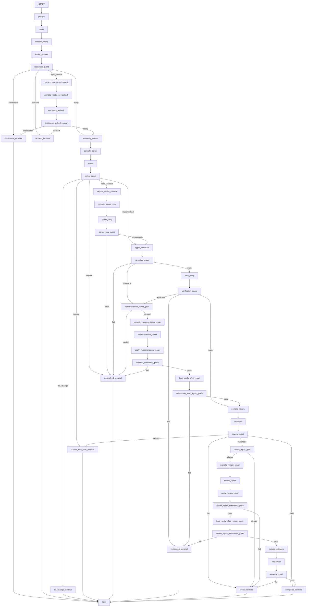

# Sage V2 Sequential Prototype Implementation Plan

## Document status

This is the implementation-ready companion to
[`13_SAGE_V2_PROVISIONAL_DESIGN.md`](13_SAGE_V2_PROVISIONAL_DESIGN.md) for the
first Sage V2 prototype.

The plan deliberately implements only the sequential V2 path. It is intended
to produce an evaluable prototype without worker dispatch, parallel Solver
calls, independent worker clones, merge orchestration, or replanning. Those
capabilities remain deferred until the sequential path proves better than V1.

The model policy is locked to the provisional design's constrained
cross-provider profile:

```text
Planner / Autonomy Classifier: google/gemini-3.7-flash
Solver / Implementer:          openai/gpt-5.4-mini
Reviewer:                     anthropic/claude-haiku-4-5
```

Allowed role-compatible fallbacks are:

```text
Planner:  google/gemini-3.5-flash-lite
Solver:   none
Reviewer: google/gemini-3.5-flash
```

The prototype remains opt-in behind configuration. V1 stays available as the
rollback path and remains the default until the V2 acceptance and canary gates
in this plan pass.

This document is a plan, not an as-built record. No V2 behavior is delivered
merely because it appears here.

---

## 1. Intended outcome

The first prototype replaces only the solve runtime inside the working V1
GitHub shell:

```text
existing V1 GitHub gate
        │
        ▼
exact-SHA isolated run clone + credential-free Docker sandbox
        │
        ▼
deterministic preflight
        │
        ▼
deterministic repository scout
        │
        ▼
Gemini intake planner / autonomy classifier
        │
        ├── repository evidence missing
        │      └── one deterministic context expansion
        │          + one Gemini readiness recheck
        │
        ├── human information or decision missing
        │      └── one consolidated clarification + terminal result
        │
        └── ready
               ▼
        freeze autonomy and acceptance contracts
               ▼
        deterministic Solver context compiler
               ▼
        one GPT-5.4 mini patch proposal
               ▼
        deterministic patch, scope, and Git guards
               ▼
        deterministic hard verification
               ▼
        Claude read-only review
               ▼
        bounded repair only when evidence requires it
               ▼
existing V1 publication boundary
```

The two primary resource targets are:

```text
ready happy path:       1 Planner + 1 Solver + 1 Reviewer = 3 model calls
under-specified Issue:  1 Planner + clarification + stop   = 1 model call
```

The prototype must preserve these V1 guarantees:

- exact command parsing and write/admin authorization;
- duplicate branch and Pull Request checks;
- solving against the accepted exact base SHA;
- a trusted host controller around an untrusted repository;
- no GitHub or model credentials in Docker;
- network-disabled repository execution;
- Git-derived changed files and diff as authoritative output;
- creation-only `sage/issue-<number>` publication;
- draft Pull Requests only and no automatic merge;
- one bot-owned invocation status plus finalizer recovery; and
- allowlisted GitHub Actions artifacts.

---

## 2. Prototype scope

### 2.1 Included

The prototype includes:

1. a provider-neutral structured model-call boundary;
2. Google, OpenAI, and Anthropic provider adapters;
3. constrained cross-provider profile validation;
4. per-run call, repair, context-expansion, retry, and time budgets;
5. normalized provider errors, usage, latency, retry, and fallback metadata;
6. deterministic repository scouting before the first model call;
7. mandatory autonomy admission and typed readiness dimensions;
8. one bounded repository-context expansion and readiness recheck;
9. one consolidated clarification packet and durable clarification rounds;
10. a frozen autonomy contract and acceptance contract;
11. role-specific deterministic context packets with hard character caps;
12. one sequential patch-first Solver;
13. one bounded Solver context-expansion escape hatch;
14. deterministic patch application and write-scope validation;
15. deterministic hard verification before semantic review;
16. one implementation repair and one review repair at most;
17. no-progress detection using diff and failure fingerprints;
18. a read-only independent Reviewer and a required re-review after review repair;
19. explicit terminal outcomes, including `human_required_after_start`;
20. V2 stage artifacts and model provenance without chain-of-thought;
21. GitHub clarification/status integration;
22. an opt-in local and GitHub V2 runtime selector;
23. deterministic unit/integration tests with fake model providers; and
24. a separate user-friendly prototype testing guide created with the feature.

### 2.2 Explicitly excluded

Do not implement any of the following in this prototype:

- Planner-directed or controller-directed parallel routing;
- `Send`, worker reducers, Worker Manager, worker clones, or worker scopes;
- merge or integration-repair agents;
- worker-to-worker communication;
- recursive delegation or agent spawning;
- a replanner or replan loop;
- bounded-tools Solver mode;
- strict-free or high-risk-review profiles;
- automatic fallback for the Solver;
- a vector database or embeddings;
- SQLite/Postgres/Redis checkpoint persistence;
- cross-run graph resume;
- long-term Issue or repository memory;
- automatic merge or ready-for-review promotion;
- a service, queue, database, or cloud sandbox;
- changes to branch naming or publication identity; or
- making V2 the default before evaluation.

The graph is sequential even when different providers could technically accept
concurrent requests. At most one model request is active anywhere in a run.

---

## 3. Locked prototype decisions

These decisions close design questions that would otherwise make the
implementation plan ambiguous.

1. The runtime selector is `SAGE_RUNTIME=v1|v2-prototype`; it defaults to
   `v1` during prototype development and rollout.
2. V2 accepts only `SAGE_MODEL_PROFILE=constrained-cross-provider` in the first
   prototype. Any other value fails preflight before a model call.
3. Required credentials are `GEMINI_API_KEY`, `OPENAI_API_KEY`, and
   `ANTHROPIC_API_KEY`. All three must be non-empty for the constrained profile.
4. The profile model IDs and fallbacks are exactly those listed in this
   document's status section. Per-role model overrides are intentionally absent
   from the first prototype so a canary has reproducible provenance.
5. Use the existing LangGraph dependency and project-owned graph routing.
   Providers never choose node names or destinations.
6. Add the existing LangChain Google and Anthropic chat-model integrations,
   pinned to compatible bounded major versions and locked through `uv.lock`.
   Do not add a second orchestration framework or generic retry package.
7. Provider SDK retries are disabled for V2. A project-owned call manager owns
   retry, fallback, budget, and deadline policy. V1 retains its existing OpenAI
   retry setting while it remains available.
8. Every outbound provider attempt consumes the global model-call budget,
   including schema repair, retry, and fallback attempts. This makes the
   six-call ceiling a real spend ceiling rather than a semantic-label count.
9. The normal call cap is six. The controller cannot start a call unless budget
   remains after preserving finalization/publication time.
10. Patch-first is the only V2 Solver mode. The Solver returns a unified diff in
    its structured response; deterministic repository code applies it.
11. The V1 six-tool loop remains implemented only for `SAGE_RUNTIME=v1`; it is
    not exposed to V2 roles.
12. All model calls are made by the trusted host controller. Model keys never
    enter repository prompts as values, artifacts, subprocess environments, or
    Docker.
13. Gemini context use requires an explicit repository-owner acknowledgement,
    `SAGE_GOOGLE_MODEL_CONTEXT_APPROVED=true`. Preflight fails without it. This
    records the provisional design's free-tier/data-use constraint without
    trying to infer a Google account's billing tier.
14. A Reviewer fallback is allowed only after the Claude attempt fails in a
    configured fallback-eligible category and enough call/time budget remains.
    The resulting metadata must say Gemini reviewed the candidate.
15. A Planner fallback is allowed only after a transient/model-availability
    failure of the primary Gemini model. It is not attempted for a missing or
    invalid Google credential because it uses the same credential.
16. The Solver has no fallback. An exhausted/unavailable OpenAI Solver ends in
    the corresponding provider terminal state.
17. A rate-limited attempt may wait and retry once only when `Retry-After` is
    valid, is at or below the configured wait ceiling, and leaves the
    finalization reserve intact. Otherwise fallback or terminal routing begins.
18. A single schema-repair call is allowed for a role only if the global call
    budget permits it. There is no prose/JSON repair loop.
19. The prototype does not publish a candidate unless hard verification is
    acceptable and semantic review passes.
20. `ReviewerResult.verdict=uncertain` is not a pass. It terminates unresolved
    unless the result contains a concrete implementation finding eligible for
    the one review repair.
21. A review repair is always hard-verified and then reviewed again. The second
    review may use the configured reviewer fallback, but it cannot trigger a
    second repair.
22. V1's single `working` GitHub status remains the prototype's non-terminal UX.
    Add precise V2 terminal states rather than adding several intermediate
    status edits in the first implementation.
23. A clarification is rendered into the invocation's existing bot-owned
    status comment with a versioned hidden clarification marker. The next run's
    context builder includes the newest such packet and the human replies after
    it while continuing to exclude generic Sage status comments.
24. Clarification ends the Actions job. The runner never waits for a reply.
25. Local CLI exit codes remain compatible: `0` for a publishable non-empty
    candidate, `1` for an execution/configuration failure, and `2` for a safe
    terminal result with no publishable diff, including clarification and
    unsupported/human-required outcomes.
26. The first prototype uses in-memory LangGraph execution plus durable stage
    artifacts. Checkpoint persistence and resume are deferred.

---

## 4. Current baseline and reuse map

The implementation must extend the current ownership boundaries instead of
building a duplicate application.

| Existing responsibility | Current implementation | Prototype treatment |
| --- | --- | --- |
| Local/GitHub request | `sage.domain.requests.SolveRequest` | Reuse unchanged. |
| Exact-SHA isolated clone | `sage.repository.workspace.prepare_run` | Reuse unchanged. |
| Solve lifecycle and sandbox cleanup | `sage.workflow.solve.solve_issue` | Extend only to understand richer terminal output and persist V2 artifacts. Keep cleanup in `finally`. |
| Runtime dependency inversion | `sage.domain.runtime.AgentRuntime`, `RuntimeContext` | Extend the output contract compatibly; do not put provider types in workflow code. |
| V1 graph | `sage.runtimes.langgraph` | Preserve as the V1 runtime and rollback path. Do not mutate it into V2. |
| Repository facade | `sage.repository.RepositoryTools` | Reuse reads, search, patch, diff, and commands; add focused structured operations needed by Scout/Verifier. |
| Safe patch application | `sage.repository.patch.apply_patch` | Reuse for Solver and repair patches; add size/format/scope guards around it. |
| Git-authoritative candidate | `get_complete_diff`, `get_changed_files` | Reuse after every mutation, verification, review repair, and finalization. |
| Bounded output | `sage.repository.output.truncate_text` | Reuse for excerpts/logs while retaining full safe artifacts separately. |
| Network-disabled sandbox | `DockerSandbox` | Reuse unchanged for repository commands. |
| Atomic artifact writes | `sage.artifacts.files` | Reuse for all V2 JSON/text artifacts. |
| Run artifact lifecycle | `ArtifactStore` | Preserve existing filenames; add a focused V2 stage writer rather than a catch-all API. |
| Controller configuration | `sage.config.Settings` | Extend with nested/focused V2 settings while preserving V1 environment behavior. |
| GitHub context | `sage.integrations.github.context` and rendering models | Extend filtering for durable clarification packets and replies. |
| GitHub status state machine | `sage.integrations.github.status` | Add V2 terminal statuses and bounded clarification rendering. |
| GitHub solve shell | `sage.workflow.github_issue.run_github_issue` | Reuse authorization, exact checkout, publication, provenance, and finalizer; branch on typed V2 outcome before no-change handling. |
| Publication | `sage.integrations.github.publishing` | Reuse unchanged. It sees only accepted `SolveResult` candidates. |
| CLI/Actions | `sage.cli`, composite actions, workflow | Add opt-in runtime/profile/key wiring while preserving V1. |
| Test toolchain | `pytest`, `make check`, `make v1-check` | Extend; no second test runner and no live API calls in normal tests. |

Important current gaps the plan must account for:

- `Settings` currently requires only OpenAI configuration;
- `AgentFinalOutput` and `SolveResult` cannot distinguish clarification,
  blocked, unresolved, and publishable outcomes;
- `ArtifactStore` records only one final model result;
- the current graph is a multi-turn OpenAI tool loop;
- repository tree/search interfaces return display strings rather than Scout
  models;
- GitHub status has only accepted, working, PR, no-change, and failed states;
- all Sage bot status comments are currently excluded from later Issue context;
- GitHub failure categories are OpenAI-specific; and
- the solve action receives only the OpenAI key.

---

## 5. Target source and test layout

Follow the repository's existing package structure. Add directories only for
real responsibilities:

```text
apps/agent/src/sage/
  config.py                         # existing; runtime/profile/budget settings
  domain/
    results.py                      # existing; final workflow outcomes
    runtime.py                      # existing; compatible runtime boundary
    admission.py                    # readiness, questions, autonomy contract
    planning.py                     # execution plan and retrieval requests
    review.py                       # review findings and criterion results
    usage.py                        # provider call/usage/provenance records
    verification.py                 # checks, failures, fingerprints
  providers/
    __init__.py
    base.py                         # ModelProvider protocol and normalized result
    errors.py                       # provider-neutral error taxonomy
    google.py                       # Gemini adapter
    openai.py                       # OpenAI adapter
    anthropic.py                    # Claude adapter
    factory.py                      # constrained profile construction only
    manager.py                      # budget, retry, fallback, deadline, usage
  repository/
    inventory.py                    # structured tracked-file and metadata facts
    scout.py                        # RepositoryMap construction and ranking
    scope.py                        # safe glob/path write-scope checks
    patch.py                        # existing; small reusable validation extension
  context/
    __init__.py
    models.py                       # excerpts, packets, omission metadata
    compiler.py                     # role-specific deterministic packets
    ranking.py                      # deterministic relevance ordering
  verification/
    __init__.py
    discovery.py                    # bounded command/capability selection
    runner.py                       # sandbox execution and fingerprints
  runtimes/
    v2/
      __init__.py
      graph.py                      # state, nodes, edges, pure routers
      runtime.py                    # V2GraphRuntime adapter
      prompts.py                    # role instructions and packet rendering
      validation.py                 # readiness/plan/solver/review guards
  artifacts/
    v2.py                           # fixed V2 stage artifact writer
```

Mirror the production boundaries in tests:

```text
apps/agent/tests/
  providers/
  repository/test_inventory.py
  repository/test_scout.py
  repository/test_scope.py
  context/test_compiler.py
  verification/test_discovery.py
  verification/test_runner.py
  runtimes/v2/test_graph.py
  runtimes/v2/test_runtime.py
  runtimes/v2/test_validation.py
  artifacts/test_v2_artifacts.py
  integrations/github/test_context.py       # extend
  integrations/github/test_status.py        # extend
  workflow/test_solve.py                    # extend
  workflow/test_github_issue.py             # extend
  actions/test_actions.py                    # extend
```

Do not place provider-specific exceptions or payload dictionaries in graph
state, domain models, GitHub workflow code, or artifacts.

---

## 6. Configuration contract

### 6.1 Runtime and profile

Add these settings:

| Environment variable | Prototype default | Validation |
| --- | --- | --- |
| `SAGE_RUNTIME` | `v1` | `v1` or `v2-prototype` |
| `SAGE_MODEL_PROFILE` | `constrained-cross-provider` when V2 is selected | Exact prototype profile only |
| `GEMINI_API_KEY` | none | Required and secret for V2 |
| `OPENAI_API_KEY` | none | Required and secret for both profiles |
| `ANTHROPIC_API_KEY` | none | Required and secret for V2 |
| `SAGE_GOOGLE_MODEL_CONTEXT_APPROVED` | `false` | Must be exactly true for V2 |

Secrets remain `repr=False`, are never serialized, and must not be echoed in
validation errors. Validate presence manually before constructing a Pydantic
error containing raw input.

### 6.2 Resource defaults

Add a frozen `V2Settings`/nested settings model with these initial defaults:

```text
max_model_calls                    = 6
max_readiness_context_expansions   = 1
max_solver_context_expansions      = 1
max_implementation_repairs         = 1
max_review_repairs                 = 1
max_schema_repairs_per_role        = 1
max_rate_limit_retries_per_call    = 1
max_blocking_questions             = 3
max_clarification_rounds           = 2
max_inflight_model_calls           = 1

planner_input_chars                = 48_000
planner_output_chars               = 10_000
readiness_recheck_input_chars      = 40_000
readiness_recheck_output_chars     = 8_000
solver_input_chars                 = 96_000
solver_output_chars                = 64_000
reviewer_input_chars               = 48_000
reviewer_output_chars              = 8_000
repair_input_chars                 = 48_000
repair_output_chars                = 48_000
max_candidate_diff_chars           = 96_000
max_verification_log_chars         = 24_000

model_request_timeout_seconds      = 600
max_retry_after_seconds            = 30
run_deadline_seconds               = 4_800
finalization_reserve_seconds       = 300
```

Character caps are hard controller limits. The context compiler also records a
conservative token estimate for diagnostics, but does not claim that character
count is an exact provider tokenizer. Actual returned usage is authoritative.

The global output and patch caps intentionally bound the first prototype to
small and medium Issues. A larger candidate ends `budget_exhausted` or
`context_too_large`; it is not silently truncated and published.

### 6.3 Verification configuration

Support a bounded optional JSON list of repository verification commands from
trusted controller configuration, plus deterministic repository discovery.
Do not interpolate commands into host shell steps. Commands execute only via
the existing Docker sandbox.

Each verification command has:

```text
id
command
source = mandatory | configured | discovered | planned
required
timeout_seconds
```

Limits:

- `git diff --check HEAD --` is always required;
- at most three additional commands run per verification pass;
- each timeout is capped by the existing command timeout and remaining run
  deadline;
- command strings use the existing repository-command character cap;
- duplicate commands are removed deterministically; and
- provider suggestions are proposals, not direct execution authority.

### 6.4 Backward compatibility

`Settings.from_env()` must load only the credentials required by the selected
runtime. V1 must continue to work with only `OPENAI_API_KEY`. The model-free
GitHub gate and finalizer must continue loading no model settings.

---

## 7. Provider boundary and call policy

### 7.1 Project-owned interface

Define a narrow async protocol conceptually equivalent to:

```python
class ModelProvider(Protocol):
    async def invoke_structured(
        self,
        *,
        role: ModelRole,
        messages: Sequence[BaseMessage],
        schema: type[BaseModel],
        timeout_seconds: int,
    ) -> ProviderResult: ...

    def capabilities(self) -> ModelCapabilities: ...
```

`ProviderResult` contains only normalized values:

```text
parsed result
provider
model
input tokens
output tokens
cached tokens when supplied
latency milliseconds
provider request ID when safe
finish category
```

Do not expose raw provider clients or response shapes to LangGraph nodes.

### 7.2 Adapter implementation

Use the existing asynchronous LangChain chat-model pattern:

- Google adapter wraps the compatible `ChatGoogleGenerativeAI` integration;
- OpenAI adapter reuses `ChatOpenAI` with the Responses API;
- Anthropic adapter wraps the compatible `ChatAnthropic` integration; and
- all adapters request Pydantic structured output and normalize usage.

Construct clients once per runtime. Set provider-native automatic retries to
zero so the project-owned manager can account for every outbound attempt.

Provider adapter tests must inspect generated request options without making a
network call, following the existing OpenAI runtime test pattern where the
integration permits it. Tests must otherwise use fake clients at the adapter
boundary rather than patching internal graph logic.

### 7.3 Error taxonomy

Normalize provider failures to:

```text
authentication
permission_or_model_access
quota_exhausted
rate_limited
timeout
provider_5xx
invalid_response
schema_error
context_too_large
ambiguous_outcome
```

Each normalized error may carry bounded safe metadata:

```text
provider
model
HTTP status
retry_after_seconds
request_id
retryable
outcome_ambiguous
```

It must not carry response bodies, prompts, keys, headers outside an allowlist,
or provider exception `repr` into user-facing messages.

### 7.4 Retry and fallback matrix

| Role/provider | Retry once | Fallback |
| --- | --- | --- |
| Planner Gemini 3.7 | 429 with acceptable `Retry-After`; timeout/5xx only when outcome is known absent | Gemini 3.5 Flash-Lite for rate/model availability/5xx after retry |
| Planner Gemini credential failure | No | No, because fallback uses the same credential |
| Solver OpenAI | 429 with acceptable `Retry-After`; timeout/5xx only when safe | None |
| Reviewer Claude | 429 with acceptable `Retry-After`; timeout/5xx only when safe | Gemini 3.5 Flash for auth/access/quota/rate/model availability/5xx |
| Schema error | One role-local schema-repair call if budget remains | Then invalid-model-output terminal |
| Ambiguous provider outcome | No blind duplicate | Fallback only when policy explicitly confirms duplication is safe; otherwise terminal |

Every retry/fallback reserves budget before it starts. Never sleep beyond the
configured ceiling or the publication reserve.

### 7.5 Call accounting

Create a `ModelCallManager` that is the only object allowed to invoke a
provider. It owns:

- one global async lock, enforcing no parallel calls;
- the six-attempt budget;
- role repair/context-expansion counters;
- per-provider consecutive failure counts;
- deadline and finalization reserve checks;
- retry/fallback decisions;
- usage/provenance records; and
- incremental persistence of `usage.json`.

Each record includes a monotonic call number, semantic stage, attempt kind
(`primary`, `retry`, `fallback`, or `schema_repair`), provider/model, usage,
latency, outcome, and safe error category. It never includes prompts or hidden
reasoning.

---

## 8. Domain contracts

Use frozen Pydantic models with `extra="forbid"` for routing-critical data.
Field lengths and list counts must be bounded at schema validation.

### 8.1 Workflow terminal outcome

Add a provider-neutral enum used by the runtime, workflow, CLI, artifacts, and
GitHub mapping:

```text
completed
no_change
needs_human_information
needs_human_design_decision
needs_maintainer_rewrite
human_required
human_required_after_start
environment_blocked
unsupported
unresolved
provider_unavailable
rate_limited
budget_exhausted
verification_failed
review_failed
invalid_model_output
```

Extend `AgentFinalOutput` compatibly with default `outcome=completed` and an
optional `clarification`. Existing V1 structured output remains valid because
the new fields have safe defaults.

Extend `SolveResult` with the same typed outcome and bounded V2 provenance.
The workflow still derives `diff` and `changed_files` from Git and rejects
inconsistent combinations:

- a publishable `completed` result requires a non-empty diff and changed files;
- clarification/human/blocked/unresolved outcomes must not publish even if a
  partial diff exists;
- a partial diff for a non-publishable outcome remains a diagnostic artifact;
- `no_change` requires an empty authoritative diff; and
- V1 results normalize through the existing behavior while V1 is selected.

### 8.2 Readiness result

Define the dispositions from the provisional design exactly:

```text
READY_AUTONOMOUS
NEEDS_REPOSITORY_CONTEXT
NEEDS_HUMAN_INFORMATION
NEEDS_HUMAN_DESIGN_DECISION
HUMAN_REQUIRED
ENVIRONMENT_BLOCKED
UNSUPPORTED
```

Define every readiness dimension explicitly:

```text
objective_clarity
expected_behavior_clarity
acceptance_testability
scope_boundedness
repository_evidence_sufficiency
design_choice_closed
external_dependency_availability
sandbox_compatibility
permission_or_credential_independence
cross_repository_dependency
human_approval_dependency
```

Each dimension is `sufficient`, `insufficient`, `unknown`, or
`not_applicable`, with a short evidence field. Confidence is optional metadata
and cannot override an insufficient/unknown blocking dimension.

### 8.3 Retrieval requests

Support only bounded machine-retrievable requests:

```text
path
symbol
literal_search
nearby_tests
direct_references
```

Each request contains `kind`, `value`, optional safe relative path, and reason.
The validator caps the list, rejects absolute/parent/`.git` paths, rejects
empty or overly broad searches, and limits fulfillment to one readiness round
or one Solver round as applicable.

### 8.4 Execution plan

The plan contains:

```text
task_summary
acceptance_contract[]
safe_assumptions[]
tasks[]
retrieval_requests[]
verification_hints[]
risks[]
non_blocking_uncertainties[]
allowed_write_scopes[]
complexity = small | medium | large
route = single
```

Each acceptance criterion has a stable ID, observable behavior, and a
verification method. Each task has an ID, objective, relevant paths, and
criterion IDs. Dependencies may express sequential order, but cycles and
parallel branches are rejected. `route` has only the literal value `single` in
the prototype schema.

### 8.5 Clarification packet

Each packet contains:

```text
version
round
disposition
summary
questions[1..3]
repository_evidence[]
rerun_instruction
```

Each question includes the missing decision/information, why it blocks, a
small option set when supported by evidence, and an optional proposed default.
The controller supplies the round and standard rerun instruction; the model
cannot forge them.

### 8.6 Autonomy contract

The deterministic `autonomy_commit` node constructs and freezes:

```text
task_summary
acceptance_contract
safe_assumptions
allowed_write_scopes
forbidden_write_scopes
non_blocking_uncertainties
available_capabilities
forbidden_capabilities
verification_expectations
provider_profile
remaining_call/repair/context budgets
base_sha
plan_digest
```

No later model may expand scope, change acceptance criteria, or increase a
budget.

### 8.7 Solver result

Statuses are:

```text
implemented
no_change
blocked
need_context
human_decision_discovered
```

The structured envelope contains summary, unified patch, changed-file claim,
expected checks, uncertainty, retrieval requests, and blocker evidence. A
model validator enforces which fields are required/forbidden for each status.

### 8.8 Review result

Use the provisional design's verdict and failure types. Every blocking finding
has an ID, criterion IDs, file/line evidence when available, explanation, and
required repair outcome. Optional findings cannot cause repair.

The deterministic review guard rejects:

- a pass with blocking findings;
- a fail with no concrete blocking finding;
- unknown criterion IDs;
- evidence outside the authoritative changed/relevant files without an
  explicit regression explanation; and
- requests that broaden the frozen acceptance contract.

---

## 9. Deterministic repository Scout

### 9.1 Inputs and outputs

`RepositoryScout` receives only the isolated workspace, sandbox, exact base
SHA, normalized Issue text, and Scout limits. It performs no model call and no
mutation.

It returns a typed `RepositoryMap` with:

```text
base_sha
tracked_file_count
tracked_paths_sample
top_level_summary
language_summary
manifests
test_roots
ci_build_files
documentation_files
likely_entry_points
exact_issue_paths
filename_matches
lexical_matches
direct_reference_hints
omitted/truncated sections
```

### 9.2 Reuse and new structured operations

Reuse path safety, ignored-directory policy, bounded file reading, fixed-string
search, sandbox execution, and Git operations. Add focused structured
repository operations rather than parsing the current human-readable
`list_tree()` and `search_text()` strings.

Use tracked Git paths as the primary inventory so generated and untracked
workspace noise does not dominate. Fixed sandbox commands may count NUL-
separated paths and return a bounded sample. Never load an unbounded file list
or complete recursive tree into memory or a prompt.

### 9.3 Deterministic ranking

Rank evidence in this order:

1. safe exact paths written in the Issue;
2. exact identifiers/symbol-like tokens;
3. filenames matching Issue terms;
4. fixed-string lexical hits;
5. tests adjacent to the matched source;
6. direct imports/references that can be found cheaply;
7. relevant manifests, architecture docs, and README excerpts.

Tokenization of Issue terms is deterministic: normalize Unicode/newlines,
extract path-like and identifier-like terms, remove a fixed stop-word list,
deduplicate case-insensitively, and cap term count/length. Search uses literal
queries passed after `-e` and shell quoting. Repository content never becomes a
command.

### 9.4 Scout limits

Initial constants should include:

```text
max tracked path sample    = 5_000
max issue search terms     = 12
max hits per term          = 5
max total lexical hits     = 40
max exact issue paths      = 20
max manifest/doc excerpts  = 12
max excerpt lines          = existing 300-line read cap, normally much lower
```

Every truncated section is disclosed. The Scout persists
`repository-map.json` before intake begins.

### 9.5 Scout tests

Cover:

- Python-only, Node-only, and mixed fixture repositories;
- exact path and identifier extraction;
- ignored/generated/vendor directories;
- filenames containing spaces, newlines, Unicode, and leading dashes;
- symlinks and `.git` rejection;
- huge tracked-file sets and explicit truncation;
- no-match and empty-repository behavior;
- deterministic ordering independent of filesystem iteration order;
- bounded output for very large/minified files; and
- proof that no Scout operation mutates the repository.

---

## 10. Context compiler

### 10.1 State versus context

Keep complete run knowledge in application state/artifacts. Construct a new
packet for each call. Never serialize graph state or prior model transcripts
wholesale.

Every packet has:

```text
packet version and role
base SHA and profile provenance
untrusted-input delimiters
role-specific contract
ordered evidence sections
omission/truncation disclosure
hard character count
digest persisted in artifacts
```

Do not include hidden chain-of-thought from an earlier role.

### 10.2 Planner packet

Include:

- normalized Issue context;
- exact base metadata;
- RepositoryMap summary and highest-ranked excerpts;
- sandbox and verification capability summary;
- current run budgets;
- clarification round metadata;
- newest prior clarification packet and subsequent human replies when present;
- readiness rubric; and
- required `IntakeResult` schema.

### 10.3 Readiness recheck packet

Include the original task/rubric, the first readiness result, only the newly
fulfilled evidence, and remaining budget. Do not repeat lower-ranked Scout
content merely because room remains.

### 10.4 Solver packet

Include:

- frozen autonomy and acceptance contracts;
- ordered plan tasks;
- allowed/forbidden write scopes;
- selected complete small files or bounded source slices;
- selected relevant tests;
- manifests/dependency facts;
- verification capabilities;
- baseline Git status/diff digest;
- patch-first instructions and output schema; and
- explicitly disclosed omitted evidence.

### 10.5 Reviewer packet

Include:

- normalized original requirement;
- frozen acceptance contract and assumptions;
- authoritative complete candidate diff;
- changed-file list;
- verification results/fingerprints;
- selected source/tests needed to understand the diff;
- known uncertainty and fallback provenance; and
- the read-only review schema.

If the complete diff exceeds the Reviewer/candidate hard cap, terminate safely.
Do not review a silently partial diff.

### 10.6 Repair packet

Include only the frozen contract, current relevant diff, one verification
failure or the concrete blocking review findings, relevant source slices,
bounded error excerpts, write scope, and prior diff/failure fingerprints.

### 10.7 Ranking and trimming algorithm

Build evidence as typed whole excerpts with priority, source path/range, digest,
and character size. Add mandatory sections first, then sort optional evidence
by deterministic score and stable path/range tie-breakers. Drop whole excerpts
that do not fit. Never cut code in the middle without an explicit truncated
range marker.

Persist compiled packets under `contexts/` for local diagnostics, with strict
filesystem names generated by the controller. Do not upload compiled contexts
through GitHub Actions by default because they may contain substantial source.

---

## 11. Autonomy admission

### 11.1 Intake call

The first graph model node invokes Gemini once with the Planner packet and
`IntakeResult` schema. It must answer the mandatory autonomy question and either
return a ready plan, bounded machine retrieval requests, or concrete human/
environment/unsupported blockers.

### 11.2 Deterministic readiness guard

The guard validates the cross-field contract, not merely JSON shape.

For `READY_AUTONOMOUS`, require:

- objective, expected behavior, acceptance testability, scope, repository
  evidence, and design choice to be sufficient;
- external dependency, sandbox, permission/credential, cross-repository, and
  approval dimensions to be sufficient or not applicable;
- at least one bounded acceptance criterion;
- a valid sequential execution plan;
- safe non-empty allowed write scopes;
- no blocking question or human-owned decision; and
- a plan that fits prototype capabilities.

For `NEEDS_REPOSITORY_CONTEXT`, require bounded retrievable requests and no
human question yet. Fulfill at most one round, then make one readiness recheck.
The second response cannot request another repository expansion; convert that
to a concrete terminal result after validation.

For human-needed dispositions, require one to three consolidated blocking
questions/evidence items. Do not start Solver or Reviewer.

### 11.3 Plan validation

Validate:

- stable unique task/criterion IDs;
- criterion references;
- task count and text limits;
- route exactly `single`;
- acyclic sequential dependencies;
- repository-relative paths and safe glob syntax;
- no `.git` or controller-artifact writes;
- retrieval request limits;
- non-empty acceptance behavior and verification methods;
- verification hints within sandbox capabilities; and
- no privileged/network/publishing operation assigned to a model.

Invalid structure gets one schema-repair attempt if budget permits. A
semantically unsafe but schema-valid plan is rejected without asking the model
to argue around the guard.

### 11.4 Clarification round handling

Use a strict hidden marker such as:

```text
<!-- sage-clarification:v1 round=1 disposition=needs_human_information -->
```

The marker is controller-generated and parser-validated. On a later invocation:

1. find the newest prior Sage clarification within bounded comment pages;
2. include its complete bounded packet even though generic Sage status comments
   remain excluded;
3. include eligible human comments created after that packet and before the new
   command;
4. pass the prior round number to intake; and
5. if another clarification would exceed round two, emit
   `needs_maintainer_rewrite` instead of posting round three.

Do not interpret a command comment as a clarification answer. Do not include
later comments or a clarification belonging to another repository/Issue.

### 11.5 Autonomy commit

Only the deterministic `autonomy_commit` node can cross from read-only Phase A
to mutation-capable Phase B. It freezes the contract, persists
`autonomy-contract.json`, and records a digest in state. Every subsequent node
verifies that digest before using the contract.

---

## 12. Sequential Solver and candidate guards

### 12.1 Primary implementation

The OpenAI Solver receives one compiled packet and returns `SolverResult`.
It has no repository tools and cannot execute commands, publish, or mutate the
workspace directly.

For `implemented`:

1. deterministically unwrap one exact Markdown diff fence if present;
2. reject an empty, oversized, binary, malformed, or unsafe-path patch;
3. save the proposed patch artifact;
4. apply it with the existing `RepositoryTools.apply_patch()` path;
5. derive actual changed paths and complete diff from Git;
6. enforce frozen allowed/forbidden write scopes;
7. run `git diff --check HEAD --` as the first candidate guard;
8. record claimed-versus-actual changed paths as observability only; and
9. persist the authoritative candidate digest.

The model's changed-file claim never grants scope or determines publication.

### 12.2 Solver context expansion

For `need_context`, validate and fulfill at most one bounded retrieval list,
recompile the packet, and make one more Solver call. The second Solver response
cannot request more context.

Context expansion consumes call budget and is permitted only before a patch is
applied. It does not mutate the repository.

### 12.3 Other Solver statuses

- `no_change`: verify the authoritative diff is empty and preserve concrete
  evidence that the requirement is already satisfied.
- `blocked`: end unresolved/environment-blocked according to validated evidence;
  do not publish a partial patch.
- `human_decision_discovered`: end `human_required_after_start`, record an
  autonomy-admission miss, and do not ask the runner to wait.

### 12.4 Scope enforcement

Implement scope matching in one reusable module using normalized POSIX paths.
Support exact files and bounded directory globs needed by the plan. Reject
absolute paths, parent traversal, `.git`, empty scope, and patterns that match
outside the repository. Check additions, modifications, renames, and deletions
from Git-derived paths.

If scope fails, classify it as an implementation failure eligible for the one
implementation repair only when a safe correction is possible. Otherwise end
unresolved.

---

## 13. Hard verification

### 13.1 Verification plan discovery

Build a deterministic `VerificationPlan` from:

1. mandatory `git diff --check HEAD --`;
2. trusted configured repository commands;
3. known manifest/test conventions discovered by the Scout; and
4. validated Planner/Solver hints that match available repository tooling.

For the first prototype, implement conservative discovery for conventions
already represented in the repository and fixtures, especially Python
`pytest`/compile checks and package scripts explicitly present in
`package.json`. Do not add a universal command that guesses every ecosystem.

Each discovered command records why it was selected. Missing dependencies or
unsupported project layouts become explicit unavailable checks, not fabricated
passes.

### 13.2 Execution

Run commands sequentially inside the existing network-disabled Docker sandbox.
Persist full bounded-by-file logs under `verification/`; put only command, exit
code, timeout, failing test names where extractable, bounded excerpt, and
fingerprint in graph state/model context.

After checks, derive Git status/diff again. Record verification-created
workspace changes. Never silently delete unknown files. A tracked candidate
mutation caused by verification is a verification failure; ignored cache files
do not change the authoritative diff.

### 13.3 Result policy

Statuses are:

```text
pass
fail
unavailable
timeout
```

`git diff --check` must pass. Configured commands marked required must pass.
Discovered checks may be unavailable only when the final uncertainty and
repository publication policy permit it. The prototype defaults to conservative
publication: a failed or timed-out required check blocks review/publication.

### 13.4 Failure fingerprints

Generate a stable hash from normalized command ID, exit category, failing test
names, and normalized leading error locations/messages. Strip run directories,
timestamps, random ports, ANSI color, and secret-looking values before hashing.

Store the full safe log as an artifact and expose only the bounded fingerprint
summary to repair.

---

## 14. Review, repair, and no-progress policy

### 14.1 Reviewer

Only a hard-verification-acceptable candidate reaches Reviewer. The Reviewer is
read-only and receives the complete bounded authoritative diff, not Solver
reasoning.

On pass, the controller confirms:

- every frozen criterion has a result;
- there are no blocking findings;
- verification remains acceptable;
- actual paths remain in scope; and
- final diff digest matches the reviewed digest.

Only then does the graph produce `completed`.

### 14.2 Implementation repair

One repair is available for a concrete failed patch/scope/hard-verification
result. The repair uses the OpenAI Solver with the repair packet and returns an
incremental unified diff against the current workspace.

After applying it, repeat patch/path/scope/diff guards and the full selected
hard verification plan. Do not send a failed repair to Reviewer.

### 14.3 Review repair

One review repair is available only for validated blocking implementation
findings. Optional findings, style preferences, new requirements, and planning
failures cannot trigger it.

After applying a review repair:

1. run all candidate/scope guards;
2. run hard verification;
3. compile a fresh Reviewer packet from the new authoritative diff; and
4. perform one re-review.

The re-review is terminal: pass completes; fail/uncertain ends `review_failed`
or `unresolved` with evidence.

### 14.4 No progress

Before every repair record:

```text
candidate diff digest
changed paths
passing check count
failure fingerprints
review finding fingerprints
```

After repair, stop immediately when the relevant fingerprint persists and the
diff is unchanged/effectively equivalent, or when the passing-check count does
not improve and no blocking finding is resolved. Do not consume another call
to restate the same failure.

### 14.5 Budget interactions

Repair counters and the six-call budget are both required. A nominal repair
allowance does not authorize a call when global budget or time is exhausted.
For example, a readiness recheck plus a provider retry can leave insufficient
budget for a later re-review; the graph must terminate safely rather than
exceed the ceiling.

---

## 15. Prototype LangGraph

### 15.1 Graph state

Use a typed state containing bounded models/references, not provider clients or
large raw strings:

```text
issue/base metadata
repository-map reference + bounded summary
readiness result
readiness expansion count
execution plan
autonomy contract + digest
compiled-context references
solver result metadata
solver expansion count
authoritative diff reference/digest/size/paths
verification result
review result
repair counters
progress fingerprints
usage artifact reference
terminal output
```

Injected node services hold providers, repository facade, compiler, verifier,
call manager, settings, and artifact writer. Secrets never enter graph state.

### 15.2 Nodes and routes

Implement this explicit topology:



Provider retry, fallback, and schema repair stay inside `ModelCallManager`; they
do not add graph topology because they are bounded transport/contract policy,
not workflow decisions.

### 15.3 Pure routing tests

Every conditional route must be a pure function tested directly. Graph tests
must assert exact node/edge sets from compiled Mermaid output and prove:

- no worker, dispatch, join, merge, replan, or tool-loop nodes exist;
- under-specified intake cannot reach Solver;
- failed verification cannot reach Reviewer;
- Reviewer optional findings cannot reach repair;
- each repair path can execute only once;
- context expansion can execute only once per supported stage;
- budget/deadline guards precede every model node; and
- every terminal reaches `END`.

---

## 16. Artifact and observability contract

### 16.1 Local artifacts

Preserve existing files:

```text
request.json
metadata.json
issue.md
agent-final.json
changed-files.json
diff.patch
repo/
```

Add V2 files/directories:

```text
repository-map.json
intake.json
plan.json
autonomy-contract.json
contexts/
  planner-01.txt
  readiness-recheck-02.txt       # only when used
  solver-02.txt
  reviewer-03.txt
  repair-*.txt                   # only when used
proposals/
  solver-*.patch
verification/
  pass-*/summary.json
  pass-*/<check-id>.log
review.json
usage.json
terminal.json
```

Use fixed writer methods and atomic writes. Large patch, context, and log data
stay out of graph state. Every referenced artifact has a digest and byte count.

### 16.2 Safe content rules

Artifacts must not contain:

- provider/GitHub keys or authorization headers;
- the controller process environment;
- raw provider exception dumps;
- hidden chain-of-thought/reasoning traces;
- cookies, home-directory configuration, or host files; or
- repository data outside the isolated run scope.

Prompts/compiled packets are local artifacts only by default. Any future upload
requires a separate allowlist/privacy decision.

### 16.3 GitHub diagnostic allowlist

Extend the existing allowlist only with bounded non-secret summaries:

```text
metadata.json
github.json
agent-final.json
changed-files.json
diff.patch
usage.json
terminal.json
verification-summary.json
review.json
```

Do not upload `contexts/`, raw provider data, full verification logs, Scout
excerpts, or the workspace. Keep the existing short retention policy.

### 16.4 Structured logs

Log stage start/end, role, provider/model, call/attempt number, latency, usage,
fallback, retry, terminal outcome, verification status, diff digest prefix, and
repair count. Never log complete prompts, source excerpts, patches, Issue bodies,
or credentials in normal logs.

---

## 17. Workflow, GitHub status, and clarification integration

### 17.1 Core solve workflow

Keep `solve_issue()` as the single lifecycle owner. Extend it to:

1. initialize artifacts before runtime execution;
2. start the existing sandbox;
3. pass the same `RuntimeContext` to the selected runtime;
4. derive authoritative diff/paths regardless of terminal outcome;
5. validate outcome/diff consistency;
6. persist final output and result; and
7. stop the sandbox in `finally` for every terminal/error path.

Do not publish from the runtime.

### 17.2 Runtime selection

Add one factory selected by trusted settings:

```text
v1            -> existing LangGraphRuntime
v2-prototype  -> V2GraphRuntime with constrained profile
```

The CLI and GitHub workflow use the same factory. Tests inject a fake runtime as
they do now.

### 17.3 GitHub outcomes

Extend `GitHubWorkflowOutcome` and status states for safe V2 terminals. At
minimum distinguish:

```text
needs_human_information
needs_human_design_decision
needs_maintainer_rewrite
human_required
human_required_after_start
environment_blocked
unsupported
unresolved
provider_unavailable
rate_limited
verification_failed
review_failed
```

Expected non-publishable V2 outcomes are typed results, not controller
exceptions. Infrastructure/configuration/provider protocol failures may still
raise focused exceptions when no valid terminal output can be formed.

`run_github_issue()` must branch on outcome before its current generic
no-diff logic:

- clarification outcome: render terminal clarification; never call publisher;
- no-change: reuse no-change flow;
- blocked/unresolved: render precise terminal evidence; never publish;
- completed with accepted non-empty diff: call existing publisher unchanged;
- inconsistent outcome/diff: fail safely as a controller/runtime contract bug.

### 17.4 Clarification rendering safety

Render questions through the existing control-character, mention, length, and
hidden-marker protections. The controller creates the only real Sage marker;
model text containing `<!-- sage-` is neutralized.

The status must say:

- why Sage stopped before implementation;
- all one-to-three questions;
- bounded repository evidence/options;
- the clarification round;
- that no Solver or Reviewer call was made when true; and
- to answer in a new Issue comment and post a new exact `/sage solve` command.

### 17.5 Finalizer

Treat every new V2 terminal status as terminal so the finalizer never overwrites
a useful clarification/review/verification result with generic failure text.
The PR reconciliation behavior remains unchanged.

### 17.6 Failure categories

Replace OpenAI-only categories in V2 paths with provider-neutral categories
plus safe provider/model provenance. Preserve existing V1 category strings for
V1 compatibility. User recovery text must distinguish authentication, quota,
temporary rate limit, invalid model output, verification failure, and
human-required outcomes without exposing raw errors.

---

## 18. GitHub Actions and secret boundary

Update the solve composite action with V2-only inputs:

```text
gemini-api-key
anthropic-api-key
runtime
model-profile
google-model-context-approved
```

The existing OpenAI key remains. Pass all provider keys only to the single
trusted solve/controller step. Do not pass them to Docker build arguments,
Docker environment, artifacts, gate, finalizer, checkout, setup, or upload
steps.

The installed workflow maps repository secrets:

```text
secrets.GEMINI_API_KEY
secrets.OPENAI_API_KEY
secrets.ANTHROPIC_API_KEY
```

and an explicit non-secret repository variable/locked action input for the
Google context acknowledgement. During canary rollout, set
`SAGE_RUNTIME=v2-prototype`; keep `v1` as the immediate rollback value.

Extend action policy tests to prove:

- gate/finalizer jobs receive no provider secret;
- solve is the only job/step receiving all three keys;
- keys are not Docker build args or container environment;
- V2 cannot run when any required key/acknowledgement is absent;
- action dependencies remain full-SHA pinned;
- diagnostic upload excludes contexts/logs/workspace; and
- the job timeout exceeds the run deadline plus finalization reserve.

---

## 19. Detailed sequential implementation phases

Implement in this order. Complete focused tests for each phase before moving to
the next; do not develop phases in parallel.

### Phase 0 — Freeze baseline and prototype fixtures

Work:

- run and record `git status --short`, unstaged/staged diffs, `make check`, and
  `make v1-check` before implementation;
- preserve all current V1 graph/runtime tests as regression tests;
- add fixture repositories/Issue contexts for readiness, clarification,
  repository expansion, successful patch, verification failure, and review
  failure;
- add fake provider response builders with safe deterministic usage metadata;
- record the current V1 graph Mermaid output; and
- add a checklist mapping every first-prototype design node to this plan.

Exit criteria:

- the baseline is green or pre-existing failures are documented;
- fixtures require no live provider/Docker where a fake boundary suffices; and
- no production behavior has changed.

### Phase 1 — Domain outcomes and configuration

Work:

- add readiness, plan, autonomy, verification, review, usage, and terminal
  domain models;
- extend final runtime/workflow results compatibly;
- add runtime/profile/provider/budget settings;
- add explicit three-key and Google-context acknowledgement validation;
- add the runtime factory while leaving V1 default; and
- update `.env.example` without real credentials.

Tests:

- cross-field model invariants and all enum cases;
- secret redaction from repr/errors/serialization;
- V1 environment compatibility with one key;
- V2 failure for each missing key, invalid profile, bad limit, or absent
  acknowledgement; and
- runtime factory selection.

Exit criteria:

- V1 tests remain green;
- invalid V2 configuration fails before a provider object is invoked; and
- no secret is serializable through a domain/result model.

### Phase 2 — Provider adapters and call manager

Work:

- add compatible Google/Anthropic dependencies and refresh only the agent lock;
- implement provider protocol/results/errors;
- wrap Gemini, OpenAI, and Claude structured calls;
- implement usage normalization;
- implement global sequential call budget, deadline, retry, fallback, circuit
  breaker, and incremental usage persistence; and
- add constrained-profile factory.

Tests:

- provider request construction and structured result validation;
- error normalization per provider;
- `Retry-After` parsing/capping;
- exact fallback matrix;
- no Solver fallback;
- every attempt consumes budget;
- no retry for ambiguous outcome;
- one global in-flight call using an async concurrency test;
- deadline/publication reserve denial; and
- logs/usage artifacts contain no credential or prompt.

Exit criteria:

- all provider behavior is testable behind fakes;
- happy path uses the requested three providers/models; and
- the manager cannot exceed six attempts under retries/fallback/schema repair.

### Phase 3 — Repository inventory and Scout

Work:

- add structured tracked-path inventory and metadata helpers;
- centralize reusable ignored-area rules where needed;
- implement Issue-term extraction, evidence lookup, ranking, and caps;
- implement `RepositoryMap` construction;
- persist `repository-map.json`; and
- prove the Scout is read-only.

Tests are those in section 9.5 plus failure classification for Git/ripgrep/file
errors.

Exit criteria:

- Scout creates a deterministic bounded map for this repository and fixtures;
- no model call or repository mutation occurs; and
- all truncation is visible in the result.

### Phase 4 — Context compiler and artifact writer

Work:

- add typed excerpts and packet models;
- implement whole-excerpt rank/trim/disclose behavior;
- implement Planner, recheck, Solver, Reviewer, and repair packets;
- add fixed V2 artifact writer methods and digests; and
- ensure compiled contexts remain local-only.

Tests:

- stable ordering and byte-for-byte deterministic packets;
- every role receives only its specified fields;
- hard caps under huge Issue/source/diff/log inputs;
- mandatory fields survive trimming;
- code excerpts are not cut silently;
- untrusted repository instructions remain delimited data;
- prior model transcript/reasoning is absent; and
- artifact filenames cannot be influenced by model/repository text.

Exit criteria:

- each packet is independently testable without a provider; and
- no packet exceeds its hard cap.

### Phase 5 — Autonomy admission subgraph

Work:

- implement preflight, Scout, intake compile/call, readiness guard, context
  expansion/recheck, clarification, blocked terminals, plan validation, and
  autonomy commit;
- add exact clarification marker parser/renderer and round handling;
- extend GitHub context filtering to preserve the newest clarification and
  later human replies; and
- persist intake, plan, and autonomy artifacts.

Tests:

- all seven intake dispositions;
- ready plan admission and every blocking readiness dimension;
- machine evidence expansion becomes ready;
- second expansion request terminates;
- consolidated one-to-three questions;
- round one, round two, and maintainer-rewrite behavior;
- forged Sage markers in model/human text are neutralized;
- latest clarification and subsequent answers survive context filtering;
- generic statuses/commands/later comments remain excluded;
- no code mutation before autonomy commit; and
- no Solver/Reviewer call for non-ready outcomes.

Exit criteria:

- an under-specified Issue reliably stops after one Gemini call; and
- a ready Issue leaves Phase A with one frozen validated contract.

### Phase 6 — Patch-first Solver and scope guards

Work:

- implement Solver prompt/result validation;
- implement one Solver context expansion;
- add patch fence normalization, size/format safety, and proposal artifacts;
- reuse existing patch application;
- implement Git-derived scope validation and candidate digesting; and
- handle no-change, blocked, and human-decision-discovered statuses.

Tests:

- successful add/modify/delete/rename patches;
- malformed, empty, fenced, oversized, binary, path-traversal, and `.git`
  patches;
- claimed versus actual paths;
- allowed/forbidden exact and glob scopes;
- patch application failure without partial changes;
- one Solver context expansion and no second expansion;
- no-change with dirty workspace rejection; and
- `human_required_after_start` with partial candidate withheld.

Exit criteria:

- a ready fixture can produce a bounded authoritative candidate in one Solver
  call; and
- no model controls mutation outside deterministic patch application.

### Phase 7 — Hard verification

Work:

- implement verification discovery and validation;
- run checks sequentially in Docker;
- implement bounded/full artifact logs and summaries;
- implement normalized failure fingerprints;
- detect verification-created tracked changes; and
- route failed mandatory checks away from Reviewer.

Tests:

- mandatory whitespace pass/fail;
- Python and package-script discovery fixtures;
- configured/planned command validation and deduplication;
- pass/fail/unavailable/timeout;
- bounded logs and secret-looking value redaction;
- stable fingerprints despite timestamps/temp paths;
- repository mutation detection; and
- proof failed verification makes zero Reviewer calls.

Exit criteria:

- obvious failures are rejected without Claude quota; and
- repair receives a bounded actionable fingerprint rather than a full log.

### Phase 8 — Reviewer and bounded repairs

Work:

- implement Reviewer prompt/result/guard;
- implement Claude-to-Gemini fallback provenance;
- implement implementation repair, review repair, hard re-verification, and
  mandatory re-review;
- implement no-progress checks; and
- enforce all counter/call/deadline interactions.

Tests:

- pass for all criteria;
- concrete blocking versus optional findings;
- goalpost-expanding finding rejected;
- uncertain verdict handling;
- Claude fallback records Gemini honestly;
- implementation repair success/failure;
- review repair success followed by re-review;
- second repair denial;
- unchanged diff/fingerprint stops as stuck; and
- six-call ceiling across worst-case paths.

Exit criteria:

- happy path is exactly three attempts;
- every repair path is finite; and
- only a reviewed digest can become completed.

### Phase 9 — Compile V2 runtime and lifecycle integration

Work:

- compile the complete V2 graph;
- implement `V2GraphRuntime` behind the existing runtime boundary;
- extend `solve_issue()` outcome/diff validation and artifacts;
- update CLI rendering/exit behavior;
- add graph Mermaid developer command for V2 while preserving V1 graph output;
  and
- verify cancellation and sandbox cleanup at every stage.

Tests:

- exact graph topology and pure routes;
- complete ready/clarification/context-expansion/repair/failure paths with
  scripted providers;
- RuntimeContext and provider dependency injection;
- cancellation propagation;
- sandbox cleanup after each terminal/exception;
- authoritative final result consistency; and
- local V1/V2 selector compatibility.

Exit criteria:

- the sequential prototype runs end-to-end against fake providers; and
- V1 remains selectable and behaviorally unchanged.

### Phase 10 — GitHub terminal and clarification UX

Work:

- add typed GitHub outcomes/status transitions;
- branch on V2 result before publication;
- render durable clarification and blocked results;
- extend finalizer terminal recognition;
- update provider-neutral recovery categories;
- extend safe provenance and diagnostic allowlists; and
- preserve existing publisher unchanged.

Tests:

- every non-publishable V2 outcome skips publisher;
- completed candidate publishes through existing fake publisher;
- clarification update is bounded/safe and later recoverable as context;
- finalizer preserves every V2 terminal;
- partial diffs never publish on blocked outcomes;
- fallback provider/model appears in provenance/status metadata; and
- existing V1 GitHub workflow tests remain green.

Exit criteria:

- GitHub can distinguish clarification, no-change, failure, and publishable
  candidate without inspecting logs; and
- V1 publication/security invariants are unchanged.

### Phase 11 — Actions, Makefile, documentation, and testing guide

Work:

- add three-key/profile/runtime/acknowledgement action wiring;
- update workflow policy with opt-in V2 canary inputs;
- add `make v2-test`, `make v2-graph`, and `make v2-check` using the existing
  `uv` environment;
- update README/backend README and `.env.example`;
- create `specs/15_SAGE_V2_PROTOTYPE_TESTING.md`; and
- document cost/data-use, fallback, artifacts, terminal statuses, and rollback.

Exit criteria:

- offline action/security tests pass;
- first-time users can follow the testing guide without reading source code;
- commands do not imply a live model call when they are offline; and
- V2 remains explicitly opt-in.

### Phase 12 — Verification, live canary, and prototype evaluation

Run checks in this order:

1. focused tests for each changed module;
2. V2 graph/runtime/workflow integration tests;
3. `make v2-check`;
4. `make check`;
5. `make v1-check`;
6. compile/package checks;
7. Docker sandbox smoke test;
8. local controlled live canaries; and
9. one authorized GitHub canary after local evidence is clean.

Do not make V2 default in this phase. Record live results in an as-built/status
document rather than rewriting this plan as if planned work had always passed.

---

## 20. Test strategy

### 20.1 Normal suite rules

The normal suite must be deterministic and make no live Google, OpenAI,
Anthropic, GitHub, or paid API calls. Mock/fake only external provider, GitHub,
clock/sleep, and Docker process boundaries. Test deterministic internal logic
directly rather than over-mocking it.

### 20.2 Required scenario matrix

| Scenario | Expected calls | Expected terminal |
| --- | ---: | --- |
| Clear one-file bug, verification/review pass | Gemini + OpenAI + Claude = 3 | completed |
| Vague bug missing reproduction | Gemini = 1 | needs human information |
| Two valid public behaviors, repo cannot choose | Gemini = 1 | needs human design decision |
| Missing symbol recoverable from repo | Gemini + Gemini recheck + OpenAI + Claude = 4 | completed |
| Private service required | Gemini = 1 | environment blocked |
| Human approval inherently required | Gemini = 1 | human required |
| Solver requests one extra file | Gemini + OpenAI + OpenAI + Claude = 4 | completed |
| Hard verify fails, one repair succeeds | Gemini + OpenAI + OpenAI + Claude = 4 | completed |
| Review blocks, repair and re-review pass | Gemini + OpenAI + Claude + OpenAI + Claude = 5 | completed |
| Claude unavailable, Gemini review fallback passes | Gemini + OpenAI + Claude attempt + Gemini = 4 | completed with fallback provenance |
| OpenAI unavailable | Gemini + bounded OpenAI attempts | provider/rate terminal, no publish |
| Repeated unchanged verification failure | bounded repair then stop | unresolved/verification failed |
| Human choice discovered after Solver starts | Gemini + OpenAI | human required after start |
| Oversized diff | Gemini + OpenAI | context/budget terminal, no Reviewer |
| Any path tries a seventh provider attempt | exactly 6 maximum | budget exhausted |

Retries count as calls, so tests must calculate exact attempts for the chosen
fake response sequence rather than assuming only semantic roles count.

### 20.3 Security tests

Prove:

- repository prompt injection cannot change graph route/profile/budget/scope;
- Issue/repository strings cannot escape search/path/shell boundaries;
- no provider/GitHub key reaches Docker environment or command output;
- provider errors/statuses/artifacts do not reveal keys or raw headers;
- patches cannot touch `.git` or escape the workspace;
- Reviewer cannot mutate because it receives no mutation service;
- clarification text cannot forge Sage markers or mention users;
- GitHub publication still uses creation-only branch rules;
- contexts/full logs are excluded from uploaded artifacts; and
- missing authorization still prevents model construction.

### 20.4 Compatibility tests

Keep explicit regression coverage for:

- local V1 CLI arguments and exit codes;
- V1 graph tool loop and turn limits;
- old run artifact filenames;
- V1 OpenAI error categories and recovery messages;
- GitHub gate/finalizer loading without model keys;
- no-change and PR publication behavior; and
- current Makefile commands.

---

## 21. User-friendly testing guide requirements

Feature implementation is incomplete until
`specs/15_SAGE_V2_PROTOTYPE_TESTING.md` exists and covers the prototype itself.
The guide must be written for a maintainer who has not read this implementation
plan.

It must include:

1. what the prototype does and what is deliberately deferred;
2. the fact that OpenAI and Anthropic API usage may be billed;
3. the Gemini data-use acknowledgement and when not to use the profile;
4. required accounts, model access, three secrets, Docker, Python, `uv`, and Git;
5. exact `.env` setup with placeholder values only;
6. offline setup and `make v2-check` before any paid call;
7. how to print and inspect the sequential graph;
8. a tiny ready-Issue fixture expected to use three calls;
9. an under-specified Issue expected to ask once and stop after Gemini;
10. how to answer a clarification and invoke a fresh run;
11. one repository-context expansion scenario;
12. one verification-repair scenario with an explicit cost warning;
13. how to inspect `repository-map.json`, contracts, verification, review,
    usage, terminal, and authoritative diff artifacts;
14. how to confirm the provider/model actually used for each role/fallback;
15. local CLI exit-code interpretation for V2 terminal outcomes;
16. a controlled GitHub Actions canary procedure;
17. evidence that the branch is draft-only and credentials stay outside Docker;
18. common authentication/quota/429/schema/verification/clarification failures;
19. how to switch immediately back to `SAGE_RUNTIME=v1`; and
20. a results table the tester can fill in with call count, token usage,
    latency, repair count, terminal status, branch/PR link, and observations.

Never instruct users to paste credentials into Issue comments, commands, logs,
test fixtures, or committed files.

---

## 22. Dependency plan

The current backend already uses LangChain Core, LangGraph, LangChain OpenAI,
OpenAI, Pydantic, pytest, and `uv`. Reuse them.

Add only the provider integrations required for the locked profile:

```text
langchain-google-genai
langchain-anthropic
```

Before locking versions during implementation:

1. confirm compatibility with the current `langchain-core>=1,<2` range and
   Python 3.14;
2. confirm each exposes async structured output and usage metadata needed by
   the adapter;
3. prefer the narrowest compatible major-version bounds;
4. update only `apps/agent/pyproject.toml` and `apps/agent/uv.lock`;
5. inspect lock diff for unrelated churn; and
6. run adapter construction plus the full deterministic suite.

Do not add a retry library, tokenizer, vector database, checkpoint database,
provider router, or second graph framework. Use standard library timing,
hashing, JSON, async locks, and bounded sleep.

If either LangChain provider integration cannot meet the structured-output or
error/usage contract reliably, stop and document the incompatibility before
switching to a direct SDK; do not retain both overlapping integrations.

---

## 23. Migration and rollout

### 23.1 Feature-gated migration

Land V2 additively. Keep V1 source/tests/runtime factory entry intact. Local and
GitHub calls use V2 only when explicitly selected.

### 23.2 Canary order

Use repositories approved for Gemini context and begin with:

1. a disposable/public fixture repository;
2. an under-specified local Issue proving one-call clarification;
3. a ready local Issue proving three-provider happy path;
4. a local hard-verification failure proving Claude is not called early;
5. a controlled repository-owner GitHub canary; and
6. a small comparison set run through V1 and V2 from equivalent base commits.

Do not force artificial provider failures against production credentials when
fakes can verify retry/fallback logic.

### 23.3 Evaluation gate

Before considering V2 as default, record at least:

```text
readiness classification correctness
false-ready and false-blocked outcomes
human-required-after-start rate
clarification rounds and usefulness
task/verification success
review blocking-finding precision
calls, attempts, tokens, latency, and repairs
fallback/provider failures
no-change correctness
V1 versus V2 result quality
```

The prototype succeeds when it demonstrates a better quality/resource frontier
on the chosen evaluation set, not merely when three providers were called.

### 23.4 Rollback

Rollback is configuration-only when possible:

```text
SAGE_RUNTIME=v1
```

Rollback must not require deleting V2 artifacts, reverting Issue comments, or
changing branch/publication logic. If schema changes make an old artifact
reader incompatible, version the new artifacts rather than rewriting existing
run directories.

---

## 24. Acceptance traceability

| Provisional design requirement | Implementation location | Primary evidence |
| --- | --- | --- |
| Preserve V1 GitHub/security shell | existing GitHub workflow/publisher + Phase 10 | V1 and GitHub workflow regression tests |
| Deterministic preflight before calls | V2 graph preflight + settings | fake provider invocation count remains zero |
| Deterministic Scout | `repository/inventory.py`, `repository/scout.py` | Scout unit tests and map artifact |
| Mandatory autonomy admission | V2 admission nodes/models | disposition/path matrix |
| One repository readiness expansion | admission guard/context compiler | exact two-Gemini-call test |
| Consolidated clarification | admission/status/context | marker/round/render/retry tests |
| Freeze acceptance/autonomy contract | admission validation/autonomy node | digest and mutation rejection tests |
| Three-call ready path | call manager + V2 graph | end-to-end scripted provider test |
| Under-specified one-call stop | readiness route | no Solver/Reviewer invocation test |
| Constrained cross-provider mapping | provider factory/settings | exact provider/model assertions |
| No parallelism | graph/call manager | topology and in-flight lock tests |
| Patch-first Solver | Solver schema/candidate guard | one-call patch fixture |
| One Solver context expansion | Solver guard/compiler | expansion ceiling tests |
| Git authoritative | existing Git helpers | claimed-vs-actual and final digest tests |
| Write-scope enforcement | `repository/scope.py` | add/modify/delete/rename scope tests |
| Hard verify before review | verification route | zero Reviewer calls on failure |
| Reviewer read-only | provider packet/services | no mutation capability test |
| Bounded repairs/no progress | repair guards/fingerprints | finite path and stuck tests |
| Six-call hard cap | call manager | seventh attempt denied test |
| Provider-aware retry/fallback | providers/manager | category matrix tests |
| Role-specific contexts | context compiler | packet allowlist/cap tests |
| Large artifacts outside state | artifact writer/graph state | state shape and artifact digest tests |
| Honest provenance | usage/terminal/GitHub status | Claude fallback reports Gemini test |
| No model secrets in Docker | Actions/sandbox tests | environment/action policy assertions |
| Explicit Gemini data policy | config/action preflight | acknowledgement-required tests |
| User-friendly feature testing guide | `15_SAGE_V2_PROTOTYPE_TESTING.md` | fresh-user walkthrough review |

---

## 25. Logical commit plan when commits are requested

Do not commit automatically. When the user explicitly requests commits, inspect
the full diff and use the smallest coherent sequence. A likely split is:

1. `feat(config): add constrained V2 model profile`
   - domain contracts, runtime selection, settings, and tests.
2. `feat(providers): add bounded cross-provider calls`
   - dependencies, adapters, call manager, usage, and tests.
3. `feat(context): add repository scout and role packets`
   - inventory, Scout, context compiler, artifacts, and tests.
4. `feat(orchestrator): add V2 autonomy admission`
   - intake/recheck/clarification/autonomy subgraph and tests.
5. `feat(orchestrator): add sequential solve and verification`
   - Solver, patch/scope guards, verifier, and tests.
6. `feat(orchestrator): add review and bounded repair`
   - Reviewer, repair/re-review, complete graph/runtime, and tests.
7. `feat(github): expose V2 terminal outcomes`
   - workflow/status/context/finalizer/provenance integration and tests.
8. `ci(actions): wire V2 provider profile`
   - composite action/workflow/Makefile policy and tests.
9. `docs: add V2 prototype testing guide`
   - README, environment documentation, and feature-specific guide.

Implementation and directly validating tests stay in the same commit. Collapse
adjacent commits if their changes are not independently coherent; do not split
artificially to match this example.

Every commit must use the repository-required signed-off form:

```bash
git commit -s -m "<conventional message>"
```

---

## 26. Definition of done

The first prototype is complete only when all of the following are true:

- [ ] V1 remains available and its deterministic checks pass.
- [ ] V2 is opt-in and accepts only the constrained cross-provider profile.
- [ ] All three required credentials and Google context acknowledgement are
      validated before any provider call.
- [ ] Provider/model assignments and approved fallbacks match this plan.
- [ ] Every outbound attempt is budgeted, serialized, timed, and recorded.
- [ ] The graph contains no parallel/worker/merge/replan/tool-loop path.
- [ ] Scout and context compilation are deterministic, bounded, and tested.
- [ ] No mutation occurs before a validated autonomy commit.
- [ ] Under-specified Issues produce one useful consolidated clarification after
      one Planner call and stop.
- [ ] Prior clarification plus maintainer replies survive into a fresh run.
- [ ] Ready happy-path Issues use exactly three provider attempts.
- [ ] Solver changes are applied only through deterministic patch code.
- [ ] Git-derived paths/diff and frozen scopes guard every candidate.
- [ ] Failed required verification never reaches Reviewer or publication.
- [ ] Reviewer receives the frozen contract, complete bounded diff, and
      verification summary without Solver reasoning.
- [ ] Implementation and review repair paths are each bounded to one.
- [ ] No-progress and six-call limits terminate deterministically.
- [ ] Fallback provenance names the provider/model actually used.
- [ ] Non-publishable terminal outcomes cannot call the publisher.
- [ ] Existing creation-only draft PR publication remains unchanged.
- [ ] Provider and GitHub secrets remain outside Docker, artifacts, prompts, and
      normal logs.
- [ ] Focused tests, `make v2-check`, `make check`, `make v1-check`, compile,
      action-policy checks, and sandbox smoke checks pass or any unavailable
      check is stated explicitly.
- [ ] `specs/15_SAGE_V2_PROTOTYPE_TESTING.md` exists and has been followed by a
      maintainer on the approved canary repository.
- [ ] Live canary results record exact calls, provider/model provenance, token
      usage, latency, repairs, verification, review, terminal status, and PR.
- [ ] The final implementation diff contains no unrelated cleanup or dependency
      churn.

Only after this checklist and the V1/V2 evaluation are complete should a new
design decision consider parallel Solver workers.
