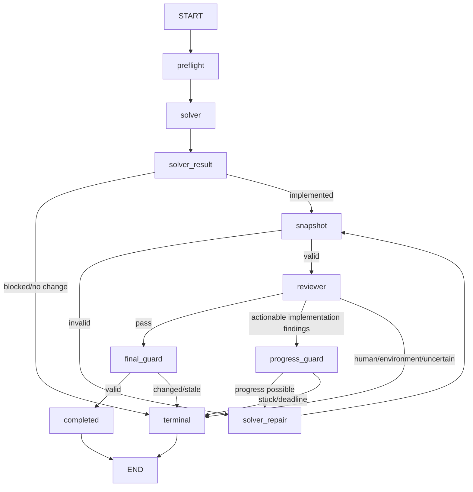

# Sage V2 Tool-Driven Architecture Migration Specification

## Document status

> **Status:** Proposed migration design. This document defines the target
> architecture but does not implement it.
>
> **Date:** 24 August 2026
>
> **Supersedes:** The Planner-first, patch-first execution architecture in
> [`13_SAGE_V2_PROVISIONAL_DESIGN.md`](13_SAGE_V2_PROVISIONAL_DESIGN.md) and
> [`14_SAGE_V2_PROTOTYPE_IMPLEMENTATION_PLAN.md`](14_SAGE_V2_PROTOTYPE_IMPLEMENTATION_PLAN.md).
> Those documents remain historical records of the first prototype.

This migration returns V2 implementation to the proven V1 tool-driven coding
loop and adds one independent Reviewer. V2 will have exactly two model roles:

```text
Solver -> Reviewer
```

There is no separate Planner agent. The Solver creates and persists its own
plan before editing. There is no patch-first model response. The Solver edits
the isolated workspace through deterministic tools, and Git derives the
authoritative diff afterward. There is no fixed global `max_model_calls`
ceiling.

---

## 1. Decision summary

The target V2 architecture is:

```text
existing V1 GitHub gate and exact-SHA checkout
                      |
                      v
           V1-style Solver tool loop
                      |
          inspect repository and issue
                      |
          save typed Solver plan artifact
                      |
       edit and test through bounded tools
                      |
                      v
       Git-derived authoritative candidate
                      |
                      v
        read-only independent Reviewer
       issue + saved plan + actual changes
                      |
          +-----------+-----------+
          |                       |
          | actionable failure    | pass
          v                       v
   Solver repair tool loop    final Git guards
          |                       |
          +------> Reviewer <-----+
                                  |
                                  v
                  existing V1 creation-only push
                                  |
                                  v
                         draft Pull Request
```

The migration makes these locked changes:

1. Remove the Intake Planner / Autonomy Classifier model role.
2. Remove the patch-first `SolverResult.patch` contract.
3. Reuse the V1 agent-to-tools execution loop for the Solver.
4. Require the Solver to save a typed plan before its first mutation.
5. Give the Reviewer the Issue, saved Solver plan, authoritative candidate,
   and verification evidence.
6. Keep the Reviewer read-only.
7. Route actionable Reviewer failures back to the Solver and require review of
   every repaired candidate.
8. Remove the global six-call `max_model_calls` budget and its configuration.
9. Preserve V1's configurable tool-loop turn limits, provider retry bounds,
   wall-clock deadline, finalization reserve, and no-progress protection.
10. Reuse the V1 GitHub gate, sandbox, authoritative Git state, publication,
    status, diagnostics, and draft-PR behavior.

V2 is therefore V1's coding architecture plus an independent review stage and
a durable Solver-authored plan.

---

## 2. Motivation

The first V2 prototype moved implementation from a tool-driven coding loop to
a one-shot structured patch response:

```text
model -> serialized unified diff -> git apply
```

That placed strict machine-format responsibilities on a probabilistic model.
The implementation could be semantically correct while failing before tests or
review because of:

- inaccurate unified-diff hunk counts;
- malformed new-file or deleted-file headers;
- non-canonical `/dev/null` variants;
- missing or mismatched source context;
- line-ending and whitespace defects; or
- truncated or otherwise incomplete patch serialization.

Adding more normalizers treats individual symptoms but does not remove the
architectural source of flakiness. Increasing model-call limits would allow
more attempts at serializing the same patch, but would not make serialization
deterministic.

V1 already demonstrated the more reliable interaction model:

```text
agent <-> repository tools
```

The model can inspect the actual repository, receive immediate tool errors,
run tests, view the real Git state, and continue until it has a coherent result
or a concrete blocker. V2 should reuse that behavior and add independent
review, rather than replace it with a raw-diff protocol.

---

## 3. Goals

The migration must:

1. Preserve the working V1 GitHub Issue-to-draft-PR experience.
2. Use exactly two model roles: Solver and Reviewer.
3. Make the Solver responsible for planning, implementation, and verification.
4. Persist the Solver's plan outside the candidate repository before mutation.
5. Let the Solver inspect, edit, and test through project-owned tools.
6. Remove raw unified Git diff generation as a required model output.
7. Make Git, not model claims, authoritative for changed paths and content.
8. Review the actual candidate against both the Issue and Solver plan.
9. Require Reviewer pass before publication.
10. Allow additional model turns when useful without a fixed six-call ceiling.
11. Prevent infinite execution through progress, time, turn, and retry guards.
12. Preserve network, credential, path, scope, branch, and publication safety.
13. Keep all execution sequential; only one model request may be active.
14. Reuse existing code rather than build a second GitHub or repository stack.

---

## 4. Non-goals

This migration does not introduce:

- a separate Planner, Intake, Autonomy, Manager, or Replanner agent;
- parallel Solver workers;
- recursive agent spawning;
- worker branches, merge agents, or model-driven merge resolution;
- model-generated raw patches as the primary mutation interface;
- automatic merge or ready-for-review promotion;
- a long-running service, queue, database, or external checkpoint store;
- cross-run agent memory;
- a global fixed model-call counter under another name; or
- removal of Git validation, Git-derived diffs, or publication safeguards.

Git remains essential. The migration removes model-authored Git diff syntax,
not Git as the source of truth.

---

## 5. V1 baseline to preserve

The following V1 responsibilities remain unchanged unless this document says
otherwise:

| Responsibility | Existing owner | Migration treatment |
| --- | --- | --- |
| Exact `/sage solve` and `/sage fix` parsing | GitHub command/event modules | Reuse unchanged. |
| Write/admin authorization | GitHub gate and solve controller | Reuse unchanged. |
| Duplicate branch/PR prevention | GitHub gate and publisher | Reuse unchanged. |
| Exact accepted base SHA | Gate, checkout, provenance | Reuse unchanged. |
| Isolated run workspace | `repository.workspace` | Reuse unchanged. |
| Credential-free Docker execution | sandbox and repository tools | Reuse unchanged. |
| Sequential agent/tool graph | `runtimes.langgraph` | Extract or extend for Solver reuse. |
| Repository discovery tools | V1 LangGraph tools | Reuse with role-specific tool registries. |
| Git-derived final diff and paths | repository/workflow services | Reuse unchanged. |
| Creation-only `sage/issue-N` push | GitHub publisher | Reuse unchanged. |
| Draft Pull Request | GitHub publisher | Reuse unchanged. |
| Bot-owned status and finalizer | GitHub status workflow | Extend only for new outcomes. |
| Allowlisted diagnostics | artifact and Actions modules | Extend for plan/review artifacts. |

The V1 runtime remains available as the rollback path until the migrated V2
passes deterministic and controlled GitHub canaries.

---

## 6. Target model roles

### 6.1 Solver

The Solver owns:

- understanding the Issue;
- exploring relevant repository code;
- identifying ambiguity or blockers;
- creating and saving the implementation plan;
- editing the workspace through deterministic tools;
- running focused verification;
- inspecting the real candidate state;
- responding to actionable Reviewer findings; and
- returning a concise structured terminal summary.

The Solver does not:

- return a raw unified diff as its implementation;
- publish branches or Pull Requests;
- receive GitHub credentials;
- bypass path or command policy;
- approve its own result for publication; or
- create another agent.

The default Solver provider remains OpenAI and its model remains configurable
through the existing environment-based settings boundary.

### 6.2 Reviewer

The Reviewer owns:

- evaluating the actual candidate against the Issue;
- evaluating whether the candidate follows the saved Solver plan;
- detecting when the plan itself missed an Issue requirement;
- inspecting relevant files and verification evidence;
- distinguishing blocking defects from optional improvements;
- returning structured, actionable findings; and
- granting the semantic pass required for publication.

The Reviewer is read-only. It cannot mutate files, call publication APIs,
change the plan, or broaden the Issue. The Reviewer may use bounded read-only
repository tools when the provided diff does not contain enough context.

The default Reviewer provider remains Google Gemini and its model remains
configurable through environment settings. Google context approval continues
to apply because Issue and repository content are sent to the Reviewer.

### 6.3 No Planner role

The Planner role, its provider configuration, fallbacks, prompts, schemas,
graph nodes, traces, and artifacts are removed from the active V2 runtime.

Planning is not removed as an engineering activity. It becomes the first
required phase of the Solver's tool loop and is persisted through a trusted
plan tool.

---

## 7. Solver plan contract

### 7.1 Required artifact

The Solver must call `save_plan` before its first mutating tool. The trusted
controller writes the validated value atomically to:

```text
<run-dir>/solver-plan.json
```

The plan is not written inside the candidate repository and therefore cannot
appear in the Pull Request diff.

The plan uses a provider-neutral typed schema similar to:

```python
class SolverPlan(BaseModel):
    schema_version: Literal["1"]
    issue_summary: str
    approach: str
    tasks: tuple[SolverPlanTask, ...]
    acceptance_criteria: tuple[SolverAcceptanceCriterion, ...]
    relevant_paths: tuple[str, ...]
    verification_commands: tuple[str, ...]
    assumptions: tuple[str, ...]
    risks: tuple[str, ...]
    status: Literal["implementable", "blocked"]
    blocker: str | None
```

Each task contains a stable ID, objective, expected paths, and linked
acceptance criteria. The schema remains deliberately smaller than the removed
Planner/Autonomy contracts.

### 7.2 Enforcement

Before a successful `save_plan` call, the Solver may use only:

- `list_tree`;
- `search_text`;
- `read_file`;
- other bounded read-only discovery tools; and
- `save_plan`.

Mutation tools reject requests until a valid implementable plan exists. This
is deterministic tool policy, not prompt-only guidance.

If the task is blocked or requires a human decision, the Solver saves a
`blocked` plan and returns a non-publishable structured outcome without
modifying the repository.

### 7.3 Plan revision

Repository evidence or Reviewer findings can invalidate part of an initial
plan. The Solver may call `revise_plan`, but only with:

- the prior plan version;
- a concise evidence-based reason;
- a complete replacement plan; and
- unchanged Issue scope unless the Issue itself supports the change.

The artifact store keeps fixed, controller-named revisions:

```text
solver-plan.json
solver-plans/01.json
solver-plans/02.json
...
```

`solver-plan.json` always contains the latest accepted plan. The Reviewer
receives the latest plan plus its version and digest. Plan revisions do not
grant new repository permissions; all file operations still pass deterministic
path policy.

### 7.4 Authority

The Issue remains the primary requirement. The plan is evidence of the
Solver's intended approach, not permission to omit an Issue requirement.

Reviewer priority is:

```text
Issue requirements
      > repository behavior and tests
      > saved Solver plan
      > Solver summary or file claims
```

If the candidate follows the plan but the plan misses an Issue requirement,
the Reviewer must fail the review and cite the Issue requirement.

---

## 8. Tool-driven Solver execution

### 8.1 Graph behavior

The Solver uses the V1 graph pattern:

```text
START
  |
  v
Solver model decision
  | tool call
  v
deterministic tool
  |
  +----------> Solver model decision
  |
  | structured terminal result
  v
Solver finalization
```

Only one tool call is executed per model turn, matching V1's current protocol.
Parallel tool calls remain disabled.

### 8.2 Read-only tools

Reuse the existing bounded capabilities where responsibilities still fit:

- `list_tree(path, max_depth)`;
- `search_text(query, path, max_results)`;
- `read_file(path, start_line, end_line)`;
- `show_diff()`; and
- `run_command(command, timeout_seconds)` under existing sandbox policy.

### 8.3 Mutation tools

The migrated V2 Solver must not require a model-authored unified diff. Its
preferred mutation interface is a small set of deterministic file operations:

```text
replace_text(path, old_text, new_text, expected_occurrences=1)
write_file(path, content, mode=create_or_replace)
delete_file(path)
move_file(source_path, destination_path)
```

Required properties:

- workspace-relative path validation;
- `.git` and workspace-escape rejection;
- symlink/path traversal protection;
- bounded input sizes;
- UTF-8 text validation for text operations;
- explicit occurrence checks for replacements;
- create/replace mode checks to prevent accidental overwrite;
- atomic writes where practical;
- one clear operation per tool call;
- useful bounded errors returned to the Solver; and
- independent deterministic tests.

The old `apply_patch` implementation remains available to V1 for compatibility
but is not registered in the migrated V2 Solver toolset. This distinction is
required: reusing the V1 loop while still requiring raw patches would reduce,
but not remove, the failure class motivating this migration.

### 8.4 Verification through tools

Like V1, the Solver must use repository commands when they provide meaningful
engineering evidence. Before returning success it must:

1. inspect the real Git diff;
2. run `git diff --check HEAD --`;
3. run focused tests or checks appropriate to the repository and Issue; and
4. remove unintended generated files or unrelated changes.

The controller records bounded command results for Reviewer context. Model
claims do not turn an unexecuted command into verification evidence.

### 8.5 Solver terminal result

The Solver's structured terminal result contains no patch:

```python
class SolverFinalResult(BaseModel):
    outcome: Literal["implemented", "no_change", "blocked", "unresolved"]
    summary: str
    plan_version: int
    verification_claims: tuple[str, ...]
    remaining_uncertainty: tuple[str, ...]
```

Changed files and diff are deliberately absent as authoritative fields. The
controller derives them from Git after the Solver finishes.

---

## 9. Candidate snapshot boundary

After a successful Solver result, deterministic controller code creates a
candidate snapshot containing:

- accepted base SHA;
- actual changed paths from Git;
- complete binary-capable Git diff;
- diff digest;
- plan version and plan digest;
- Solver summary;
- recorded verification commands and results; and
- remaining uncertainty.

The candidate is rejected before review if:

- `HEAD` does not match the accepted base commit;
- there is no non-empty authoritative diff for an implemented outcome;
- a changed path violates repository policy;
- Git reports whitespace corruption;
- runtime/cache output entered the authoritative candidate unexpectedly; or
- the saved plan is missing or invalid.

This boundary does not apply a model patch. It only observes and validates the
workspace already edited through tools.

---

## 10. Reviewer execution

### 10.1 Required input

Every review attempt receives:

1. the complete Issue description and accepted comment context;
2. the latest saved Solver plan;
3. the authoritative changed-file list;
4. the authoritative Git diff or a bounded diff plus retrieval access;
5. verification commands and their actual results;
6. the Solver summary and uncertainty; and
7. any findings from the immediately preceding review cycle.

The Reviewer never reviews the Solver's intended patch or changed-file claims;
it reviews actual Git state.

### 10.2 Reviewer tools

The Reviewer receives a read-only tool registry:

- `list_tree`;
- `search_text`;
- `read_file`;
- `show_diff`;
- optionally `run_command` for bounded, network-disabled verification; and
- no plan-writing, mutation, Git commit, branch, or publication tools.

### 10.3 Review result

Reuse or simplify the existing typed `ReviewResult` contract. A result must
contain:

- `pass`, `fail`, or `uncertain` verdict;
- criterion-by-criterion results derived from the Issue and plan;
- concrete evidence for every blocking finding;
- path and line when available;
- required repair outcome;
- optional findings separated from blockers; and
- confidence and remaining uncertainty.

A pass requires:

- every explicit Issue acceptance requirement is satisfied;
- the implementation is coherent with the saved plan or deviations are
  justified by repository evidence;
- required verification passed;
- no blocking correctness, security, or scope finding remains; and
- the candidate is suitable for a human-reviewed draft Pull Request.

Reviewer preference does not block publication. Style or unrelated cleanup is
optional unless repository policy or an Issue requirement makes it mandatory.

---

## 11. Review and repair routing

### 11.1 Pass

When the Reviewer passes:

```text
review pass
    -> final deterministic candidate validation
    -> completed SolveResult
    -> existing V1 publication boundary
    -> draft Pull Request
```

No model may publish directly.

### 11.2 Actionable implementation failure

When the Reviewer returns concrete implementation findings:

1. Persist `review.json` and a versioned review artifact.
2. Send only the Issue, current plan, findings, actual candidate state, and
   relevant verification evidence back to the Solver.
3. Resume a tool-driven Solver repair phase.
4. Require the Solver to revise the plan if the approach changes materially.
5. Derive a fresh candidate snapshot from Git.
6. Run the Reviewer again.

Every repaired candidate requires a fresh Reviewer pass.

### 11.3 No fixed repair count

There is no `max_review_repairs=1` or global model-call ceiling. Repair may
continue while all of the following remain true:

- the Reviewer has actionable, in-scope findings;
- the Solver makes observable progress;
- the candidate diff digest or relevant verification state changes;
- the same failure fingerprint is not repeated without progress;
- the run deadline leaves the finalization reserve intact; and
- provider or infrastructure failures have not made progress impossible.

This permits more work for genuinely difficult Issues without creating an
unbounded loop.

### 11.4 No-progress termination

The controller terminates safely when a repair cycle returns the same
candidate digest and materially equivalent blocking findings. It records a
`review_failed` or `unresolved` outcome with the latest plan, review, and
verification artifacts.

### 11.5 Non-implementation failure

Reviewer findings that require a human product decision, unavailable external
dependency, permission, credential, or Issue rewrite do not return to the
Solver. They produce the corresponding safe terminal status and no branch.

---

## 12. Model-call and termination policy

### 12.1 Remove the global call budget

Delete the V2 `max_model_calls` setting, `SAGE_MAX_MODEL_CALLS` environment
variable, six-call validation, `remaining_calls`, call reservation failures,
and routing based on a global call count.

Logs continue to assign monotonic call numbers for observability:

```text
Solver: activity call=7 ...
Reviewer: activity call=8 ...
```

They no longer render `call=7/6` or deny a useful call solely because six prior
attempts occurred.

### 12.2 Safety controls that remain

Removing `max_model_calls` does not mean infinite execution. The following
controls remain:

- V1-style configurable model-turn limits for each tool-driven agent session;
- one active model request at a time;
- per-request timeout;
- bounded provider retry and schema-repair behavior;
- Actions job timeout;
- controller run deadline;
- finalization/publication time reserve;
- command timeout and output bounds;
- no-progress detection across repair cycles;
- cancellation propagation; and
- explicit safe terminal outcomes.

Turn limits protect the model/tool protocol; deadlines protect the entire run.
Neither is used as a spend target or a substitute for progress detection.

### 12.3 Provider failures

Provider retries remain bounded because retrying authentication, schema, or
deterministic validation errors indefinitely cannot solve the Issue. Provider
errors are recorded independently from Solver/Reviewer progress and do not
restore repository state implicitly.

---

## 13. Proposed graph

The orchestration remains sequential:



Publication remains outside the model graph in the trusted GitHub workflow.

---

## 14. State ownership

The graph state should contain only controller-owned, typed state:

```text
issue_text
prepared base SHA
Solver message/session state
latest Solver plan + version + digest
latest Solver terminal result
authoritative candidate snapshot
Reviewer message/session state
latest ReviewResult
review history references
verification evidence references
progress fingerprints
run deadline state
terminal output
```

Large Issue text, file contents, tool logs, and diffs remain in bounded
artifacts or context references rather than being copied repeatedly through
every state transition.

The controller owns graph topology and state transitions. Neither agent names
nodes, selects providers, changes deadlines, or decides publication policy.

---

## 15. Artifact contract

### 15.1 Local run artifacts

The migrated V2 retains or adds:

```text
metadata.json
issue.md
solver-plan.json
solver-plans/<version>.json
solver-final.json
changed-files.json
diff.patch
verification-summary.json
verification/<pass>/...
review.json
reviews/<version>.json
usage.json
terminal.json
```

Remove active generation of:

```text
intake.json
autonomy-contract.json
Planner contexts
patch proposals as the Solver implementation contract
```

Historical artifacts from the patch-first prototype remain ordinary files and
are not migrated or resumed.

### 15.2 GitHub Actions artifact allowlist

The Actions diagnostic allowlist may include bounded versions of:

- `solver-plan.json`;
- `review.json`;
- `verification-summary.json`;
- `agent-final.json` or replacement terminal summary;
- `changed-files.json`;
- `diff.patch`;
- `usage.json`;
- `terminal.json`; and
- `github.json`.

Do not upload full model conversations, unrestricted repository reads, raw
tool transcripts, credentials, or the workspace.

### 15.3 Usage and observability

`usage.json` records every provider attempt without enforcing a global total.
It includes role, stage, provider, model, attempt type, latency, tokens,
outcome, and safe provider error metadata.

Logs and LangSmith traces must visibly separate:

```text
Solver: planning
Solver: tool activity
Solver: implementation
Solver: verification
Reviewer: review activity
Reviewer: verdict
Solver: repair
Publication: deterministic boundary
```

The saved plan and actual code content are artifacts/context, not unrestricted
log payloads.

---

## 16. Configuration migration

### 16.1 Retain

Retain environment configuration for:

- runtime selector;
- OpenAI API key and Solver model;
- Gemini API key and Reviewer model;
- Google context approval;
- provider retry settings;
- Solver/tool-loop turn limit;
- model request timeout;
- run deadline and finalization reserve;
- command timeout and tool output bounds;
- sandbox image;
- trusted verification commands;
- artifact/run directories; and
- LangSmith tracing/project/workspace settings.

### 16.2 Remove

Remove active V2 configuration for:

- Planner model;
- Planner fallback model;
- Planner input bounds;
- readiness recheck input bounds;
- readiness context expansions;
- Solver context-expansion calls used by the patch-first compiler;
- `SAGE_MAX_MODEL_CALLS`;
- `max_model_calls`;
- fixed implementation repair count; and
- fixed review repair count.

Do not leave ignored environment variables or action inputs that appear to be
supported. Remove them from `.env.example`, Make targets, composite action
inputs, workflow variables, settings validation, tests, and documentation.

### 16.3 Compatibility

Keep `SAGE_RUNTIME=v1|v2-prototype` during migration to avoid changing the
external selector and rollback procedure simultaneously. A later release may
rename `v2-prototype` to `v2` after canary acceptance.

The `constrained-cross-provider` profile may retain its name for installation
compatibility, but its validation now means:

```text
Solver:   OpenAI-compatible configured model
Reviewer: Google-compatible configured model
Planner:  absent
```

---

## 17. Provider and tracing migration

Provider construction must instantiate only Solver and Reviewer policies for
V2. Remove Planner-specific factories, fallback wiring, role validation, and
trace expectations from the active path.

LangSmith should show one parent workflow trace with nested role spans:

```text
Sage V2 Workflow
  Solver
    tool calls and model turns
  Reviewer
    read-only calls and verdict
  Solver repair       # only when needed
  Reviewer re-review  # only when needed
```

Call numbering is observational and unbounded by a six-call policy. Trace
metadata must include plan version and candidate digest but not secrets.

---

## 18. Error and terminal behavior

Required terminal outcomes include:

| Outcome | Meaning | Publish? |
| --- | --- | --- |
| `completed` | Non-empty candidate passed Reviewer and final guards | Yes |
| `no_change` | Solver established that no repository change is needed | No |
| `needs_human_information` | Issue lacks a fact only a human can provide | No |
| `needs_human_design_decision` | A human-owned design choice remains open | No |
| `environment_blocked` | Required tool/dependency cannot run safely | No |
| `provider_unavailable` | Required Solver or Reviewer provider unavailable | No |
| `rate_limited` | Provider limit remained after bounded retry | No |
| `verification_failed` | Required verification could not be repaired | No |
| `review_failed` | Reviewer blockers repeated without progress | No |
| `unresolved` | Solver could not produce a coherent candidate | No |
| `invalid_model_output` | Structured protocol failed bounded recovery | No |

`budget_exhausted` should no longer mean “six calls were used.” If retained for
backward-compatible status rendering, it may only represent a wall-clock,
deadline, or explicit operator cost boundary.

Any non-publishable outcome must leave the default branch and remote Sage
branch untouched.

---

## 19. Security invariants

The migration must preserve:

1. Repository content is untrusted and cannot redefine agent instructions.
2. Solver and Reviewer receive no GitHub token.
3. Docker receives no provider or GitHub credential.
4. Repository commands remain network-disabled.
5. Tool paths are workspace-relative and validated against escapes/symlinks.
6. Agents cannot invoke Git push, publication, or external network commands.
7. The Reviewer has no mutation tools.
8. The saved plan cannot broaden controller permissions or path policy.
9. Git-derived state overrides model file claims.
10. Publication revalidates the candidate after Reviewer pass.
11. Sage pushes only a creation-only `sage/issue-N` branch.
12. Sage creates only a draft Pull Request and never merges it.
13. Credentials are not persisted in Git config, artifacts, logs, or traces.
14. External actions and Sage actions remain pinned to immutable SHAs.

---

## 20. Migration ownership map

The implementation phase should prefer extension and extraction over
duplication:

| Area | Migration direction |
| --- | --- |
| `runtimes/langgraph` | Extract a reusable sequential agent/tool-loop builder while preserving V1 behavior. |
| V2 runtime | Orchestrate Solver loop, snapshot, Reviewer loop, repairs, and terminal result. |
| V1 tools | Reuse read/search/tree/diff/command adapters. |
| V2 mutation tools | Add structured file-operation tools; do not register `apply_patch`. |
| Planning domain | Replace Planner-oriented `ExecutionPlan` usage with a smaller Solver-owned plan schema. |
| Review domain | Reuse and simplify existing typed review contracts where possible. |
| Provider manager | Remove global call reservation and Planner policy; retain retry, timeout, usage, and trace concerns. |
| Artifacts | Reuse atomic writers; add fixed Solver-plan and review-history methods. |
| Verification | Reuse repository commands and bounded evidence; remove patch-application routing. |
| GitHub workflow | Reuse gate, checkout, publication, status, and finalizer. Remove Planner inputs. |
| Configuration | Remove dead Planner/call-budget settings and document only active variables. |

Do not delete a shared module until repository search confirms V1 and other
paths no longer call it.

---

## 21. Migration sequence

Implementation should proceed sequentially in independently reviewable phases.

### Phase 1 — Freeze current behavior with tests

- Add/retain V1 graph and GitHub publication regressions.
- Add tests proving current V2 patch-first behavior is isolated behind its
  runtime selector.
- Record the exact settings/action inputs scheduled for removal.

### Phase 2 — Extract the reusable V1 tool loop

- Parameterize role instructions, model, tool registry, terminal schema,
  logging identity, and turn limit.
- Keep V1 graph output and behavior unchanged.
- Prove V1 tests pass without snapshot churn.

### Phase 3 — Add structured edit tools

- Implement and test `replace_text`, `write_file`, `delete_file`, and
  `move_file` behind existing repository safety services.
- Test path escape, symlink, duplicate occurrence, overwrite, encoding, size,
  and atomicity failures.
- Register them only for migrated V2 initially.

### Phase 4 — Add Solver-owned planning

- Define `SolverPlan` and its validation.
- Add `save_plan` and `revise_plan` controller tools.
- Enforce plan-before-mutation in tool policy.
- Persist plan versions atomically outside the candidate repository.

### Phase 5 — Build the V2 Solver loop

- Reuse the extracted V1 loop with Solver instructions and tools.
- Remove patch output from Solver terminal schema.
- Build the Git-derived candidate snapshot after Solver completion.
- Preserve V1-style tool feedback and verification behavior.

### Phase 6 — Build the read-only Reviewer loop

- Supply Issue, latest plan, actual candidate, and verification evidence.
- Expose only read-only tools.
- Persist typed review results and histories.
- Require pass before completion.

### Phase 7 — Add progress-based repair routing

- Return actionable findings to the Solver.
- Re-snapshot and re-review every repair.
- Stop on repeated diff/finding fingerprints, deadline reserve, cancellation,
  or non-implementation blockers.
- Do not add a fixed repair count.

### Phase 8 — Remove obsolete patch-first/Planner code

- Remove active Planner graph nodes and provider policy.
- Remove patch proposal and application nodes from V2.
- Remove global model-call budget enforcement.
- Remove dead settings, action inputs, environment variables, prompts,
  artifacts, tests, and documentation.
- Retain V1 `apply_patch` behavior until V1 is deliberately retired.

### Phase 9 — Integrate publication and observability

- Feed only Reviewer-passed results to the existing publisher.
- Preserve final candidate equality and changed-path checks.
- Update role logs and LangSmith traces for Solver/Reviewer only.
- Update Actions artifact allowlist and workflow pins.

### Phase 10 — Canary and rollout

- Run deterministic offline tests.
- Run local V1 and migrated V2 fixtures.
- Run the offline publication smoke test.
- Perform one controlled GitHub canary.
- Keep V1 rollback until repeated V2 canaries create correct draft PRs.

---

## 22. Required tests

### 22.1 Solver/tool-loop tests

- plan must be saved before mutation;
- invalid or blocked plan prevents mutation;
- Solver may inspect before planning;
- structured edits modify the intended file exactly;
- tool errors return bounded feedback and permit correction;
- relevant commands can be run and recorded;
- terminal Solver result contains no patch;
- actual diff and paths come from Git; and
- V1 graph behavior remains unchanged after shared-loop extraction.

### 22.2 Plan tests

- schema validation and stable IDs;
- atomic plan persistence;
- fixed safe artifact paths;
- plan version/digest updates;
- revision reason required;
- plan artifact excluded from repository diff; and
- plan cannot grant path or command permissions.

### 22.3 Mutation-tool tests

- exact replacement occurrence enforcement;
- create-only and replace-only behavior;
- UTF-8 and size boundaries;
- safe delete and move behavior;
- traversal, absolute path, `.git`, and symlink escape rejection;
- unchanged file on failed mutation;
- generated/untracked runtime noise exclusion; and
- no model-authored unified diff required for add/edit/delete/move scenarios.

### 22.4 Reviewer tests

- Reviewer receives Issue and latest plan;
- Reviewer reads authoritative Git candidate;
- Reviewer cannot mutate;
- missing Issue criterion fails even if plan omitted it;
- optional findings do not block;
- pass requires complete criterion coverage;
- every repair is re-reviewed; and
- schema/provider errors produce safe terminal outcomes.

### 22.5 Repair tests

- actionable finding routes to Solver;
- changed diff permits another review;
- same diff plus same finding stops as no progress;
- plan revision is required for material approach change;
- human/environment finding does not loop;
- deadline reserve prevents another cycle; and
- there is no fixed six-call or one-repair termination.

### 22.6 GitHub/publication tests

- only Reviewer-passed non-empty candidates publish;
- default branch remains unchanged;
- branch creation remains creation-only;
- Pull Request remains draft;
- final workspace diff equals reviewed candidate;
- status and artifacts describe Solver/Reviewer stages; and
- gate/finalizer receive no provider keys.

### 22.7 Configuration tests

- Planner variables are absent or rejected as obsolete according to the
  selected migration policy;
- `SAGE_MAX_MODEL_CALLS` is no longer loaded or advertised;
- Solver and Reviewer models remain environment-configurable;
- Gemini key/context acknowledgement is required only for Reviewer use in V2;
- V1 configuration remains compatible; and
- Actions inputs match the application settings exactly.

---

## 23. Acceptance criteria

The migration is complete only when all of the following are true:

- [ ] V2 has exactly two active model roles: Solver and Reviewer.
- [ ] No Planner provider call, graph node, trace, or action input remains in
      the active V2 path.
- [ ] Solver saves a valid plan before its first repository mutation.
- [ ] Reviewer receives the Issue and latest saved Solver plan.
- [ ] V2 Solver uses a V1-style sequential tool loop.
- [ ] V2 implementation does not require a model-generated unified diff.
- [ ] V2 structured edit tools cover add, edit, delete, and move operations.
- [ ] Git derives authoritative changed files and diff after tool execution.
- [ ] Reviewer is read-only and must pass the actual candidate.
- [ ] Actionable review failures can return to Solver more than once when
      measurable progress continues.
- [ ] No fixed global `max_model_calls` limit remains.
- [ ] Turn, retry, deadline, cancellation, and no-progress guards remain.
- [ ] Every repaired candidate is reviewed again.
- [ ] Only a Reviewer-passed candidate reaches publication.
- [ ] Existing creation-only branch and draft-PR behavior remains unchanged.
- [ ] V1 remains a working rollback path during rollout.
- [ ] Unit, integration, Actions-policy, and offline publication tests pass.
- [ ] A user-friendly testing guide is updated for the migrated architecture.
- [ ] A controlled GitHub canary creates the intended draft Pull Request.

---

## 24. Rollback

During migration and canary rollout:

```dotenv
SAGE_RUNTIME=v1
```

must continue to select the unchanged V1 runtime. Rollback does not delete
plans, reviews, run artifacts, or previously created draft Pull Requests.

The migrated V2 must not become the default until:

1. deterministic test coverage passes;
2. V1 regression coverage remains green;
3. multiple local tool-driven solves succeed without raw patch generation;
4. offline publication passes; and
5. controlled GitHub canaries consistently create correct draft Pull Requests.

---

## 25. Final architectural statement

The target is intentionally simple:

```text
V2 = V1 tool-driven Solver + saved Solver plan + independent Reviewer
```

The Solver plans, edits, tests, and repairs through tools. The Reviewer checks
the Issue, plan, actual code, and verification evidence. Git records what
really changed. Deterministic controller code owns routing and publication.
Only a Reviewer-passed candidate becomes a creation-only branch and draft Pull
Request.

This removes the flaky model-to-unified-diff boundary while preserving the
working V1 product shell and adding the one V2 capability that materially
improves confidence: independent semantic review.
