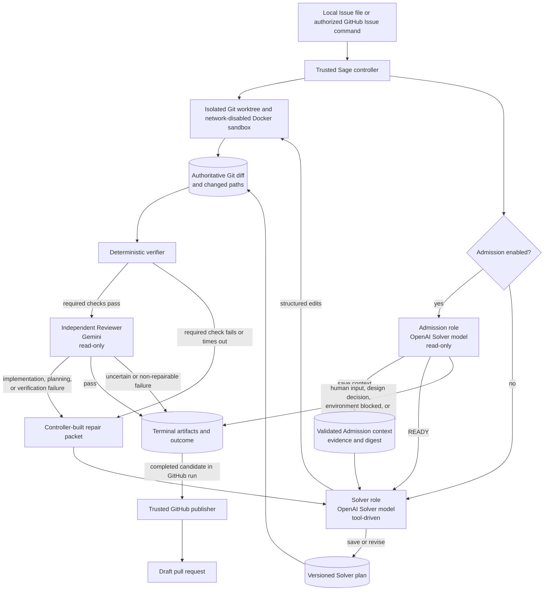
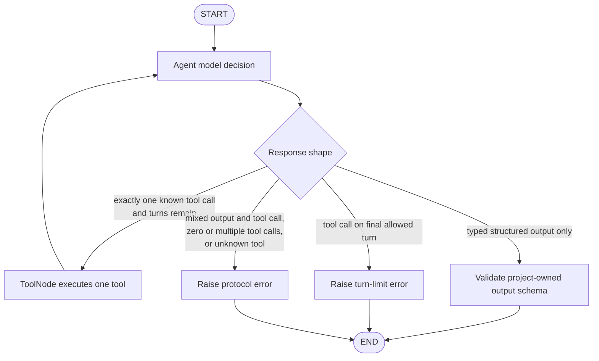
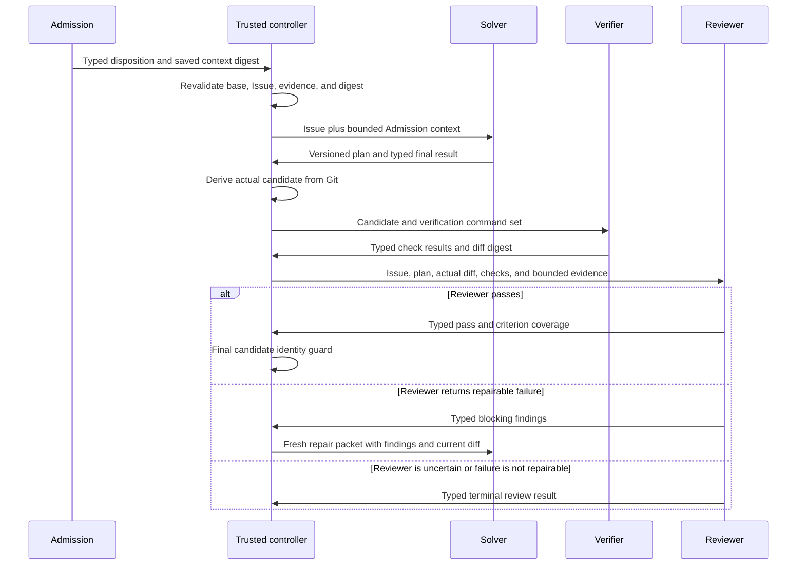

# Current Admission, Solver, and Reviewer System

## Scope

This document describes only the currently implemented multi-agent runtime
composed of Admission, Solver, deterministic verification, and an
independent Reviewer. It records only the present code, behavior, boundaries,
and operational constraints.

V2 is the only runtime and is selected by default. The optional explicit
selector is:

```dotenv
SAGE_RUNTIME=v2
```

Admission is disabled by default. Set `SAGE_V2_ADMISSION_ENABLED=true` to opt
into the read-only Admission stage.

## Current status

The runtime is implemented as a production-oriented Python backend. It can run
against a local Issue file or inside the repository's GitHub Actions
controller. Its successful output is an uncommitted, reviewed Git candidate in
an isolated workspace. In the GitHub path, the trusted publisher turns that
candidate into a commit on a deterministic branch and opens a draft pull
request. Sage does not merge the pull request.

The system currently contains three logical agent roles but two model
configurations:

| Role | Model/provider | Access | Responsibility |
| --- | --- | --- | --- |
| Admission | The configured OpenAI Solver model | Read-only repository tools, bounded research tools, context-save tool | Determine whether the Issue is ready and persist reusable evidence |
| Solver | The configured OpenAI Solver model | Repository reads, bounded research, plan tools, structured file edits, diff inspection, verification-only commands | Plan and implement the requested change |
| Reviewer | The configured Gemini Reviewer model | No repository or mutation tools; receives a controller-built packet | Independently judge the actual candidate, plan, requirements, and verification evidence |

Admission and Solver are separate sessions and roles even though they use the
same configured model. The Reviewer is independent at the provider and prompt
boundary.

## Implemented architecture

The trusted Python controller owns workspace preparation, role scheduling,
state validation, deterministic verification, repair routing, artifact
persistence, deadlines, and terminal outcomes. Models can propose tool calls
and typed results, but they do not own workflow transitions or publication.



### Architectural boundaries

| Boundary | Current owner |
| --- | --- |
| Role prompts and typed model contracts | `sage.runtimes.v2` and `sage.domain` |
| Role ordering and repair loop | `V2GraphRuntime` in `sage.runtimes.v2.runtime` |
| Per-role tool loop | Shared compiled LangGraph from `sage.runtimes.tool_loop` |
| Repository operations | `sage.repository` through thin LangChain tool adapters |
| Candidate truth | Git status, changed paths, and binary-capable Git diff |
| Verification | `sage.verification.Verifier` in the sandbox |
| Reviewer provider boundary | `sage.providers` |
| Research network boundary | Trusted controller-side `sage.research` service |
| Run artifacts | `sage.artifacts` outside the candidate repository |
| GitHub authorization and publication | `sage.integrations.github` and `sage.workflow.github_issue` |

The outer optional Admission → Solver → Verifier → Reviewer workflow is
deterministic Python orchestration. It is not a single compiled LangGraph
containing all three roles. LangGraph is used for the bounded tool-call loop
inside Admission when enabled and inside every initial or repair Solver
session.

## LangGraph role loop

Admission and Solver each receive a fresh, checkpoint-free compiled graph. One
model decision is allowed per graph turn, and parallel tool calls are disabled.



Tool results are appended to graph message state before the next model
decision. Expected repository tool failures are converted into bounded tool
results so the role can correct its next request. Unexpected failures propagate
to the controller. The default Solver session limit is 30 model turns; the
default Admission session limit is 12 model turns.

There is no LangGraph checkpointer in this runtime. Each Admission, Solver, and
Solver-repair session has fresh in-memory graph state. Durable handoff state is
stored by the controller as typed artifacts.

## End-to-end behavior

### 1. Preflight and workspace

The workflow prepares a run directory and Git worktree at the accepted base
SHA, starts the Docker sandbox, and constructs repository tools rooted at that
workspace. The multi-agent runtime rejects an empty Issue, a missing Git
workspace, a mismatched runtime selection, or a workspace that is already
dirty.

The target repository is mounted into the sandbox at `/workspace`. The sandbox
runs with networking disabled, a read-only root filesystem, dropped Linux
capabilities, `no-new-privileges`, bounded processes and memory, and a writable
workspace mount. Model credentials remain in the trusted host controller and
are not passed into repository commands.

### 2. Admission

When Admission is enabled, it runs before any mutation. It can:

- list a bounded repository tree;
- search for exact literal text;
- read bounded text-file ranges;
- search configured public documentation or the web through the controller;
- read only same-run research result IDs; and
- save exactly one Admission context snapshot.

Admission has no plan, file-write, file-delete, file-move, command, diff, Git
publication, or credential tools.

Before returning, Admission must save a context containing the Issue
requirements, relevant paths and symbols, repository conventions, candidate
verification commands, assumptions, open questions, and evidence references.
The controller resolves repository excerpts, hashes their files, resolves
same-run research IDs, calculates the context digest, and writes the snapshot
outside the candidate repository.

The context is revalidated before the Solver receives it. Validation confirms:

- the workspace HEAD still equals the accepted base SHA;
- the Issue content digest is unchanged;
- the context digest matches its complete content;
- evidence and requirement identifiers are internally consistent; and
- every repository evidence file still matches its recorded content digest.

Admission returns one of these dispositions:

| Disposition | Behavior |
| --- | --- |
| `READY` | Continue to the Solver with the validated context |
| `NEEDS_HUMAN_INFORMATION` | Persist one to three focused questions and stop before mutation |
| `NEEDS_HUMAN_DESIGN_DECISION` | Persist one to three focused questions and stop before mutation |
| `ENVIRONMENT_BLOCKED` | Stop with an environment-blocked outcome |
| `UNSUPPORTED` | Stop with an unsupported outcome |

Clarification is limited to two rounds. The GitHub flow writes the questions
into the invocation's status comment. Another run occurs only after the Issue
is updated and a new exact `/sage solve` or `/sage fix` comment is created. If
the configured rounds are exhausted while required context is still missing,
the outcome asks for a maintainer rewrite of the Issue.

If Admission is explicitly disabled, the controller starts directly with the
Solver and no Admission context is required.

### 3. Solver

The Solver receives the Issue, accepted base SHA, and the validated Admission
context when one exists. It starts a new LangGraph tool loop for the initial
implementation and another fresh loop for every repair attempt.

The Solver must save a complete typed plan before any mutation. The plan holds:

- an Issue summary and implementation approach;
- versioned tasks and acceptance criteria;
- relevant paths and verification commands;
- assumptions and risks;
- an implementable or blocked status;
- the Admission context digest and material evidence IDs, when Admission ran;
- same-run research result IDs used by the plan; and
- a blocker when the plan is not implementable.

Plan revisions replace the complete plan, increment its version, and require
the prior version plus an evidence-based reason. Mutation tools reject calls
until the current saved plan is implementable.

The Solver's current tool surface is:

| Capability | Tools and constraints |
| --- | --- |
| Repository inspection | `list_tree`, `search_text`, `read_file` |
| Research | `search_documentation`, `read_documentation`, `search_web`, `fetch_web_page` when configured |
| Planning | `save_plan`, `revise_plan` |
| Mutation | `replace_text`, `write_file`, `delete_file`, `move_file`; all gated by an implementable plan |
| Candidate inspection | `show_diff` |
| Commands | `run_command`, restricted to trusted or allowlisted verification commands |

The Solver does not receive a raw patch tool. File changes are made through
structured repository operations. Its structured final result reports
`implemented`, `no_change`, `blocked`, or `unresolved`, references the latest
plan version, and contains a summary and verification claims. It does not
provide the authoritative patch or changed-file list.

### 4. Candidate derivation

For an implemented result, the controller validates the final Solver result
against the latest plan and Admission context. It rejects unknown Admission or
research references. It then derives a `CandidateSnapshot` from Git, not from
model claims.

The snapshot contains the accepted base SHA, actual changed paths, actual Git
diff, a SHA-256 diff digest, the current plan version and digest, and the
Solver's summary and uncertainty. Candidate creation fails if HEAD moved, the
diff or changed-path list is empty, or the diff exceeds the configured context
cap.

### 5. Deterministic verification

Verification runs sequentially in the network-disabled sandbox without model
involvement. Every pass includes required `git diff --check HEAD --`.
Controller-configured checks are added next, followed by safe Solver plan hints,
up to four checks in total.

Solver-suggested commands are accepted only from the implemented verification
prefix set, including Python, pytest, npm test/lint, make test/check, Cargo
test, and Go test forms. Git commit, push, reset, and clean commands are
rejected. Configured controller commands can be marked required or optional.

Required failure or timeout makes the pass fail. An unavailable or failed
optional check is retained as uncertainty but does not fail the pass. Logs are
bounded, ANSI sequences are removed, token-like values are redacted, and a
stable failure fingerprint is recorded. The controller also confirms that the
candidate diff digest did not change during verification.

### 6. Independent review

The Reviewer receives one bounded, controller-built packet containing:

- the complete Issue;
- the latest saved Solver plan;
- actual changed files and actual Git diff;
- deterministic verification results;
- the Solver summary;
- a bounded Admission context, when Admission ran; and
- research provenance metadata.

The Reviewer has no file, shell, mutation, publication, or direct research
tools. It returns a typed verdict of `pass`, `fail`, or `uncertain`, plus
criterion results, findings, evidence, confidence, and uncertainty.

A pass is valid only when every plan acceptance criterion appears exactly once
and is satisfied, there is no blocking failure data, and the Reviewer's schema
is valid. The Reviewer prompt also requires all explicit Issue requirements,
required verification, correctness, security, and scope to be checked.

Before accepting a pass, the controller confirms that HEAD and the candidate
diff digest still match the reviewed snapshot.

## Agent communication

The roles cannot send messages to each other directly. They do not share a
chat, invoke each other as tools, or hand off control through model-selected
routes.

Communication is indirect and controller-mediated:



Admission context is therefore evidence passed forward by the controller, not
a conversation. Reviewer feedback reaches the Solver only after the controller
validates it and constructs a new repair prompt.

## Agent and repair loops

Two different loops exist.

### Per-session tool loop

Admission and Solver alternate between one model decision and one tool
execution until they return typed output or hit a protocol/turn limit. Each
repair starts a fresh Solver tool loop; prior in-memory messages are not
continued.

### Controller repair loop

After an implemented Solver result, the controller repeatedly performs:

```text
validate Solver result
  -> derive candidate from Git
  -> run deterministic verification
  -> if verification fails: send a repair packet to a fresh Solver session
  -> otherwise run independent review
  -> if review reports a repairable failure: send a repair packet to a fresh Solver session
  -> if review passes: complete
```

The repair loop does not use a fixed review-repair count. It is bounded by the
run deadline and finalization reserve, per-session model-turn limits, provider
failure handling, candidate size limits, and no-progress detection.

No-progress detection compares the candidate diff digest with either a stable
verification-failure fingerprint or a stable blocking-review fingerprint. If
the same candidate produces the same failure again, the controller stops with
`verification_failed` or `review_failed`. It also stops rather than beginning
another model call when only the finalization reserve remains.

## Research behavior

Research is an optional, run-scoped service in the trusted controller. The
implemented search adapter is Tavily and uses the Python standard library for
HTTP. No arbitrary model-selected URL fetch tool is exposed: agents search,
receive normalized result IDs, and can read only those same-run IDs.

Search and content sizes are bounded. Public URL validation rejects private or
non-public destinations, optional domain allowlists restrict accepted queries
and results, external text is normalized, and prompt-like lines and secret-like
values are sanitized. Results are cached within the run and recorded with
content digests and provenance. If research is disabled or unconfigured, tools
return a bounded unavailable result rather than opening network access in the
sandbox.

Admission and Solver can use documentation and web research. The Reviewer does
not call the research service; it receives research provenance in its review
packet.

## Provider scheduling and limits

The configured cross-provider profile requires both OpenAI and Gemini
credentials and explicit approval to send the review packet to the Google
model. Admission and Solver calls use the configured OpenAI Solver model.
Reviewer calls use the configured Gemini Reviewer model with provider-native
retries disabled.

The `ModelCallManager` serializes Reviewer calls, records every Admission,
Solver, and Reviewer attempt, enforces the run deadline and finalization
reserve, and opens a per-provider circuit after two consecutive recorded
failures. Reviewer rate-limit or server failures can receive at most one
controller-managed retry when the error is retryable, unambiguous, within the
retry-after cap, and leaves finalization time. A Reviewer schema failure gets
one schema-repair attempt.

Default operational limits include:

| Setting | Default |
| --- | ---: |
| Admission model turns per session | 12 |
| Solver model turns per session | 30 |
| Clarification rounds | 2 |
| Model request timeout | 600 seconds |
| Run deadline | 4,800 seconds |
| Finalization reserve | 300 seconds |
| Solver input | 96,000 characters |
| Reviewer input | 48,000 characters |
| Repair input | 48,000 characters |
| Candidate diff | 96,000 characters |
| Verification log | 24,000 characters |

## Terminal behavior

The runtime can finish with these current outcome categories:

| Category | Causes |
| --- | --- |
| Completed | Required verification passes, Reviewer passes, and final candidate identity is unchanged |
| No change | Solver reports no change and Git contains no changed paths |
| Human required before mutation | Admission needs information or a design decision |
| Maintainer rewrite required | Clarification rounds are exhausted |
| Human required after start | Solver is blocked, Reviewer is uncertain, or review finds requirement ambiguity |
| Environment blocked or unsupported | Admission or Reviewer classifies the task accordingly |
| Verification failed | Required deterministic checks cannot make progress |
| Review failed | Blocking review findings cannot make progress or are not repairable by the implemented routes |
| Invalid model output | A typed or cross-field role contract is violated |
| Provider unavailable or rate limited | A required provider cannot serve the run under retry policy |
| Budget exhausted | The run reaches its finalization reserve |
| Unresolved | The controller cannot establish a stable authoritative candidate |

Only `completed` with a non-empty authoritative diff can reach GitHub
publication. Human-required, failure, unsupported, no-change, and other
terminal outcomes update status and diagnostics without creating a branch or
pull request.

## GitHub behavior

The included workflow listens for newly created Issue comments. It recognizes
only exact `/sage solve` and `/sage fix` commands on Issues, not pull requests.
The gate verifies repository permission, rejects duplicate work when the
deterministic branch or an open matching pull request already exists, captures
the exact base SHA, and creates or reuses a bot-owned status comment.

The solve job rechecks authorization and duplicates, builds bounded Issue
context, solves against the accepted SHA, and publishes only the authoritative
completed candidate. Publication:

- revalidates the workspace, local Git configuration, HEAD, diff, changed
  paths, and whitespace;
- uses the deterministic branch `sage/issue-<number>`;
- creates a commit only in the trusted publisher after review;
- pushes the branch with creation-only semantics;
- opens a draft pull request with bounded summary, changed files, uncertainty,
  and provenance; and
- warns in the pull request when the default branch advanced without rebasing
  or altering the reviewed candidate.

A finalizer job preserves or repairs the terminal status comment after an
interrupted solve job. Uploaded GitHub diagnostics are allowlisted and exclude
the full Admission context, raw research bodies, Issue document, and repository
checkout.

## Persisted state and observability

The controller writes atomic run artifacts outside the candidate repository.
Depending on the route taken, they include:

```text
metadata.json
issue.md
admission-context.json
admission-context-summary.json
admission-final.json
clarification.json
research-summary.json
solver-plan.json
solver-plans/<revision>.json
solver-final.json
candidate-snapshot.json
verification-summary.json
verification/pass-<number>/summary.json
verification/pass-<number>/<check>.log
review.json
reviews/<cycle>.json
usage.json
terminal.json
agent-final.json
changed-files.json
diff.patch
```

Usage provenance records monotonically numbered model calls, role, stage,
provider, model, attempt kind, token counts when supplied, latency, retry count,
outcome, bounded error category, and request ID. It also records Admission
sessions, Solver sessions, and review cycles.

Structured logs identify workflow and role activity, verification passes,
research operations, decisions, failures, latency, and terminal outcome.
Optional LangSmith tracing is supported and disabled by default. When enabled,
it can send Issue and repository context to the configured LangSmith workspace;
input and output hiding are separately configurable.

## Current verification coverage

The repository contains deterministic tests for the implemented multi-agent
behavior, including:

- Admission context persistence, digest validation, evidence revalidation, and
  clarification routing;
- Admission stopping before Solver mutation;
- reuse of Admission context by Solver and Reviewer;
- plan-before-mutation enforcement and versioned plan revisions;
- structured repository edits and path/symlink protections;
- multiple Solver/Reviewer repair cycles;
- Git-derived candidate identity and stable no-progress fingerprints;
- required and optional verification behavior;
- complete Reviewer acceptance-criterion coverage;
- provider retry, schema-repair, deadline, circuit, and usage accounting;
- research budgets, caching, domain restrictions, normalization, and
  provenance;
- terminal outcome safety checks in the solve workflow;
- GitHub authorization, deduplication, status transitions, exact-SHA handling,
  draft pull-request publication, and finalization; and
- composite Action and workflow security invariants.

The repository's focused offline check for this runtime is `make v2-check`. A
strict live local run is exposed as `make first-run`; `make v2-first-run` is a
compatibility alias. Offline publication behavior can be exercised with
`make v2-github-smoke`.

## Present constraints

- V2 is the only supported runtime. `SAGE_RUNTIME` may be omitted or set to
  `v2`; other values fail configuration.
- Admission is disabled by default and is enabled with
  `SAGE_V2_ADMISSION_ENABLED=true`. When disabled, no read-only readiness gate
  or Admission context is produced.
- Admission and Solver share one model configuration; they are role-separated
  sessions, not independently configured model providers.
- The Reviewer is read-only and has no direct tools.
- Roles communicate only through controller-validated packets and artifacts.
- Top-level orchestration is Python control flow; only the per-session role
  loops are compiled LangGraph graphs.
- Graph sessions have no checkpoint persistence or resume mechanism.
- Repository commands and verification execute without network access.
- Controller-side research supports the configured Tavily adapter or an
  unavailable no-op provider.
- A candidate larger than the configured diff cap is rejected rather than
  partially reviewed.
- Sage creates draft pull requests only and never merges them.
