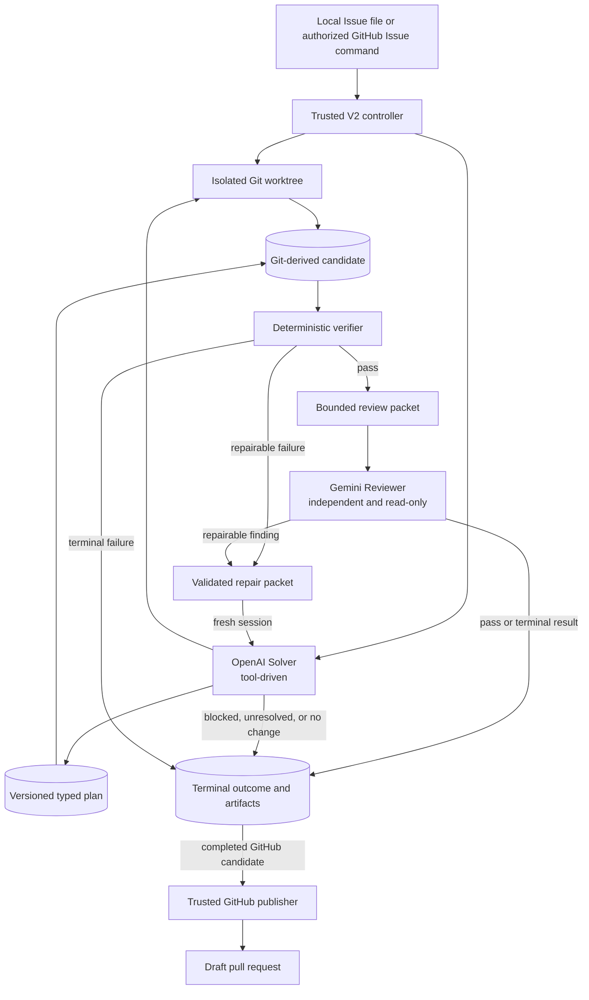
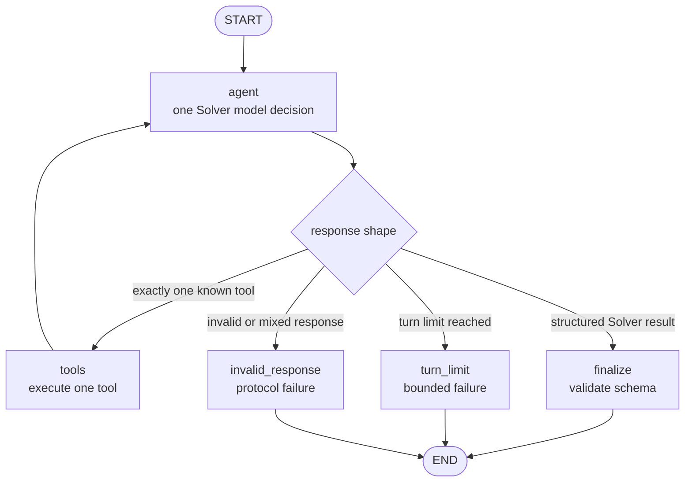
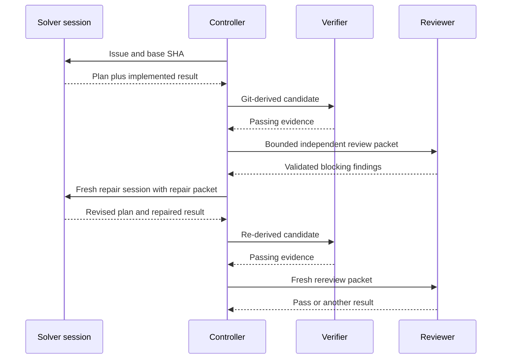

# Current Solver and Independent Reviewer System

> **Status:** Historical pre-consolidation snapshot from 2 September 2026. The
> consolidation in
> [`24_AGENT_INTUITIVE_ARCHITECTURE_IMPLEMENTATION_PLAN.md`](24_AGENT_INTUITIVE_ARCHITECTURE_IMPLEMENTATION_PLAN.md)
> is now implemented. Use
> [`../docs/architecture.md`](../docs/architecture.md) for current behavior.

## Scope

This document describes the behavior and architecture currently implemented in
Sage. The only model roles in the V2 runtime are the Solver and the independent
Reviewer.

Sage accepts a local Issue document or an authorized GitHub Issue command,
prepares an isolated Git worktree, lets the Solver plan and implement a change,
derives the candidate from Git, runs deterministic verification, and sends the
bounded result to the Reviewer. A completed GitHub run may publish a branch and
draft pull request. Sage never merges a pull request.

## Runtime roles

| Role | Provider | Access | Responsibility |
| --- | --- | --- | --- |
| Solver | OpenAI, configured by `SAGE_V2_SOLVER_MODEL` | Repository reads, structured file mutations, bounded verification commands, Git diff, and configured research | Inspect the repository, persist a typed plan, implement the Issue, and repair validated failures |
| Reviewer | Gemini, configured by `SAGE_V2_REVIEWER_MODEL` | No repository mutation tools; receives a controller-built packet and can use bounded official-documentation research | Independently judge the candidate against the Issue, Solver plan, Git diff, and verification evidence |

The trusted controller owns orchestration, validation, limits, artifacts,
verification, terminal mapping, and publication. Neither model controls routing
or GitHub credentials.

## System architecture



The outer workflow is deterministic Python orchestration. LangGraph is used
inside each Solver session as a bounded sequential tool loop.

## Solver LangGraph

Each initial or repair session compiles a fresh, checkpoint-free graph. The
model must either request exactly one known tool or return the configured
structured result. Parallel tool calls are disabled.



Graph state exists only for that session: accumulated messages, the number of
model turns, and a pending/final structured output. There is no checkpointer or
cross-session message history. `SAGE_MAX_TURNS` defaults to 30 model decisions
per Solver session. The Reviewer is a separate structured model call and does
not run in this LangGraph.

## End-to-end behavior

### Preparation and preflight

The workflow reads the Issue, creates the run directory and isolated worktree,
starts the network-disabled Docker sandbox, and verifies that the prepared Git
workspace exists and is clean. The accepted base SHA remains authoritative.

### Solver planning and implementation

The Solver receives the Issue and base SHA. It can inspect repository files and
metadata, search within the repository, use configured bounded research, and
inspect the current Git diff.

Before any mutation, it must call `save_plan` with an Issue summary, approach,
tasks linked to acceptance criteria, relevant paths, verification commands,
assumptions, risks, research result IDs, and `implementable` or `blocked`
status. File mutation and command tools reject calls until an implementable
plan exists.

A plan change uses `revise_plan`, supplies the current plan version, and records
an evidence-based reason. Every revision is immutable and the latest revision
is stored at `solver-plan.json`.

The mutation tools are `replace_text`, `write_file`, `delete_file`, and
`move_file`. `run_command` accepts only trusted configured checks or built-in
allowlisted verification commands. Arbitrary shell mutation is not a Solver
capability.

The Solver returns `implemented`, `no_change`, `blocked`, or `unresolved`. Git,
not the model response, determines changed paths and diff.

### Candidate derivation and verification

For an implemented result, the controller creates a candidate snapshot binding
the accepted base SHA, changed files, bounded diff and digest, current plan
version and digest, and the Solver's summary, claims, and uncertainty.

The deterministic verifier checks Git diff integrity and runs applicable
discovered/configured commands inside the sandbox. It records bounded results
and logs for each pass. The controller rejects a candidate that changes during
verification.

A failed required check creates a repair packet containing the Issue, latest
plan, current candidate diff, and verification findings. A fresh Solver session
receives that packet.

### Independent review

After required verification passes, the controller sends the Reviewer a
bounded packet containing the Issue, latest typed plan, changed-file list,
authoritative Git diff, deterministic verification, Solver summary, and
upload-safe research provenance.

The Reviewer returns `pass`, `fail`, or `uncertain`. A failure includes a type
and blocking findings with criterion/evidence links. Controller validation
rejects malformed findings, unknown criteria, and inconsistent verdicts.

A passing review triggers a final Git guard: HEAD must still equal the accepted
base SHA and the current diff digest must equal the reviewed snapshot.

## Repair and rereview loop

Solver and Reviewer can exchange feedback over multiple cycles, but they never
communicate directly. The controller is the only bridge:



Repairable failure types are implementation, planning, and verification. Each
repair uses a fresh Solver graph and each rereview is a fresh Reviewer call.
There is no shared transcript, direct handoff API, simultaneous conversation,
or shared mutable agent memory.

The loop is bounded by identical candidate/failure fingerprint detection, the
per-session turn limit, provider retry limits, input/artifact caps, the overall
run deadline, and a reserved finalization window. An unchanged candidate with
the same failure stops instead of looping.

## Research and provider isolation

Research is optional and run-scoped. The Solver may search official
documentation and the web within configured budgets. The Reviewer may search
official documentation but has no general web-search budget. Results are
normalized, public-URL checked, cached, assigned run-local IDs, and treated as
untrusted evidence. Research does not grant network access to the target
repository sandbox.

The Solver uses the configured OpenAI model; the Reviewer uses the configured
Gemini model. `SAGE_GOOGLE_MODEL_CONTEXT_APPROVED=true` is required because the
bounded review packet is sent to Google.

The model-call manager records role, stage, provider, model, token counts when
available, latency, retry count, outcome, safe error category, status code, and
request ID. Reviewer calls are serialized. Solver session and review-cycle
counts are persisted in `usage.json`.

## Terminal outcomes

| Outcome | Current meaning |
| --- | --- |
| `completed` | Candidate passed deterministic verification and independent review |
| `no_change` | Solver found no repository change was required |
| `human_required_after_start` | Solver was blocked or Reviewer could not resolve requirements safely |
| `environment_blocked` | Reviewer identified an environment constraint |
| `unresolved` | Solver or runtime could not produce a stable candidate |
| `provider_unavailable` | A required provider could not serve the role |
| `rate_limited` | A required provider remained rate-limited |
| `budget_exhausted` | The run reached its deadline reserve |
| `verification_failed` | Required deterministic checks failed without progress |
| `review_failed` | Independent review remained blocking without progress |
| `invalid_model_output` | A role violated its structured contract |

Only a completed candidate is eligible for GitHub publication. A no-change run
posts a terminal status without a branch. Other outcomes preserve diagnostics
and do not publish.

## Artifacts and source of truth

Current run artifacts can include:

```text
metadata.json
agent-final.json
solver-plan.json
solver-plans/NN.json
solver-final.json
candidate-snapshot.json
verification-summary.json
verification/pass-N/summary.json
verification/pass-N/<check>.log
review.json
reviews/NN.json
research-summary.json
usage.json
terminal.json
changed-files.json
diff.patch
github.json
```

Artifacts are written atomically. Git-derived `changed-files.json` and
`diff.patch` are authoritative; model claims are not. GitHub diagnostics copy
only a fixed allowlist and do not upload the isolated repository.

## GitHub behavior

The public trigger is an exact `/sage solve` or `/sage fix` Issue comment from
an actor with current write/admin permission. The gate prevents duplicate open
pull requests and refuses to overwrite an existing remote branch. The solve job
uses an exact credential-free checkout and scopes model secrets to that job.

Publication revalidates the base, applies the authoritative candidate in a
disposable checkout, creates a commit and branch, and opens a draft pull
request. Status comments transition from accepted to working to one terminal
state. Terminal reconciliation is idempotent.

## Current configuration

V2 is selected when `SAGE_RUNTIME` is omitted or set to `v2`. Live execution
requires `OPENAI_API_KEY`, `GEMINI_API_KEY`, and
`SAGE_GOOGLE_MODEL_CONTEXT_APPROVED=true`.

| Setting | Default |
| --- | ---: |
| `SAGE_MAX_TURNS` | 30 per Solver session |
| `SAGE_MODEL_REQUEST_TIMEOUT_SECONDS` | 600 seconds |
| `SAGE_RUN_DEADLINE_SECONDS` | 4800 seconds |
| `SAGE_FINALIZATION_RESERVE_SECONDS` | 300 seconds |
| `SAGE_SOLVER_INPUT_CHARS` | 96000 |
| `SAGE_REPAIR_INPUT_CHARS` | 48000 |
| `SAGE_REVIEWER_INPUT_CHARS` | 48000 |
| `SAGE_MAX_CANDIDATE_DIFF_CHARS` | 96000 |
| `SAGE_MAX_VERIFICATION_LOG_CHARS` | 24000 |

LangSmith tracing is optional and configured at the controller boundary.
