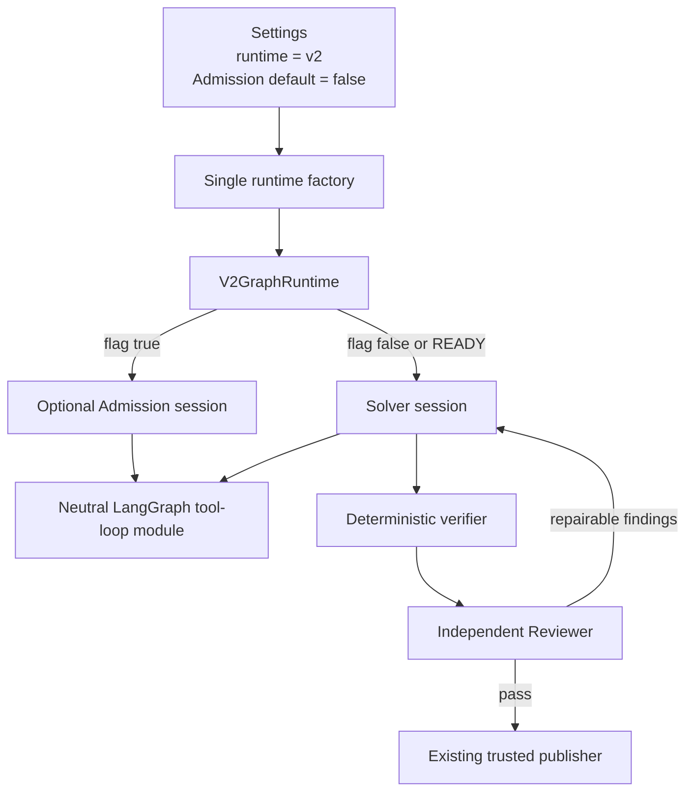

# Single-Agent Removal and V2 Default Implementation Plan

> **Status:** Implemented on 27 August 2026 by commit `53bdbe1`. This is a
> historical migration record, not active work. Its optional Admission stage
> was subsequently removed by the plan in
> [`23_ADMISSION_REMOVAL_AND_SOLVER_REVIEWER_IMPLEMENTATION_PLAN.md`](23_ADMISSION_REMOVAL_AND_SOLVER_REVIEWER_IMPLEMENTATION_PLAN.md).
> Use [`../docs/architecture.md`](../docs/architecture.md) for current behavior.

## 1. Objective

Remove the single-agent runtime and its exclusive code paths from the
executable project. Promote the existing Admission/Solver/independent Reviewer
runtime to the only runtime, expose it under the selector `v2`, and make it the
default for local and GitHub execution.

Admission remains an optional first stage. It must be disabled by default and
controlled by the existing environment variable:

```dotenv
SAGE_V2_ADMISSION_ENABLED=false
```

Setting the variable to `true` must enable the current read-only Admission
behavior without changing its tools, evidence contract, clarification routing,
or handoff to the Solver.

This is a removal and configuration migration. Apart from the explicitly
requested defaults and names, the current multi-agent behavior must remain
unchanged.

## 2. Required end state

The completed repository must satisfy all of these conditions:

1. `V2GraphRuntime` is the only implementation of the `AgentRuntime` protocol.
2. `SAGE_RUNTIME` defaults to `v2` when absent or blank.
3. `SAGE_RUNTIME=v2` is the only accepted runtime selector value.
4. `SAGE_RUNTIME=v1` and `SAGE_RUNTIME=v2-prototype` fail configuration with a
   concise migration error; neither value acts as an alias.
5. Admission defaults to disabled for direct `Settings` construction,
   `Settings.from_env`, `.env.example`, the GitHub composite Action, and the
   installable workflow.
6. `SAGE_V2_ADMISSION_ENABLED=true` enables Admission in local and GitHub runs.
7. Admission-disabled execution begins with the Solver and otherwise follows
   the current Solver → verification → independent Reviewer behavior.
8. The shared LangGraph tool loop used by Admission and Solver remains intact
   under neutral ownership.
9. No executable import, runtime factory branch, CLI label, active setup guide,
   Make target, Action input default, or workflow default presents the removed
   runtime as available.
10. GitHub authorization, exact-SHA checkout, sandboxing, repository tools,
    deterministic verification, repair routing, artifact persistence, terminal
    statuses, draft pull-request publication, and finalization retain their
    current behavior.
11. No new production dependency is introduced.

## 3. Behavioral invariants

The implementation must preserve the following current contracts.

### 3.1 Agent and orchestration behavior

- Admission and Solver continue to use the configured OpenAI Solver model.
- The independent Reviewer continues to use the configured Gemini Reviewer
  model.
- Admission and Solver continue to run one tool call per LangGraph turn with
  parallel tool calls disabled.
- Admission remains read-only and must save one validated evidence snapshot
  before returning.
- The Solver must save an implementable plan before mutation.
- The Solver continues to edit through `replace_text`, `write_file`,
  `delete_file`, and `move_file`; it must not gain a raw patch tool.
- Candidate identity continues to come from Git rather than model claims.
- Required deterministic verification continues to run before review.
- Review feedback continues to reach a fresh Solver repair session only through
  a controller-built packet.
- No-progress detection, deadlines, finalization reserve, provider retry,
  schema repair, and provider circuit behavior remain unchanged.

### 3.2 Repository and publication behavior

- Work continues in a clean worktree at the accepted base SHA.
- Repository commands continue to run inside the network-disabled Docker
  sandbox.
- Only a completed, non-empty, verified, reviewed candidate can reach
  publication.
- The publisher continues to use `sage/issue-<number>`, creation-only push
  semantics, and a draft pull request.
- Sage continues never to merge.

### 3.3 Interfaces that must remain stable

- The `sage solve` and `sage github ...` CLI command shapes and exit-code
  behavior remain stable.
- Existing result and outcome schemas remain stable.
- Existing artifact filenames and GitHub diagnostic allowlist remain stable.
- Existing GitHub commands `/sage solve` and `/sage fix` remain exact-match
  triggers.
- Existing `SAGE_V2_SOLVER_MODEL`, `SAGE_V2_REVIEWER_MODEL`,
  `SAGE_V2_ADMISSION_ENABLED`, research, verification, budget, tracing, and
  sandbox variables retain their names and meanings.

### 3.4 Explicitly allowed behavior changes

Only these changes are intended:

| Area | Current behavior | Required behavior |
| --- | --- | --- |
| Runtime default | Local configuration defaults to the single-agent selector | Local configuration defaults to `v2` |
| Runtime name | Multi-agent selector is `v2-prototype` | Multi-agent selector is `v2` |
| Runtime availability | Two runtime implementations are selectable | Only the multi-agent implementation exists |
| Admission default | Enabled | Disabled |
| Admission opt-in | Disable flag exists | The same flag enables Admission when set to `true` |
| CLI/runtime wording | Contains legacy and prototype labels | Describes Sage or V2 without legacy/prototype wording |

## 4. Current dependency findings

The single-agent runtime is not isolated enough to delete immediately. The
remaining runtime currently imports reusable pieces from its package:

```text
sage.runtimes.v2.runtime
  -> sage.runtimes.langgraph.graph.build_graph
  -> sage.runtimes.langgraph.runtime.recursion_limit
  -> sage.runtimes.langgraph.runtime.is_openai_quota_error
```

The `sage.runtimes.langgraph` package also owns code that is exclusive to the
single-agent runtime:

- `runtime.py`: `LangGraphRuntime`, old provider error translation, and old
  model construction;
- `prompt.py`: the single-agent coding prompt and initial message;
- `tools.py`: the six-tool surface including raw `apply_patch`;
- `__init__.py`: public export of `LangGraphRuntime`; and
- parts of `graph.py`: old graph name, default prompt, default output schema,
  and singleton finalizer.

The raw patch capability extends outside that package:

```text
LangGraph tools
  -> RepositoryTools.apply_patch
  -> sage.repository.patch.apply_patch
  -> PatchError
```

One non-agent caller, the offline GitHub publication smoke test, reuses only
`normalize_null_file_headers` from `sage.repository.patch`. That normalization
must be retained before deleting the agent patch implementation.

The single-agent selector also affects configuration, artifact metadata, CLI
rendering, solve-result validation, Make targets, Actions, workflows, tests,
and active documentation. Removal must cover those call sites rather than only
deleting the runtime class.

## 5. Target architecture



There is still one reusable LangGraph state machine because Admission and
Solver both use it. “Remove the single-agent runtime” means removing the old
runtime adapter, prompt, tool registry, output defaults, graph identity, and
selection path—not removing LangGraph from the multi-agent implementation.

## 6. Configuration contract

### 6.1 Runtime selector

Change `Settings.runtime` from a two-value string field to a single-value typed
contract. Prefer:

```python
runtime: Literal["v2"] = "v2"
```

`Settings.from_env` must normalize the input as follows:

| Raw environment state | Result |
| --- | --- |
| `SAGE_RUNTIME` absent | `v2` |
| `SAGE_RUNTIME=` or whitespace | `v2` |
| `SAGE_RUNTIME=v2` | `v2` |
| `SAGE_RUNTIME=v1` | `ConfigurationError` with migration guidance |
| `SAGE_RUNTIME=v2-prototype` | `ConfigurationError` with migration guidance |
| Any other value | `ConfigurationError` |

Do not keep a compatibility alias for `v2-prototype`. An alias would leave two
names for the runtime and make it difficult to prove that the prototype name
has been removed from active configuration.

Because V2 becomes the only default, `Settings.from_env` must always enforce
the current cross-provider requirements:

- `OPENAI_API_KEY` is present;
- `GEMINI_API_KEY` is present;
- `SAGE_MODEL_PROFILE` is `constrained-cross-provider`; and
- `SAGE_GOOGLE_MODEL_CONTEXT_APPROVED=true`.

The obsolete patch-first configuration rejection currently guarded by
`runtime == "v2-prototype"` must also become unconditional. This preserves the
current V2 validation rather than accidentally accepting obsolete variables
after the branch disappears.

### 6.2 Admission default and environment variable

Use the existing public variable; do not introduce a duplicate such as
`SAGE_ADMISSION_ENABLED`.

Change all default layers together:

| Layer | Required default |
| --- | --- |
| `Settings.v2_admission_enabled` | `False` |
| `Settings.from_env(... SAGE_V2_ADMISSION_ENABLED absent ...)` | `False` |
| `.env.example` | `SAGE_V2_ADMISSION_ENABLED=false` |
| `.github/actions/sage-solve/action.yml` input `admission-enabled` | `"false"` |
| `.github/workflows/sage.yml` fallback | `${{ vars.SAGE_V2_ADMISSION_ENABLED || 'false' }}` |
| Local first-run helper | Preserve caller value; otherwise use `false` |

The value must continue through the composite Action as
`SAGE_V2_ADMISSION_ENABLED`. Truthy values accepted by `_parse_bool` continue
to enable Admission; invalid boolean text continues to fail configuration.

### 6.3 Model configuration cleanup

`OPENAI_MODEL` and `Settings.openai_model` are exclusive to the removed runtime
except for a redundant metadata/CLI display path. Remove them from active
configuration rather than retaining two OpenAI model settings.

Use `Settings.v2_solver_model` wherever the current code needs to display or
record the coding model. Keep the existing `model` key in `metadata.json` for
artifact-shape compatibility, but populate it from `v2_solver_model`. Keep the
existing `runtime`, `model_profile`, `v2_admission_enabled`,
`research_enabled`, and `web_search_provider` metadata keys, now without
runtime-conditional `None` branches.

`OPENAI_MAX_RETRIES` remains active because the Solver's OpenAI client uses it.

## 7. Source-code implementation phases

### Phase 1 — Characterize and protect current V2 behavior

Before moving source, add or tighten focused tests that freeze the behavior to
be preserved:

1. Capture the shared LangGraph routing, turn-limit, tool-error, sequential
   tool, and structured-output behavior independently of the old prompt and
   tool surface.
2. Add a factory test proving `build_runtime` returns `V2GraphRuntime` for
   `runtime="v2"`.
3. Add configuration tests for the new default, strict selector rejection, and
   Admission default/override matrix.
4. Add a runtime test proving default-disabled Admission starts directly with
   Solver and records zero Admission sessions.
5. Retain explicit Admission-enabled tests proving the existing context and
   clarification flows.
6. Add metadata assertions so the artifact schema and Solver model value remain
   stable during cleanup.

Run the focused V2 suite before structural deletion to establish a baseline.

### Phase 2 — Extract the reusable LangGraph tool loop

Create a neutral module such as:

```text
apps/agent/src/sage/runtimes/tool_loop.py
```

Move the reusable contents of `sage.runtimes.langgraph.graph` into it:

- graph input/state/output types;
- model-turn node;
- routing function;
- typed finalize-node factory;
- turn-limit and invalid-response nodes;
- repository-tool error conversion;
- model usage logging hooks;
- graph compilation; and
- graph recursion-limit calculation.

Remove single-agent defaults while moving:

- `instructions` becomes a required `build_graph` argument;
- `output_schema` becomes required;
- `graph_name` becomes required;
- `role_name` remains explicit;
- `AgentFinalOutput` is no longer imported as the graph output default;
- `CODING_AGENT_INSTRUCTIONS` is no longer imported;
- the `sage_v0_1` graph constant is removed; and
- the module-level `finalize = build_finalize_node(AgentFinalOutput)` singleton
  is removed.

Keep node names, routing semantics, state message accumulation, error strings,
turn accounting, and callback behavior unchanged so Admission and Solver traces
do not change beyond the module path.

Update `sage.runtimes.v2.runtime` to import `build_graph` and
`recursion_limit` from the neutral module. Move the provider-specific
`is_openai_quota_error` helper to a focused module such as
`sage.providers.openai`, because V2 still uses it to distinguish quota
exhaustion from a temporary rate limit. Move its relevant unit cases into
`tests/providers/test_openai.py`.

Migrate the reusable tests from `tests/runtimes/test_langgraph_graph.py` to a
neutral test such as `tests/runtimes/test_tool_loop.py`. Replace the old raw
patch tool fixture with a small generic tool or the current structured file
tool. Retain tests for:

- valid routing;
- mixed structured output/tool rejection;
- zero, multiple, and unknown tool-call rejection;
- turn-limit behavior;
- asynchronous invocation and system-instruction ordering;
- one and multiple sequential tool calls;
- tool result ordering;
- safe `RepositoryError` feedback;
- unexpected tool/model failure propagation; and
- compiled graph topology.

Do not retain tests of the old coding prompt, old graph name, raw patch ordering,
or old six-tool registry.

### Phase 3 — Remove the single-agent runtime and raw patch surface

After V2 imports and neutral graph tests pass, delete:

```text
apps/agent/src/sage/runtimes/langgraph/__init__.py
apps/agent/src/sage/runtimes/langgraph/runtime.py
apps/agent/src/sage/runtimes/langgraph/prompt.py
apps/agent/src/sage/runtimes/langgraph/tools.py
apps/agent/src/sage/runtimes/langgraph/graph.py
apps/agent/tests/runtimes/test_langgraph_runtime.py
apps/agent/tests/runtimes/test_langgraph_tools.py
```

Delete the old graph test only after its reusable cases exist under the neutral
tool-loop tests.

Remove the single-agent-only patch entry point:

- remove `RepositoryTools.apply_patch` and its import;
- delete `sage.repository.patch.apply_patch` and its patch-path machinery;
- delete `PatchError` if repository search confirms no remaining caller; and
- delete obsolete raw-patch tests.

Before deleting `sage.repository.patch`, move the publication smoke test's
`normalize_null_file_headers` behavior into the focused module
`sage.integrations.github.smoke_patch`. Add
`tests/integrations/github/test_smoke_patch.py` for bare and prefixed
`/dev/null` headers so `make v2-github-smoke` continues to accept saved Git
diffs exactly as it does now.

Retain the V2 tests asserting that `apply_patch` is not present in the Solver
tool registry. Those tests become a regression against accidental
reintroduction rather than a comparison with another runtime.

### Phase 4 — Make V2 the only runtime in configuration and construction

Update `sage.config`:

1. Default and validate `runtime` as `v2` only.
2. Change Admission's model and environment defaults to `False`/`false`.
3. Make V2 credential, profile, context-approval, and obsolete-setting checks
   unconditional.
4. Remove `DEFAULT_OPENAI_MODEL`, `openai_model`, and `OPENAI_MODEL` loading.
5. Keep `DEFAULT_V2_SOLVER_MODEL` and `DEFAULT_V2_REVIEWER_MODEL` unchanged.
6. Preserve all current bounds and boolean parsing.

Update `sage.runtimes.factory`:

- remove the `LangGraphRuntime` import;
- remove runtime branching; and
- return `V2GraphRuntime(settings)` as the single construction path.

Keeping the factory is useful because the CLI and GitHub workflow already
inject runtime construction through this boundary in tests. It also avoids
coupling orchestration directly to provider setup.

Update `sage.providers.factory` and `V2GraphRuntime._preflight` to expect the
literal runtime `v2`. Preserve their other validation and error behavior.

### Phase 5 — Make solve orchestration single-path

Update `sage.workflow.solve.solve_issue` to remove runtime-conditioned result
normalization.

The current multi-agent consistency checks become unconditional:

- `completed` requires both a non-empty diff and changed-file list;
- `no_change` requires both an empty diff and empty changed-file list; and
- pre-mutation outcomes reject any repository change.

Do not retain the removed runtime's behavior of converting `completed` with an
empty diff to `no_change`, because that would weaken the current multi-agent
contract.

Remove the unused legacy model-provider exceptions only after confirming they
have no production caller:

- `ModelAuthenticationError`;
- `ModelAPIError`;
- `ModelQuotaError`; and
- `ModelRateLimitError`.

Then remove their legacy branches from GitHub failure classification and their
synthetic tests. Preserve `AgentRuntimeError` classification and all typed V2
terminal outcomes. The multi-agent runtime already converts expected provider
failures into `SolveOutcome` values before GitHub publication, so this cleanup
does not alter its production failure routing.

### Phase 6 — Update CLI and artifact presentation

Update `sage.cli` without changing commands or exit codes:

- change `sage solve` help to describe the current issue solver;
- remove legacy version language from `_run_local_solve` documentation;
- pass `settings.v2_solver_model` to result rendering;
- replace the `Sage V0` heading with `Sage` or `Sage V2`; and
- keep run ID, base SHA, model, changed files, summary, workspace, patch path,
  uncertainty, and artifact output layout otherwise stable.

Update `ArtifactStore.initialize_run`:

- set `model` from `v2_solver_model`;
- record `runtime` as `v2`;
- always record `model_profile`, `v2_admission_enabled`, and
  `research_enabled`; and
- preserve all filenames and secret-exclusion behavior.

Add direct metadata assertions rather than relying only on file existence.

### Phase 7 — Update GitHub Action and workflow defaults

In `.github/actions/sage-solve/action.yml`:

- change the runtime input description to `Trusted runtime selector (v2)`;
- change its default from `v1` to `v2`;
- make `gemini-api-key` required because the Reviewer is no longer behind an
  optional runtime selection;
- change `admission-enabled` default from `"true"` to `"false"`;
- remove prototype wording from descriptions; and
- keep `SAGE_RUNTIME` and `SAGE_V2_ADMISSION_ENABLED` propagation unchanged.

In `.github/workflows/sage.yml`:

- change every runtime fallback to `v2`;
- change Admission fallback to `false`;
- remove the redundant `OPENAI_MODEL` job variable;
- retain `SAGE_V2_SOLVER_MODEL` and `SAGE_V2_REVIEWER_MODEL` defaults;
- retain the existing model secrets, permissions, job separation, timeouts,
  concurrency, action pins, diagnostics allowlist, and finalizer; and
- remove `prototype` wording from comments and names without changing action
  references as part of the source edit.

The immutable `24aysh/sage` Action pins must be updated only after the
implementation commit exists. Pin updates belong to the deployment/install
step, not the source refactor commit.

Update `tests/actions/test_actions.py` to assert exact new defaults and to prove:

- no `OPENAI_MODEL` variable remains;
- runtime fallback is `v2` in both job environment and Action input;
- Admission fallback is `false`;
- OpenAI and Gemini Action credentials are both required;
- credentials remain scoped only to the solve step;
- least-privilege permissions and exact command filters are unchanged; and
- diagnostics remain allowlisted.

### Phase 8 — Consolidate Make targets and local setup

The Makefile currently exposes separate setup/check paths for the old default
and the opt-in runtime. Consolidate them around the only runtime.

Required target behavior:

| Target | Required behavior |
| --- | --- |
| `make first-run` | Use the current two-provider V2 setup and strict live-run validation |
| `make v2-first-run` | Thin compatibility alias to `first-run` |
| `make test` | Run the complete deterministic backend suite |
| `make check` | Preserve the current backend-test and compile behavior |
| `make v2-test` / `make v2-check` | Retain as compatibility entry points, without prototype wording |
| `make graph` | Validate or print the current neutral tool-loop topology |
| `make v2-graph` | Thin compatibility alias to `graph` |
| `make v1-check` | Remove |

`first-run` must request both OpenAI and Gemini credentials, preserve explicit
Google context approval, set `SAGE_RUNTIME=v2`, default Admission to false, and
retain optional LangSmith/research environment forwarding. It must continue to
build and smoke-test the sandbox, run deterministic checks, solve explicit
inputs, and validate run artifacts.

Update `doctor` so V2 prerequisites are checked unconditionally. It must no
longer branch on `SAGE_RUNTIME`. Admission being disabled does not remove the
Gemini requirement because the independent Reviewer remains mandatory.

Remove `OPENAI_MODEL` setup and legacy help text. Do not rename sandbox image
tags in this task; values such as `sage-sandbox:v0` or `sage-sandbox:v1` are
container image identifiers, not runtime selectors.

### Phase 9 — Update tests and fixtures comprehensively

#### Configuration tests

Update `tests/test_config.py` to cover:

- missing runtime defaults to `v2`;
- blank runtime defaults to `v2`;
- explicit `v2` succeeds;
- `v1`, `v2-prototype`, and arbitrary selectors fail clearly;
- Gemini and Google context approval are required when runtime is omitted;
- Admission defaults to false;
- explicit Admission true and false parse correctly;
- invalid Admission text fails;
- obsolete patch-first variables remain rejected; and
- `OPENAI_MODEL` is no longer a supported active setting.

Any generic test constructing `Settings` directly without live provider setup
may continue doing so, because provider credential enforcement occurs at the
environment boundary and provider factory. Set `runtime="v2"` only where the
test needs to assert it explicitly.

#### Runtime tests

Update all `runtime="v2-prototype"` fixtures to `runtime="v2"`.

Admission tests that rely on Admission running must set
`v2_admission_enabled=True` explicitly. Solver/Reviewer tests should normally
use the new default (`False`) unless Admission context is part of the behavior
under test. This prevents tests from accidentally depending on a hidden
default.

Retain coverage for:

- multiple verification/review repairs;
- Admission early termination;
- Admission context reuse;
- final candidate identity guards;
- plan-before-mutation;
- provider retry and schema repair;
- cancellation; and
- all typed terminal outcomes.

#### Workflow and CLI tests

- Make V2 repository consistency checks unconditional in
  `tests/workflow/test_solve.py`.
- Keep GitHub workflow dependency injection and publication tests unchanged
  except for removed legacy error classes and selector values.
- Update CLI heading/help/model assertions while preserving exit-code and
  rendered-field assertions.
- Update observability metadata expectation from `v2-prototype` to `v2`.
- Update Makefile tests for the consolidated targets and default-disabled
  Admission.

#### Deleted tests

Delete tests whose only subject is removed behavior:

- `tests/runtimes/test_langgraph_runtime.py`;
- `tests/runtimes/test_langgraph_tools.py`;
- raw patch application tests, after publication-smoke normalization coverage
  has been preserved; and
- single-agent-only configuration and error-classification cases.

Do not reduce total behavioral coverage by deleting the shared LangGraph loop
tests; migrate those cases before deletion.

### Phase 10 — Update active documentation

Update active documentation and examples so a new user sees one runtime:

- root `README.md`;
- `apps/agent/README.md`;
- `.env.example`;
- Makefile help and prerequisite messages;
- `specs/20_CURRENT_PROJECT_STATUS.md`; and
- a new feature-specific testing guide, for example
  `specs/22_V2_DEFAULT_RUNTIME_TESTING.md`.

Required documentation statements:

- the runtime is V2 and is the default/only runtime;
- OpenAI and Gemini credentials are required;
- Admission is disabled by default;
- `SAGE_V2_ADMISSION_ENABLED=true` enables Admission;
- Admission-disabled flow begins at Solver;
- enabled Admission can stop for clarification before mutation;
- the Reviewer remains mandatory regardless of Admission;
- the runtime creates reviewed candidates and draft pull requests but never
  merges; and
- no rollback selector exists.

The older numbered design and migration specifications are historical records,
not executable runtime surfaces. Preserve their text, but remove them from
current setup links. Exclude those records from the executable-removal search;
do not rewrite history or mix large historical-document churn into this task.

## 8. Names that must and must not change

Avoid a global replacement of `v1`, `v2`, or `prototype`. Several version-like
strings are separate compatibility contracts.

### Change

- runtime selector `v2-prototype` → `v2`;
- runtime default `v1` → `v2`;
- active wording such as “V2 prototype” → “V2”;
- Admission defaults `true` → `false`; and
- old CLI/runtime labels that identify the removed agent.

### Retain unless separately migrated

- `SAGE_V2_*` environment variable names;
- `V2GraphRuntime` and `sage.runtimes.v2` module names;
- graph identity `sage_v2_tool_driven`;
- artifact schema/version fields;
- clarification marker `sage-clarification:v1`;
- pull-request markers;
- GitHub branch naming;
- package version in `pyproject.toml`;
- pinned third-party Action versions and SHAs;
- Docker image tags such as `sage-sandbox:v0` and `sage-sandbox:v1`; and
- LangSmith project default `sage-v2`.

The clarification marker is parsed from existing Issue content to count
rounds. Renaming it would break durable GitHub clarification state and is not
part of the runtime rename.

## 9. File-level change matrix

| File or area | Planned change |
| --- | --- |
| `apps/agent/src/sage/config.py` | Single `v2` selector, V2 default, Admission false default, unconditional V2 validation, remove legacy model setting |
| `apps/agent/src/sage/runtimes/factory.py` | Remove branch/import; construct V2 only |
| `apps/agent/src/sage/runtimes/tool_loop.py` | New neutral home for reusable LangGraph loop and recursion limit |
| `apps/agent/src/sage/runtimes/v2/runtime.py` | Import neutral loop/helper, expect runtime `v2`; preserve role flow |
| `apps/agent/src/sage/providers/openai.py` | Focused quota-classification helper still used by V2 |
| `apps/agent/src/sage/providers/factory.py` | Validate runtime `v2` |
| `apps/agent/src/sage/runtimes/langgraph/` | Delete after extraction |
| `apps/agent/src/sage/runtimes/repository_tools.py` | Retain shared read/diff adapters unchanged |
| `apps/agent/src/sage/repository/__init__.py` | Remove raw `apply_patch` façade method/import |
| `apps/agent/src/sage/repository/patch.py` | Delete after moving smoke-only normalization |
| `apps/agent/src/sage/integrations/github/smoke_patch.py` | Own saved-diff null-header normalization |
| `apps/agent/src/sage/integrations/github/publication_smoke.py` | Import normalization from the smoke-owned module; otherwise unchanged |
| `apps/agent/src/sage/errors.py` | Remove dead patch and legacy provider exceptions after reference audit |
| `apps/agent/src/sage/workflow/solve.py` | Apply V2 candidate invariants unconditionally |
| `apps/agent/src/sage/workflow/github_issue.py` | Remove dead legacy model exception classifications only |
| `apps/agent/src/sage/artifacts/store.py` | Unconditional V2 metadata; model from V2 Solver setting |
| `apps/agent/src/sage/cli.py` | Current help/heading/model display; same commands and exit codes |
| `.env.example` | Runtime `v2`, Admission false, remove `OPENAI_MODEL`, update guidance |
| `.github/actions/sage-solve/action.yml` | Runtime default `v2`, Admission false, current descriptions |
| `.github/workflows/sage.yml` | Runtime fallback `v2`, Admission false, remove redundant model variable |
| `Makefile` | Consolidate default setup/check path; remove legacy targets/branches |
| `apps/agent/tests/runtimes/` | Migrate shared graph tests; delete single-agent tests |
| `apps/agent/tests/repository/` | Delete raw patch tests after smoke normalization coverage is moved |
| `apps/agent/tests/test_config.py` | New selector/default/Admission contract |
| `apps/agent/tests/test_cli.py` | New labels/model source; same output behavior |
| `apps/agent/tests/test_makefile.py` | New canonical targets and defaults |
| `apps/agent/tests/actions/test_actions.py` | Exact Action/workflow V2 and Admission defaults |
| `apps/agent/tests/workflow/` | Unconditional V2 invariants; remove dead exception cases |
| `apps/agent/tests/providers/` | Runtime `v2`; relocated OpenAI quota helper tests |
| Active README/spec/testing docs | Describe only the current runtime and opt-in Admission |

## 10. Detailed verification plan

### 10.1 Static removal audit

Search executable and active configuration paths after implementation:

```bash
rg -n 'LangGraphRuntime|CODING_AGENT_INSTRUCTIONS|build_initial_message' \
  apps/agent/src apps/agent/tests .github Makefile .env.example

rg -n 'v2-prototype|SAGE_RUNTIME=v1|runtime="v1"|runtime == "v1"' \
  apps/agent/src apps/agent/tests .github Makefile .env.example \
  README.md apps/agent/README.md specs/20_CURRENT_PROJECT_STATUS.md

rg -n 'OPENAI_MODEL|openai_model' \
  apps/agent/src apps/agent/tests .github Makefile .env.example \
  README.md apps/agent/README.md

rg -n 'apply_patch|PatchError|repository\.patch' \
  apps/agent/src apps/agent/tests
```

Expected results:

- no old runtime class, prompt, or selector in executable/active paths;
- no raw patch tool or repository patch entry point;
- `apply_patch` may appear only in negative assertions proving it is absent;
- no legacy OpenAI model setting; and
- no runtime selection branch.

Do not include historical specs, clarification markers, Docker tags, or Action
version comments in broad version-string assertions.

### 10.2 Focused unit tests

Run configuration, factory, loop, runtime, workflow, and Action tests first:

```bash
UV_CACHE_DIR=/tmp/sage-v2-default-uv-cache \
uv run --project apps/agent pytest -q \
  apps/agent/tests/test_config.py \
  apps/agent/tests/test_cli.py \
  apps/agent/tests/test_makefile.py \
  apps/agent/tests/test_observability.py \
  apps/agent/tests/providers \
  apps/agent/tests/runtimes/test_tool_loop.py \
  apps/agent/tests/runtimes/v2 \
  apps/agent/tests/workflow/test_solve.py \
  apps/agent/tests/workflow/test_github_issue.py \
  apps/agent/tests/actions
```

### 10.3 Admission-default matrix

Add deterministic tests for all four entry conditions:

| Runtime environment | Admission environment | Expected first role |
| --- | --- | --- |
| unset | unset | Solver |
| `v2` | unset | Solver |
| unset | `true` | Admission |
| `v2` | `false` | Solver |

For Admission-disabled cases, assert:

- `provenance.admission_sessions == 0`;
- no Admission model activity;
- no Admission context/final artifact;
- Solver, verification, and Reviewer still run; and
- a passing candidate can complete.

For Admission-enabled cases, assert:

- `provenance.admission_sessions == 1`;
- READY context is reused by Solver and Reviewer;
- human-required Admission stops before Solver and mutation; and
- clarification artifacts and GitHub status behavior remain unchanged.

### 10.4 Runtime-selector matrix

Test `Settings.from_env` with required credentials:

```text
unset          -> v2
blank          -> v2
v2             -> v2
v1             -> ConfigurationError
v2-prototype   -> ConfigurationError
unknown        -> ConfigurationError
```

Also assert the Action manifest and workflow both default to `v2`, and no
default layer can silently reintroduce Admission.

### 10.5 Full deterministic checks

Run the repository's consolidated checks:

```bash
UV_CACHE_DIR=/tmp/sage-v2-default-uv-cache make check
UV_CACHE_DIR=/tmp/sage-v2-default-uv-cache make github-test
UV_CACHE_DIR=/tmp/sage-v2-default-uv-cache make actions-check
```

Also run the retained `make v2-check` entry point and prove it delegates to the
same checks rather than a different runtime suite.

Run compile validation:

```bash
UV_CACHE_DIR=/tmp/sage-v2-default-uv-cache \
uv run --project apps/agent python -m compileall -q apps/agent/src
```

### 10.6 Offline publication smoke

Run:

```bash
make v2-github-smoke
```

Then run the supplied-patch form against a local clone and saved diff. Confirm
null-header normalization, authoritative candidate validation, creation-only
branch push, commit metadata, and draft pull-request behavior remain unchanged.

### 10.7 Manual local testing guide

Use a small committed test repository and a deterministic Issue.

First test the new default without setting either runtime or Admission:

```bash
unset SAGE_RUNTIME
unset SAGE_V2_ADMISSION_ENABLED
make first-run REPO=/absolute/repository ISSUE=/absolute/issue.md
```

Confirm logs begin with Solver activity, contain no Admission activity, run
verification and Reviewer, and create the usual run artifacts.

Then test explicit Admission:

```bash
export SAGE_RUNTIME=v2
export SAGE_V2_ADMISSION_ENABLED=true
make first-run REPO=/absolute/repository ISSUE=/absolute/issue.md
```

Confirm Admission runs first, saves and revalidates context, and passes a READY
context to the Solver. Repeat with an intentionally incomplete Issue and
confirm Admission posts/returns clarification without modifying the worktree.

Finally test removed selectors:

```bash
SAGE_RUNTIME=v1 make solve REPO=/absolute/repository ISSUE=/absolute/issue.md
SAGE_RUNTIME=v2-prototype make solve REPO=/absolute/repository ISSUE=/absolute/issue.md
```

Both must fail before model construction with a safe configuration message.

### 10.8 GitHub canary

After source commits and Action pins are finalized:

1. Leave repository variable `SAGE_RUNTIME` unset and confirm the workflow uses
   `v2`.
2. Leave `SAGE_V2_ADMISSION_ENABLED` unset and trigger `/sage solve`; confirm
   Solver is the first role and a reviewed draft pull request is created for a
   deterministic Issue.
3. Set `SAGE_V2_ADMISSION_ENABLED=true`; trigger a second controlled Issue and
   confirm Admission runs.
4. Test an incomplete Issue with Admission enabled; confirm clarification and
   no branch or pull request.
5. Confirm the finalizer preserves the terminal status and uploaded diagnostics
   remain allowlisted.

Live provider and GitHub canaries are not part of the normal unit suite and
must use controlled Issues and approved credentials.

## 11. Compatibility and migration notes

This change intentionally breaks two old configuration values:

- `SAGE_RUNTIME=v1` is removed because its implementation no longer exists.
- `SAGE_RUNTIME=v2-prototype` is renamed to `SAGE_RUNTIME=v2`.

Deployment configuration must be updated atomically with the code. A stale
repository or organization variable must fail clearly rather than silently
selecting another behavior.

Admission's default changes from enabled to disabled. Deployments that require
readiness classification and clarification before Solver work must explicitly
set:

```dotenv
SAGE_V2_ADMISSION_ENABLED=true
```

No artifact migration is required. Existing run directories remain readable
because filenames and data models are unchanged. Existing GitHub clarification
markers remain readable because their protocol marker is retained.

## 12. Risks and mitigations

| Risk | Mitigation |
| --- | --- |
| Deleting `runtimes/langgraph` breaks Admission/Solver | Extract neutral loop and pass migrated tests before deletion |
| Runtime omission now requires Gemini unexpectedly | Update `.env.example`, doctor, first-run, Action inputs, and setup docs together |
| Workflow accidentally enables Admission | Assert false at Settings, Action, and workflow layers |
| Explicit Admission stops working | Keep enabled-path context and clarification integration tests |
| V2 candidate safety weakens when solve branches are removed | Make current V2 consistency guards unconditional |
| Old raw patch code remains reachable | Remove façade, implementation, exception, tools, and direct tests; audit imports |
| Publication smoke loses saved-diff compatibility | Move and test only its null-header normalization before patch deletion |
| Broad version replacement corrupts protocols or image tags | Use targeted selector edits and retain the explicit do-not-rename list |
| Stale workflow variable silently selects old name | Strictly reject `v2-prototype` and update deployment variables atomically |
| Historical docs mislead users | Remove them from active links and consolidate current testing guidance |
| Large mixed diff becomes hard to review | Use the logical commit split below |

## 13. Recommended logical commit split

No commits should be created unless the user explicitly requests them. If
authorized, use this split:

1. `refactor(runtimes): extract shared langgraph tool loop`
   - neutral tool-loop module;
   - V2 imports;
   - migrated generic graph tests;
   - OpenAI quota helper relocation.

2. `refactor(runtimes): remove single-agent implementation`
   - delete runtime, prompt, tools, exports, and exclusive tests;
   - remove raw patch façade/implementation;
   - preserve publication-smoke normalization and tests;
   - remove dead legacy exceptions.

3. `feat(config): make v2 the default runtime`
   - strict `v2` selector;
   - Admission false default and environment parsing;
   - factory, solve invariants, CLI, metadata;
   - focused tests.

4. `ci(actions): use v2 with opt-in admission`
   - composite Action and workflow defaults;
   - Action policy tests;
   - Makefile target consolidation.

5. `docs: document the current v2 runtime`
   - active READMEs, `.env.example`, current status spec, and testing guide;
   - optional obsolete-spec cleanup kept separate if requested.

Each commit should leave imports valid and its relevant deterministic tests
passing. Tests that protect a change stay in the same commit as that change.

## 14. Completion checklist

- [ ] Shared Admission/Solver LangGraph behavior is protected before deletion.
- [ ] `LangGraphRuntime` and its prompt/tool registry no longer exist.
- [ ] `sage.runtimes.langgraph` has no remaining import or package.
- [ ] Raw patch mutation is absent from the agent and repository façade.
- [ ] Publication smoke retains saved-diff normalization.
- [ ] `Settings.runtime` defaults to and accepts only `v2`.
- [ ] `v1` and `v2-prototype` fail with migration guidance.
- [ ] V2 credentials and profile validation run when the selector is omitted.
- [ ] Admission defaults to disabled in every configuration layer.
- [ ] `SAGE_V2_ADMISSION_ENABLED=true` is tested locally and through Action
  wiring.
- [ ] Admission-disabled execution starts at Solver and still verifies/reviews.
- [ ] Current V2 solve-result consistency guards are unconditional.
- [ ] CLI commands and exit codes are unchanged.
- [ ] Artifact filenames and GitHub diagnostic allowlist are unchanged.
- [ ] GitHub permissions, exact-SHA behavior, publication, and finalizer are
  unchanged.
- [ ] Legacy runtime-specific errors and tests are removed only after reference
  audit.
- [ ] No active `OPENAI_MODEL` setting remains; Solver model display uses
  `SAGE_V2_SOLVER_MODEL`.
- [ ] Active docs describe V2 as the only/default runtime and Admission as
  opt-in.
- [ ] Targeted searches find no executable old selector or runtime class.
- [ ] Focused tests pass.
- [ ] Complete deterministic checks pass.
- [ ] Offline publication smoke passes.
- [ ] Final diff contains no unrelated dependency, formatting, web, or protocol
  changes.
