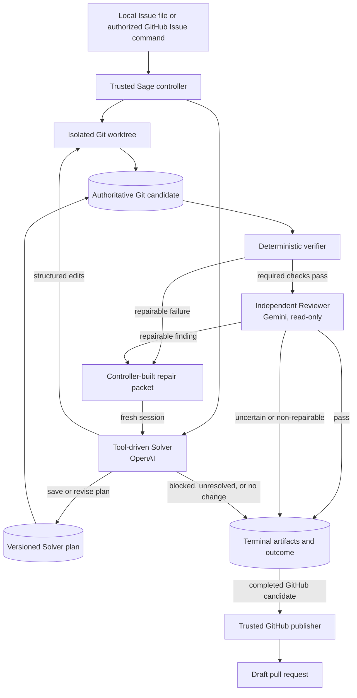

# Admission Removal and Solver–Reviewer Implementation Plan

> **Status:** Implemented on 28 August 2026 by commit `583c40b`; current system
> documentation was completed by `09d09b3`. This is a historical migration
> record, not active work. Use
> [`../docs/architecture.md`](../docs/architecture.md) for the consolidated
> current architecture.

## Objective

Remove the Admission feature and every active Admission-owned surface from the
project. The resulting V2 runtime must contain only:

- the OpenAI-backed, tool-driven Solver;
- deterministic candidate derivation and verification; and
- the independent Gemini-backed Reviewer.

Every run must start with the Solver. A repairable verification or review
failure must continue to reach a fresh Solver repair session, followed by
verification and another independent review. The agents remain isolated and
communicate only through controller-built packets.

This document is an implementation plan. It does not implement the removal.

## Required end state

After implementation:

1. Admission cannot be enabled because no Admission implementation, setting,
   environment variable, Action input, workflow variable, model role, prompt,
   tool, schema, artifact, status, or test remains active.
2. `V2GraphRuntime.solve()` always starts with the initial Solver session.
3. Solver planning, structured repository edits, Git-derived candidate truth,
   deterministic verification, independent review, repair, rereview,
   no-progress detection, deadlines, and provider failure handling retain
   their current behavior.
4. The Reviewer remains mandatory for every implemented candidate that passes
   required deterministic verification.
5. A repairable Reviewer result is validated by the controller and sent to a
   fresh Solver repair session. The repaired candidate is verified and
   reviewed again.
6. Solver and Reviewer do not gain direct communication, shared message
   history, a shared LangGraph, or access to each other's tools.
7. New run metadata and diagnostics contain no Admission fields or files.
8. GitHub Issue context no longer recognizes or preserves Sage clarification
   markers as a special type of bot comment.
9. No new dependency is added.

## Preserved workflow



The feedback cycle is intentionally iterative:

```text
Solver
  -> controller derives candidate from Git
  -> deterministic verification
  -> Reviewer
  -> controller validates blocking findings
  -> fresh Solver repair session
  -> deterministic verification
  -> Reviewer again
  -> pass, terminal failure, no progress, or deadline
```

## Current Admission ownership

Admission is currently spread across runtime, domain, orchestration,
observability, operations, and GitHub integration layers. Deleting only
`sage.runtimes.v2.admission` would leave invalid schemas and dead branches.

### Admission-only modules

| File | Current ownership |
| --- | --- |
| `apps/agent/src/sage/domain/admission.py` | Readiness dispositions, evidence contracts, context snapshots, blocking questions, clarification packets, and Admission results |
| `apps/agent/src/sage/runtimes/v2/admission.py` | Context session, evidence resolution, read-only tools, Admission result validation, context rendering, and clarification-round parsing |
| `apps/agent/tests/runtimes/v2/test_admission.py` | Unit coverage exclusively for the Admission feature |

These three files should be deleted rather than retained as empty wrappers.

### Shared modules containing Admission branches

| Area | Current Admission coupling |
| --- | --- |
| Runtime | Optional Admission scheduling, `_run_admission`, context rendering, terminal routing, and context injection into Solver/Reviewer packets |
| Prompts | Admission instructions/message plus Admission-specific Solver guidance and packet tags |
| Solver domain | `admission_context_digest` and `admission_evidence_ids` in every Solver plan schema |
| Validation | Cross-checking Solver plans against an Admission context |
| Usage | `ModelRole.ADMISSION` and `admission_sessions` |
| Provider manager | Admission session accounting and Admission-or-Solver coding-call branches |
| Research | `ResearchRole.ADMISSION` and its per-role budgets |
| Artifacts | Admission context/final/summary and clarification writers |
| Result domain | Admission-only outcomes and clarification fields |
| GitHub | Clarification markers, context inclusion, terminal outcomes, status rendering, diagnostics, and workflow uploads |
| Configuration | Four Admission/clarification settings and environment readers |
| Operations | Makefile variables, Action input, workflow variables, and Admission artifact checks |
| Documentation | README, current architecture spec, and current testing guide |

## Behavior changes that must be explicit

Removing Admission changes these user-visible behaviors:

- Sage no longer performs a separate read-only readiness pass before Solver
  work.
- Sage no longer produces one-to-three Admission clarification questions or
  counts clarification rounds.
- An incomplete or ambiguous Issue reaches the Solver. The Solver may save a
  blocked plan and return its existing blocked result, which maps to
  `human_required_after_start`.
- Reviewer requirement ambiguity continues to map to
  `human_required_after_start`.
- New runs do not create `admission-context.json`,
  `admission-context-summary.json`, `admission-final.json`, or
  `clarification.json`.
- Existing run directories are not rewritten or deleted.
- Existing GitHub clarification comments remain ordinary historical comments,
  but new context collection no longer gives bot-authored clarification status
  comments special eligibility.

No other solve or publication behavior should change.

## Configuration contract

### Remove Settings fields

Delete these fields from `Settings`:

```text
v2_admission_enabled
v2_admission_max_turns
v2_admission_context_chars
max_clarification_rounds
```

### Remove environment readers and documentation

Delete all loading, parsing, validation, propagation, examples, and active
documentation for:

```text
SAGE_V2_ADMISSION_ENABLED
SAGE_V2_ADMISSION_MAX_TURNS
SAGE_V2_ADMISSION_CONTEXT_CHARS
SAGE_MAX_CLARIFICATION_ROUNDS
```

The variables should not become compatibility aliases. If they remain in an
operator's environment, normal environment loading should ignore them because
they are no longer read. They must not alter runtime behavior.

Update `apps/agent/tests/test_config.py` to remove Admission parsing/default
tests and add one migration test that passes the removed names in an explicit
environment mapping, then asserts:

- settings load successfully when all still-required values are valid;
- none of the four Admission attributes exists on `Settings`; and
- every solve still selects V2 and starts with Solver.

This negative test may retain the old variable names solely to prove they are
inert. Production code and active configuration documentation must not contain
them.

### Run metadata

Remove `v2_admission_enabled` from `ArtifactStore.initialize_run()` metadata.
Do not replace it with a constant such as `false`; the feature no longer
exists.

## Domain-model cleanup

### Delete Admission contracts

Delete `sage.domain.admission` in full after all imports are removed. Do not
move Admission evidence or clarification types into a generic module because
there will be no remaining producer or consumer.

### Simplify Solver plans

Remove these fields from `SolverPlan`:

```text
admission_context_digest
admission_evidence_ids
```

Keep `research_result_ids`. Solver research remains available and its result
IDs continue to be checked against the run-scoped research service.

Because `SolverPlan` uses `extra="forbid"`, removing the Admission fields also
ensures a model cannot keep emitting the obsolete schema silently. Update all
plan fixtures and structured-output tests accordingly.

### Simplify solve results and outcomes

Remove the `clarification` field and clarification validator from
`AgentFinalOutput`. Remove the same field from `SolveResult` and stop copying it
in `workflow.solve`.

Remove Admission-only `SolveOutcome` members after confirming no non-Admission
producer remains:

```text
NEEDS_HUMAN_INFORMATION
NEEDS_HUMAN_DESIGN_DECISION
NEEDS_MAINTAINER_REWRITE
HUMAN_REQUIRED
UNSUPPORTED
```

Retain `HUMAN_REQUIRED_AFTER_START`. It is actively produced by a blocked
Solver and by Reviewer requirement ambiguity. Retain `ENVIRONMENT_BLOCKED`; it
is actively produced by Reviewer environment failures.

Update `workflow.solve` candidate-consistency checks accordingly:

- remove all Admission-only outcomes from the pre-mutation set;
- do not treat `ENVIRONMENT_BLOCKED` as necessarily pre-mutation because its
  remaining producer is the post-candidate Reviewer; and
- preserve the completed/no-change candidate invariants.

Add a focused test proving a Reviewer-originated non-publishable terminal may
retain the authoritative candidate for diagnostics without reaching
publication.

## Runtime simplification

### `V2GraphRuntime._solve`

Remove:

- all Admission imports;
- `admission_context`, `admission_context_json`, and
  `review_admission_context_json` state;
- the `v2_admission_enabled` conditional;
- `AdmissionContextSession` creation;
- clarification-round calculation;
- Admission model execution, validation, logging, artifacts, and early return;
- `validate_solver_plan_context`; and
- Admission packet arguments from initial solve, verification repair, review,
  and review repair calls.

The first model-backed operation after preflight must be:

```text
_run_solver(stage="solver", message=build_solver_message(...))
```

Change the workflow-start log from
`nodes=admission,solver,reviewer` to `nodes=solver,reviewer`.

Delete `_run_admission` and `_admission_terminal` completely.

### Solver tool-loop helper

`_run_coding_graph` currently accepts a generic coding role only because both
Admission and Solver use it. After removal, simplify it to a Solver-owned
helper such as `_run_solver_graph`:

- remove the `role` parameter;
- hardcode `ModelRole.SOLVER` for usage and traces;
- keep `stage` so initial solve and repair remain distinguishable;
- keep the shared `sage.runtimes.tool_loop` graph builder unchanged; and
- retain one tool call per turn, structured final output, turn limits, error
  hooks, and checkpoint-free sessions.

The Reviewer must continue through `ModelCallManager.invoke_reviewer`, not the
Solver's LangGraph tool loop.

### Prompts and packets

Delete `ADMISSION_INSTRUCTIONS` and `build_admission_message`.

Remove Admission-specific language from `SOLVER_INSTRUCTIONS`, including:

- copying an Admission digest or evidence IDs;
- starting from Admission context; and
- avoiding valid baseline reads already performed by Admission.

The remaining Solver instruction should explicitly require the Solver to
inspect sufficient repository context itself before saving its plan.

Make these function signatures Admission-free:

```python
build_solver_message(*, base_sha: str, issue_text: str) -> str

build_repair_message(
    *,
    issue_text: str,
    plan_json: str,
    candidate_diff: str,
    findings_json: str,
) -> str

build_review_message(
    *,
    issue_text: str,
    plan_json: str,
    changed_files_json: str,
    candidate_diff: str,
    verification_json: str,
    solver_summary: str,
    research_summary_json: str | None = None,
) -> str
```

Delete `<admission-context>` and `<base-admission-context>` rendering. Keep all
existing untrusted-data boundaries around Issue, diff, findings, verification,
and research content.

### Validation

Delete `validate_solver_plan_context` and its Admission import. Preserve
`validate_solver_final` and `validate_review` unchanged except for fixture
updates caused by the smaller Solver plan schema.

## Usage, observability, and provider scheduling

### Usage schema

Remove:

- `ModelRole.ADMISSION`; and
- `RunProvenance.admission_sessions`.

New `usage.json` files should contain `solver_sessions`, `review_cycles`, and
the ordered call records only. Existing saved usage files are historical
artifacts and are not migrated in place.

### Model call manager

Remove `admission_sessions` state and persistence. Replace the two-role coding
session branch with a Solver-only operation, for example:

```python
def start_solver_session(self) -> None:
    self.solver_sessions += 1
    self._persist()
```

Restrict OpenAI coding-call accounting to `ModelRole.SOLVER`. Reviewer
accounting, schema repair, bounded retry, circuit behavior, deadline checks,
and `review_cycles` must remain unchanged.

### Observability

Remove the `admission` activity label from `_STAGE_ACTIVITIES` and delete
Admission trace tests. Keep Solver, Solver repair, review, and rereview names
and tags unchanged.

Update log/documentation wording that currently calls the OpenAI tool loop an
“Admission or Solver” loop.

## Research cleanup

Remove `ResearchRole.ADMISSION` and the Admission entry in
`_ROLE_SEARCH_BUDGETS`.

Retain:

- Solver documentation and web research tools;
- run-scoped result IDs and cache;
- research provenance passed to Reviewer;
- domain and URL safety checks; and
- Reviewer research policy code unless a separate repository-wide dead-code
  audit proves it has no intended consumer.

Convert generic research-service tests that currently use
`ResearchRole.ADMISSION` to `ResearchRole.SOLVER` when the behavior under test
is provider error handling, caching, normalization, or budgeting. Delete only
tests that specifically assert Admission's independent budget.

## Artifact cleanup

Remove the Admission import and these methods from `V2ArtifactStore`:

```text
write_admission_context
write_admission_context_summary
write_admission_final
write_clarification
```

Remove these filenames from GitHub diagnostic allowlists and workflow uploads:

```text
admission-context.json
admission-context-summary.json
admission-final.json
clarification.json
```

The full Admission context is already excluded from GitHub diagnostic copies;
delete the now-obsolete test for summary-copy/full-context-exclusion. Preserve
the general allowlist boundary and add an assertion that no Admission filename
is present.

Remove the conditional Admission artifact validation from `make run-status`.
Continue requiring the general run inputs/results and validating the candidate
Git diff.

## GitHub controller cleanup

### Outcomes and mappings

Remove the same Admission-only values from:

- `GitHubWorkflowOutcome`;
- `WorkflowStatusState`;
- `TERMINAL_STATUS_STATES`; and
- `_v2_terminal_mapping`.

Retain `HUMAN_REQUIRED_AFTER_START` and `ENVIRONMENT_BLOCKED` for active
Solver/Reviewer terminal paths.

### Clarification rendering

Remove:

- the `ClarificationPacket` import;
- `has_sage_clarification_marker`;
- the `clarification` parameter from `render_workflow_status`,
  `transition_invocation_status`, and any forwarding helper;
- clarification-state validation;
- `_clarification_message`; and
- the hidden `sage-clarification:v1` marker generator.

The generic terminal status renderer continues to render
`human_required_after_start` with the bounded result summary and uncertainty.

### Issue-context collection

Delete clarification-specific collection and eligibility logic from
`integrations.github.context`:

- remove `has_sage_clarification_marker` imports;
- remove “keep only newest clarification” deduplication; and
- treat every bot-authored Sage status comment as ineligible Issue context.

Human-authored replies remain eligible under the existing ordering, command,
and size rules.

### Workflow handoff

Stop passing `solve_result.clarification` to status transitions. Delete the
GitHub workflow test that builds an Admission clarification packet and replace
it with coverage for active Solver/Reviewer terminal outcomes.

## Makefile and GitHub Actions

### Makefile

Remove:

- `inherited_admission_enabled` capture and restore;
- the `SAGE_V2_ADMISSION_ENABLED=false` default/export;
- conditional Admission artifact checks in `run-status`; and
- Admission wording from `v2-graph`, help, and testing-guide references.

Keep `first-run`, its `v2-first-run` compatibility alias, `v2-test`,
`v2-check`, `graph`, `v2-graph`, and publication smoke behavior.

### Composite Action

Remove the `admission-enabled` input and
`SAGE_V2_ADMISSION_ENABLED` environment forwarding from
`.github/actions/sage-solve/action.yml`.

Keep both provider credentials, model selectors, Google context approval,
research settings, exact-SHA checkout, sandbox build, and publication
boundaries.

### Workflow

Remove:

- `SAGE_V2_ADMISSION_MAX_TURNS`;
- `SAGE_V2_ADMISSION_CONTEXT_CHARS`;
- `SAGE_MAX_CLARIFICATION_ROUNDS`;
- the `admission-enabled` Action argument;
- Admission artifacts from upload paths; and
- stale `# V2 admission` pin comments.

The workflow's repository-local composite Action references are pinned to a
specific repository commit. Implement this in two commits if necessary:

1. commit the runtime, Action, tests, and documentation removal; then
2. update workflow Action references to the exact first commit SHA and commit
   that pin update separately.

Do not use a branch name, tag, or placeholder SHA.

## Documentation updates

Update active documentation to describe only Solver, deterministic
verification, Reviewer, and the repair/rereview loop:

- `README.md`;
- `apps/agent/README.md`;
- `specs/20_CURRENT_PROJECT_STATUS.md`;
- `specs/22_V2_DEFAULT_RUNTIME_TESTING.md`;
- `.env.example`; and
- Makefile help text.

The current-status Mermaid diagrams must begin at Solver and show Reviewer
findings returning through the controller to a fresh Solver repair session.
Remove all Admission roles, optional branches, artifacts, limits,
clarification behavior, and configuration examples.

Historical design and implementation specs are records of prior decisions and
should not be silently rewritten. They may retain Admission terminology, but
active documentation must not link to them as current behavior. The
implementation audit should therefore distinguish active product surfaces
from frozen historical specs.

If repository policy instead requires zero textual Admission references across
the entire tree, remove the Admission-specific historical specs in a separate
documentation commit rather than editing their contents to describe events
that did not occur.

## File-level implementation map

### Delete

```text
apps/agent/src/sage/domain/admission.py
apps/agent/src/sage/runtimes/v2/admission.py
apps/agent/tests/runtimes/v2/test_admission.py
```

### Modify production code

```text
apps/agent/src/sage/config.py
apps/agent/src/sage/artifacts/store.py
apps/agent/src/sage/artifacts/v2.py
apps/agent/src/sage/domain/results.py
apps/agent/src/sage/domain/solver.py
apps/agent/src/sage/domain/usage.py
apps/agent/src/sage/integrations/github/context.py
apps/agent/src/sage/integrations/github/provenance.py
apps/agent/src/sage/integrations/github/status.py
apps/agent/src/sage/observability.py
apps/agent/src/sage/providers/manager.py
apps/agent/src/sage/research/models.py
apps/agent/src/sage/research/service.py
apps/agent/src/sage/runtimes/v2/prompts.py
apps/agent/src/sage/runtimes/v2/runtime.py
apps/agent/src/sage/runtimes/v2/tools.py
apps/agent/src/sage/runtimes/v2/validation.py
apps/agent/src/sage/workflow/github_issue.py
apps/agent/src/sage/workflow/solve.py
```

`runtimes/v2/tools.py` needs only wording or fixtures adjusted if its active
tool set remains Solver-only and contains no Admission import after the main
deletion.

### Modify operations and documentation

```text
.env.example
.github/actions/sage-solve/action.yml
.github/workflows/sage.yml
Makefile
README.md
apps/agent/README.md
specs/20_CURRENT_PROJECT_STATUS.md
specs/22_V2_DEFAULT_RUNTIME_TESTING.md
```

### Update or delete tests

```text
apps/agent/tests/actions/test_actions.py
apps/agent/tests/integrations/github/test_context.py
apps/agent/tests/integrations/github/test_provenance.py
apps/agent/tests/providers/test_manager.py
apps/agent/tests/research/test_service.py
apps/agent/tests/runtimes/v2/test_admission.py        # delete
apps/agent/tests/runtimes/v2/test_runtime.py
apps/agent/tests/runtimes/v2/test_tools.py
apps/agent/tests/runtimes/v2/test_validation.py
apps/agent/tests/test_config.py
apps/agent/tests/test_makefile.py
apps/agent/tests/test_observability.py
apps/agent/tests/workflow/test_github_issue.py
apps/agent/tests/workflow/test_solve.py
```

Also update any additional tests found by the final reference audit; do not
keep production shims solely to avoid fixture updates.

## Implementation phases

### Phase 1 — Establish the Solver–Reviewer regression baseline

Before editing, run:

```bash
make v2-check
make check
make graph
make v2-graph
```

Record the results. Inspect the existing runtime tests for:

- initial Solver implementation;
- plan-before-mutation enforcement;
- deterministic verification;
- Reviewer pass;
- Reviewer repair followed by rereview;
- multiple repair cycles;
- no-progress termination;
- provider retry and schema repair;
- cancellation and deadline behavior; and
- candidate identity guards.

Preserve or strengthen those tests before deleting Admission fixtures.

### Phase 2 — Simplify schemas, prompts, and runtime together

In one coherent change:

1. remove Admission types from Solver plans and final results;
2. remove Admission prompt functions and packet parameters;
3. make `_solve` start directly with Solver;
4. remove Admission execution and terminal helpers;
5. simplify the Solver graph wrapper and model-call accounting; and
6. delete both Admission production modules.

Run focused runtime, validation, prompt/tool, provider-manager, artifact, and
workflow tests before moving outward to GitHub and operations.

### Phase 3 — Remove clarification and Admission outcomes

Delete Admission-only solve/GitHub/status enums, clarification rendering,
special Issue-context collection, diagnostic files, and workflow forwarding.
Update terminal mapping tests so all remaining outcomes have a current
Solver/Reviewer producer.

### Phase 4 — Remove configuration and operational inputs

Delete Settings fields, environment loading, `.env.example` entries, Makefile
handling, composite Action input, workflow variables, upload paths, and their
tests. Confirm an operator cannot turn Admission on through any supported
surface.

### Phase 5 — Remove Admission research, artifacts, and observability

Remove Admission role values, budgets, session counters, artifact writers,
activity labels, and focused tests. Convert generic research/provider tests to
the Solver role instead of deleting useful coverage.

### Phase 6 — Update active documentation and testing guide

Rewrite active diagrams and commands for the Solver-first runtime. Add a
user-friendly testing section specifically proving the iterative
Solver–Reviewer repair loop.

### Phase 7 — Final audit and deployment pin

Run focused and full checks, perform reference scans, inspect the complete
diff, commit logical changes with sign-off when authorized, and update the
workflow's self-referencing Action SHA in its own commit if required.

## Test plan

### Configuration tests

Assert:

- `Settings` has no Admission or clarification fields;
- the removed environment names cannot alter settings;
- both Solver and Reviewer credentials remain required;
- V2 remains the only/default runtime; and
- research configuration remains unchanged.

### Runtime tests

Assert:

- the first coding session is always Solver;
- there is no Admission model bind or call;
- the initial Solver receives the Issue and base SHA without Admission markup;
- Solver saves a plan before mutation;
- Solver plans reject removed Admission fields as extra input;
- a passing candidate is verified and reviewed exactly as before;
- a repairable verification failure reaches a fresh Solver repair;
- a repairable Reviewer failure reaches a fresh Solver repair;
- repaired output is verified and sent to Reviewer again;
- repeated repair/rereview can occur more than once;
- no-progress detection still terminates an unchanged candidate/failure pair;
- Reviewer uncertainty and requirement ambiguity remain non-publishable; and
- cancellation, deadlines, provider failures, and candidate guards remain
  bounded.

### Artifact and provenance tests

Assert new runs contain:

- Solver plans and final output;
- candidate snapshot and authoritative diff;
- verification summaries/logs;
- review versions;
- usage with Solver sessions and review cycles; and
- terminal output.

Assert new runs and GitHub diagnostic uploads do not contain any Admission or
clarification files or metadata keys.

### GitHub tests

Assert:

- bot-authored Sage status comments are excluded from Issue context without a
  clarification exception;
- human replies remain eligible;
- no clarification status state can be rendered;
- Solver-blocked and Reviewer-ambiguity outcomes render the generic
  `human_required_after_start` terminal status;
- Reviewer/verification failures never publish;
- completed reviewed candidates still publish only as draft pull requests;
  and
- Action/workflow YAML has no Admission input, variable, or artifact path.

### Offline commands

Run in this order:

```bash
uv run --project apps/agent pytest \
  -c apps/agent/pyproject.toml \
  apps/agent/tests/runtimes/v2 \
  apps/agent/tests/providers/test_manager.py \
  apps/agent/tests/research/test_service.py \
  apps/agent/tests/artifacts

uv run --project apps/agent pytest \
  -c apps/agent/pyproject.toml \
  apps/agent/tests/integrations/github \
  apps/agent/tests/workflow/test_github_issue.py \
  apps/agent/tests/actions

make v2-check
make check
make graph
make v2-graph
```

Do not claim live-provider coverage from these offline checks.

### Reference audits

Active production, tests, operations, and current documentation should pass:

```bash
rg -n -i \
  'sage\.domain\.admission|runtimes\.v2\.admission|ModelRole\.ADMISSION|ResearchRole\.ADMISSION' \
  apps/agent/src apps/agent/tests .github Makefile .env.example \
  README.md apps/agent/README.md specs/20_CURRENT_PROJECT_STATUS.md \
  specs/22_V2_DEFAULT_RUNTIME_TESTING.md

rg -n \
  'SAGE_V2_ADMISSION|SAGE_MAX_CLARIFICATION_ROUNDS|v2_admission_|admission_sessions' \
  apps/agent/src .github Makefile .env.example README.md apps/agent/README.md \
  specs/20_CURRENT_PROJECT_STATUS.md specs/22_V2_DEFAULT_RUNTIME_TESTING.md

rg -n -i \
  'admission-context|admission-final|clarification\.json|sage-clarification' \
  apps/agent/src apps/agent/tests .github Makefile .env.example
```

The first and third commands should return no matches. The second may match
only the deliberate negative migration test if tests are included in that
scan; it must return no production or active documentation match.

Also verify deleted modules cannot be imported and the package compiles:

```bash
uv run --project apps/agent python -m compileall -q apps/agent/src
```

## Live local validation

Use a clean disposable target repository and an Issue with deterministic
acceptance criteria:

```bash
make first-run \
  REPO=/absolute/path/to/target-repository \
  ISSUE=/absolute/path/to/issue.md \
  BASE_REF=HEAD
```

Confirm:

- logs begin with Solver activity and never mention Admission;
- the Solver writes a plan before mutation;
- deterministic verification runs;
- Reviewer receives the actual Git diff and verification packet;
- a passing review completes normally;
- `usage.json` has Solver sessions and review cycles only; and
- no Admission or clarification artifact exists.

For the feedback loop, use a controlled fixture or provider stub where the
first Reviewer result has one repairable implementation finding and the second
Reviewer result passes. Confirm the observed sequence is:

```text
Solver -> verification -> Reviewer fail
Solver repair -> verification -> Reviewer pass
```

Live model behavior is not deterministic enough to be the only proof of this
route; the offline runtime test remains authoritative.

## Compatibility and migration notes

- Deployments must remove all four Admission/clarification environment
  variables and the `admission-enabled` Action input.
- New run metadata and usage schemas remove Admission keys rather than writing
  constant false/zero values.
- New runs no longer produce Admission or clarification artifacts. Existing
  run directories remain readable as plain files and are not modified.
- Integrations consuming removed solve outcomes or clarification fields must
  migrate to the remaining generic terminal outcomes, primarily
  `human_required_after_start`.
- Existing Sage clarification bot comments are not deleted. They simply lose
  special context-selection behavior in future runs.
- The shared LangGraph tool-loop module remains because Solver actively uses
  it.
- The Gemini Reviewer credential and Google context acknowledgement remain
  required because independent review remains mandatory.

## Risks and mitigations

| Risk | Mitigation |
| --- | --- |
| Reviewer repair accidentally becomes one-shot | Preserve explicit fail → repair → rereview and multi-cycle runtime tests before deleting Admission fixtures |
| Solver prompt still emits removed plan fields | Remove prompt instructions and assert the `extra="forbid"` SolverPlan schema rejects those fields |
| Stale workflow configuration suggests Admission can run | Audit Settings, `.env.example`, Makefile, Action inputs, workflow env, and repository variables together |
| GitHub status imports deleted clarification schemas | Remove clarification types, render parameters, mappings, and context-marker logic in the same coherent change |
| Reviewer environment failure conflicts with pre-mutation guards | Reclassify candidate consistency around remaining producers and add a post-candidate terminal test |
| Generic research/provider coverage is lost with Admission tests | Rebind generic tests to Solver and delete only Admission-specific assertions |
| Diagnostics leak or expect removed files | Keep the allowlist model and assert Admission filenames are absent |
| Historical specs look current | Remove active links and keep current status/testing docs authoritative |
| Workflow self-pins point at pre-removal code | Update exact Action SHAs after the implementation commit in a separate signed pin commit |
| User work is overwritten | Preserve the pre-existing `.gitignore` modification and stage only task-owned files |

## Suggested commit boundaries

When implementation and commits are authorized, use the smallest coherent
split that keeps tests with behavior:

1. `refactor(runtime): remove admission execution`
   - runtime, prompts, schemas, usage, provider manager, research role,
     artifacts, and focused tests;
2. `refactor(github): remove admission clarification flow`
   - outcomes, statuses, context handling, diagnostics, workflow handoff, and
     GitHub tests;
3. `chore(config): remove admission configuration`
   - Settings, environment example, Makefile, composite Action, workflow
     variables, and configuration/Action tests;
4. `docs: document solver reviewer runtime`
   - active README, current status, and testing guide; and
5. `ci(actions): pin solver reviewer actions`
   - exact repository Action SHA updates after the implementation commit.

Combine boundaries when an intermediate commit would not import, compile, or
pass its focused tests. Every created commit must use `git commit -s`.

## Completion checklist

- [ ] `sage.domain.admission` is deleted.
- [ ] `sage.runtimes.v2.admission` is deleted.
- [ ] Admission-only tests are deleted; reusable coverage is moved to Solver.
- [ ] Every run starts with Solver.
- [ ] Reviewer remains mandatory after successful deterministic verification.
- [ ] Reviewer findings still reach a fresh Solver repair session.
- [ ] Repaired candidates are verified and reviewed again, including multiple
      cycles.
- [ ] No direct Solver–Reviewer messaging or shared state is introduced.
- [ ] All four Admission/clarification Settings fields are removed.
- [ ] All four Admission/clarification environment variables are removed from
      production and operational surfaces.
- [ ] The composite Action has no Admission input.
- [ ] The workflow has no Admission variable or upload path.
- [ ] Admission model/research roles, budgets, session counters, and activity
      labels are removed.
- [ ] Solver plans have no Admission digest or evidence fields.
- [ ] Solver, repair, and review packets contain no Admission markup.
- [ ] Admission and clarification artifacts and metadata are removed.
- [ ] Admission-only solve, GitHub, and status outcomes are removed.
- [ ] `HUMAN_REQUIRED_AFTER_START` remains for active Solver/Reviewer blockers.
- [ ] GitHub Issue context has no clarification-marker exception.
- [ ] Active documentation describes only Solver and Reviewer.
- [ ] Focused tests, `make v2-check`, `make check`, `make graph`, and
      `make v2-graph` pass.
- [ ] Final reference audits show no Admission production surface.
- [ ] The final diff contains no unrelated changes, including the existing
      `.gitignore` modification.
- [ ] If commits are requested, each commit is signed off and workflow Action
      pins use an exact implementation commit SHA.
