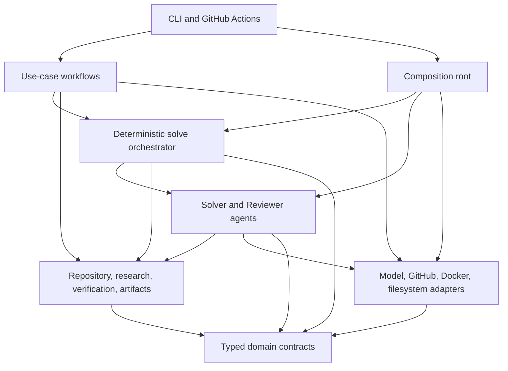

# Agent-Intuitive Architecture Consolidation Implementation Plan

## Document status

> **Status:** Implemented and verified offline on the `refactor` branch; live
> provider and GitHub rollout gates remain pending.
>
> **Date:** 3 September 2026
>
> **Baseline:** `3c2e1a3` on `main`, with 304 deterministic tests passing.
>
> **Current behavior source of truth:**
> [`architecture.md`](../docs/architecture.md)
>
> **Current testing source of truth:**
> [`testing.md`](../docs/testing.md)

This specification records the behavior-preserving consolidation of the Sage
backend, automation, tests, and documentation. The current guides above describe
the implemented tree; this document retains the detailed migration rationale.

> **User-directed retention note:** the implementation keeps `specs/` in the
> project. The index and status banners label older numbered documents as
> historical so they remain available without competing with current guides.

Offline verification completed with 297 deterministic tests, package
compilation, graph rendering, the zero-model/zero-network publication smoke,
GitHub diagnostics, and the network-disabled Docker smoke. A paid-provider
local solve was not run, and the GitHub canary requires an immutable Action
commit; both remain explicit rollout gates rather than inferred successes.

The product architecture delivered as Sage V2 is the only supported
architecture. Because it is the only architecture, target Python names describe
responsibility rather than repeating a version number. Persisted or public V2
labels are retained where changing them would break an existing contract. Old
implementation generations are not retained as executable compatibility paths.

The web application's appearance and behavior are outside this migration. Its
root-level design document is included only in the documentation relocation
because its current location makes it look like the backend architecture
source of truth.

---

## 1. Executive decision

Sage should read as one system with one obvious path:

```text
interface
  -> use-case workflow
    -> deterministic solve orchestrator
      -> Solver agent
      -> candidate derivation
      -> deterministic verification
      -> independent Reviewer agent
      -> bounded repair or terminal result
    -> optional GitHub publication
```

The implementation should make that path visible in directory names, module
names, constructor boundaries, tests, artifacts, commands, and documentation.

The migration therefore makes these decisions:

1. There is one solve architecture and no runtime selection abstraction.
2. `Solver` and `Reviewer` become first-class agent modules instead of details
   inside a versioned runtime coordinator.
3. The outer solve/verify/review/repair loop becomes an explicitly named
   deterministic orchestrator. It is not described as an agent or a LangGraph.
4. LangGraph remains the bounded implementation of each Solver tool session;
   it does not become the outer workflow engine.
5. Model-callable tools remain adapters over deterministic services. Business
   and safety logic stays in ordinary Python.
6. One run-bound artifact object owns all run persistence.
7. One composition root constructs concrete providers, agents, and the
   orchestrator. A factory no longer pretends to select among runtimes.
8. Public behavior and safety contracts remain stable. Internal imports and
   private class names may change.
9. Historical specifications remain in the project, but leave the active
   documentation path after their still-valid decisions are distilled into
   current documentation.
10. No production dependency and no additional model call are introduced.

This is not a rewrite. Each phase moves or extracts one responsibility, keeps
the repository runnable, and proves parity before the next phase begins.

---

## 2. Why the current system is difficult to navigate

The current implementation works, but its map describes its migration history
more strongly than its present responsibilities.

### 2.1 Measured baseline

At the baseline commit:

| Measure | Current value | Consequence |
| --- | ---: | --- |
| Python production files under `sage` | 81 | Many entry points must be opened before ownership is clear |
| Python production lines | 10,922 | Size is reasonable, but high-coupling files concentrate the mental cost |
| Python test files | 47 | Tests are useful but mirror obsolete `runtimes/v2` naming |
| Deterministic tests | 304 passing | Strong safety net for a staged refactor |
| Numbered specification files | 23 | Current, superseded, and removed architectures appear equally authoritative |
| Specification lines | 23,890 | A newcomer cannot cheaply identify the current 286-line as-built document |

The five largest production files are:

| File | Lines | Mixed responsibilities |
| --- | ---: | --- |
| `integrations/github/client.py` | 826 | protocol, transport, retries, REST operations, response parsing, pagination |
| `integrations/github/publishing.py` | 777 | policy, candidate validation, Git transaction, credentials, push, PR reconciliation, rendering |
| `runtimes/v2/runtime.py` | 631 | composition, orchestration, Solver, Reviewer, validation, terminal mapping, persistence |
| `research/service.py` | 542 | provider, HTTP, security, normalization, cache, budgets, service |
| `workflow/github_issue.py` | 533 | authorization recheck, context, solve, mapping, publication, status, diagnostics, recovery |

Large files are not automatically wrong. These files are hotspots because each
changes for several unrelated reasons.

### 2.2 Migration scaffolding has become the public architecture

Only one runtime exists, yet the normal path still includes:

```text
SAGE_RUNTIME=v2
  -> Settings.runtime: Literal["v2"]
  -> build_runtime()
  -> AgentRuntime protocol
  -> V2GraphRuntime
  -> sage.runtimes.v2
```

This has no runtime choice left to model. The selector, factory, versioned
package, and class name make the reader search for alternatives that do not
exist.

Related duplication remains in `DEFAULT_V2_*`, `v2_solver_model`,
`V2ArtifactStore`, `_v2_terminal_mapping`, `v2-*` Make targets, V2-only Action
inputs, and V2-only tests. These names were correct migration aids. They are not
good permanent ownership boundaries.

### 2.3 Responsibilities are hidden or doubled

- `repository/__init__.py` contains the 210-line primary repository service.
  Opening the intuitively named package shows implementation rather than a
  small public surface.
- `ArtifactStore` owns request and final artifacts while `V2ArtifactStore` owns
  stage artifacts for the same run. The orchestrator creates the second store
  even though the workflow already created the first.
- `RuntimeContext` carries a `sandbox` reference that runtime code never uses;
  repository services already own the sandbox boundary.
- The Solver model is constructed directly in `V2GraphRuntime`; the Reviewer
  is constructed through a `ProviderSet` factory that currently contains only
  the Reviewer. Provider composition is asymmetric and non-obvious.
- `runtimes/v2/runtime.py` has 21 internal imports and
  `workflow/github_issue.py` has 17. This is a coupling signal, not merely a
  formatting concern.
- The `domain` package contains a runtime protocol whose type-only imports
  point to configuration, repository, and sandbox layers. Pure contracts and
  runtime wiring are not cleanly separated.

### 2.4 Fragmentation and concentration coexist

The GitHub integration has several single-purpose files of fewer than 25 lines
beside two files of more than 750 lines. The repository service is implemented
in `__init__.py` while low-level operations are distributed across many files.
The result is neither a compact feature module nor a clean layered system.

The answer is not to put everything into fewer giant files. The target is one
module per reason to change, with the primary type stored in the file a reader
would guess.

### 2.5 Documentation describes chronology instead of truth

The active `specs/` directory exposes bootstrapping, replacement, prototype,
Admission, removal, and current designs in one numbered sequence. Some old
plans correctly describe code that was later deleted. Some testing guides
still advertise unavailable selectors. Two already-completed plans still use
future tense.

There are also live inconsistencies:

- `Makefile` still sends users to the original setup guide;
- local configuration defaults to Docker image `sage-sandbox:v0`;
- the GitHub Action builds `sage-sandbox:v1`;
- backend package metadata reports `1.0.0` while V2 is the only product
  architecture; and
- root `DESIGN.md` is a web visual brief, not the system design.

An agent should not need historical reconstruction to answer “where does the
current solve start?”

---

## 3. Design principles for the target system

### 3.1 One concept, one canonical name

The following terms are normative:

| Term | Meaning | Must not mean |
| --- | --- | --- |
| workflow | One user-facing use case, including resource lifecycle | A model conversation |
| orchestrator | Trusted deterministic solve/verify/review/repair control | A provider adapter or prompt |
| agent | One model-backed role with instructions, allowed capabilities, and output contract | The whole application |
| tool | A model-callable typed adapter | Arbitrary business logic or a generic helper |
| service | Deterministic capability used by workflows, orchestrator, or tools | A hidden global singleton |
| provider | External model/search/GitHub boundary | Core domain behavior |
| artifact | Persisted run evidence with a stable name and schema | Cross-run mutable memory |
| context | Explicit run-scoped dependencies and trusted identifiers | An unbounded prompt transcript |
| candidate | Git-derived repository state bound to a base SHA and digest | A model's claimed patch |

Names such as `runtime`, `manager`, `common`, and `helpers` are allowed only
when the owned concept is genuinely generic and documented. Target modules use
the more precise terms above.

### 3.2 Dependencies point toward stable contracts

The intended dependency tower is:



The diagram is about source dependency, not runtime chronology. The domain
layer imports only the standard library and Pydantic. Agents never import CLI,
GitHub workflow, publication, or Docker implementations. Integrations never
reach into a versioned agent package.

### 3.3 Explicit construction, no service locator

The application builds dependencies once and passes them through constructors
or function parameters. It does not add a plugin registry, reflective import,
dependency-injection framework, or mutable global container.

One `composition.py` module is the production wiring map. Tests remain free to
construct the orchestrator with fake agents/services directly.

### 3.4 Agent-accretive without speculative abstraction

Adding a future agent role should require:

1. one role module containing its instructions, input packet builder, allowed
   tools, and typed output boundary;
2. explicit construction in `composition.py`;
3. an explicit orchestrator transition;
4. focused role contract tests; and
5. an update to the architecture and testing documents.

It should not require editing an unrelated provider, hiding routing in a
prompt, or registering magic strings across the repository. There is no generic
role registry until at least two genuinely interchangeable role
implementations require one.

### 3.5 Artifacts are the audit trail, not hidden control state

The orchestrator owns in-memory control state for a run. Artifacts record each
accepted transition atomically. Agents receive bounded packets constructed
from typed state; they do not discover control decisions by rereading arbitrary
artifact files.

This preserves cheap, legible debugging:

```text
issue -> plan revision -> candidate -> verification pass -> review -> terminal
```

### 3.6 Optimize model resources at the packet boundary

This refactor must not add model calls. It preserves:

- fresh Solver sessions for repair;
- one tool request per Solver turn;
- no direct Solver/Reviewer transcript sharing;
- Git-derived changed files and diff;
- bounded initial, repair, and review packets;
- same-run research IDs rather than duplicated source bodies;
- controller validation before repair or terminal routing; and
- deadline/finalization reserve enforcement before every model call.

Code modularity must not be purchased with more prompts, summaries, agents, or
provider round trips.

---

## 4. Behavior and safety compatibility contract

The migration is complete only when the following behavior is unchanged.

### 4.1 Input and execution invariants

- `sage solve` accepts the same repository, Issue file, base reference,
  optional sandbox override, and debug flag.
- `sage github gate`, `solve`, `finalize`, `event-check`, and
  `publication-smoke` retain their command shape and exit behavior.
- Local and GitHub solves prepare a separate clean checkout at the accepted
  committed base SHA.
- The source checkout and its uncommitted changes are never mutated or copied
  into the candidate.
- Repository commands execute only in the network-disabled Docker sandbox.
- Host Git remains limited to preparation and trusted publication operations.
- Sandbox cleanup occurs on success, terminal model outcomes, and exceptions.

### 4.2 Agent and orchestration invariants

- The Solver remains OpenAI-backed and the Reviewer remains Gemini-backed.
- The Solver inspects the repository and saves a complete plan before mutation.
- A blocked plan cannot authorize mutation.
- Plan revisions remain immutable, sequential, digest-bound, and explicit.
- Solver mutations remain limited to exact replace, file write, delete, move,
  and policy-checked verification commands.
- There is no raw patch tool, arbitrary shell mutation, commit, push,
  credential access, or direct network access available to the Solver.
- Candidate truth comes only from Git state at the accepted base SHA.
- Required deterministic verification always precedes semantic review.
- Reviewer packets contain the complete Issue, latest plan, actual changed
  files, actual bounded diff, verification evidence, Solver summary, and safe
  research provenance.
- The Reviewer has no mutation capability.
- Every repair begins a fresh Solver graph. Every repaired passing candidate
  receives a fresh independent review.
- Repeated candidate/failure fingerprints, turn limits, provider retry bounds,
  input caps, deadline, and finalization reserve continue to stop loops.
- The final base SHA and diff digest guard runs after Reviewer pass.

### 4.3 Result, artifact, and publication invariants

- All current `SolveOutcome`, `SolverOutcome`, review verdict, failure type,
  verification status, and GitHub workflow outcome values remain stable.
- Existing run artifact filenames and JSON field meanings remain stable during
  this refactor.
- `changed-files.json` and `diff.patch` remain authoritative.
- Existing run directories are never migrated, renamed, or deleted.
- GitHub diagnostic upload remains a fixed allowlist and never includes the
  repository checkout.
- Only a completed, non-empty, verified, reviewed candidate is publishable.
- Publication keeps exact-base validation, creation-only branch push,
  `sage/issue-<number>`, draft pull requests, duplicate checks, and orphan
  recovery.
- Sage never merges or marks a draft pull request ready.
- Status reconciliation remains idempotent.

### 4.4 Observability invariants

- Each model attempt retains role, stage, provider, model, latency, retry,
  outcome, safe error category, status code, request ID, and token counts when
  available.
- Solver tool decisions remain visible without logging tool arguments or
  sensitive payloads.
- Trace inputs/outputs remain governed by the current LangSmith settings.
- Log and GitHub error text stays bounded and secret-safe.

### 4.5 Explicitly permitted compatibility changes

These changes affect names or setup, not solve semantics:

| Surface | Decision | Migration behavior |
| --- | --- | --- |
| Python imports/classes | Replace version/migration names with responsibility names | Internal API change; update repository call sites atomically |
| `SAGE_RUNTIME` | Remove from active settings, Action inputs, workflow variables, and docs | Existing `SAGE_RUNTIME=v2` in a shell becomes an ignored unrelated environment value |
| `SAGE_MODEL_PROFILE` | Remove the one-value selector | Concrete Solver/Reviewer settings remain authoritative |
| Settings attributes | Rename `v2_solver_model` / `v2_reviewer_model` to `solver_model` / `reviewer_model` | Internal Python construction change only |
| Model environment variables | Retain `SAGE_V2_SOLVER_MODEL` and `SAGE_V2_REVIEWER_MODEL` in this behavior-preserving migration | Avoid an unnecessary operator-facing breaking change |
| Make targets | Make unversioned commands canonical and remove version-only aliases after docs switch | Command migration is documented in one release note |
| Docker image | Use one project-owned V2 tag in local and GitHub paths | Users rebuild the same Dockerfile under the canonical tag |
| Package metadata | Align the distribution release with V2 | No Python import or runtime behavior change |
| Active docs | Replace numbered chronological navigation with current-purpose documents | Git history retains removed design history |

The retained model environment names are the one deliberate exception to
internal unversioning. They are current V2 public configuration, contain no old
runtime compatibility behavior, and changing them would not improve runtime
correctness. A later public configuration revision, if desired, must be a
separate task with an explicit deprecation policy.

External action and dependency release comments such as `actions/checkout`
version pins are not Sage runtime generations and must not be altered by a
blind version search.

---

## 5. Target source layout

The target layout is intentionally small. Directories are created only for
real responsibilities.

```text
apps/agent/src/sage/
  __init__.py
  cli.py                         # argument surface and process exit policy
  composition.py                 # production dependency construction
  config.py                      # single environment-loading boundary
  errors.py                      # public error taxonomy
  observability.py               # safe trace/log metadata

  domain/
    __init__.py                  # package documentation only
    solve.py                     # SolveRequest, PreparedRun, final solve contracts
    solver.py                    # plan, saved plan, candidate, Solver result
    review.py                    # independent review contracts
    verification.py             # deterministic verification contracts
    usage.py                     # model-call provenance contracts

  agents/
    __init__.py                  # package documentation only
    loop.py                      # reusable bounded LangGraph tool loop
    prompts.py                   # static role instructions and packet builders
    repository_tools.py          # model-callable repository adapters
    solver.py                    # Solver role runner and plan session
    reviewer.py                  # Reviewer role runner and contract validation

  orchestration/
    __init__.py                  # package documentation only
    context.py                   # run-scoped SolveContext and narrow protocol
    candidate.py                 # Git snapshot, final guard, fingerprints
    validation.py                # cross-model contract validation
    solve.py                     # deterministic solve/verify/review/repair loop

  workflows/
    __init__.py                  # package documentation only
    solve.py                     # prepare/start/stop/persist one solve use case
    github.py                    # authorized GitHub solve and finalization use case

  artifacts/
    __init__.py                  # package documentation only
    files.py                     # atomic file primitives
    store.py                     # one run-bound RunArtifacts owner

  repository/
    __init__.py                  # package documentation only
    service.py                   # primary deterministic Repository service
    workspace.py                 # isolated checkout preparation
    filesystem.py                # safe paths plus read/write/move/delete
    search.py                    # bounded ripgrep search
    tree.py                      # bounded repository tree
    git.py                       # sandbox candidate Git operations
    host_git.py                  # trusted host Git subprocess boundary
    commands.py                  # sandbox command execution
    output.py                    # bounded rendering
    selection.py                 # ignored runtime-noise policy

  verification/
    __init__.py                  # package documentation only
    discovery.py                 # trusted check selection
    runner.py                    # deterministic verification execution

  research/
    __init__.py                  # package documentation only
    models.py                    # normalized research contracts
    service.py                   # budgets, cache, provenance, role policy
    providers.py                 # search provider protocol and Tavily adapter
    safety.py                    # public URL/domain/content normalization
    tools.py                     # role-specific model-callable adapters

  providers/
    __init__.py                  # package documentation only
    base.py                      # structured model provider protocol
    errors.py                    # provider error taxonomy
    google.py                    # Gemini structured-output adapter
    openai.py                    # OpenAI-specific error classification
    calls.py                     # deadline, retry, serialization, usage ledger

  sandbox/
    __init__.py                  # package documentation only
    base.py                      # command result and sandbox protocol
    docker.py                    # Docker implementation

  integrations/
    __init__.py                  # package documentation only
    github/
      __init__.py                # package documentation only
      config.py                  # GitHub-only environment boundary
      models.py                  # stable GitHub domain/workflow contracts
      api_models.py              # GitHub wire-response contracts
      transport.py               # urllib transport, retry, pagination helpers
      client.py                  # GitHub protocol and REST operations
      events.py                  # event validation and command parsing
      context.py                 # bounded Issue context collection/rendering
      gate.py                    # authorization and deduplication
      outputs.py                 # safe Actions output serialization
      status.py                  # status rendering and transitions
      publication.py            # publication policy and transaction coordinator
      git_publish.py             # credential-scoped Git publication primitives
      diagnostics.py             # provenance and allowlisted copies
      publication_smoke.py       # deterministic offline publication harness
      doctor.py                  # installation diagnostics
```

This is a destination map, not permission for a one-shot directory move. Each
phase below establishes the target incrementally.

### 5.1 Files intentionally absent from the target

- `sage/runtimes/`: there is no selectable runtime.
- `sage/runtimes/v2/`: current agent and orchestration responsibilities have
  stable names.
- `sage/runtimes/factory.py`: composition is construction, not selection.
- `sage/domain/runtime.py`: orchestration protocols do not belong in pure
  domain contracts.
- `sage/artifacts/v2.py`: one run has one artifact owner.
- implementation-bearing package `__init__.py` files: primary types live in
  discoverable modules.
- a global `utils.py`, `common.py`, service locator, agent registry, event bus,
  or generic state framework.

### 5.2 Current-to-target ownership map

| Current source | Target owner | Treatment |
| --- | --- | --- |
| `runtimes/tool_loop.py` | `agents/loop.py` | Mechanical move first; preserve graph topology and recursion formula |
| `runtimes/repository_tools.py` | `agents/repository_tools.py` | Move model-callable wrappers; keep repository logic in services |
| `runtimes/v2/prompts.py` | `agents/prompts.py` | Remove version wording only; preserve instructions and packet envelopes |
| `runtimes/v2/tools.py` | `agents/solver.py` plus `agents/repository_tools.py` | Keep plan state with Solver; keep adapters grouped by capability |
| `runtimes/v2/validation.py` | `orchestration/validation.py` and `agents/reviewer.py` | Cross-role checks stay trusted and deterministic |
| `runtimes/v2/graph.py` | `orchestration/candidate.py` | Rename for actual candidate/fingerprint ownership |
| `runtimes/v2/runtime.py` | `agents/solver.py`, `agents/reviewer.py`, `orchestration/solve.py` | Split by reason to change; preserve the exact outer state machine |
| `runtimes/factory.py` | `composition.py` | Replace selection with explicit construction |
| `domain/runtime.py` | `orchestration/context.py` | Remove unused sandbox field; retain narrow solve protocol for tests |
| `domain/requests.py` + `domain/results.py` | `domain/solve.py` | Co-locate one use case's input/output contracts |
| `artifacts/store.py` + `artifacts/v2.py` | `artifacts/store.py` | One run-bound store, same files and serialization |
| `repository/__init__.py` | `repository/service.py` | Move implementation; use direct imports |
| `repository/paths.py` + `repository/files.py` + `repository/edits.py` | `repository/filesystem.py` | Consolidate one safe filesystem boundary |
| `providers/manager.py` | `providers/calls.py` | Name the deadline/retry/usage responsibility |
| `providers/factory.py` | `composition.py` | Build both role models at one visible boundary |
| `research/service.py` | `research/service.py`, `providers.py`, `safety.py` | Separate policy/cache from network adapter and validation |
| `workflow/solve.py` | `workflows/solve.py` | Package rename and precise use-case documentation |
| `workflow/github_issue.py` | `workflows/github.py` | Keep GitHub lifecycle distinct from API mechanics |
| `github/client.py` | `github/client.py` + `github/transport.py` | Separate high-level operations from HTTP mechanics |
| `github/publishing.py` | `github/publication.py` + `github/git_publish.py` | Separate policy from credential-scoped Git transaction |
| `github/provenance.py` | `github/diagnostics.py` | Use the user-visible responsibility name |
| `github/smoke_patch.py` | `github/publication_smoke.py` | Merge single-consumer normalization with its harness |
| `github/commands.py` | `github/events.py` | Command parsing is part of event interpretation |

Tiny files are merged only where there is one owner and one reason to change.
Security boundaries such as host Git, Docker, atomic files, and Action outputs
remain explicit even when small.

---

## 6. Target runtime ownership

### 6.1 `SolveOrchestrator`

`orchestration/solve.py` owns only the deterministic state machine:

```text
preflight
  -> initial Solver session
  -> validate Solver result and research references
  -> terminal Solver outcome OR derive candidate
  -> deterministic verification
  -> repair Solver session on repairable verification failure
  -> independent review on verification pass
  -> repair Solver session on validated repairable review failure
  -> final candidate guard on pass
  -> terminal persistence
```

The class should be named `SolveOrchestrator`. Its constructor receives:

- `Settings` or, preferably, the few immutable limit values it actually uses;
- a `SolverAgent`;
- a `ReviewerAgent`;
- a research-service builder or run-scoped research service;
- a verifier builder; and
- safe observability callbacks where required.

It does not construct SDK clients, parse environment variables, prepare
workspaces, start Docker, read Issues, publish GitHub branches, or render CLI
output.

The current `while True` loop may remain. A visible loop with explicit bounded
guards is easier to audit than introducing another workflow framework. If the
loop is decomposed, each helper returns a typed decision rather than mutating a
large shared dictionary.

### 6.2 `SolverAgent`

`agents/solver.py` owns:

- one fresh bounded Solver tool graph per initial/repair session;
- binding the role's allowed tools and structured output;
- input-cap enforcement;
- `SolverPlanSession` lifecycle;
- model-attempt callbacks into the call ledger; and
- Solver result activity logging.

It does not own candidate derivation, verification policy, Reviewer routing,
terminal outcome mapping, or publication.

The plan-before-mutation gate remains in ordinary Python. Every mutation tool
calls `require_implementable()` before delegating to the repository service.

### 6.3 `ReviewerAgent`

`agents/reviewer.py` owns:

- construction of the bounded review packet;
- Reviewer input-cap enforcement;
- one structured Reviewer invocation;
- review-schema validation against the saved Solver plan; and
- Reviewer result activity logging.

It exposes one narrow method such as:

```python
async def review(
    self,
    *,
    issue_text: str,
    plan: SavedSolverPlan,
    candidate: CandidateSnapshot,
    verification: VerificationResult,
    research: ResearchSummary,
    rereview: bool,
) -> ReviewResult:
    ...
```

It never receives repository mutation services. This structural absence is
stronger than a prompt instruction.

### 6.4 Agent packet builders

Prompt text and envelope serialization remain in `agents/prompts.py`. Builders
accept typed objects where possible and serialize once at the boundary. The
module must keep these security properties:

- Issue/repository/research content is labeled untrusted;
- controller instructions cannot be supplied by the Issue;
- repair packets distinguish verification evidence from Reviewer findings;
- no raw provider object or hidden transcript enters a packet; and
- length is checked after final rendering, before provider invocation.

### 6.5 Tool ownership

Model-callable functions live under `agents/` or `research/tools.py`; the work
they perform lives in deterministic services.

```text
LangChain tool schema
  -> plan/capability guard
    -> Repository or ResearchService
      -> sandbox/filesystem/network boundary
```

No tool should import the orchestrator or decide the next agent transition.

---

## 7. Configuration and version consolidation

### 7.1 Remove false choices

Delete from `Settings` and environment parsing:

- `runtime`;
- `model_profile`; and
- all validation whose only purpose is to confirm the one available runtime or
  one available profile.

Delete corresponding Action inputs, workflow variables, Make exports, metadata
lookups, tests, and documentation. Do not retain an internal enum with one
member or a compatibility branch for removed implementations.

An existing environment containing `SAGE_RUNTIME=v2` or the current profile
value remains operable because unknown environment variables are naturally
ignored. Other values no longer select any implementation because selection no
longer exists.

### 7.2 Keep current operator model keys

Continue reading:

```dotenv
SAGE_V2_SOLVER_MODEL=gpt-5.4-mini
SAGE_V2_REVIEWER_MODEL=gemini-3.5-flash
```

Map them into unversioned Python fields:

```python
settings.solver_model
settings.reviewer_model
```

Rename constants to `DEFAULT_SOLVER_MODEL` and `DEFAULT_REVIEWER_MODEL`.

The distinction between public environment compatibility and clean internal
ownership must be documented beside `Settings.from_env`; it must not produce
aliases or fallback precedence.

### 7.3 Align project-owned release identifiers

Perform one explicit operational migration:

- package version: `2.0.0`;
- local and hosted Docker tag: `sage-sandbox:v2`;
- default/manual run directory prefix: remove `v2-manual` in favor of
  `manual` because the run is already Sage;
- user-facing banner: `Sage`, not `Sage V2`;
- canonical LangSmith project may remain `sage-v2` because changing it would
  split operational trace history;
- graph/artifact fields that identify the current V2 format remain unchanged
  during this refactor.

The Docker tag must change in `config.py`, `.env.example`, `Makefile`, both
Action steps, tests, and the testing guide in the same logical change. Local
users must rebuild the image; hosted jobs build it on every run.

### 7.4 Do not broaden configuration scope

This migration does not add YAML/TOML configuration, dynamic role manifests,
provider auto-discovery, multiple model profiles, or a second settings library.
Environment variables continue to be read at the existing trusted boundaries.

---

## 8. Run context and artifact consolidation

### 8.1 One run context

Replace `RuntimeContext` with `SolveContext` containing only what agents and
the orchestrator use:

```text
prepared run identity/base/workspace
repository service
immutable settings/limits
run artifact store
```

Do not include the raw Docker sandbox; `Repository` owns command execution.
Do not include GitHub credentials, GitHub clients, source repository paths, or
global environment access.

### 8.2 One artifact owner

Replace `ArtifactStore` plus `V2ArtifactStore` with a run-bound `RunArtifacts`:

```python
artifacts = RunArtifacts(prepared.run_dir)
artifacts.initialize(...)
await orchestrator.solve(..., artifacts=artifacts)
artifacts.write_result(...)
```

The same object is passed to plan persistence, verification logging, review
persistence, usage persistence, and terminal persistence.

This is consolidation, not an artifact redesign. Preserve:

- atomic replace behavior;
- fixed controller-owned filenames;
- safe stage-name validation;
- versioned `solver-plans/` and `reviews/` directories;
- latest-pointer files;
- Pydantic JSON serialization mode;
- newline and sort behavior of generic JSON files;
- existing error types and safe messages; and
- the GitHub diagnostic allowlist.

Add a narrow `VerificationArtifacts` protocol only if it materially improves
unit-test construction. Do not create a protocol for every writer method.

### 8.3 Artifact parity fixture

Before consolidation, add a deterministic fixture that exercises an initial
plan, plan revision, candidate, two verification passes, two reviews, usage,
terminal output, and final solve output. Compare relative file names and parsed
JSON values before and after the move. Do not compare timestamps or temporary
absolute paths.

---

## 9. Repository, verification, and research boundaries

### 9.1 Rename the repository façade

Move `RepositoryTools` from `repository/__init__.py` to
`repository/service.py` and rename it `Repository`. This object is a trusted
deterministic service; the LangChain functions that expose it are tools.

Production imports should use:

```python
from sage.repository.service import Repository
```

Package `__init__.py` files should not hide primary implementations through
broad re-export barrels. Tests may import the concrete module they exercise.

### 9.2 Preserve repository policy

The move must preserve:

- workspace traversal and symlink rejection;
- UTF-8 and regular-file rules;
- exact occurrence checks;
- create/replace mode semantics;
- no-overwrite move behavior;
- ignored untracked runtime/dependency noise;
- binary-capable complete Git diff;
- bounded search/tree/file/command output;
- command timeout classification; and
- per-tool safe activity logging.

Combine safe paths, reads, and edits into `filesystem.py` only after their
focused tests are moved together. Host Git and sandbox Git remain separate
because their trust boundaries differ.

### 9.3 Verification depends on capability, not V2 artifacts

Rename versioned docstrings and types. `Verifier` accepts `Repository` and the
run artifact writer it needs. Discovery remains a pure function of the saved
plan and trusted configured commands.

No verification command becomes model-defined merely because the Solver lists
it in a plan. Existing allowlists, configured command limits, required/optional
semantics, fingerprints, and candidate-stability check remain exact.

### 9.4 Split research by reason to change

Keep `ResearchService` as the policy owner for budgets, per-run cache,
provenance, role access, and normalized results. Move:

- `SearchProvider`, unavailable provider, and Tavily adapter to
  `research/providers.py`;
- public URL/domain checks, HTML text extraction, and external-text
  normalization to `research/safety.py`; and
- only model-callable wrappers to `research/tools.py`.

Do not change allowed schemes, public-address restrictions, redirects,
timeouts, content caps, role permissions, or the target sandbox's lack of
network access.

---

## 10. Provider and model-call composition

### 10.1 Build both role dependencies visibly

`composition.py` constructs:

- the OpenAI chat model used by `SolverAgent`;
- the Gemini structured provider used by `ReviewerAgent`;
- the two agent objects; and
- `SolveOrchestrator`.

This replaces the current asymmetric arrangement where the Solver model is
constructed inside the runtime and a `ProviderSet` factory constructs only the
Reviewer.

Tests can pass fake agent/model dependencies without reading environment
variables.

### 10.2 Keep one run-scoped model-call ledger

Rename `ModelCallManager` to `ModelCallController` only if the class continues
to own all of these responsibilities together:

- attempt numbering;
- per-role/stage provenance;
- deadline and finalization reserve checks;
- Reviewer serialization;
- bounded retry/schema repair;
- safe provider error classification; and
- usage persistence callback.

If those responsibilities are split, use at most two cohesive objects: a
deadline/budget object and a call/provenance controller. Do not introduce a
generic scheduler framework.

Call ordering, maximum retries, Retry-After limits, request timeouts, Reviewer
serialization, and terminal error mapping are frozen behavior.

### 10.3 Preserve provider-specific isolation

Provider wire quirks remain in adapters:

- Gemini schema filtering remains in `providers/google.py`;
- OpenAI quota classification remains in `providers/openai.py`;
- shared unpacking and usage extraction remain in `providers/base.py`; and
- provider exceptions remain normalized before orchestration sees them.

No Google/OpenAI response dictionary should leak into domain or orchestrator
code.

---

## 11. GitHub integration consolidation

GitHub is a large, security-sensitive subsystem. Refactor it after the agent
core is stable and never combine the changes into the same commit.

### 11.1 Split HTTP mechanics from API operations

Move `UrllibTransport`, response bounding, header normalization, pagination
parsing, and retry-delay helpers to `transport.py`. Keep `GitHubClient` and
`RestGitHubClient` methods in `client.py`.

The split must preserve:

- fixed GitHub API host and encoded path components;
- authorization and media headers;
- bounded response bodies;
- GET/PATCH retry behavior;
- POST reconciliation behavior;
- `Retry-After` handling;
- request ID/status propagation; and
- Pydantic validation of every response.

### 11.2 Separate publication policy from Git mechanics

`publication.py` owns eligibility, duplicate checks, base movement policy,
result mapping, PR title/body, and transaction sequence. `git_publish.py` owns
the credential-scoped disposable checkout, askpass environment, candidate
application, commit, creation-only push, and safe Git diagnostics.

GitHub tokens never enter model settings, artifacts, command strings, or the
target sandbox.

### 11.3 Keep the GitHub workflow readable as a transaction

`workflows/github.py` should read top-to-bottom as:

```text
reauthorize and deduplicate
  -> validate exact checkout and runner paths
  -> transition status to working
  -> collect/materialize Issue context
  -> run the core solve workflow
  -> map terminal non-publication outcomes
  -> publish completed candidate
  -> persist diagnostics and terminal status
  -> on failure, best-effort safe diagnostics/status, then re-raise
```

The broad outer exception catch is intentional because it reconciles external
state and then re-raises. Preserve that policy, but extract a small named
failure-recording function so the main success transaction is visible. The
nested best-effort catches must remain narrow in purpose and must never mask the
original exception.

Rename `_v2_terminal_mapping` to `_terminal_mapping`; its values do not change.

### 11.4 Consolidate models carefully

Merge the stable internal GitHub value objects, gate result, and Issue-context
models only where doing so removes circular navigation. Keep wire-response
models separate because they change with GitHub API payloads rather than Sage
workflow behavior.

Do not create one unbounded GitHub `models.py` containing transport internals,
domain values, events, workflow outcomes, and publication results without
sections or ownership clarity.

---

## 12. Documentation as an agent interface

Documentation is part of the control surface. The final active documentation
must answer three questions immediately:

1. What does Sage do now?
2. Where does each responsibility live?
3. How do I prove a change is safe?

### 12.1 Final active documentation

Create or promote these unnumbered documents:

```text
README.md                  # 60-second product and setup entry
docs/architecture.md       # implemented system, dependency tower, control map
docs/testing.md            # offline, live local, GitHub canary, troubleshooting
docs/refactor-plan.md      # this plan while implementation is active
apps/web/DESIGN.md         # web visual source of truth
```

The root README should contain a short “change map”:

| I need to change… | Start here |
| --- | --- |
| Solver behavior/tools | `sage/agents/solver.py` |
| Reviewer criteria | `sage/agents/reviewer.py` |
| solve/repair routing | `sage/orchestration/solve.py` |
| repository capability | `sage/repository/service.py` |
| model/provider behavior | `sage/providers/` |
| GitHub trigger/publication | `sage/integrations/github/` and `sage/workflows/github.py` |
| settings | `sage/config.py` and `.env.example` |
| run evidence | `sage/artifacts/store.py` |

`docs/architecture.md` should include runtime sequence, dependency rules,
module ownership, artifact lifecycle, security boundaries, extension recipes,
and the same terminology used by source code.

### 12.2 Historical specifications

Extract still-valid invariants into the current architecture/testing documents
and verify inbound links. Retain every numbered specification in `specs/` as
design history, add an unmistakable historical-status banner to superseded
documents, and keep them out of active onboarding links.

`specs/README.md` is the permanent index that separates current sources of
truth, the implemented consolidation plan, completed migrations, and
historical records.

### 12.3 Root `DESIGN.md`

Move the web visual brief to `apps/web/DESIGN.md` after reading and obeying the
nested web instructions. Update any web references. Do not rewrite its visual
content as part of the backend architecture migration.

### 12.4 Agent-maintenance rules

Update `AGENTS.md` after the new layout exists with:

- the canonical module map;
- dependency direction rules;
- the distinction between agents, orchestrator, tools, and services;
- the canonical check commands; and
- the rule that new architecture documentation updates the current document
  instead of appending another chronological specification by default.

Do not duplicate the full architecture spec inside `AGENTS.md`; link to it.

---

## 13. Implementation phases

Every phase starts from a passing tree, changes one concern, runs focused
checks, and ends with a passing tree. Do not begin the next phase with known
failures.

### Phase 0 — Freeze behavioral evidence

**Goal:** make accidental behavior changes visible before moving code.

1. Record the baseline commit and deterministic test count.
2. Add characterization tests for:
   - CLI parser shapes and exit mappings;
   - current solve outcomes and repair/rereview cycles;
   - Solver graph topology and one-tool-per-turn routing;
   - prompt packet tags and included authoritative fields;
   - result/outcome enum values;
   - complete artifact file/schema set;
   - model-call order/retry/deadline accounting;
   - repository path, diff, and mutation policies;
   - GitHub context/status/publication transaction; and
   - Action permissions, secret scope, pins, and diagnostic allowlist.
3. Capture generated CLI help and graph topology as semantic assertions, not a
   whitespace-heavy full-text snapshot.
4. Add an AST-based dependency test using the standard library. It initially
   reports the current exceptions and becomes strict as phases remove them.

**Exit gate:** full deterministic suite passes; no production behavior changed.

### Phase 1 — Establish the canonical documentation map

**Goal:** stop new work from using historical plans as current truth.

1. Add the temporary `specs/README.md` index.
2. Mark completed removal plans as implemented records.
3. Mark the current architecture and testing guide explicitly authoritative.
4. Link this plan from the root README and current status document.
5. Correct only broken/stale links needed during implementation.

**Exit gate:** every root/Make/doctor documentation link resolves, and a
newcomer reaches current architecture and tests in two clicks or fewer.

### Phase 2 — Unify artifacts and run context

**Goal:** create one run-scoped state/evidence boundary before splitting the
orchestrator.

1. Introduce run-bound `RunArtifacts` using existing atomic writers.
2. Move all stage writers without changing file names or JSON shapes.
3. Pass the same artifact object from workflow to orchestrator, verifier, and
   plan session.
4. Replace `RuntimeContext` with minimal `SolveContext`; remove the unused raw
   sandbox reference.
5. Move request/result contracts into `domain/solve.py` if the import move can
   remain atomic.
6. Delete `artifacts/v2.py` and `domain/runtime.py` only after reference audits.

**Focused tests:** artifacts, workflow solve, verifier, Solver tools, existing
run fixture compatibility.

### Phase 3 — Extract explicit agent roles

**Goal:** make Solver and Reviewer independently legible and testable.

1. Move the generic tool loop to `agents/loop.py` without logic edits.
2. Move repository tool adapters to `agents/repository_tools.py`.
3. Move prompts and packet builders to `agents/prompts.py`.
4. Create `SolverAgent` from current Solver graph methods, plan session, and
   tool construction.
5. Create `ReviewerAgent` from current review invocation and validation.
6. Preserve provider attempt hooks, role/stage labels, input caps, and result
   schemas.
7. Move tests to `tests/agents/` and keep every failure-path assertion.

**Focused tests:** loop routing, Solver plan/mutation gate, Solver result
validation, Reviewer criteria validation, packets, model-call records.

### Phase 4 — Extract the deterministic orchestrator

**Goal:** make the outer control loop visible without a versioned runtime.

1. Move candidate creation, final guard, and fingerprints to
   `orchestration/candidate.py`.
2. Move cross-role validation to `orchestration/validation.py` where it is not
   owned by one role.
3. Create `SolveOrchestrator` using injected `SolverAgent` and `ReviewerAgent`.
4. Preserve the exact terminal mapping and progress-detection semantics.
5. Add `composition.py` that constructs concrete providers, agents, research,
   and orchestrator.
6. Replace `build_runtime()` call sites with the composition function.
7. Delete `runtimes/factory.py` and `runtimes/v2/` after `rg` confirms no
   imports.

**Focused tests:** initial success, no change, blocked, unresolved, verifier
repair, multiple review repairs, uncertainty, invalid contracts, provider
errors, no progress, deadline, final Git guard.

### Phase 5 — Remove false configuration and version indirection

**Goal:** make the sole architecture the direct default.

1. Remove runtime/profile fields and validation from settings.
2. Rename internal model constants/fields while retaining current V2 model
   environment keys.
3. Remove runtime/profile Action inputs and workflow variables.
4. Update artifact initialization to preserve required metadata compatibility
   without depending on a selector.
5. Align package metadata and Docker tag.
6. Replace user-facing and internal versioned class/docstring/error wording
   with role/system wording where it is not a persisted contract.
7. Delete selector rejection tests; replace them with tests that direct
   construction always yields the sole orchestrator.

**Focused tests:** settings, composition, CLI, artifacts, observability,
Makefile, Actions.

For clarity, artifact compatibility in step 4 means `metadata.json` continues
to contain `"runtime": "v2"` and
`"model_profile": "constrained-cross-provider"`, and usage/trace records keep
their current V2 graph labels. These become fixed format/observability labels,
not user-selectable settings. Removing or renaming those persisted fields is a
separate artifact-schema migration and is outside this plan.

### Phase 6 — Clarify repository, verification, and research ownership

**Goal:** remove hidden primary implementations and split the research hotspot.

1. Move the repository service out of `__init__.py` and rename it.
2. Update direct imports; keep package initializers documentation-only.
3. Consolidate filesystem path/read/edit operations with their tests.
4. Update verifier and agent adapters to depend on the renamed service.
5. Split research provider and safety code from `ResearchService`.
6. Run path/symlink, command, diff, research security, cache, and budget tests
   after each slice.

**Exit gate:** no new dependency edge points from deterministic services into
agents/orchestration; all security tests pass.

### Phase 7 — Clarify workflows and GitHub integration

**Goal:** make user-facing transactions readable and isolate GitHub mechanics.

1. Rename `workflow/` to `workflows/` and update direct imports.
2. Split GitHub transport from client operations.
3. Split publication policy from credential-scoped Git operations.
4. Rename provenance ownership to diagnostics.
5. Merge publication-smoke-only patch normalization into its harness.
6. Extract GitHub failure recording from the main success transaction.
7. Rename versioned private mapping names.
8. Preserve all public command/status/publication contracts.

**Focused tests:** every GitHub integration test, GitHub workflow test, CLI
automation test, offline publication smoke, Actions policy.

### Phase 8 — Consolidate commands and active documentation

**Goal:** expose one obvious developer workflow.

1. Make `make test`, `make check`, `make graph`, and `make github-smoke`
   canonical.
2. Remove redundant version-only aliases and duplicated help text.
3. Ensure `make check` includes unit, architecture, Action policy, and compile
   checks exactly once.
4. Move the current status content into `docs/architecture.md` and current
   testing content into `docs/testing.md`, updated for the final layout.
5. Move the web brief to `apps/web/DESIGN.md` without content changes.
6. Update README, backend README, `.env.example`, Make help, doctor, workflow
   comments, and `AGENTS.md`.
7. Retain superseded numbered documents with historical-status banners after
   extracting current invariants and auditing inbound links.

**Exit gate:** all tracked Markdown links resolve; searches for removed source
paths and commands return no active references.

### Phase 9 — Final parity, efficiency, and rollout gate

**Goal:** prove the new map is smaller, safer to navigate, and behaviorally
equivalent.

1. Run the complete verification matrix in Section 14.
2. Compare CLI, graph, artifacts, outcomes, call sequence, and GitHub Action
   permissions to Phase 0 evidence.
3. Measure source file count, LOC, largest modules, and internal fan-out.
4. Inspect the complete diff for accidental dependency, formatting, web, or
   behavior changes.
5. Perform a live local disposable-repository solve.
6. After an immutable action pin exists, run one controlled GitHub canary.
7. Update current architecture/testing docs with observed final values.

No old runtime is retained as rollback. Rollback is a Git revert to the last
known-good revision, not a runtime selector or dormant compatibility package.

---

## 14. Detailed verification and testing guide

All normal tests are deterministic and must not call paid model or live GitHub
APIs.

### 14.1 Fast focused order

Run after the relevant phase:

```bash
uv run --project apps/agent pytest -c apps/agent/pyproject.toml \
  apps/agent/tests/artifacts \
  apps/agent/tests/repository \
  apps/agent/tests/verification

uv run --project apps/agent pytest -c apps/agent/pyproject.toml \
  apps/agent/tests/agents \
  apps/agent/tests/orchestration \
  apps/agent/tests/workflows/test_solve.py

uv run --project apps/agent pytest -c apps/agent/pyproject.toml \
  apps/agent/tests/integrations/github \
  apps/agent/tests/workflows/test_github.py \
  apps/agent/tests/test_cli.py \
  apps/agent/tests/actions
```

Paths become valid as phases move tests. Before a move, run their current
equivalents.

### 14.2 Full offline gate

The final canonical commands are:

```bash
make check
make graph
make github-smoke
make github-doctor
```

`make check` must run the entire deterministic Python suite, architecture
dependency checks, Action/workflow policy tests, and package compilation. It
must not require Docker or provider keys.

`make github-smoke` must report zero model calls and zero network calls.

### 14.3 Static architecture audit

Add a standard-library AST test enforcing:

- `domain` imports no `config`, `agents`, `orchestration`, `repository`,
  `sandbox`, workflow, or integration module;
- `agents` imports no CLI, workflow, GitHub, or concrete Docker module;
- `orchestration` imports no CLI, workflow, GitHub, or concrete Docker module;
- deterministic capabilities import no agents or workflows;
- no production logic lives in package initializers; and
- internal module graph has no cycle.

Use explicit allowlists for genuine composition edges. Do not build a custom
lint framework or add a dependency.

### 14.4 Version/removal audit

Audit project-owned surfaces, excluding dependency/action release pins and this
migration record:

```bash
rg -n 'sage\.runtimes|V2GraphRuntime|V2ArtifactStore|build_runtime|_v2_' \
  apps/agent/src apps/agent/tests .github Makefile README.md docs

rg -n 'SAGE_RUNTIME|SAGE_MODEL_PROFILE|v2-first-run|v2-check|v2-test|v2-graph' \
  apps/agent/src apps/agent/tests .github Makefile .env.example README.md docs

rg -n 'sage-sandbox:v0|sage-sandbox:v1' \
  apps/agent/src apps/agent/tests .github Makefile .env.example README.md docs
```

Expected result: no active match. Current V2 model environment keys, current
artifact/trace schema labels, and external dependency pins remain allowed.

### 14.5 Behavior matrix

| Scenario | Required result |
| --- | --- |
| clean implemented candidate, verification pass, review pass | `completed`, unchanged authoritative diff |
| Solver returns no change with clean Git | `no_change` |
| Solver returns no change after mutation | `unresolved` |
| Solver blocks after saving blocked plan | `human_required_after_start` |
| implemented output without plan | `invalid_model_output` |
| implemented output under blocked plan | `invalid_model_output` |
| plan references unknown research ID | `invalid_model_output` |
| required verification fails, repair progresses | fresh Solver repair then reverification |
| verification repeats same candidate/failure | `verification_failed` |
| Reviewer returns repairable findings | fresh Solver repair then verification and rereview |
| Reviewer repeats same candidate/finding | `review_failed` |
| Reviewer is uncertain | `human_required_after_start` |
| Reviewer reports environment constraint | `environment_blocked` |
| provider temporary rate limit exhausts bounds | `rate_limited` |
| quota/auth/provider failure | `provider_unavailable` |
| deadline reserve reached | `budget_exhausted` |
| candidate changes during/after verification/review | non-publishable failure |
| cancelled task | cancellation propagates and sandbox still stops |

### 14.6 Artifact parity

For the parity fixture, assert:

- identical relative filenames;
- identical parsed request, issue, plan, candidate, verification, review,
  usage, terminal, changed-file, and final-result values;
- plan/review revision numbering remains one-based and ordered;
- latest pointer matches the final revision;
- failure logs remain bounded;
- atomic writers leave no temporary files after success; and
- injected write failure produces `ArtifactError` without a partial target.

### 14.7 Live local canary

Use a disposable committed repository and a small issue with explicit
acceptance criteria:

```bash
make first-run REPO=/absolute/path/to/disposable/repo \
  ISSUE=/absolute/path/to/issue.md
```

Confirm:

1. exactly the expected Solver/Reviewer model sequence occurred;
2. Solver saved a plan before the first mutation;
3. candidate commands ran in the network-disabled sandbox;
4. deterministic verification preceded review;
5. artifact names and key fields match the baseline;
6. source repository and base commit remain unchanged; and
7. the run contains an uncommitted, independently reviewed candidate.

No production repository is used for this canary.

### 14.8 GitHub canary

After all implementation commits are pushed and both composite Action
references are pinned to the immutable implementation commit:

1. install the updated workflow on a disposable repository;
2. invoke one bounded Issue with `/sage solve`;
3. verify gate authorization and exact base SHA;
4. verify one status-comment lifecycle;
5. verify creation-only branch and draft PR;
6. verify diagnostic allowlist and absence of repository/secrets;
7. verify finalizer idempotence; and
8. delete the disposable branch/PR only through normal repository maintenance,
   not from Sage.

The canary is a rollout gate, not part of the offline suite.

---

## 15. Quantitative acceptance targets

Correctness outranks metrics, but the migration should produce measurable
navigation improvement.

| Metric | Baseline | Target |
| --- | ---: | ---: |
| Production Python files | 81 | no more than 75 unless an added boundary is justified in review |
| Production Python lines | 10,922 | net reduction of at least 5%, excluding comments/docstrings added solely to explain public APIs |
| Largest mixed-responsibility coordinator | 631 lines | orchestrator no more than 400 lines |
| Highest internal fan-out | 21 (`runtimes/v2/runtime.py`) | no non-composition module above 14 |
| Active architecture/testing entry documents | 23-numbered sequence | 2 current sources plus this active plan |
| Supported solve architectures | 1 behind selection scaffolding | 1 constructed directly |

The file/LOC limits are review signals, not reasons to compress readable code
or merge security boundaries. Any exception must be documented in the final
architecture update with the reason.

Additional qualitative acceptance criteria:

- a newcomer can trace CLI-to-Solver in at most five source hops;
- searching `class SolverAgent`, `class ReviewerAgent`, or
  `class SolveOrchestrator` finds the primary implementation directly;
- primary code is absent from `__init__.py`;
- each top-level package has one sentence of ownership documentation;
- tests mirror production responsibility names;
- a role's tools and output schema are discoverable from its module;
- no folder or class is named for a removed architecture generation; and
- no current document asks the reader to understand a superseded generation
  before the present system.

---

## 16. Risks and mitigations

| Risk | Mitigation |
| --- | --- |
| Mechanical moves conceal logic edits | Move first with import-only changes; simplify in a later diff |
| Artifact consolidation changes JSON or filenames | Add parsed parity fixture before the move |
| Agent extraction changes call order or trace stages | Assert ordered model-call records and trace metadata |
| Context split accidentally gives Reviewer mutation access | Construct Reviewer without repository capability; test absence structurally |
| Removing selector breaks current deployments | Current correct `SAGE_RUNTIME=v2` becomes harmless; update Action/workflow atomically |
| Docker tag mismatch breaks local setup | Change all project-owned defaults together and require rebuild in testing guide |
| GitHub split changes retry/publication security | Keep all current transport/publication tests and run offline smoke after each slice |
| Broad exception cleanup loses terminal reconciliation | Preserve the outer catch/re-raise policy and test original exception identity |
| A retained historical spec looks current | Add status banners and keep current onboarding links pointed at `docs/` |
| LOC target encourages dense code | Treat it as a signal; readability and security boundaries can justify exceptions |
| New abstractions recreate the problem | No registry/framework; require two real callers before shared abstraction |
| Large rename becomes unreviewable | Use phase and commit boundaries below; never mix web visual changes with backend logic |

---

## 17. Suggested logical commits

No commit may be created unless the user explicitly requests it. If commits are
authorized, use signed-off Conventional Commits and keep tests with behavior.

1. `test(architecture): freeze solve behavior contracts`
   - characterization, artifact parity, and dependency tests only.
2. `docs: establish current architecture navigation`
   - temporary spec index, status banners, plan links.
3. `refactor(artifacts): unify run persistence`
   - run-bound store, minimal context, direct tests.
4. `refactor(agents): separate solver and reviewer roles`
   - agent package, loop/tools/prompts moves, role tests.
5. `refactor(orchestration): expose the solve control loop`
   - orchestrator, candidate/validation, composition, remove runtime package.
6. `refactor(config): remove runtime selection scaffolding`
   - settings/internal names, package/Docker identity, config tests.
7. `refactor(repository): clarify deterministic capabilities`
   - service/filesystem moves and focused safety tests.
8. `refactor(research): separate policy provider and safety`
   - no behavior or dependency change.
9. `refactor(github): separate workflow transport and publication`
   - GitHub modules with integration tests and offline smoke.
10. `chore(make): expose unversioned developer commands`
    - Make/help/doctor and command-policy tests.
11. `docs: publish the current system guide`
    - architecture/testing/README/AGENTS, web design move, historical cleanup.
12. `ci(actions): pin consolidated sage implementation`
    - immutable action/workflow pins after the implementation commit exists.

Combine adjacent commits only when the intermediate tree could not import and
pass its relevant tests. Do not mix broad formatting or unrelated frontend
work into any commit.

---

## 18. Definition of done

- [x] The Phase 0 behavior ledger exists and passes.
- [x] The only solve path is constructed directly without a runtime selector.
- [x] `SolverAgent`, `ReviewerAgent`, and `SolveOrchestrator` have clear,
      separate ownership.
- [x] Solver/Reviewer communication still occurs only through trusted bounded
      packets.
- [x] LangGraph remains a per-Solver-session tool loop, not the outer workflow.
- [x] One `RunArtifacts` object owns every artifact for a run.
- [x] `SolveContext` contains no unused sandbox or external credentials.
- [x] Repository primary implementation lives in `repository/service.py`.
- [x] Research policy, provider, and safety responsibilities are separated.
- [x] GitHub HTTP, workflow, and publication/Git responsibilities are explicit.
- [x] Domain contracts have no infrastructure dependencies.
- [x] No primary production implementation lives in `__init__.py`.
- [x] No removed runtime/factory/versioned internal package remains.
- [x] Project-owned Docker tags are consistently V2.
- [x] Current model environment variables retain their documented behavior.
- [x] CLI commands, exit codes, outcome values, artifact schemas, and GitHub
      behavior match the baseline.
- [x] No production dependency or model call was added.
- [x] Canonical commands and current documents are obvious from the root
      README.
- [x] Historical designs are absent from active navigation after valid
      decisions are distilled.
- [x] The complete deterministic suite and compilation pass.
- [x] Architecture import rules pass.
- [x] Graph and artifact parity checks pass.
- [x] Offline publication smoke passes with zero model/network calls.
- [ ] A disposable live local solve passes.
- [ ] A controlled GitHub canary passes after immutable Action pinning.
- [x] Final file-count, LOC, fan-out, and largest-module measurements are
      recorded in the current architecture document.
- [x] Final diff review finds no unrelated changes.
- [ ] If commits were requested, every commit is signed off, logically scoped,
      and listed in the handoff.

The desired result is not merely fewer files or fewer lines. It is a system in
which the source tree itself explains how Sage thinks, what the trusted
controller owns, what each agent may do, where evidence becomes authoritative,
and exactly where a future change belongs.
