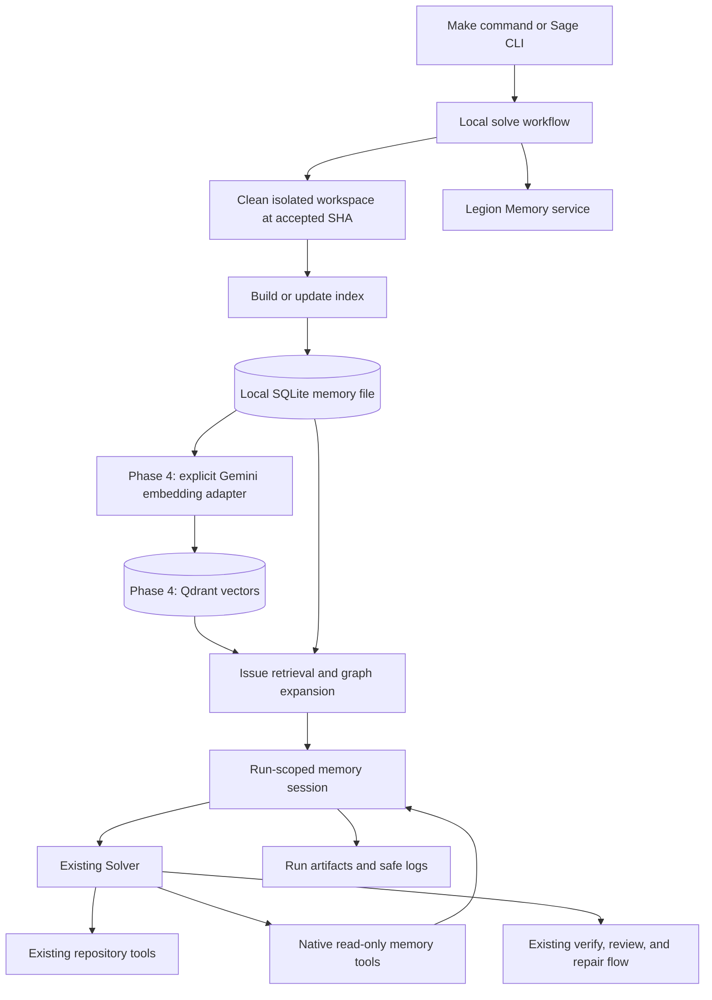

# Legion Memory Implementation Plan

## Document status

> **Status:** Phases 1-3 have local implementations and tests. Phase 4
> (embedding integration and reference-behavior alignment) has an initial local
> implementation; remaining parity and evaluation gates are tracked in section 8.
> Phase 5 (GitHub Actions) remains deferred. Implementation is not proof of
> measured token/tool savings or complete reference parity.
>
> **Updated:** 7 September 2026
>
> **Sage baseline audited:** `528ea6c` on `legion`
>
> **Reference inspected:** local `code-review-graph/` source, package version
> 2.3.8. The original plan recorded `b586687`; the current reference directory
> has no independent Git checkout, so that revision cannot be verified from
> it. Section 2 records the audited files and reproducibility requirements.
>
> **Current Sage architecture source of truth:**
> [`../docs/architecture.md`](../docs/architecture.md)
>
> **Current Sage testing source of truth:**
> [`../docs/testing.md`](../docs/testing.md)

This specification plans a local code-memory capability named **Legion
Memory**. It covers the native graph engine, retrieval, and local Sage
integration in Phases 1 through 3, followed by Gemini Embedding 2 and Qdrant
integration in Phase 4. Phase 5, GitHub Actions integration, is
deliberately deferred and is not designed here.

This document remains the phased plan. Sections 5-7 retain the original
implementation milestones, with current command names corrected. The audit in
section 2 distinguishes implemented behavior from outstanding parity work;
section 8 records the initial embedding implementation and outstanding work.
The section 2 audit describes the pre-Phase-4 baseline, not today's implementation.

---

## 1. Objective

Legion Memory will give Sage a rebuildable, repository-specific knowledge
graph that helps the Solver locate relevant code, relationships, tests,
execution paths, and architectural regions before it edits a repository.

The intended local flow is:

```text
local Issue solve
  -> prepare the clean workspace at the accepted base SHA
  -> call the one build-or-update operation
  -> open the requested local SQLite memory file
  -> synchronize Gemini node embeddings to Qdrant when explicitly enabled
  -> retrieve bounded Issue-relevant lexical/vector/graph context
  -> log whether useful memory was found
  -> run the normal Solver with native read-only graph tools
  -> fall back to the existing repository tools when memory is unavailable
  -> verify and review the Git-derived candidate as today
```

The feature must satisfy these end-state requirements:

1. `build_or_update_graph_tool` is the only build entry point. Its caller does
   not decide whether the database is cold or warm. The implementation selects
   a full build, incremental update, or no-op from database and Git provenance.
2. The graph is stored in one local SQLite file supplied or resolved by Sage.
   SQLite remains authoritative for graph structure and provenance. Phase 4
   adds Qdrant for derived vectors, not as a replacement graph database.
3. Graph operations are native Python capabilities and LangChain tools inside
   Sage. Sage does not launch, configure, or call an MCP server.
4. Every memory-enabled run attempts graph build/update before the first model
   call and against the clean workspace's exact accepted base SHA.
5. Retrieval is bounded, provenance-bearing, and safe to place in the Solver's
   untrusted context envelope.
6. A missing hit, unreadable database, locked database, unsupported schema,
   parser failure, or retrieval failure does not prevent a normal local solve.
   Sage logs the reason and continues with its existing repository tools.
7. Logs and a run artifact state consistently whether memory was available,
   retrieved, actually exposed to the Solver, or bypassed.
8. Graph results are graph-derived navigation context, not source truth. The
   Solver must read current files before planning or editing; repository
   source and Git state continue to outrank the graph.
9. Legion Memory is a rebuildable repository-index capability; hosted
   embeddings are an explicitly configured external adapter. It does not
   become a LangGraph checkpoint, workflow state store, agent transcript, or
   second solve architecture.
10. The local result remains a verified and reviewed candidate suitable for a
    future draft pull request. Creating the actual GitHub draft pull request is
    Phase 5 and remains out of scope here.
11. Match the reference's relevant indexing, hybrid ranking, and progressive
    context behavior, with fixture-backed parity. Native tools, accepted-SHA
    isolation, Gemini Embedding 2, and Qdrant are intentional differences.
    Different embedding models cannot promise identical rankings; fewer
    tokens/tool calls is an evaluation objective, not a guaranteed outcome.

---

## 2. What is being reused from `code-review-graph`

The reference project is MIT-licensed. If implementation code is copied or
substantially adapted, Sage must preserve the required copyright and license
notice in an appropriate `NOTICE` or third-party license file. The
implementation should pin its comparison to the inspected commit instead of
silently following the reference repository's moving `main` branch.

The useful reference concepts are:

| Reference concept | Legion Memory decision |
| --- | --- |
| SQLite `nodes`, `edges`, `metadata`, indexes, migrations, and WAL mode | Adapt into a small Sage-owned store with explicit schema versioning |
| Tree-sitter symbol and relationship extraction | Reuse the parsing design after fixing the initial language scope |
| Git-aware full build and incremental update | Preserve one public build/update entry point and safe full-rebuild fallback |
| Atomic per-file replacement and deleted-file reconciliation | Preserve so a failed update cannot leave half of a file indexed |
| FTS5 search with exact identifier and path boosts | Use as the deterministic first retrieval layer |
| Optional vector search and reciprocal-rank fusion | Implement in Phase 4 using explicit Gemini Embedding 2 configuration and Qdrant |
| Directed impact traversal with edge weights and hard limits | Adapt with deterministic limits and truncation metadata |
| Stored flows, communities, architecture summaries, hubs, and gaps | Include only the portions selected in the Phase 1 tool manifest |
| Git SHA provenance and cautious confidence for empty results | Preserve; an empty result must not be described as proof of absence |
| MCP wrappers, server, installation, prompts, and transport | Do not port |
| Watch daemon, registry, cross-repository search, wiki, and editor integration | Do not port in Phases 1-3 |
| `memory.py` Q&A-to-Markdown helper | Do not treat as working retrieval; it is not connected to the reference graph pipeline |

Directly depending on the full `code-review-graph` distribution is not the
recommended design. It would bring MCP, FastMCP, watcher, and other runtime
surfaces that Sage does not need. Prefer adapting the smallest deterministic
core into Sage, with attribution, unless the dependency analysis proves that a
smaller supported library surface exists.

### 2.1 Reference audit and parity boundary — 6 September 2026

The audit follows actual call paths, not the number of similarly named tools:

- Creation: `parser.py`, `incremental.py`, `graph.py`, `postprocessing.py`,
  `tools/build.py`, `flows.py`, and `communities.py` in
  `code-review-graph/code_review_graph/`.
- Retrieval: `embeddings.py`, `search.py`, `tools/query.py`,
  `tools/context.py`, `tools/review.py`, `analysis.py`, and `prompts.py`.
- Auxiliary behavior: `main.py` (30 MCP registrations), `enrich.py`,
  `context_savings.py`, `memory.py`, and the retrieval/token benchmark modules
  under `eval/`. Editor hooks and MCP prompt transport are not Sage runtime
  dependencies; useful context-selection behavior can be adapted natively.
- Legion comparison: `sage/legion_memory/{parsing,store,service,retrieval,session}.py`,
  `sage/agents/{memory_tools,prompts}.py`, `sage/domain/memory.py`, Make targets,
  and tests under `apps/agent/tests/legion_memory/`.

All reference paths above are relative to the ignored local reference copy.
Its upstream is [tirth8205/code-review-graph](https://github.com/tirth8205/code-review-graph).
Do not mistake `git -C code-review-graph rev-parse HEAD` for an upstream
revision: here it resolves the parent Sage repository. Audit fingerprints:

```text
embeddings.py SHA256 1f5a79e692822d608abda77b330f23eb7d206695f451da93eaa8ae1fdb183636
search.py     SHA256 7a9d22505740c50b0b2389149222c2b334107e81924519a527760c84fd2048b9
parser.py     SHA256 e35c74456d26ecdd76d94fedb9f4ec1289b0dd086523813162ea38c20f8077f4
```

Before porting, freeze a reproducible upstream commit or source archive with
checksums for **all** adopted modules and test fixtures; preserve attribution
in the existing `THIRD_PARTY_NOTICES.md`. The audit is of this local source,
not a claim of parity with every future upstream release.

### 2.2 What the reference actually does, and current mismatches

The reference embeds non-File graph nodes, not arbitrary whole-file chunks or
past agent conversations. `_node_to_text` combines symbol/parent names,
split identifiers, kind, parameters, return type, bounded documentation,
directory, and language. `EmbeddingStore` skips unchanged text/provider
identities, stores float vectors in SQLite, removes orphans, and searches by
cosine similarity. Its Google adapter defaults to `gemini-embedding-001`, not
Embedding 2. Qdrant is therefore a requested Legion storage adaptation, not
an upstream dependency to copy.

`search.hybrid_search` gathers FTS and vector candidates, over-fetches three
times the requested limit, applies reciprocal-rank fusion (RRF, constant 60),
then query-kind, identifier, and context-file boosts. It reports hybrid,
FTS-only, semantic-only, keyword fallback, or no results. The low-level
`embeddings.semantic_search` helper is **not** the complete MCP search path.
The build wrapper refreshes existing embeddings only with an explicit
provider/model; initial embedding is a separate operation. Default graph
builds do not automatically pay for embeddings.

| Area and evidence | Current Legion difference | Phase 4 disposition |
| --- | --- | --- |
| `embeddings.py`; Legion has no embedding adapter/index | No document or query vectors, cache identity, or semantic candidates | Implement Gemini/Qdrant lifecycle in 4B-4D |
| `search.py` versus `store.search` and `retrieval._score_lexical` | Legion uses OR-token FTS, additive exact-name/path weights, and a separate Issue scorer; no RRF. Reference FTS quotes the query as a phrase | Share a reference-compatible ranked-search core; fixture the phrase/OR difference and label any retained Issue-specific expansion |
| `retrieval.retrieve_issue_context` | Returns early when there are no lexical candidates; semantic-only matches could never reach expansion | Fuse before choosing seeds or deciding no-match; replace the lexical score threshold, not just the candidate source |
| `_node_to_text` versus Legion `parsing._Extractor` | Legion stores a signature but does not populate structured parameters/return types, docstring summaries, or framework decorators | Add bounded metadata extraction before embedding; version the text recipe and parser |
| Reference parser/resolver families versus `store._resolve_edge_targets` | Legion mostly resolves unique names/same-file targets and simple imports; it lacks the reference's richer language/framework resolution. `references_to` exists without `REFERENCES` extraction in the current parser | Port evidence-backed resolution and emitted edge kinds with fixtures; expose unresolved/unsupported coverage honestly |
| Reference `flows.py` versus `_rebuild_flows` | Reference excludes tests by default, recognizes decorators, skips singleton flows, defaults to depth 15, and scores several risk factors. Legion includes trivial roots, limits depth to 8 / entries to 200, and uses a simpler size/security score | Align entry eligibility, flow membership, and criticality; keep explicit safety caps and truncation evidence |
| Reference `communities.py` versus `_rebuild_communities` | Reference has weighted Leiden with file-based fallback, test reassignment, oversized-community splitting, and richer naming; Legion uses NetworkX Louvain or file groups | Align behavior and test membership/cohesion; evaluate the optional igraph dependency explicitly, do not call Louvain identical to Leiden |
| `analysis.py` versus service analysis tools | Legion knowledge gaps cover untested functions only, not isolated nodes/thin communities; bridge approximation thresholds and graph populations differ | Port the missing analyses and fixture node inclusion, scores, ordering, and approximation policy |
| `tools/query.py` versus `query_graph_tool` | Same names do not ensure matching query patterns, disambiguation, confidence, or result envelopes | Build a pattern/edge coverage matrix, including event/config/framework patterns where supported; return explicit unsupported status for unported patterns |
| `tools/context.py`, `tools/review.py`, `prompts.py` | Legion lacks upstream detail levels, task-sensitive next-tool guidance, change-risk context, and targeted source-snippet composition | Implement compact-first context and selected read-only context tools; reuse Sage source-read/diff boundaries |
| `enrich.py` editor search/read hooks | Sage has no equivalent automatic graph enrichment on repository reads | Adapt the useful behavior only as bounded, deduplicated native/session enrichment; never port editor hook transport |
| `context_savings.py` and reference evals | Upstream estimates context savings; Legion records actual solve usage but has no embedding usage or three-way benchmark | Keep actual provider usage authoritative; separately report estimates, indexing/query cost, latency, and quality |
| `incremental.py` versus Legion committed-blob inventory | Upstream can index working-tree changes; Legion indexes the accepted committed snapshot | Intentional safety difference. Preserve base-SHA provenance and current-source checks during edits/repair |
| `memory.py` | Q&A Markdown helpers are not a verified episodic-retrieval pipeline | No transcript/episode memory in this phase; embeddings alone do not add learning from completed solves |

These are source-level findings, not results of a live comparative benchmark.
Embeddings cannot repair missing edges, poor community membership, or oversized
tool responses by themselves. Existing flows/communities already participate
in Legion's Issue expansion, so their differences can change retrieved code.

### 2.3 Account for all 30 reference tools

Legion currently has **15 Solver-bound read-only tools plus one native
workflow/CLI build operation = 16 counterparts**. Fourteen reference tools
have no direct native counterpart. They are not all irrelevant:

| Missing reference tools | Relevance and planned handling |
| --- | --- |
| `embed_graph_tool`, `run_postprocess_tool` | Index creation/maintenance: implement equivalent service capabilities behind the single build entry point; do not add model-controlled writes or require users to choose cold/warm paths |
| `get_review_context_tool`, `detect_changes_tool` | Relevant to bug impact, tests, and compact source context: add bounded native read-only equivalents, reusing Sage's existing diff/source capabilities; do not change independent Reviewer gates |
| `find_large_functions_tool`, `get_surprising_connections_tool`, `get_suggested_questions_tool` | Useful diagnostic navigation, though not mandatory for every Issue: port deterministic capabilities with focused tests and selective exposure |
| `refactor_tool` | Includes useful dead-code analysis, suggestions, and rename previews; port analysis/preview behavior through existing plan/source boundaries, without upstream's persisted apply-token workflow |
| `apply_refactor_tool` | Mutation, not retrieval/indexing: use Sage's existing structured edit tools and verification instead of adding a second write path |
| `get_docs_section_tool` | Reference tool documentation, not repository-memory creation: replace with Sage-native tool descriptions/docs; do not return MCP-specific instructions |
| `generate_wiki_tool`, `get_wiki_page_tool` | Separate generated-documentation workflow; not consumed by the inspected node-embedding/search pipeline. Remain excluded from the single-repository Issue engine |
| `list_repos_tool`, `cross_repo_search_tool` | Multi-repository registry/search, outside the selected-repository boundary. Remain excluded; repository isolation is required |

Porting a capability does not require exposing every tool in every Solver
prompt. Measure schema-token overhead and use explicit native capability sets
without introducing another runtime. Exact **30-tool product parity** would
also require the excluded documentation, registry, and mutation workflows;
this plan targets reference memory behavior with the above declared
differences, not an unqualified claim of a byte-for-byte clone.

---

## 3. Scope and non-goals

### 3.1 In scope for Phases 1-3

- one local SQLite graph for one repository;
- schema creation and forward migrations;
- full, incremental, and no-change indexing behind one operation;
- symbol, file, call, import, containment, inheritance, reference, and test
  relationships for the selected languages;
- FTS5/keyword retrieval, graph expansion, impact analysis, flows,
  communities, and architecture summaries selected for the native tool set;
- native Solver tool adapters with hard response limits;
- explicit build and retrieval provenance;
- graceful no-memory fallback;
- local CLI and Make commands;
- run artifacts and user-friendly logging;
- deterministic tests and a controlled local live-solve evaluation.

### 3.2 Explicitly out of scope

- MCP clients, servers, configuration, or transport;
- GitHub Actions memory persistence, cache restore/save, workflow inputs,
  diagnostic uploads, status comments, or publication changes;
- actual draft-PR creation as part of the local command;
- a daemon, file watcher, background process, or repository registry;
- cross-repository querying;
- arbitrary SQL exposed to the model;
- graph-backed mutation or refactoring tools that bypass Sage's existing plan
  and structured mutation gates;
- storing credentials, full model transcripts, or private provider payloads;
- treating memory as authoritative evidence without checking the source;
- automatic provider discovery, model substitution, or hidden network calls;
- a new runtime selector, orchestration graph, or agent role.

### 3.3 Added scope for Phase 4

- explicitly enabled `gemini-embedding-2` document/query embeddings;
- Qdrant vector persistence alongside the existing SQLite graph;
- content-hash reuse, stale/deleted-vector reconciliation, restart recovery;
- shared FTS/vector rank fusion for initial retrieval and native search;
- reference-relevant parser, graph analysis, and compact-context parity;
- embedding-specific logs, usage accounting, failure tests, and three-way
  no-memory / lexical-memory / hybrid-memory evaluation.

---

## 4. Target architecture



### 4.1 Ownership

The original ownership sketch is below. In the current implementation,
`service.py` owns indexing and graph queries, `store.py` owns derived graph
processing, and `session.py` owns run-local memory use. The sketched
`indexing.py`, `postprocessing.py`, and `analysis.py` are not existing modules;
extract them only when the Phase 4 work needs a focused owner.

```text
apps/agent/src/sage/
  domain/
    memory.py                  # stable build, retrieval, and usage contracts
  legion_memory/
    store.py                   # SQLite connection, queries, and transactions
    migrations.py              # ordered schema migrations
    parsing.py                 # parser facade and normalized parser output
    indexing.py                # Git inventory, hashing, full/incremental build
    postprocessing.py          # FTS, flow, community, and summary refresh
    retrieval.py               # Issue ranking and bounded graph expansion
    analysis.py                # impact, flow, community, and architecture queries
    service.py                 # narrow workflow/tool-facing capability
  agents/
    memory_tools.py            # LangChain adapters only
```

Existing owners change narrowly:

| Existing file | Planned responsibility |
| --- | --- |
| `sage/composition.py` | Construct the concrete Legion Memory service explicitly |
| `sage/workflows/solve.py` | Prepare memory after the clean workspace exists and before the first model call |
| `sage/orchestration/context.py` | Carry an optional run-scoped memory session, not a global database singleton |
| `sage/agents/solver.py` | Bind selected memory adapters beside existing repository tools |
| `sage/agents/prompts.py` | Tell the Solver how to use and verify graph evidence |
| `sage/artifacts/files.py` and `store.py` | Persist one bounded memory-usage artifact |
| `sage/observability.py` | Render stable build/retrieval/usage panels |
| `sage/domain/solve.py` | Carry an optional memory-file request without coupling domain code to SQLite |
| `sage/cli.py` | Add memory build/status commands and local solve argument wiring |
| `sage/config.py` | Own only genuine tunables such as time and output budgets |

`sage/legion_memory` may depend on the standard library, its selected parser
and graph libraries, and Sage domain contracts (including injected embedding
and vector-store interfaces in Phase 4). It must not import agents,
orchestration, workflows, CLI, GitHub integration, providers, or Docker.
Agent adapters call the service; they do not contain graph algorithms or SQL.

### 4.2 Database placement and identity

The recommended default is outside the target repository:

```text
<sage-root>/.sage/legion-memory/<repo-name>-<identity-hash>/graph.sqlite3
```

This preserves Sage's guarantee that the source checkout is not mutated. Add
`.sage/legion-memory/` to `.gitignore`. `--memory-file` overrides the default
with an explicit local path.

The database must bind itself to a stable repository identity and record the
indexed Git SHA. Graph node paths must be repository-relative POSIX paths, not
run-directory absolute paths, because every Sage run has a new workspace.
Opening a database whose repository identity does not match the selected
repository must never return results from the wrong codebase.

### 4.3 Initial schema

The first migration should provide, at minimum:

- `metadata`: schema version, repository identity, indexed SHA, build state,
  build type, timestamps, parser version, and selected language set;
- `nodes`: stable qualified identity, kind, name, relative path, line range,
  language, parent, signature/parameters/return type, test marker, file hash,
  bounded JSON metadata, and update time;
- `edges`: kind, source and target qualified identities, source path and line,
  confidence/tier, bounded JSON metadata, and update time;
- indexes for file, kind, qualified identity, source, target, and edge kind;
- `nodes_fts`: SQLite FTS5 index over name, qualified name, path, and signature;
- `flows` and `flow_memberships` if flow tools are in the accepted manifest;
- `communities` and node community membership if architecture tools are in the
  accepted manifest; and
- optional precomputed summary/risk tables only when a selected tool consumes
  them.

Use parameterized SQL, explicit transactions, WAL mode, bounded busy timeout,
foreign-key enforcement where practical, and context-managed connections.
Set the new `indexed_sha` and `ready` state only after parsing and required
post-processing complete. A failed update must leave the previous ready graph
usable or mark the new state unavailable; it must not advertise partial data as
current.

### 4.4 Build/update contract

`build_or_update_graph_tool(repo_root, memory_file, ...)` must:

1. validate and resolve the repository and database paths without allowing a
   graph node path to escape the selected repository;
2. inspect database schema, repository identity, prior indexed SHA, current
   accepted SHA, and parser/schema versions;
3. choose internally between full build, incremental update, or no-op;
4. use tracked files plus documented include/exclude rules;
5. parse added and changed files, reconcile deleted/renamed files, and refresh
   direct dependants only when the parser design requires it;
6. atomically replace each affected file's nodes and edges;
7. run the selected deterministic post-processing exactly once;
8. commit ready provenance only after success; and
9. return a typed, bounded result containing build type, counts, SHA, duration,
   warnings, and safe failure reason.

The caller never contains separate cold-start and warm-start branches. A
missing/empty database, unusable incremental base, repository mismatch,
incompatible parser identity, or unsupported migration causes the tool to make
the safe decision defined by its contract. It must never quietly reuse stale
or foreign graph data.

### 4.5 Native tool manifest

Phase 1 begins by freezing a manifest. The recommended initial manifest is the
read-only subset that directly helps issue solving:

| Tool | Bound to Solver? | Purpose |
| --- | --- | --- |
| `build_or_update_graph_tool` | No; workflow/CLI invokes it | Build/update before a run without spending a model turn |
| `list_graph_stats_tool` | Yes | Report health, scope, SHA, and counts |
| `get_minimal_context_tool` | Yes | Return a compact starting map for a task |
| `semantic_search_nodes_tool` | Yes | Search FTS/keyword and report the actual search mode |
| `query_graph_tool` | Yes | Query callers, callees, imports, importers, children, tests, inheritance, references, and file summaries |
| `traverse_graph_tool` | Yes | Run bounded directional traversal from a resolved node |
| `get_impact_radius_tool` | Yes | Rank affected nodes/files using directed weighted edges |
| `list_flows_tool` / `get_flow_tool` | Yes | Discover and inspect bounded execution paths |
| `get_affected_flows_tool` | Yes | Relate likely changed files or selected paths to flows |
| `list_communities_tool` / `get_community_tool` | Yes | Inspect stored architectural regions |
| `get_architecture_overview_tool` | Yes | Return a compact community/bridge overview |
| `get_hub_nodes_tool` / `get_bridge_nodes_tool` | Yes | Identify hotspots and chokepoints |
| `get_knowledge_gaps_tool` | Yes | Report untested or structurally uncertain hotspots |

Every tool must have typed arguments, a typed internal result, a JSON-safe
rendering, explicit total/returned/omitted counts, hard result and character
ceilings, graph provenance, and a status value. Tools must not accept arbitrary
SQL or arbitrary filesystem paths. Empty results include confidence/provenance
language and never assert that a relationship does not exist.

Do not initially bind build, post-processing, embedding, apply-refactor,
write-memory, or database-maintenance operations to the Solver. Keeping the
build operation native to Sage does not require letting a model invoke an
expensive write after the workflow already ran it.

### 4.6 Retrieval and fallback contracts

The workflow-level retrieval result should use explicit states:

```text
used          useful bounded context was retrieved and exposed
no_match      graph is ready, but no useful Issue match passed the threshold
unavailable   graph could not be built, opened, validated, or queried safely
disabled      this invocation did not request Legion Memory
```

`no_match` and `unavailable` both continue into the existing Solver with the
normal repository tools. The difference remains visible in logs and artifacts.
Do not catch `KeyboardInterrupt`, cancellation, or unrelated programming
errors as ordinary no-memory fallbacks. Catch only the Legion Memory error
taxonomy at the workflow boundary.

Standalone build commands are stricter: invalid input or a failed build exits
non-zero. Graceful fallback belongs to a solve whose primary objective is
fixing an Issue, not to a command explicitly asked to build a database.

---

## 5. Phase 1 — Native graph engine, tools, tests, and manual build

### 5.1 Freeze the extraction and tool contract

Before porting code:

1. record the inspected reference commit and the exact modules/algorithms being
   adapted;
2. decide the language set and native tool manifest from the open questions;
3. make a license/attribution inventory;
4. prove proposed parser packages and versions install and import on Sage's
   required Python 3.14 runtime;
5. compare each new dependency against a standard-library or existing-package
   alternative; and
6. explicitly exclude MCP, FastMCP, watchdog, daemon, registry, wiki,
   refactoring, and editor code from the import graph.

Expected production dependencies are SQLite from the standard library plus
Tree-sitter and a grammar provider. Add NetworkX only if the accepted impact,
community, or centrality implementation materially needs it. Do not add
sentence-transformers, igraph, or an embeddings SDK in Phase 1.

### 5.2 Implement storage and migrations

- Add the domain contracts and Legion Memory error taxonomy.
- Implement schema creation and ordered forward migrations.
- Implement repository identity and exact-SHA provenance.
- Implement atomic node/edge replacement, removal, and indexed reads.
- Implement FTS5 creation/rebuild with an atomic failure path.
- Add connection timeouts, WAL, cleanup, and deterministic serialization.
- Treat a user-supplied database as untrusted local input: validate schema and
  bound all decoded JSON and returned text.

### 5.3 Implement parsing and the single build/update path

- Normalize parser output into `NodeRecord` and `EdgeRecord` before it reaches
  SQLite.
- Inventory only selected tracked text files; skip the memory file, `.git`,
  generated dependencies, binary content, and configured exclusions.
- Make qualified identities stable across disposable Sage workspaces.
- Implement cold full build, SHA-based incremental change detection,
  add/change/delete/rename reconciliation, and no-change detection internally.
- Fall back to a full rebuild when the stored base SHA is unavailable after a
  rebase/history rewrite or parser/schema identity is incompatible.
- Persist parse errors as bounded warnings and define whether one failed file
  invalidates the build or produces a ready graph with declared gaps.
- Run FTS and accepted flow/community post-processing after graph writes.

### 5.4 Implement the accepted native tools

- Put graph algorithms in `legion_memory`, not in `agents`.
- Add thin LangChain adapters in `agents/memory_tools.py`.
- Return structured error statuses for expected graph problems.
- Attach repository identity, indexed SHA, build age, search mode, truncation,
  and confidence to relevant responses.
- Use repository-relative paths and bounded line locators. The Solver retrieves
  actual source through the existing `read_file` tool.
- Verify that no graph tool can mutate repository files or bypass the saved-plan
  gate.

### 5.5 Add CLI and Make commands

Add native commands such as:

```bash
uv run --project apps/agent sage memory build \
  --repo /absolute/path/to/repo \
  --memory-file /absolute/path/to/graph.sqlite3

uv run --project apps/agent sage memory status \
  --repo /absolute/path/to/repo \
  --memory-file /absolute/path/to/graph.sqlite3
```

Expose the build through the repository's established Make variable style:

```bash
make legion-memory REPO=/absolute/path/to/repo
make legion-memory REPO=/absolute/path/to/repo \
  MEMORY_FILE=/absolute/path/to/graph.sqlite3
```

GNU Make treats `make legion-memory <repo>` as two targets, not as a positional
argument. The variable form above is the recommended equivalent. The command
must print the resolved memory file, build type, indexed SHA, files parsed,
node/edge totals, warnings, duration, and a clear success/failure result.

### 5.6 Automated tests

Add mirrored tests under `apps/agent/tests/legion_memory/`:

- `test_store.py`: schema, migrations, constraints, WAL, transactions,
  concurrent read behavior, repository mismatch, unsupported schema, corrupt
  data, and rollback;
- `test_parsing.py`: fixture extraction for every accepted language, stable
  identities, test detection, source ranges, calls/imports/inheritance, syntax
  errors, and binary/unsupported files;
- `test_indexing.py`: cold build, repeated no-op, incremental add/change/delete/
  rename, stale SHA, history rewrite, ignored files, failed file, failed
  post-processing, and previous-ready-graph preservation;
- `test_search.py`: FTS rebuild, identifier/path/signature matching, keyword
  fallback, special characters, SQL-injection-shaped input, ranking, and hard
  limits;
- `test_analysis.py`: direction and weight semantics, cycles, ambiguity,
  transitive tests, flows, communities, hubs, gaps, truncation, and deterministic
  output;
- `test_tools.py`: every accepted tool's schema, adapter wiring, provenance,
  no-graph/stale-graph/empty-result behavior, and output bounds;
- updates to `test_cli.py`, `test_makefile.py`, `test_composition.py`, and
  `test_architecture.py` for command and ownership contracts.

Tests must use temporary repositories and SQLite files. They must not use a
live model, network, paid embeddings, the reference project's MCP server, or a
developer's real cache.

### 5.7 Manual Phase 1 check

Run the command against both a tiny fixture repository and the Sage repository:

1. build a new database and confirm non-zero file/node/edge counts;
2. inspect `memory status` and a small set of parameterized SQLite queries;
3. run the same build again and confirm `no_change` without duplicate rows;
4. modify, add, rename, and delete fixture files in separate commits;
5. rerun the same command and confirm only the correct graph data changes;
6. query a known function's callers, callees, imports, tests, flow, and
   community;
7. confirm the target repository's Git status is unchanged; and
8. corrupt or lock a copied test database and confirm the command fails clearly
   without damaging the last good database.

### 5.8 Phase 1 exit criteria

- Every tool in the frozen manifest has direct passing tests.
- `make legion-memory REPO=...` creates a usable SQLite graph.
- The same command handles first build, update, and no-change paths.
- Manual queries match source inspection for the selected fixtures.
- No MCP process, network call, provider credential, or source-repository
  mutation occurs.
- Focused tests, `make check`, and `make graph` pass.
- `docs/architecture.md` and `docs/testing.md` describe the implemented engine,
  commands, supported languages, database location, and troubleshooting.

---

## 6. Phase 2 — Issue-relevant memory retrieval and tests

### 6.1 Define one retrieval service

Add a deterministic operation such as:

```text
retrieve_issue_context(issue_text, graph_snapshot, budgets) -> MemoryRetrievalResult
```

It should:

1. normalize the Issue without treating Issue text as instructions to the
   memory engine;
2. extract path-like text, qualified names, identifiers, error tokens, and
   useful natural-language terms;
3. retrieve FTS5/keyword candidates and report the actual search mode;
4. boost exact identifiers, paths, symbols, tests, and current context files;
5. expand only the best seeds through bounded callers, callees, imports,
   tests, flows, and communities;
6. rank and deduplicate related paths and symbols;
7. attach graph SHA, scores/reasons, relationship evidence, confidence, and
   omitted counts; and
8. render a compact context under both result-count and character budgets.

The result should distinguish:

- graph unavailable;
- graph ready but no lexical candidates;
- candidates found but below the usefulness threshold;
- useful context returned; and
- useful context truncated by budget.

Retrieval output should identify why each item was selected, for example
`exact_identifier`, `path_match`, `fts`, `caller_of`, `test_for`,
`same_flow`, or `same_community`. This makes local evaluation and user-facing
logs explainable.

### 6.2 Retrieval test corpus

Create small, deterministic fixture repositories plus Issue texts covering:

- an exact function/class/configuration identifier;
- an explicit file path;
- a natural-language bug description with related symbol vocabulary;
- a caller/callee relationship not named directly in the Issue;
- a test related through `TESTED_BY` or naming inference;
- an architectural issue that should surface a community or flow;
- ambiguous duplicate names;
- unsupported-language and parser-gap cases;
- irrelevant terms that should return `no_match`;
- stale, empty, corrupt, locked, foreign-repository, and unsupported-schema
  databases; and
- oversized graphs/results that must be truncated deterministically.

For each positive case, record expected relevant paths/symbols and an allowed
rank window rather than brittle full JSON snapshots. Measure at least top-k
recall, reciprocal rank, returned characters, and query duration. Compare:

```text
FTS/keyword only
  versus
FTS/keyword plus graph expansion
```

Phase 2 is the lexical-plus-graph baseline. Embeddings are now explicitly
requested and planned in Phase 4; do not retroactively describe Phase 2's
“semantic” tool name as evidence that vectors already exist.

### 6.3 Failure and security tests

- All SQL remains parameterized for adversarial Issue text.
- Retrieved text is bounded and tagged as untrusted data.
- Node paths cannot escape the selected workspace.
- Invalid JSON metadata, invalid line ranges, or unknown edge kinds are ignored
  or surfaced safely.
- One failed expansion does not discard valid primary hits.
- `no_match` is not logged as a graph failure.
- A graph whose indexed SHA differs from the accepted base is never exposed as
  current memory.
- Retrieval does not make a model or network call.

### 6.4 Phase 2 exit criteria

- Retrieval returns the expected relevant path/symbol within the agreed top-k
  window for every positive fixture.
- Negative fixtures return an explicit bounded `no_match` result.
- Graph expansion improves or preserves the lexical baseline on the fixture
  corpus.
- All failure modes return stable statuses and reasons.
- Query time and response size stay within configured budgets on the chosen
  representative repository.
- Focused retrieval tests and `make check` pass.
- The testing guide contains a reproducible retrieval check with expected
  output fields.

---

## 7. Phase 3 — Local Solver integration and memory-assisted solve evaluation

### 7.1 Wire memory into the local workflow

Add an optional `memory_file` to the local solve request and CLI. Keep SQLite
types out of the domain request. The local workflow should:

1. read the Issue and prepare the existing clean workspace;
2. initialize run artifacts;
3. call the Legion Memory build/update service against that workspace and the
   accepted base SHA;
4. attempt Issue retrieval from the resulting ready graph;
5. construct a run-scoped `MemorySession` containing only the validated graph
   handle/provenance, retrieval result, and usage recorder;
6. place the optional session in `SolveContext`;
7. start the sandbox and the existing orchestrator; and
8. close memory/database resources during workflow cleanup on every path.

The graph is a snapshot of the accepted base. Solver mutations occur after the
build, so every graph response must continue to label that base SHA. Repair
sessions may reuse base-architecture memory, but must read current workspace
files and current Git diff before acting. Do not silently describe the graph as
including in-run edits.

### 7.2 Expose memory to the Solver

- Add the accepted read-only memory tools to `build_solver_tools` only when a
  valid `MemorySession` exists.
- Include the compact initial retrieval result in a clearly delimited
  `<untrusted-legion-memory>` section of the initial Solver message when status
  is `used`.
- Tell the Solver to start from memory locators, verify them through repository
  reads, and fall back to `list_tree`, `search_text`, and `read_file` when the
  graph is empty, uncertain, or stale.
- Do not add memory tools to the Reviewer. The Reviewer must continue judging
  the actual plan, Git diff, and verification evidence.
- Do not let retrieved content satisfy the saved-plan gate or acceptance
  criteria by itself.
- Record each native memory tool call's name, status, hit count, returned
  paths, duration, and output truncation without storing raw model arguments or
  full source bodies.

### 7.3 Graceful fallback behavior

The workflow must attempt build and retrieval before the model, then choose one
of these visible paths:

| Condition | Solver behavior | Required log/artifact state |
| --- | --- | --- |
| Useful hits | Include compact context and bind memory tools | `used`, hit count, top paths, indexed SHA |
| Ready graph, no useful hit | Run normal Solver; memory tools may remain available for manual exploration | `no_match`, search mode, zero useful hits |
| Build/open/retrieval unavailable | Run normal Solver without memory tools | `unavailable`, bounded failure category and fallback message |
| Memory not requested | Preserve existing local solve exactly | `disabled` if an artifact is written |

An expected memory failure must not change the solve outcome taxonomy. Provider,
verification, review, and candidate failures keep their existing meanings.

### 7.4 User-friendly logs and artifact

Add stable panels in `sage.observability`, for example:

```text
Legion Memory: graph ready
  ├─ Build: incremental
  ├─ Base: 0123456789ab
  ├─ Files: 4 updated / 218 indexed
  ├─ Graph: 1,842 nodes / 3,901 edges
  └─ Memory file: .../graph.sqlite3

Legion Memory: retrieval
  ├─ Status: used
  ├─ Search: fts + graph expansion
  ├─ Matches: 8 returned / 23 considered
  ├─ Relevant paths: sage/orchestration/solve.py, tests/.../test_solve.py
  └─ Fallback: not needed
```

For no-match or failure paths, emit the same panel fields with `Status:
no_match` or `Status: unavailable` and `Fallback: normal repository
inspection`. Never log the full Issue, source snippets, raw SQLite errors with
sensitive paths, credentials, or database contents.

Persist one bounded `legion-memory.json` run artifact containing:

- schema/format version;
- requested and resolved memory-file identity;
- repository identity and indexed SHA;
- build type/status/counts/duration/warnings;
- retrieval status/search mode/counts/top paths/truncation/duration;
- native memory tool usage summaries; and
- the final `used`, `no_match`, `unavailable`, or `disabled` state.

The artifact is evidence, not control state. Existing authoritative candidate,
verification, review, and terminal artifacts remain unchanged.

### 7.5 Local command

Preserve the existing no-memory command during evaluation and add an explicit
memory-assisted command:

```bash
make legion-solve \
  REPO=/absolute/path/to/repo \
  ISSUE=/absolute/path/to/issue.md \
  MEMORY=/absolute/path/to/graph.sqlite3 \
  BASE_REF=HEAD
```

It should call the same local solve workflow through:

```bash
sage solve --repo ... --issue-file ... --base-ref ... --memory-file ...
```

The command must build/update the supplied graph before the model call. It must
print the run directory and the Legion Memory status. A completed run still
uses Sage's existing Git-derived candidate, deterministic verification, and
independent review gates.

### 7.6 Automated integration tests

Add tests proving:

- the build/update call occurs once, after exact-SHA workspace preparation and
  before the first Solver call;
- useful retrieval is included in the initial prompt and memory tools are
  bound;
- the Solver verifies memory locators through repository reads in a scripted
  tool-loop test;
- `no_match`, missing file, corrupt file, lock timeout, parser failure, and
  retrieval failure all continue through the normal Solver path;
- memory-specific exceptions do not hide cancellation or unrelated defects;
- base-SHA mismatch blocks graph use;
- tool results retain base-snapshot provenance after Solver mutation and during
  repair;
- Reviewer inputs and capabilities remain unchanged;
- `legion-memory.json` and log panels are stable, bounded, and secret-safe;
- existing `sage solve` argument behavior remains compatible;
- `legion-solve` validates `REPO`, `ISSUE`, and `MEMORY`; and
- sandbox/database resources close on success and failure.

### 7.7 Local memory-assisted evaluation

Use at least two real local Issues whose relevant code is present in the graph:

1. build the database with `make legion-memory`;
2. record deterministic retrieval output before any live model call;
3. run the Issue once through the existing no-memory command and once through
   `make legion-solve` with the same base SHA, models, budgets, and Issue;
4. inspect logs and `legion-memory.json` to prove whether the Solver received
   and called memory;
5. compare relevant paths found, repository-read calls, model turns, input
   tokens, elapsed time, outcome, verification, review, and candidate diff;
6. verify the memory-assisted result is a completed, non-empty, verified,
   reviewed candidate; and
7. repeat a no-match/failure case and confirm it behaves as a normal run.

Because live model runs are nondeterministic, one faster or cheaper run is not
proof of general improvement. Phase 3's hard gate is correct use and graceful
fallback without quality regression. Keep the comparison record as evaluation
evidence and expand the case set before making memory the default.

### 7.8 Phase 3 exit criteria

- `make legion-solve REPO=... ISSUE=... MEMORY=...` works locally.
- Every memory-enabled run attempts the single build/update operation before
  the first model call.
- Useful memory is visibly retrieved, passed to the Solver, and verified
  against source in the controlled live case.
- No-hit and unavailable-memory cases still execute the normal Solver path.
- Logs and `legion-memory.json` clearly state where memory was or was not used.
- The candidate passes existing deterministic verification and independent
  review; memory cannot bypass either gate.
- Focused tests and the canonical checks pass:

  ```bash
  make check
  make graph
  make github-smoke
  make github-doctor
  ```

- The local live evaluation is reported truthfully as run, failed, or not run.
- `docs/architecture.md` and `docs/testing.md` are updated with the final local
  behavior and reproducible commands.

---

## 8. Phase 4 — Gemini Embedding 2, Qdrant, and memory-behavior parity

**Status: initial local implementation, 7 September 2026; not all exit criteria
are complete.** Gemini/Qdrant configuration, generation publication/reuse,
shared hybrid search, semantic-only seeds, compact relationship context,
weighted Leiden and selected Python/JS parsing/flow improvements are now
implemented with offline tests. Current commands and limits are documented in
`docs/testing.md`. Remaining work includes the full language/tool-pattern
matrix, exact community naming/splitting/population parity, native read/search
enrichment, physical generation cleanup, real-server/live-provider checks and
held-out solve evaluation. Retained old generations are filtered out of search
but are not physically purged yet. Do not claim complete Phase 4 or measured
token savings. The sub-phases below retain the complete target requirements.

Validation on 7 September 2026: `make check` passed (419 tests and compilation),
as did `make graph`, `make github-smoke`, and `make github-doctor` (the latter
required access to the Docker daemon). Manual Make smoke checks confirmed full
and no-change graph builds, readable saved retrieval context, and strict,
secret-safe missing-key failure with the graph remaining usable. Gemini calls
were mocked in tests; real local Qdrant persistence was exercised. No live
Gemini, shared Qdrant server, or paid Solver efficiency experiment was run.

Implement remaining work in the
order 4A → 4B → 4C → 4D → 4E → 4F → 4G. Each sub-phase includes its own
failure tests. Do not wait for a live model run to discover indexing or
ranking defects.

### 8.1 Phase 4A — Freeze and close the relevant parity gaps

1. Freeze the reference source and convert section 2's audit into a fixture
   manifest mapping reference function, Legion owner, expected behavior,
   intentional deviation, and test. Run reference code only in an isolated
   development harness; normal Sage tests must not require the ignored
   `code-review-graph/` directory, MCP, or a reference package installation.
2. Start with Python and JavaScript/TypeScript cases covering Flask/Express
   routes, repository/service layers, MongoDB access, aliases, duplicate
   method names, test fakes, callbacks, decorators, and cross-file calls.
   Extend the matrix across Legion's advertised languages before claiming
   broad parser parity; do not silently reduce existing language support.
3. Extend the existing parser records with bounded documentation, parameters,
   return types, and decorator metadata. Port applicable reference resolvers
   and `REFERENCES` extraction, including fixtures where resolution must stay
   uncertain. Re-resolve dependants after target rename/deletion; compare
   incremental output to a fresh full build on the same snapshot.
4. Align flows, communities, hubs/bridges, and gaps using the audited
   algorithms. Extract focused processing/analysis modules from existing
   `store.py`/`service.py` only as needed. Resolve the Leiden dependency choice
   explicitly; if it is deferred, record community parity as incomplete.
5. Build native read-only equivalents selected in section 2.3. Add
   minimal/standard/verbose projections, symbol disambiguation, supported
   pattern reporting, correct counts, and precise graph limitations. Preserve
   result budgets rather than copying unbounded upstream paths.
6. Preserve existing license notices; update parser/schema/algorithm versions
   so old graphs rebuild when newly required metadata or relations are absent.

Exit: graph fixtures and the complete tool/pattern manifest distinguish
matched behavior, tested safety adaptations, and remaining gaps. Embeddings
must not be used to declare a structurally incomplete port equivalent.

### 8.2 Phase 4B — Explicit provider and vector-store boundaries

Extend existing owners rather than constructing another memory engine:

| Owner | Responsibility |
| --- | --- |
| `sage/domain/memory.py` or a focused domain companion | Embedding identity, vector records, readiness, usage, and narrow provider/store protocols; no vendor imports |
| `sage/providers/` | Gemini embedding adapter; independent of Solver/Reviewer chat calls |
| `sage/integrations/` | Qdrant adapter: collection validation, vector upsert/query/delete, filters, lifecycle |
| `sage/legion_memory/` | Node text recipe, synchronization manifest, hybrid search, graph expansion, bounded rendering |
| `sage/config.py` | All settings/secrets loading and validation, including standalone memory commands |
| `sage/composition.py` | Construct/inject adapters into the existing service; disabled mode creates neither client |
| Existing workflow/session, CLI, logging and artifact owners | Shared lifecycle, explicit opt-in, safe degradation, usage and context evidence |

Reuse the Google GenAI SDK already present through the Google provider stack;
declare it directly if Sage imports it directly. Add only `qdrant-client`
without FastEmbed/inference extras, plus an independently justified graph
dependency if 4A requires it. Verify Python 3.14 and the existing lockfile;
do not add a second RAG framework, sentence-transformers, or an LLM reranker.

**Verified Gemini constraints:** use `gemini-embedding-2`, not `001` or an
implicit preview fallback. Google documents an 8,192-token input limit and
recommended dimensions 768/1536/3072. Model 2 rejects `task_type`; for code
search use `task: code retrieval | query: {issue}` and documents formatted as
`title: {symbol} | text: {node_text}`. Multiple inputs may aggregate into one
embedding: use separate document requests or verified independent `Content`
inputs, and assert one result per node. Model 1 vectors cannot be reused with
model 2. Reduced-dimensional model 2 output is automatically normalized.
See Google's [embedding and migration guide](https://ai.google.dev/gemini-api/docs/embeddings).

Proposed defaults and contracts:

- Embeddings remain **off unless explicitly enabled**. Add Make override
  `EMBEDDINGS=on|off` mapped to typed settings; document precedence over
  environment configuration. Existing invocations remain lexical-compatible.
- Use `SAGE_LEGION_EMBEDDINGS_ENABLED`, fixed/defaulted
  `SAGE_LEGION_EMBEDDING_MODEL=gemini-embedding-2`, and
  `SAGE_LEGION_EMBEDDING_DIMENSIONS=3072`. Benchmark smaller dimensions later;
  any dimension/model/recipe change creates a new index identity.
- Load `GEMINI_API_KEY` at the existing config boundary. A memory build or
  retrieval must not require OpenAI credentials, Solver/Reviewer model
  initialization, or Docker sandbox startup. Never print secrets.
- Use persistent local Qdrant by default for these local single-owner commands:
  a `qdrant/` sibling of the SQLite file, resolved explicitly through settings.
  Permit `SAGE_LEGION_QDRANT_PATH` or `SAGE_LEGION_QDRANT_URL`, mutually
  exclusive, and secret `SAGE_LEGION_QDRANT_API_KEY` for server mode. Do not
  silently switch storage modes or create a cloud account.
- The [Qdrant Python client](https://github.com/qdrant/qdrant-client#local-mode)
  supports disk-backed local mode and the server API. Local mode is the
  development path, not a claim of shared-process scalability. Give one
  lifecycle owner the local client; report concurrent-open failures clearly.
  Use a configured local/server deployment when multiple processes need it.
- Configure a cosine collection with a vector size matching the embedding
  identity; validate existing collection configuration before reads/writes.
  Qdrant defines these at collection creation in its
  [collection documentation](https://qdrant.tech/documentation/manage-data/collections/).
  Use exact search in parity tests to isolate ranking from ANN approximation;
  benchmark any approximate production setting separately.
- Set bounded embedding concurrency, per-request and whole-stage deadlines,
  maximum nodes/input tokens per build, and bounded retries for transient
  errors. Respect retry hints; no retry for bad credentials, invalid model,
  dimensions, or deterministic validation errors. Stop on cancellation.
- Enabling cloud embeddings explicitly permits sending bounded source-derived
  node text and Issue query text to Google. Display this in help/testing docs;
  honor repository exclusions and never include credentials or raw provider
  payloads in logs. Do not claim that vectors are anonymized source data.

Exit: fake-provider tests validate document/query formatting, independent
vectors, cardinality/order, finite values, expected dimension, timeout/retry
classification, client closure, and zero network/client initialization when
disabled. Malformed or partial responses cannot silently pass through `zip`.

### 8.3 Phase 4C — Rebuildable, incremental vector creation

Keep `build_or_update_graph_tool` as the single public build path. Extend it
with an explicit embedding policy; the caller still does not select cold or
warm behavior. Graph readiness and vector readiness are separate states.

**Representation and storage:**

1. Port `_node_to_text` semantics from section 2.2 into a pure, versioned text
   builder. Embed each non-File symbol, including tests; do not embed whole
   files, flows, communities, raw Issues, or past runs as new document types.
   Those relationships remain in SQLite. Preserve document title, identifier
   splitting and bounded docstrings; no generated summaries/model call per
   node. Do not add an upstream field such as full bodies that the inspected
   recipe does not use merely because embeddings are available.
2. Hash the exact formatted provider input. Identity includes provider/API
   endpoint identity without credentials, model, dimension, document/query
   recipe versions and normalization policy. Scope reuse to this memory
   namespace/repository; identical text from another repository is not an
   implicit cross-repository cache.
3. Add SQLite migrations for a persistent memory namespace and synchronization
   manifest: graph SHA/revision, index fingerprint, generation, eligible/ready
   counts, node identity/text hash, pending/ready/failed state and safe reason.
   Do not overwrite existing graph tables or use integer node row IDs as
   durable vector identities; graph rebuilds can reassign them.
4. Qdrant stores vectors plus bounded identity payloads, not a second copy of
   authoritative graph relations or source. Use deterministic UUID point IDs
   derived from namespace, generation and qualified node identity. Payloads
   include repository ID, generation, index fingerprint, qualified name,
   relative path, kind and text hash. Bind every search to that namespace and
   published generation; resolve returned locators through validated SQLite.

**Synchronization and crash safety:**

1. Build/commit the accepted-SHA SQLite graph first. After full, incremental,
   **and no-change** graph results, reconcile the vector manifest. The current
   early no-change return must not skip first embedding, repair after failure,
   a new model/recipe, or detection of a missing Qdrant collection.
2. Plan a pending generation from the graph snapshot. Reuse unchanged vectors
   with the same text hash/index identity; embed only missing/changed text.
   Move/copy reused vectors into the pending generation without Google calls.
   Source line changes still refresh locator metadata; changed relationships
   still refresh the graph even if document vectors can be reused.
3. Use idempotent bounded upserts with completion acknowledgement. Validate
   point counts/identities against the manifest, then publish the generation
   through one short SQLite transaction **only if** the graph SHA/revision
   still matches. Do not hold a SQLite write transaction across API calls.
4. Serialize writers using an explicit bounded lock/lease per memory namespace;
   reject a stale writer's publication. Readers pin graph and vector
   provenance, never partially written data. Test concurrent different-SHA
   builds as well as same-SHA retries. SQLite and Qdrant have no shared atomic
   transaction: the manifest and publication check are mandatory.
5. Reconcile removed/renamed nodes and orphan points. Retire only generations
   no active reader needs; cleanup is strictly namespace-scoped and resumable,
   never a blanket collection deletion. Crash before publication leaves an
   unpublished generation; crash after publication can leave harmless cleanup
   debt. Restart resumes or discards pending work safely.
6. On provider/vector failure, keep a valid graph ready but mark vectors
   unavailable/incomplete. Do not use a previous-SHA or wrong-model generation
   as if it were current. Continue lexical retrieval in solves; strict
   embedding-enabled build commands exit non-zero if vector readiness was not
   achieved, while reporting successful graph creation separately.

An unchanged, fully ready build must make zero document-embedding calls. A
metadata-only SHA change can reuse vector values but must publish correct
provenance. Rebuilding vector storage may cost embedding calls if no reusable
vectors survive; never advertise the SQLite manifest as a vector backup.
Copying only `graph.sqlite3` continues to allow lexical retrieval; hybrid
retrieval needs the corresponding Qdrant data/configuration or a rebuild.

Exit: deterministic tests cover initial embedding, no-op, content/signature/
docstring changes, insert/delete/rename, target re-resolution, model/recipe/
dimension changes, old SQLite migration, missing collection, invalid vectors,
partial writes, crash/restart, concurrent writers and repository isolation.

### 8.4 Phase 4D — One hybrid retrieval path

Use a shared ranked-search capability from initial Issue retrieval,
`semantic_search_nodes_tool`, and task matching where appropriate. Do not
implement three embedding integrations or send the whole Issue to Google
once per extracted lexical term.

1. Keep explicit path/identifier extraction and safe input bounds. Construct
   one bounded semantic query from the Issue description, preserving the bug
   behavior rather than sending only extracted code identifiers. Overlong
   inputs must be bounded before provider submission, with truncation logged.
2. Query FTS and Qdrant against the same graph/index snapshot. Reproduce the
   reference search core: candidate limit `3 * requested_limit`, RRF
   `sum(1 / (60 + rank))` for one-based ranks, query-kind boosts, identifier
   boosts, and 1.5 context-file boost. Deduplicate by qualified node identity;
   use deterministic tie-breaking and filters with bounded over-fetching.
3. Fixture upstream phrase-FTS behavior separately from Legion's existing
   OR-token Issue queries. Retain explicit path hits as a documented
   Issue-adapter extension; do not secretly reuse additive lexical scoring as
   an alleged RRF equivalent. Raw cosine and BM25 scores are not directly
   summed. Preserve contributor ranks/scores for diagnostics.
4. Choose graph-expansion seeds **after fusion**, including semantic-only
   matches. Replace `NO_LEXICAL_CANDIDATES` as the terminal condition for a
   hybrid request. Calibrate hybrid usefulness separately: the current
   additive threshold `5.0` would reject normal RRF scores. A nearest neighbor
   alone does not prove Issue relevance; include unrelated-query tests and a
   documented acceptance rule without presenting it as upstream behavior.
5. Reuse bounded edge/test/flow/community expansion, corrected in 4A. Carry
   seed/rank/relationship reasons, confidence and provenance; cap redundant
   members so a large community cannot crowd out direct semantic/path hits.
   Do not require a lexical match as a condition for keeping a vector seed.
6. On vector failure use FTS, then existing keyword fallback; semantic-only
   retrieval remains possible if FTS has no hits. If nothing useful survives,
   return no-match. Graph corruption/staleness disables memory rather than
   falling back to unvalidated vector payloads. Catch typed boundary failures,
   not all exceptions or cancellation.
7. Cache repeated query vectors in the run/session using exact query text and
   provider/recipe identity. Cache retrieval results only with graph/index
   generation and budget/filter identity; do not introduce cross-run Issue
   storage. Native tools may embed queries but never rebuild documents.

Exit: golden RRF/boost/tie/filter tests match reference behavior for identical
candidate lists. Use fixed fake vectors to test parity independently of a
provider change. Add synonym-only Issues, exact paths, duplicate symbols,
unrelated Issues, missing FTS, unavailable Qdrant, stale/wrong-repository
points, and budget/deduplication cases. Every existing lexical test remains
meaningful in explicit embeddings-off mode.

### 8.5 Phase 4E — Compact agent context and truthful usage

- Adapt the reference's progressive disclosure: compact initial map plus
  selected Issue hits; minimal tool results first; expand only relevant
  entities when needed. Preserve the existing 12-result / 12,000-character
  ceilings initially and measure tighter budgets, rather than increasing
  context just because more candidates are available.
- Do not make the Solver spend an extra `get_minimal_context_tool` call to
  fetch information already supplied by pre-run retrieval. Expose task-aware
  next-tool suggestions only for available native capabilities. Never force
  a fixed minimum number of memory calls to label a run successful.
- Add targeted bounded source context through the existing repository read
  capability if 4A's review-context equivalent needs it. The vector database
  is not a source reader. Preserve accepted-base labels, current-file checks,
  structured edit gates, and independent verification/review. Avoid returning
  the same snippet via both graph enrichment and ordinary file reads.
- Continue with graph tools on a ready-graph/no-match run, as current
  `session.py` does, so the Solver can try a refined query. If the graph itself
  is unavailable, continue with normal repository tools. A vector outage alone
  must not discard useful lexical memory.
- Extend existing build/retrieval/end-of-run panels and `legion-memory.json`,
  not a new logging stack. Report embedding enabled/disabled, model/dimension,
  vector readiness, graph/index generation, eligible/reused/embedded/deleted
  counts, FTS/vector/expanded candidates, returned/omitted counts, actual
  contributing search modes, fallback reason, and stage latency. Never print
  vector arrays or raw provider errors containing credentials/content.
- Retain `graph.context.md` (more generally `<database-stem>.context.md`) next
  to the SQLite file. Atomically save exactly the bounded context shown to the
  user, with ranks, reasons, provenance, and fallback mode. Run artifacts retain
  run-scoped evidence; the adjacent latest-retrieval file is not an immutable
  evaluation record. Do not call a valid no-hit result “memory used.”
- Preserve existing model/tool/command/token totals. Add **separate** embedding
  document calls, query calls, retries, provider-reported input tokens, reused
  vectors, Qdrant operations, and indexing/retrieval time. Embedding API calls
  and Qdrant requests are not model-selected tool calls. Provider usage that is
  unavailable must be `unknown`, not zero or a fabricated character estimate.
  Show any estimate explicitly and record monetary cost only with a stated
  pricing source/date. Separate cold-build cost from amortized/query cost.
- Keep `make solve` completely memory-free, even if embedding settings exist.
  `make legion-solve` retains the same solve architecture and supports explicit
  embeddings-off lexical comparisons. Reviewer behavior remains unchanged.

Exit: scripted agent tests prove semantic context exposure and source checks,
refined-query behavior, graceful degradation, correct usage accounting, and
resource cleanup. Tests assert exact emitted/saved context and stable logs,
including partial failures after a successful graph build.

### 8.6 Phase 4F — Brief testing guide and evaluation

The following `EMBEDDINGS` switches are implemented on the existing Make targets.
Load Gemini credentials through the documented config
boundary before hybrid commands; do not place secrets in command arguments.

```bash
# Existing lexical graph and retrieval remain available.
make legion-memory REPO=/absolute/repo MEMORY_FILE=/absolute/memory/graph.sqlite3 EMBEDDINGS=off
make legion-retrieve REPO=/absolute/repo ISSUE=/absolute/issue.md MEMORY=/absolute/memory/graph.sqlite3 EMBEDDINGS=off

# Build graph and vectors; repeating this unchanged must embed zero documents.
make legion-memory REPO=/absolute/repo MEMORY_FILE=/absolute/memory/graph.sqlite3 EMBEDDINGS=on
make legion-memory REPO=/absolute/repo MEMORY_FILE=/absolute/memory/graph.sqlite3 EMBEDDINGS=on

# Print matches, contributing modes, fallback details, and the saved context path.
make legion-retrieve REPO=/absolute/repo ISSUE=/absolute/issue.md MEMORY=/absolute/memory/graph.sqlite3 EMBEDDINGS=on

# Replace SAME_COMMIT with one fixed SHA; use identical solve settings.
make solve REPO=/absolute/repo ISSUE=/absolute/issue.md BASE_REF=SAME_COMMIT
make legion-solve REPO=/absolute/repo ISSUE=/absolute/issue.md MEMORY=/absolute/memory/graph.sqlite3 BASE_REF=SAME_COMMIT EMBEDDINGS=off
make legion-solve REPO=/absolute/repo ISSUE=/absolute/issue.md MEMORY=/absolute/memory/graph.sqlite3 BASE_REF=SAME_COMMIT EMBEDDINGS=on
```

Manual expectations:

1. Initial hybrid build reports graph and vector readiness independently, the
   resolved Qdrant location, model/dimensions, and embedded node count. The
   second build reports all eligible vectors reused and no document calls.
2. Retrieval reports `Memory used: yes` only when useful context is rendered;
   hybrid or semantic contribution is visible per result. Inspect the printed
   `.context.md` path for actual code locators/reasons, not just a character
   count. Test a paraphrased Issue without target identifiers.
3. Commit a fixture docstring/signature change and rebuild: only changed
   embedding text incurs document calls. Delete/rename a symbol: old vectors
   must never reappear. Keep these modifications in disposable fixture repos.
4. Use an isolated test Qdrant endpoint made unavailable, or a fake provider
   returning a rate-limit error: retrieval/solve reports vector fallback and
   uses lexical matches if available. Invalid graph provenance instead gives
   a normal no-memory solve. Do not mutate a real collection to test failure.
5. Compare run directories and final usage summaries, including actual command
   lists, graph tools, model turns, input/output/cached tokens, document/query
   embedding usage, elapsed time, verification, review and candidate outcome.
   A failed/unverified patch cannot count as an efficiency improvement.

Automated verification uses the existing toolchain:

```bash
uv run --project apps/agent pytest apps/agent/tests/legion_memory
make check
make graph
make github-smoke
make github-doctor
```

Add focused provider/integration, CLI, workflow, prompt and usage tests under
their existing test owners; include them in `make check`. Offline tests use
fake Gemini embeddings and temporary local Qdrant, require no API keys, and
make no network calls. Run separate opt-in real-Qdrant-server adapter tests
for filtering, publication visibility, restart and multi-client behavior;
local mode alone is not proof of server concurrency correctness. A small live
Gemini canary verifies model availability, separate document vectors,
dimensions and natural-language ranking; it is not part of the offline gate.

Evaluation corpus and gates:

- Start with `test-legion/flask-inventory` and the Express fixture, including
  synonym-only Issue variants; add multi-file cases and unrelated distractors.
  Maintain labeled relevant symbols/paths/tests, not only a yes/no match flag.
- Compare no-memory, lexical, and hybrid on identical base SHAs, Issue text,
  models, budgets, verification and review settings. Use clean independent
  solve workspaces. Capture cold-build and warm-query results separately.
- Measure recall@5/12, MRR, unrelated-result rate, context size, repository-read
  and graph-tool calls, model turns, actual token usage, latency, and verified
  solve rate. Use repeated runs and report spread/cache effects; select
  thresholds on a development set and evaluate a held-out set.
- Adapt the reference's multi-hop benchmark (semantic anchor followed by a
  relationship query) and realistic grep/read-top-k baseline as offline
  diagnostics. Do not compare compact graph output only against reading the
  entire repository and present that ratio as actual Sage token savings.
- Exact ranking parity is a deterministic gate only with identical candidate
  lists/vectors and matching algorithm settings. Compare real-model semantic
  quality separately; Gemini 2/Qdrant cannot reproduce another model's vectors.
- Required outcomes: no regression in exact-path/identifier fixture recall;
  useful semantic-only retrieval in labeled cases; no cross-repository or
  stale-generation hits; no degradation of solve-quality gates. Report whether
  total tokens and tool calls improve across successful paired runs. If they
  do not, leave hybrid opt-in and investigate rather than claiming savings.

### 8.7 Phase 4G — Exit criteria and handoff

- The section 2 parity manifest is complete: every gap has a tested resolution
  or an explicitly accepted deviation; unresolved relevant gaps prohibit an
  unqualified “same as code-review-graph” claim.
- One build/update entry point handles graph creation and configured vector
  reconciliation, including no-change recovery; existing SQLite files migrate
  without losing graph-only use.
- Gemini/Qdrant are injected, bounded, and explicitly configured; disabled
  runs make no embedding/vector calls. Upstream auto-provider selection and
  obsolete Google request parameters are not copied.
- Initial retrieval and native semantic search share fusion/fallback logic;
  compact results, exact context artifacts and separate usage are covered by
  tests. Query-only tools never unexpectedly re-embed the repository.
- Deterministic checks pass. Server and live-provider checks and comparative
  solves are recorded truthfully as passed/failed/not run, with evidence.
  No efficiency claim is made from mocked tests alone.
- Update `docs/architecture.md`, `docs/testing.md`, Make help and environment
  examples with implemented defaults, privacy implications, migration,
  persistence, failure behavior and reproducible commands. This spec remains
  the phased record, not a replacement for those current guides.
- GitHub Actions integration remains unimplemented and unplanned here.

---

## 9. Phase 5 — GitHub Actions integration

Phase 5 is intentionally skipped. Do not change the composite action, GitHub
workflow, cache/artifact policy, hosted-runner database lifecycle, status
comments, diagnostics allowlist, or draft-PR publication in Phases 1-4.

A later specification must decide where SQLite and vector data persist between
hosted runs, how repository/fork trust affects cache keys, how concurrent jobs
serialize updates, what is safe to upload, and how memory status appears in the
GitHub user experience.

---

## 10. Implementation and commit boundaries

Keep each phase independently reviewable and include its tests with its code.
A reasonable logical split is:

1. `feat(legion-memory): add native graph engine and build command`
   - domain contracts, store, migrations, parser/indexing, selected graph
     tools, dependency/lock changes, Make command, direct tests, and Phase 1
     documentation;
2. `feat(legion-memory): add issue retrieval`
   - ranking, graph expansion, retrieval contracts, corpus, failure tests, and
     retrieval documentation; and
3. `feat(solver): integrate legion memory into local solves`
   - workflow/context/tool wiring, prompts, fallback, logs, artifact, local
     command, integration tests, evaluation instructions, and current docs;
4. `fix(legion-memory): align graph and context behavior`
   - 4A parity fixtures and focused parser/analysis/context ports; split by
     independently verifiable capability if needed;
5. `feat(legion-memory): add Gemini and Qdrant indexing`
   - typed adapters/configuration, migrations, incremental synchronization,
     explicit build policy, and failure/recovery tests (4B-4C);
6. `feat(legion-memory): add hybrid retrieval`
   - shared RRF search, semantic-only seeds, progressive context and tests
     (4D and tightly coupled portions of 4E); and
7. `feat(legion-memory): report embedding usage and evaluation`
   - remaining usage/CLI integration, testing guide and benchmark evidence
     (4E-4G). Keep each behavior's tests and user docs with its implementation.

Split Phase 1 further only if a dependency/license foundation is independently
coherent. Do not separate tests from the behavior they validate. Do not commit
as part of a plan-only update. Commits require an explicit user request;
Phase 5 remains deferred.

---

## 11. Risks and controls

| Risk | Control |
| --- | --- |
| Stale graph misleads the Solver | Bind every result to repository identity and exact indexed SHA; source wins |
| Corrupt/partial update | Explicit transactions, last-ready provenance, rollback tests, no silent destructive recovery |
| Large graph overwhelms context | Hard counts, depth limits, character budgets, returned/omitted metadata |
| Embeddings fail to reduce solve cost | Three-way held-out retrieval/solve evaluation, actual usage, quality gates, opt-in rollout |
| Gemini 2 returns one aggregate vector for many nodes | Independent document inputs and strict response cardinality/order tests |
| SQLite and Qdrant diverge | Snapshot manifest, pending generations, verified publication, scoped cleanup, restart tests |
| Wrong model/dimension or old vectors contaminate retrieval | Versioned identities, strict filters, SQLite validation, explicit rebuild |
| Hosted embedding cost, rate limits, or source disclosure | Explicit enablement, data bounds, budgets, bounded retries, lexical fallback, safe logs |
| Similar tool names conceal graph/context differences | Pinned-source parity manifest and differential fixtures, not tool counts |
| Parser scope makes the first phase too large | Freeze languages and tools before porting; add fixtures for every claimed language |
| Native graph tools bypass repository safety | Make them read-only locators; all source reads and mutations stay in existing tools |
| Memory becomes hidden workflow state | Keep it rebuildable and optional; run artifacts remain authoritative |
| New dependencies inflate the runtime | Exclude MCP/watcher/wiki stacks; justify and pin only parser/graph essentials |
| A user-supplied DB contains hostile text | Validate schema/JSON/paths, parameterize SQL, bound output, mark context untrusted |
| In-run edits make the base graph stale | Label graph as accepted-base snapshot and require current file/diff reads during repair |
| “Memory used” logs overclaim usefulness | Distinguish available, retrieved, exposed, and native-tool-called states |

---

## 12. Remaining decisions

The provider/model (Gemini Embedding 2), vector store (Qdrant), native tools
without MCP, local SQLite graph, and memory-free `make solve` baseline are
already decided. They are not open questions.

1. **How broad must the first parity release be?** Is single-repository
   Issue-solving parity with section 2.3's explicit exclusions sufficient, or
   is full product parity intended? Recommendation: close all relevant graph,
   retrieval, and compact-context gaps first; do not port registry/wiki or a
   second mutation workflow without an explicit scope change.
2. **Which language/framework fixtures gate completion?** Recommendation:
   Python and JS/TS first, followed by all currently advertised Legion
   languages. Record reference-only languages separately; no unsupported
   all-language parity claim.
3. **Weighted Leiden dependency — resolved for the initial implementation.**
   igraph 1.0 installs and runs on the project's Python 3.14 environment; it
   replaces the Louvain approximation. Community population, naming, and
   oversized-community splitting still need reference-fixture parity gates.
4. **Does local usage require concurrent processes immediately?** The proposed
   default is persistent local Qdrant for one owner. If concurrent CLI/solve
   use is expected, prefer a local Qdrant server instead; keep storage mode
   explicit and document backup/lifecycle ownership before implementation.
5. **What are the embedding cost and latency budgets?** Agree maximum initial
   index spend, per-run query spend, deadline, and concurrency for actual Google
   account quotas. Proposed dimension is 3072; compare 768/1536 only through
   explicit separate indexes and quality evaluation, not silent truncation.
6. **What numerical improvement justifies rollout?** Agree held-out corpus
   size, repeated-run count, recall/MRR targets, acceptable unrelated-hit rate,
   and token/tool reduction targets before tuning. Quality and fallback gates
   in 4F are mandatory regardless of savings. Publish negative results too.
