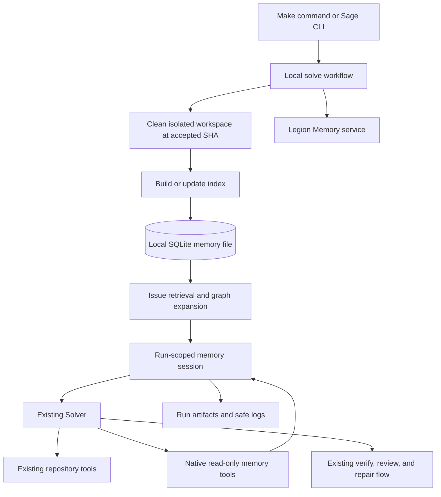

# Legion Memory Implementation Plan

## Document status

> **Status:** Phase 1 implemented; Phases 2 and 3 remain proposed. Phase 4 is
> deferred.
>
> **Date:** 4 September 2026
>
> **Sage baseline:** `0c9c169` on `main`
>
> **Reference implementation inspected:** `code-review-graph` 2.3.8 at
> `b586687`
>
> **Current Sage architecture source of truth:**
> [`../docs/architecture.md`](../docs/architecture.md)
>
> **Current Sage testing source of truth:**
> [`../docs/testing.md`](../docs/testing.md)

This specification plans a local code-memory capability named **Legion
Memory**. It covers the native graph engine, retrieval, and local Sage
integration in Phases 1 through 3. Phase 4, GitHub Actions integration, is
deliberately deferred and is not designed here.

This document remains the phased plan. Phase 1 behavior and commands are now
reflected in the current architecture and testing guides; later-phase sections
remain proposed work.

---

## 1. Objective

Legion Memory will give Sage a rebuildable, repository-specific knowledge
graph that helps the Solver locate relevant code, relationships, tests,
execution paths, and architectural regions before it edits a repository.

The intended local flow is:

```text
local Issue solve
  -> prepare the clean workspace at the accepted base SHA
  -> call the one build-or-update operation
  -> open the requested local SQLite memory file
  -> retrieve bounded Issue-relevant graph context
  -> log whether useful memory was found
  -> run the normal Solver with native read-only graph tools
  -> fall back to the existing repository tools when memory is unavailable
  -> verify and review the Git-derived candidate as today
```

The feature must satisfy these end-state requirements:

1. `build_or_update_graph_tool` is the only build entry point. Its caller does
   not decide whether the database is cold or warm. The implementation selects
   a full build, incremental update, or no-op from database and Git provenance.
2. The graph is stored in one local SQLite file supplied or resolved by Sage.
   SQLite is the storage engine; no graph server or remote database is added.
3. Graph operations are native Python capabilities and LangChain tools inside
   Sage. Sage does not launch, configure, or call an MCP server.
4. Every memory-enabled run attempts graph build/update before the first model
   call and against the clean workspace's exact accepted base SHA.
5. Retrieval is bounded, provenance-bearing, and safe to place in the Solver's
   untrusted context envelope.
6. A missing hit, unreadable database, locked database, unsupported schema,
   parser failure, or retrieval failure does not prevent a normal local solve.
   Sage logs the reason and continues with its existing repository tools.
7. Logs and a run artifact state consistently whether memory was available,
   retrieved, actually exposed to the Solver, or bypassed.
8. Graph results are navigation evidence, not source truth. The Solver must
   read current files before planning or editing; repository source and Git
   state continue to outrank the graph.
9. Legion Memory is a deterministic repository-index capability. It does not
   become a LangGraph checkpoint, workflow state store, agent transcript, or
   second solve architecture.
10. The local result remains a verified and reviewed candidate suitable for a
    future draft pull request. Creating the actual GitHub draft pull request is
    Phase 4 and remains out of scope here.

---

## 2. What is being reused from `code-review-graph`

The reference project is MIT-licensed. If implementation code is copied or
substantially adapted, Sage must preserve the required copyright and license
notice in an appropriate `NOTICE` or third-party license file. The
implementation should pin its comparison to the inspected commit instead of
silently following the reference repository's moving `main` branch.

The useful reference concepts are:

| Reference concept | Legion Memory decision |
| --- | --- |
| SQLite `nodes`, `edges`, `metadata`, indexes, migrations, and WAL mode | Adapt into a small Sage-owned store with explicit schema versioning |
| Tree-sitter symbol and relationship extraction | Reuse the parsing design after fixing the initial language scope |
| Git-aware full build and incremental update | Preserve one public build/update entry point and safe full-rebuild fallback |
| Atomic per-file replacement and deleted-file reconciliation | Preserve so a failed update cannot leave half of a file indexed |
| FTS5 search with exact identifier and path boosts | Use as the deterministic first retrieval layer |
| Optional vector search and reciprocal-rank fusion | Defer until lexical-plus-graph retrieval is measured; do not make it an implicit network call |
| Directed impact traversal with edge weights and hard limits | Adapt with deterministic limits and truncation metadata |
| Stored flows, communities, architecture summaries, hubs, and gaps | Include only the portions selected in the Phase 1 tool manifest |
| Git SHA provenance and cautious confidence for empty results | Preserve; an empty result must not be described as proof of absence |
| MCP wrappers, server, installation, prompts, and transport | Do not port |
| Watch daemon, registry, cross-repository search, wiki, and editor integration | Do not port in Phases 1-3 |
| `memory.py` Q&A-to-Markdown helper | Do not treat as working retrieval; it is not connected to the reference graph pipeline |

Directly depending on the full `code-review-graph` distribution is not the
recommended design. It would bring MCP, FastMCP, watcher, and other runtime
surfaces that Sage does not need. Prefer adapting the smallest deterministic
core into Sage, with attribution, unless the dependency analysis proves that a
smaller supported library surface exists.

---

## 3. Scope and non-goals

### 3.1 In scope for Phases 1-3

- one local SQLite graph for one repository;
- schema creation and forward migrations;
- full, incremental, and no-change indexing behind one operation;
- symbol, file, call, import, containment, inheritance, reference, and test
  relationships for the selected languages;
- FTS5/keyword retrieval, graph expansion, impact analysis, flows,
  communities, and architecture summaries selected for the native tool set;
- native Solver tool adapters with hard response limits;
- explicit build and retrieval provenance;
- graceful no-memory fallback;
- local CLI and Make commands;
- run artifacts and user-friendly logging;
- deterministic tests and a controlled local live-solve evaluation.

### 3.2 Explicitly out of scope

- MCP clients, servers, configuration, or transport;
- GitHub Actions memory persistence, cache restore/save, workflow inputs,
  diagnostic uploads, status comments, or publication changes;
- actual draft-PR creation as part of the local command;
- a daemon, file watcher, background process, or repository registry;
- cross-repository querying;
- arbitrary SQL exposed to the model;
- graph-backed mutation or refactoring tools that bypass Sage's existing plan
  and structured mutation gates;
- storing credentials, full model transcripts, or private provider payloads;
- treating memory as authoritative evidence without checking the source;
- an automatic embeddings provider or any hidden model/network call;
- a new runtime selector, orchestration graph, or agent role.

---

## 4. Target architecture



### 4.1 Ownership

The proposed source layout is:

```text
apps/agent/src/sage/
  domain/
    memory.py                  # stable build, retrieval, and usage contracts
  legion_memory/
    store.py                   # SQLite connection, queries, and transactions
    migrations.py              # ordered schema migrations
    parsing.py                 # parser facade and normalized parser output
    indexing.py                # Git inventory, hashing, full/incremental build
    postprocessing.py          # FTS, flow, community, and summary refresh
    retrieval.py               # Issue ranking and bounded graph expansion
    analysis.py                # impact, flow, community, and architecture queries
    service.py                 # narrow workflow/tool-facing capability
  agents/
    memory_tools.py            # LangChain adapters only
```

Existing owners change narrowly:

| Existing file | Planned responsibility |
| --- | --- |
| `sage/composition.py` | Construct the concrete Legion Memory service explicitly |
| `sage/workflows/solve.py` | Prepare memory after the clean workspace exists and before the first model call |
| `sage/orchestration/context.py` | Carry an optional run-scoped memory session, not a global database singleton |
| `sage/agents/solver.py` | Bind selected memory adapters beside existing repository tools |
| `sage/agents/prompts.py` | Tell the Solver how to use and verify graph evidence |
| `sage/artifacts/files.py` and `store.py` | Persist one bounded memory-usage artifact |
| `sage/observability.py` | Render stable build/retrieval/usage panels |
| `sage/domain/solve.py` | Carry an optional memory-file request without coupling domain code to SQLite |
| `sage/cli.py` | Add memory build/status commands and local solve argument wiring |
| `sage/config.py` | Own only genuine tunables such as time and output budgets |

`sage/legion_memory` may depend on the standard library, its selected parser
libraries, and Sage domain contracts. It must not import agents,
orchestration, workflows, CLI, GitHub integration, providers, or Docker.
Agent adapters call the service; they do not contain graph algorithms or SQL.

### 4.2 Database placement and identity

The recommended default is outside the target repository:

```text
<sage-root>/.sage/legion-memory/<repo-name>-<identity-hash>/graph.sqlite3
```

This preserves Sage's guarantee that the source checkout is not mutated. Add
`.sage/legion-memory/` to `.gitignore`. `--memory-file` overrides the default
with an explicit local path.

The database must bind itself to a stable repository identity and record the
indexed Git SHA. Graph node paths must be repository-relative POSIX paths, not
run-directory absolute paths, because every Sage run has a new workspace.
Opening a database whose repository identity does not match the selected
repository must never return results from the wrong codebase.

### 4.3 Initial schema

The first migration should provide, at minimum:

- `metadata`: schema version, repository identity, indexed SHA, build state,
  build type, timestamps, parser version, and selected language set;
- `nodes`: stable qualified identity, kind, name, relative path, line range,
  language, parent, signature/parameters/return type, test marker, file hash,
  bounded JSON metadata, and update time;
- `edges`: kind, source and target qualified identities, source path and line,
  confidence/tier, bounded JSON metadata, and update time;
- indexes for file, kind, qualified identity, source, target, and edge kind;
- `nodes_fts`: SQLite FTS5 index over name, qualified name, path, and signature;
- `flows` and `flow_memberships` if flow tools are in the accepted manifest;
- `communities` and node community membership if architecture tools are in the
  accepted manifest; and
- optional precomputed summary/risk tables only when a selected tool consumes
  them.

Use parameterized SQL, explicit transactions, WAL mode, bounded busy timeout,
foreign-key enforcement where practical, and context-managed connections.
Set the new `indexed_sha` and `ready` state only after parsing and required
post-processing complete. A failed update must leave the previous ready graph
usable or mark the new state unavailable; it must not advertise partial data as
current.

### 4.4 Build/update contract

`build_or_update_graph_tool(repo_root, memory_file, ...)` must:

1. validate and resolve the repository and database paths without allowing a
   graph node path to escape the selected repository;
2. inspect database schema, repository identity, prior indexed SHA, current
   accepted SHA, and parser/schema versions;
3. choose internally between full build, incremental update, or no-op;
4. use tracked files plus documented include/exclude rules;
5. parse added and changed files, reconcile deleted/renamed files, and refresh
   direct dependants only when the parser design requires it;
6. atomically replace each affected file's nodes and edges;
7. run the selected deterministic post-processing exactly once;
8. commit ready provenance only after success; and
9. return a typed, bounded result containing build type, counts, SHA, duration,
   warnings, and safe failure reason.

The caller never contains separate cold-start and warm-start branches. A
missing/empty database, unusable incremental base, repository mismatch,
incompatible parser identity, or unsupported migration causes the tool to make
the safe decision defined by its contract. It must never quietly reuse stale
or foreign graph data.

### 4.5 Native tool manifest

Phase 1 begins by freezing a manifest. The recommended initial manifest is the
read-only subset that directly helps issue solving:

| Tool | Bound to Solver? | Purpose |
| --- | --- | --- |
| `build_or_update_graph_tool` | No; workflow/CLI invokes it | Build/update before a run without spending a model turn |
| `list_graph_stats_tool` | Yes | Report health, scope, SHA, and counts |
| `get_minimal_context_tool` | Yes | Return a compact starting map for a task |
| `semantic_search_nodes_tool` | Yes | Search FTS/keyword and report the actual search mode |
| `query_graph_tool` | Yes | Query callers, callees, imports, importers, children, tests, inheritance, references, and file summaries |
| `traverse_graph_tool` | Yes | Run bounded directional traversal from a resolved node |
| `get_impact_radius_tool` | Yes | Rank affected nodes/files using directed weighted edges |
| `list_flows_tool` / `get_flow_tool` | Yes | Discover and inspect bounded execution paths |
| `get_affected_flows_tool` | Yes | Relate likely changed files or selected paths to flows |
| `list_communities_tool` / `get_community_tool` | Yes | Inspect stored architectural regions |
| `get_architecture_overview_tool` | Yes | Return a compact community/bridge overview |
| `get_hub_nodes_tool` / `get_bridge_nodes_tool` | Yes | Identify hotspots and chokepoints |
| `get_knowledge_gaps_tool` | Yes | Report untested or structurally uncertain hotspots |

Every tool must have typed arguments, a typed internal result, a JSON-safe
rendering, explicit total/returned/omitted counts, hard result and character
ceilings, graph provenance, and a status value. Tools must not accept arbitrary
SQL or arbitrary filesystem paths. Empty results include confidence/provenance
language and never assert that a relationship does not exist.

Do not initially bind build, post-processing, embedding, apply-refactor,
write-memory, or database-maintenance operations to the Solver. Keeping the
build operation native to Sage does not require letting a model invoke an
expensive write after the workflow already ran it.

### 4.6 Retrieval and fallback contracts

The workflow-level retrieval result should use explicit states:

```text
used          useful bounded context was retrieved and exposed
no_match      graph is ready, but no useful Issue match passed the threshold
unavailable   graph could not be built, opened, validated, or queried safely
disabled      this invocation did not request Legion Memory
```

`no_match` and `unavailable` both continue into the existing Solver with the
normal repository tools. The difference remains visible in logs and artifacts.
Do not catch `KeyboardInterrupt`, cancellation, or unrelated programming
errors as ordinary no-memory fallbacks. Catch only the Legion Memory error
taxonomy at the workflow boundary.

Standalone build commands are stricter: invalid input or a failed build exits
non-zero. Graceful fallback belongs to a solve whose primary objective is
fixing an Issue, not to a command explicitly asked to build a database.

---

## 5. Phase 1 — Native graph engine, tools, tests, and manual build

### 5.1 Freeze the extraction and tool contract

Before porting code:

1. record the inspected reference commit and the exact modules/algorithms being
   adapted;
2. decide the language set and native tool manifest from the open questions;
3. make a license/attribution inventory;
4. prove proposed parser packages and versions install and import on Sage's
   required Python 3.14 runtime;
5. compare each new dependency against a standard-library or existing-package
   alternative; and
6. explicitly exclude MCP, FastMCP, watchdog, daemon, registry, wiki,
   refactoring, and editor code from the import graph.

Expected production dependencies are SQLite from the standard library plus
Tree-sitter and a grammar provider. Add NetworkX only if the accepted impact,
community, or centrality implementation materially needs it. Do not add
sentence-transformers, igraph, or an embeddings SDK in Phase 1.

### 5.2 Implement storage and migrations

- Add the domain contracts and Legion Memory error taxonomy.
- Implement schema creation and ordered forward migrations.
- Implement repository identity and exact-SHA provenance.
- Implement atomic node/edge replacement, removal, and indexed reads.
- Implement FTS5 creation/rebuild with an atomic failure path.
- Add connection timeouts, WAL, cleanup, and deterministic serialization.
- Treat a user-supplied database as untrusted local input: validate schema and
  bound all decoded JSON and returned text.

### 5.3 Implement parsing and the single build/update path

- Normalize parser output into `NodeRecord` and `EdgeRecord` before it reaches
  SQLite.
- Inventory only selected tracked text files; skip the memory file, `.git`,
  generated dependencies, binary content, and configured exclusions.
- Make qualified identities stable across disposable Sage workspaces.
- Implement cold full build, SHA-based incremental change detection,
  add/change/delete/rename reconciliation, and no-change detection internally.
- Fall back to a full rebuild when the stored base SHA is unavailable after a
  rebase/history rewrite or parser/schema identity is incompatible.
- Persist parse errors as bounded warnings and define whether one failed file
  invalidates the build or produces a ready graph with declared gaps.
- Run FTS and accepted flow/community post-processing after graph writes.

### 5.4 Implement the accepted native tools

- Put graph algorithms in `legion_memory`, not in `agents`.
- Add thin LangChain adapters in `agents/memory_tools.py`.
- Return structured error statuses for expected graph problems.
- Attach repository identity, indexed SHA, build age, search mode, truncation,
  and confidence to relevant responses.
- Use repository-relative paths and bounded line locators. The Solver retrieves
  actual source through the existing `read_file` tool.
- Verify that no graph tool can mutate repository files or bypass the saved-plan
  gate.

### 5.5 Add CLI and Make commands

Add native commands such as:

```bash
uv run --project apps/agent sage memory build \
  --repo /absolute/path/to/repo \
  --memory-file /absolute/path/to/graph.sqlite3

uv run --project apps/agent sage memory status \
  --repo /absolute/path/to/repo \
  --memory-file /absolute/path/to/graph.sqlite3
```

Expose the build through the repository's established Make variable style:

```bash
make legion-memory REPO=/absolute/path/to/repo
make legion-memory REPO=/absolute/path/to/repo \
  MEMORY_FILE=/absolute/path/to/graph.sqlite3
```

GNU Make treats `make legion-memory <repo>` as two targets, not as a positional
argument. The variable form above is the recommended equivalent. The command
must print the resolved memory file, build type, indexed SHA, files parsed,
node/edge totals, warnings, duration, and a clear success/failure result.

### 5.6 Automated tests

Add mirrored tests under `apps/agent/tests/legion_memory/`:

- `test_store.py`: schema, migrations, constraints, WAL, transactions,
  concurrent read behavior, repository mismatch, unsupported schema, corrupt
  data, and rollback;
- `test_parsing.py`: fixture extraction for every accepted language, stable
  identities, test detection, source ranges, calls/imports/inheritance, syntax
  errors, and binary/unsupported files;
- `test_indexing.py`: cold build, repeated no-op, incremental add/change/delete/
  rename, stale SHA, history rewrite, ignored files, failed file, failed
  post-processing, and previous-ready-graph preservation;
- `test_search.py`: FTS rebuild, identifier/path/signature matching, keyword
  fallback, special characters, SQL-injection-shaped input, ranking, and hard
  limits;
- `test_analysis.py`: direction and weight semantics, cycles, ambiguity,
  transitive tests, flows, communities, hubs, gaps, truncation, and deterministic
  output;
- `test_tools.py`: every accepted tool's schema, adapter wiring, provenance,
  no-graph/stale-graph/empty-result behavior, and output bounds;
- updates to `test_cli.py`, `test_makefile.py`, `test_composition.py`, and
  `test_architecture.py` for command and ownership contracts.

Tests must use temporary repositories and SQLite files. They must not use a
live model, network, paid embeddings, the reference project's MCP server, or a
developer's real cache.

### 5.7 Manual Phase 1 check

Run the command against both a tiny fixture repository and the Sage repository:

1. build a new database and confirm non-zero file/node/edge counts;
2. inspect `memory status` and a small set of parameterized SQLite queries;
3. run the same build again and confirm `no_change` without duplicate rows;
4. modify, add, rename, and delete fixture files in separate commits;
5. rerun the same command and confirm only the correct graph data changes;
6. query a known function's callers, callees, imports, tests, flow, and
   community;
7. confirm the target repository's Git status is unchanged; and
8. corrupt or lock a copied test database and confirm the command fails clearly
   without damaging the last good database.

### 5.8 Phase 1 exit criteria

- Every tool in the frozen manifest has direct passing tests.
- `make legion-memory REPO=...` creates a usable SQLite graph.
- The same command handles first build, update, and no-change paths.
- Manual queries match source inspection for the selected fixtures.
- No MCP process, network call, provider credential, or source-repository
  mutation occurs.
- Focused tests, `make check`, and `make graph` pass.
- `docs/architecture.md` and `docs/testing.md` describe the implemented engine,
  commands, supported languages, database location, and troubleshooting.

---

## 6. Phase 2 — Issue-relevant memory retrieval and tests

### 6.1 Define one retrieval service

Add a deterministic operation such as:

```text
retrieve_issue_context(issue_text, graph_snapshot, budgets) -> MemoryRetrievalResult
```

It should:

1. normalize the Issue without treating Issue text as instructions to the
   memory engine;
2. extract path-like text, qualified names, identifiers, error tokens, and
   useful natural-language terms;
3. retrieve FTS5/keyword candidates and report the actual search mode;
4. boost exact identifiers, paths, symbols, tests, and current context files;
5. expand only the best seeds through bounded callers, callees, imports,
   tests, flows, and communities;
6. rank and deduplicate related paths and symbols;
7. attach graph SHA, scores/reasons, relationship evidence, confidence, and
   omitted counts; and
8. render a compact context under both result-count and character budgets.

The result should distinguish:

- graph unavailable;
- graph ready but no lexical candidates;
- candidates found but below the usefulness threshold;
- useful context returned; and
- useful context truncated by budget.

Retrieval output should identify why each item was selected, for example
`exact_identifier`, `path_match`, `fts`, `caller_of`, `test_for`,
`same_flow`, or `same_community`. This makes local evaluation and user-facing
logs explainable.

### 6.2 Retrieval test corpus

Create small, deterministic fixture repositories plus Issue texts covering:

- an exact function/class/configuration identifier;
- an explicit file path;
- a natural-language bug description with related symbol vocabulary;
- a caller/callee relationship not named directly in the Issue;
- a test related through `TESTED_BY` or naming inference;
- an architectural issue that should surface a community or flow;
- ambiguous duplicate names;
- unsupported-language and parser-gap cases;
- irrelevant terms that should return `no_match`;
- stale, empty, corrupt, locked, foreign-repository, and unsupported-schema
  databases; and
- oversized graphs/results that must be truncated deterministically.

For each positive case, record expected relevant paths/symbols and an allowed
rank window rather than brittle full JSON snapshots. Measure at least top-k
recall, reciprocal rank, returned characters, and query duration. Compare:

```text
FTS/keyword only
  versus
FTS/keyword plus graph expansion
```

Do not add embeddings merely because a test uses the word “semantic.” Add them
only if the measured corpus shows an important retrieval gap and the chosen
provider, privacy behavior, cache, cost, and offline-test strategy are approved.

### 6.3 Failure and security tests

- All SQL remains parameterized for adversarial Issue text.
- Retrieved text is bounded and tagged as untrusted data.
- Node paths cannot escape the selected workspace.
- Invalid JSON metadata, invalid line ranges, or unknown edge kinds are ignored
  or surfaced safely.
- One failed expansion does not discard valid primary hits.
- `no_match` is not logged as a graph failure.
- A graph whose indexed SHA differs from the accepted base is never exposed as
  current memory.
- Retrieval does not make a model or network call.

### 6.4 Phase 2 exit criteria

- Retrieval returns the expected relevant path/symbol within the agreed top-k
  window for every positive fixture.
- Negative fixtures return an explicit bounded `no_match` result.
- Graph expansion improves or preserves the lexical baseline on the fixture
  corpus.
- All failure modes return stable statuses and reasons.
- Query time and response size stay within configured budgets on the chosen
  representative repository.
- Focused retrieval tests and `make check` pass.
- The testing guide contains a reproducible retrieval check with expected
  output fields.

---

## 7. Phase 3 — Local Solver integration and memory-assisted solve evaluation

### 7.1 Wire memory into the local workflow

Add an optional `memory_file` to the local solve request and CLI. Keep SQLite
types out of the domain request. The local workflow should:

1. read the Issue and prepare the existing clean workspace;
2. initialize run artifacts;
3. call the Legion Memory build/update service against that workspace and the
   accepted base SHA;
4. attempt Issue retrieval from the resulting ready graph;
5. construct a run-scoped `MemorySession` containing only the validated graph
   handle/provenance, retrieval result, and usage recorder;
6. place the optional session in `SolveContext`;
7. start the sandbox and the existing orchestrator; and
8. close memory/database resources during workflow cleanup on every path.

The graph is a snapshot of the accepted base. Solver mutations occur after the
build, so every graph response must continue to label that base SHA. Repair
sessions may reuse base-architecture memory, but must read current workspace
files and current Git diff before acting. Do not silently describe the graph as
including in-run edits.

### 7.2 Expose memory to the Solver

- Add the accepted read-only memory tools to `build_solver_tools` only when a
  valid `MemorySession` exists.
- Include the compact initial retrieval result in a clearly delimited
  `<untrusted-legion-memory>` section of the initial Solver message when status
  is `used`.
- Tell the Solver to start from memory locators, verify them through repository
  reads, and fall back to `list_tree`, `search_text`, and `read_file` when the
  graph is empty, uncertain, or stale.
- Do not add memory tools to the Reviewer. The Reviewer must continue judging
  the actual plan, Git diff, and verification evidence.
- Do not let retrieved content satisfy the saved-plan gate or acceptance
  criteria by itself.
- Record each native memory tool call's name, status, hit count, returned
  paths, duration, and output truncation without storing raw model arguments or
  full source bodies.

### 7.3 Graceful fallback behavior

The workflow must attempt build and retrieval before the model, then choose one
of these visible paths:

| Condition | Solver behavior | Required log/artifact state |
| --- | --- | --- |
| Useful hits | Include compact context and bind memory tools | `used`, hit count, top paths, indexed SHA |
| Ready graph, no useful hit | Run normal Solver; memory tools may remain available for manual exploration | `no_match`, search mode, zero useful hits |
| Build/open/retrieval unavailable | Run normal Solver without memory tools | `unavailable`, bounded failure category and fallback message |
| Memory not requested | Preserve existing local solve exactly | `disabled` if an artifact is written |

An expected memory failure must not change the solve outcome taxonomy. Provider,
verification, review, and candidate failures keep their existing meanings.

### 7.4 User-friendly logs and artifact

Add stable panels in `sage.observability`, for example:

```text
Legion Memory: graph ready
  ├─ Build: incremental
  ├─ Base: 0123456789ab
  ├─ Files: 4 updated / 218 indexed
  ├─ Graph: 1,842 nodes / 3,901 edges
  └─ Memory file: .../graph.sqlite3

Legion Memory: retrieval
  ├─ Status: used
  ├─ Search: fts + graph expansion
  ├─ Matches: 8 returned / 23 considered
  ├─ Relevant paths: sage/orchestration/solve.py, tests/.../test_solve.py
  └─ Fallback: not needed
```

For no-match or failure paths, emit the same panel fields with `Status:
no_match` or `Status: unavailable` and `Fallback: normal repository
inspection`. Never log the full Issue, source snippets, raw SQLite errors with
sensitive paths, credentials, or database contents.

Persist one bounded `legion-memory.json` run artifact containing:

- schema/format version;
- requested and resolved memory-file identity;
- repository identity and indexed SHA;
- build type/status/counts/duration/warnings;
- retrieval status/search mode/counts/top paths/truncation/duration;
- native memory tool usage summaries; and
- the final `used`, `no_match`, `unavailable`, or `disabled` state.

The artifact is evidence, not control state. Existing authoritative candidate,
verification, review, and terminal artifacts remain unchanged.

### 7.5 Local command

Preserve the existing no-memory command during evaluation and add an explicit
memory-assisted command:

```bash
make solve-memory \
  REPO=/absolute/path/to/repo \
  ISSUE=/absolute/path/to/issue.md \
  MEMORY_FILE=/absolute/path/to/graph.sqlite3 \
  BASE_REF=HEAD
```

It should call the same local solve workflow through:

```bash
sage solve --repo ... --issue-file ... --base-ref ... --memory-file ...
```

The command must build/update the supplied graph before the model call. It must
print the run directory and the Legion Memory status. A completed run still
uses Sage's existing Git-derived candidate, deterministic verification, and
independent review gates.

### 7.6 Automated integration tests

Add tests proving:

- the build/update call occurs once, after exact-SHA workspace preparation and
  before the first Solver call;
- useful retrieval is included in the initial prompt and memory tools are
  bound;
- the Solver verifies memory locators through repository reads in a scripted
  tool-loop test;
- `no_match`, missing file, corrupt file, lock timeout, parser failure, and
  retrieval failure all continue through the normal Solver path;
- memory-specific exceptions do not hide cancellation or unrelated defects;
- base-SHA mismatch blocks graph use;
- tool results retain base-snapshot provenance after Solver mutation and during
  repair;
- Reviewer inputs and capabilities remain unchanged;
- `legion-memory.json` and log panels are stable, bounded, and secret-safe;
- existing `sage solve` argument behavior remains compatible;
- `solve-memory` validates `REPO`, `ISSUE`, and `MEMORY_FILE`; and
- sandbox/database resources close on success and failure.

### 7.7 Local memory-assisted evaluation

Use at least two real local Issues whose relevant code is present in the graph:

1. build the database with `make legion-memory`;
2. record deterministic retrieval output before any live model call;
3. run the Issue once through the existing no-memory command and once through
   `make solve-memory` with the same base SHA, models, budgets, and Issue;
4. inspect logs and `legion-memory.json` to prove whether the Solver received
   and called memory;
5. compare relevant paths found, repository-read calls, model turns, input
   tokens, elapsed time, outcome, verification, review, and candidate diff;
6. verify the memory-assisted result is a completed, non-empty, verified,
   reviewed candidate; and
7. repeat a no-match/failure case and confirm it behaves as a normal run.

Because live model runs are nondeterministic, one faster or cheaper run is not
proof of general improvement. Phase 3's hard gate is correct use and graceful
fallback without quality regression. Keep the comparison record as evaluation
evidence and expand the case set before making memory the default.

### 7.8 Phase 3 exit criteria

- `make solve-memory REPO=... ISSUE=... MEMORY_FILE=...` works locally.
- Every memory-enabled run attempts the single build/update operation before
  the first model call.
- Useful memory is visibly retrieved, passed to the Solver, and verified
  against source in the controlled live case.
- No-hit and unavailable-memory cases still execute the normal Solver path.
- Logs and `legion-memory.json` clearly state where memory was or was not used.
- The candidate passes existing deterministic verification and independent
  review; memory cannot bypass either gate.
- Focused tests and the canonical checks pass:

  ```bash
  make check
  make graph
  make github-smoke
  make github-doctor
  ```

- The local live evaluation is reported truthfully as run, failed, or not run.
- `docs/architecture.md` and `docs/testing.md` are updated with the final local
  behavior and reproducible commands.

---

## 8. Phase 4 — GitHub Actions integration

Phase 4 is intentionally skipped. Do not change the composite action, GitHub
workflow, cache/artifact policy, hosted-runner database lifecycle, status
comments, diagnostics allowlist, or draft-PR publication in Phases 1-3.

A later specification must decide where the SQLite file persists between
hosted runs, how repository/fork trust affects cache keys, how concurrent jobs
serialize updates, what is safe to upload, and how memory status appears in the
GitHub user experience.

---

## 9. Implementation and commit boundaries

Keep each phase independently reviewable and include its tests with its code.
A reasonable logical split is:

1. `feat(legion-memory): add native graph engine and build command`
   - domain contracts, store, migrations, parser/indexing, selected graph
     tools, dependency/lock changes, Make command, direct tests, and Phase 1
     documentation;
2. `feat(legion-memory): add issue retrieval`
   - ranking, graph expansion, retrieval contracts, corpus, failure tests, and
     retrieval documentation; and
3. `feat(solver): integrate legion memory into local solves`
   - workflow/context/tool wiring, prompts, fallback, logs, artifact, local
     command, integration tests, evaluation instructions, and current docs.

Split Phase 1 further only if a dependency/license foundation is independently
coherent. Do not separate tests from the behavior they validate. Do not commit
or begin Phase 4 as part of these changes.

---

## 10. Risks and controls

| Risk | Control |
| --- | --- |
| Stale graph misleads the Solver | Bind every result to repository identity and exact indexed SHA; source wins |
| Corrupt/partial update | Explicit transactions, last-ready provenance, rollback tests, no silent destructive recovery |
| Large graph overwhelms context | Hard counts, depth limits, character budgets, returned/omitted metadata |
| Natural-language retrieval is weak without embeddings | Measure lexical-plus-graph retrieval first; approve embeddings separately |
| Parser scope makes the first phase too large | Freeze languages and tools before porting; add fixtures for every claimed language |
| Native graph tools bypass repository safety | Make them read-only locators; all source reads and mutations stay in existing tools |
| Memory becomes hidden workflow state | Keep it rebuildable and optional; run artifacts remain authoritative |
| New dependencies inflate the runtime | Exclude MCP/watcher/wiki stacks; justify and pin only parser/graph essentials |
| A user-supplied DB contains hostile text | Validate schema/JSON/paths, parameterize SQL, bound output, mark context untrusted |
| In-run edits make the base graph stale | Label graph as accepted-base snapshot and require current file/diff reads during repair |
| “Memory used” logs overclaim usefulness | Distinguish available, retrieved, exposed, and native-tool-called states |

---

## 11. Open questions

1. **What is a memory?** Is Legion Memory initially only the rebuildable code
   graph, or must it also store completed Sage episodes such as Issue, plan,
   changed paths, verification, and review? The inspected reference's Q&A
   Markdown helper is not wired into retrieval. Recommendation: ship the code
   graph first; if episodic memory is required, add only verified/reviewed
   completed runs in a separately designed schema and retention policy.
2. **How much tool parity is required?** Must Phase 1 reproduce all 30 reference
   MCP tools, or is the recommended read-only issue-solving manifest sufficient?
   Recommendation: adopt the manifest in section 4.5 and exclude transport,
   mutation, wiki, registry, and maintenance tools.
3. **Which languages are required for the first release?** Full parser parity
   with the reference is a large commitment. Recommendation: select languages
   from Sage's real target repositories, require fixtures for each, and add
   languages incrementally without claiming unsupported parity.
4. **Where should the default SQLite file live?** Recommendation: Sage's local
   `.sage/legion-memory/` area so indexing never changes the target repository;
   retain `--memory-file` for explicit placement and portability.
5. **Should local memory be opt-in or immediately replace `make solve`?**
   Recommendation: keep `make solve-memory` explicit through Phase 3 evaluation,
   then decide whether every local solve should resolve a default memory file.
6. **Are embeddings required in Phase 2?** If yes, which local or hosted model,
   what privacy approval, cache format, cost budget, Python 3.14 support, and
   offline-test substitute are acceptable? Recommendation: begin with FTS5 plus
   graph expansion and decide from measured retrieval gaps.
7. **Should `build_or_update_graph_tool` be model-callable?** Recommendation:
   keep it a native workflow/CLI tool but do not bind it to the Solver, because
   the workflow already invokes it before the first model turn.
8. **How should parse gaps affect readiness?** Decide whether one failed file
   makes the graph unavailable or produces a ready graph with declared gaps and
   lower confidence. Recommendation: allow bounded per-file gaps, but make
   systemic parser or post-processing failure unavailable.
9. **What exact retrieval success thresholds gate Phase 2?** Agree on the
   fixture corpus, top-k recall/rank target, maximum result characters, and
   representative-repository latency before implementation is called complete.
10. **What attribution form should Sage use?** Decide whether adapted MIT code
    is tracked in a root `NOTICE`, a third-party licenses file, or per-module
    headers before copying implementation text.
