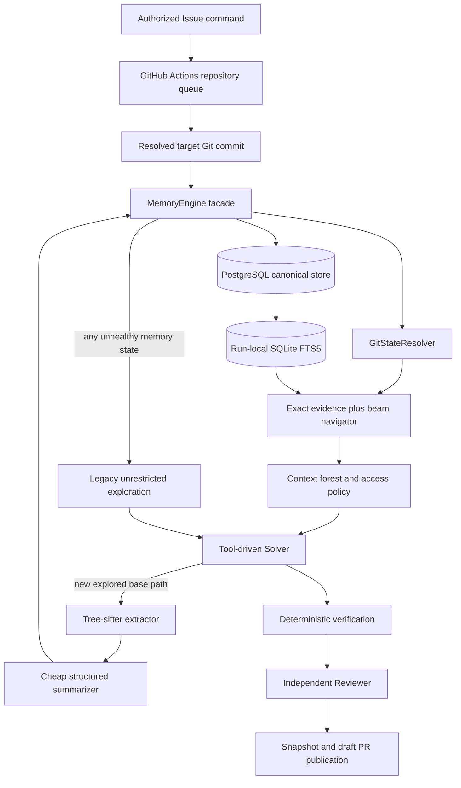

# Sage SMRT Memory Engine V1 Implementation Plan

## Document status

This document is the implementation plan for the behavior specified in
`specs/24_SAGE_SMRT_MEMORY_ENGINE_RESEARCH.md`. It does not implement the
Memory Engine.

The plan is grounded in the repository as it exists on 2026-08-29:

- V2 is the only runtime;
- the model-backed roles are the tool-driven OpenAI Solver and the independent
  Gemini Reviewer;
- repository reads are currently direct `list_tree`, `search_text`, and
  `read_file` tools;
- every solve uses an isolated Git clone and an accepted base commit;
- there is no database, cross-run memory, parser integration, or search index;
- GitHub Actions concurrency is currently scoped to one Issue, so different
  Issues in the same repository may solve concurrently; and
- run artifacts are local files, while Git-derived changed files and diff are
  authoritative.

This plan deliberately does not use the Memory Engine as an excuse to perform
the future whole-repository refactor. It introduces a self-contained feature
boundary and a small integration seam that can be moved during that refactor.

## 1. Intended outcome

After implementation, Sage will have an opt-in SMRT Memory Engine that:

1. stores a sparse, immutable semantic overlay in one PostgreSQL database;
2. uses Git tree and blob object IDs as source identities;
3. creates semantic memory only for repository regions Sage actually explores;
4. reuses unchanged memory across commits and renames;
5. refreshes changed semantic cards only when retrieval needs them;
6. retrieves through exact evidence, SQLite FTS5, hierarchy, and unexplored Git
   branches;
7. maintains roughly four diverse navigation hypotheses;
8. gives the Solver a bounded multi-file context forest made from current raw
   source;
9. allows controlled direct and semantic context expansion;
10. records why every file entered active context;
11. publishes snapshots atomically and retains the newest five READY snapshots
    once five exist;
12. falls back to the current unrestricted repository exploration path if
    memory becomes unhealthy;
13. reports a sanitized memory fallback in the draft pull request; and
14. never allows two Issues for one repository to solve at the same time.

The initial release remains disabled by default:

```dotenv
SAGE_MEMORY_ENABLED=false
```

When the variable is absent or false, Sage must not connect to PostgreSQL,
initialize FTS5, load Tree-sitter grammars, call the summarizer, alter Solver
tools, or change current solve behavior.

## 2. Required behavioral invariants

The implementation must preserve every invariant in the research spec. The
following translations are important for code review.

### 2.1 Authority and identity

- Git at the accepted target commit is complete repository truth.
- SMRT is a partial learned overlay, never a repository mirror.
- Raw source from the active workspace is authoritative for Solver reasoning.
- Memory generation always reads source from the accepted base commit, not
  uncommitted candidate content in the mutable worktree.
- A semantic object is immutable and content-addressed.
- A logical path is a snapshot mapping, not part of semantic object identity.
- File and directory source object IDs are stored separately from SHA-256
  semantic/overlay digests.
- V1 persists only `FileNode` and `DirectoryNode` semantics. Symbols are
  metadata on a `FileNode`.

### 2.2 Sparse learning

- Listing a Git path does not automatically create semantic memory for every
  child.
- No full-repository semantic indexing job is introduced.
- Deterministic Git inventory may inspect names and object IDs without creating
  semantic nodes or invoking a model.
- A file becomes learned only after Sage actually materializes or reads it.
- A directory memory is based only on explored immediate-child memories and is
  partial unless the implementation can prove complete coverage.

### 2.3 Retrieval and Solver behavior

- Exact path, filename, symbol, identifier, import, and direct-reference
  evidence outrank lexical similarity.
- `not_responsible_for` is negative routing evidence and is never inserted into
  positive FTS text.
- Known memory cannot prevent exploration of plausible unknown Git branches.
- Finding one good file does not terminate other live hypotheses.
- The initial result is a context forest, not a single guessed file.
- The Solver receives current source, not semantic cards as a substitute for
  source.
- While SMRT is healthy, broad repository expansion flows through the
  context-policy boundary.
- Files must be materialized and read before existing-file mutation.

### 2.4 Reliability

- Only READY snapshots can be selected as latest.
- Failed BUILDING snapshots cannot replace the prior READY snapshot.
- Memory failure does not by itself fail an Issue solve.
- After fallback, no additional semantic result, stale card, FTS hit, or memory
  hierarchy affects that solve.
- Raw source already materialized before fallback may remain in context because
  it is Git truth, not memory truth.
- Memory failure details are sanitized before logs, artifacts, status comments,
  or pull request text.
- No more than five READY roots per repository remain; once five exist, every
  successful publication retains exactly the newest five.

## 3. Scope and non-goals

### 3.1 Included

- repository-scoped GitHub Issue serialization and queueing;
- opt-in memory configuration;
- a PostgreSQL schema and migrations;
- sparse copy-on-write snapshot storage;
- Git OID resolution and solve-time catch-up;
- Python, TypeScript, and JavaScript Tree-sitter extraction;
- issue-independent structured file and directory summarization;
- SQLite FTS5 and exact-evidence retrieval;
- diverse bounded beam navigation;
- context forest materialization and expansion;
- read-before-edit enforcement in memory mode;
- snapshot retention and reachability cleanup;
- fallback, artifacts, logs, and pull request diagnostics;
- deterministic unit/integration coverage;
- a user-facing testing guide; and
- a staged canary and rollback path.

### 3.2 Explicitly excluded

- full-repository semantic pre-indexing;
- vector embeddings or a vector database;
- symbol nodes, call graphs, dataflow, LSP, or SCIP;
- background push-time memory maintenance;
- concurrent solves for the same repository;
- cross-repository semantic sharing;
- storing source blobs in PostgreSQL;
- storing Issue-conditioned Solver reasoning as canonical memory;
- automatic self-healing after SMRT fallback within one solve;
- adding SQLAlchemy, an ORM, Alembic, or a service framework;
- replacing local run artifacts with database persistence;
- redesigning Solver/Reviewer orchestration unrelated to memory; and
- making SMRT the default before benchmark and canary acceptance.

## 4. Current implementation and reuse map

| Existing area | Reuse | Required extension |
| --- | --- | --- |
| `sage.config.Settings` | Single trusted environment boundary and Pydantic validation | Add a nested/typed memory configuration surface with a false default and conditional validation |
| `sage.repository.host_git.run_git` | Shell-free trusted Git execution | Add SMRT-specific Git object queries behind `GitStateResolver`; do not put semantic logic in `host_git.py` |
| `sage.repository.RepositoryTools` | Existing bounded raw reads, edits, Git diff, and sandbox commands | Route reads and mutations through a run-scoped context policy without teaching this façade about PostgreSQL |
| `sage.runtimes.repository_tools` | Central construction point for Solver repository tools | Make tool behavior policy-aware and add context inspection/expansion tools only when memory is enabled |
| `sage.runtimes.v2.V2GraphRuntime` | Existing deterministic Solver/Reviewer lifecycle | Open one memory session, provide it to Solver tool construction, finalize it, and attach its report |
| `sage.providers.base.ModelProvider` | Provider-neutral structured output validation | Reuse it for the non-agent memory summarizer |
| `sage.providers.manager.ModelCallManager` | Deadline, retry, usage, and safe failure accounting | Add a memory-summarizer invocation purpose without giving the summarizer agent tools |
| `V2ArtifactStore` and `ArtifactStore` | Fixed atomic file writes | Add bounded memory summary/context trace artifacts |
| `solve_issue()` | Isolated workspace lifecycle and guaranteed sandbox cleanup | Add repository identity and memory-session lifecycle injection |
| GitHub gate and repeated gate | Authorization, duplicate PR/branch checks, status ownership | Keep gates outside the solve queue and repeat checks after a queued job starts |
| GitHub Actions workflow | Event filtering, secret scoping, publication permissions | Change solve-job concurrency from Issue scope to repository scope with a real pending queue |
| `publish_solve_result()` | Deterministic draft PR construction | Render a bounded `Sage Memory` fallback section from a typed report |

There is no reusable database, migration, semantic-memory, Tree-sitter, or
FTS abstraction in the current source. Those components should be added once,
inside the feature boundary described below.

## 5. Key implementation decisions

### 5.1 Queue provider: GitHub Actions in V1

Use GitHub Actions as the V1 issue queue rather than creating a second durable
queue in PostgreSQL.

The solve job will use a repository-scoped concurrency group:

```yaml
concurrency:
  group: sage-${{ github.event.repository.id }}-solve
  queue: max
```

Do not set `cancel-in-progress: true`; GitHub rejects that combination with
`queue: max`.

Current GitHub Actions supports one running workflow/job plus up to 100 pending
members in a concurrency group. Pending work is processed in waiting order,
although strict dispatch order is not guaranteed. See the official
[concurrency documentation](https://docs.github.com/en/actions/how-tos/write-workflows/choose-when-workflows-run/control-workflow-concurrency)
and [Actions limits](https://docs.github.com/en/actions/reference/limits).

This choice has four advantages for V1:

- it directly enforces one active solve per repository;
- it does not place database credentials in the authorization gate;
- it requires no leases, heartbeats, reapers, or queue recovery tables; and
- a memory-database outage cannot break queue ownership.

Gate jobs remain outside the concurrency group so authorization and duplicate
rejection are prompt. An accepted status means queued. The solve job repeats
authorization, duplicate branch/PR checks, and target-commit resolution after
it leaves the queue.

### 5.2 Target commit is resolved after queue wait

The current event SHA can be stale after a long queue wait. Split the concepts:

```text
event_base_sha
= default-branch SHA when the command event was accepted

target_base_sha
= exact default-branch SHA checked out when the queued solve starts
```

GitHub provenance retains both. Memory catch-up, workspace preparation,
candidate derivation, review, and publication use `target_base_sha`.

The solve action should check out the queued Issue's default branch with full
history after the concurrency wait, detach at the resolved SHA, disable
credential persistence, and pass that exact SHA to the trusted controller.

### 5.3 PostgreSQL is canonical; SQLite is derived

PostgreSQL owns semantic objects, overlay objects, snapshot roots, freshness,
provenance, and retention. SQLite FTS5 is rebuilt from one READY/BUILDING
snapshot for a solve and can be deleted at any time.

No source file contents are stored in PostgreSQL or SQLite. Only bounded
semantic payloads, structural metadata, identities, and mappings are stored.

### 5.4 PostgreSQL implementation is provider-neutral

The code accepts a PostgreSQL DSN and does not import a Neon SDK or call a Neon
control-plane API. Neon is a deployment choice, not a domain dependency.

Use Psycopg 3 directly. Do not add an ORM. Runtime queries are small and have a
stable schema, so typed repository methods and checked SQL are simpler than an
additional framework.

For Neon:

- use a pooled runtime DSN with TLS for solve traffic;
- use a direct DSN for schema migration;
- fully qualify table names instead of relying on session `search_path`;
- keep transactions short; and
- do not use session-level advisory locks, `LISTEN`, or other session state.

Neon's pooler uses PgBouncer transaction mode and does not preserve
session-level features; Neon also recommends a direct connection for migration
tools. See [Neon connection pooling](https://neon.com/docs/connect/connection-pooling)
and [Neon's Python connection guide](https://neon.com/docs/guides/python).

### 5.5 Memory is a vertical feature boundary

The core runtime may know only the public `MemoryEngine`/`MemorySession`
contracts. It must not import PostgreSQL SQL, FTS5 details, Tree-sitter grammar
objects, or overlay traversal algorithms.

The later repository refactor should be able to move the whole `sage.memory`
package and update one composition root, rather than untangling memory logic
from `V2GraphRuntime`, prompts, repository tools, and GitHub code.

### 5.6 Candidate worktree content never becomes base memory

Every semantic generation input is loaded through:

```text
git show <target_base_sha>:<path>
```

or an equivalent object-database operation verified against the target commit.

The mutable worktree is used for Solver reasoning and edits. A new candidate
file has no source blob in the accepted base and is not persisted into SMRT
until a later solve targets a commit containing that file.

### 5.7 The Solver receives source, not canonical cards

SMRT cards select files. The initial Solver packet contains:

- context roles and safe path/reason metadata;
- bounded current raw source or source excerpts; and
- instructions for controlled expansion.

It does not include a semantic summary as a replacement for raw source. If
memory later fails, already materialized source remains trustworthy, while all
unmaterialized memory hypotheses and indexes are discarded.

## 6. Target architecture



### 6.1 Proposed source layout

```text
apps/agent/src/sage/memory/
  __init__.py
  api.py
  models.py
  ports.py
  canonical.py
  engine.py
  session.py
  git_state.py
  parsing.py
  summarizer.py
  snapshots.py
  refresh.py
  retention.py
  context.py
  failure.py
  retrieval/
    __init__.py
    exact.py
    sparse.py
    beam.py
  adapters/
    __init__.py
    sqlite_fts.py
    postgres/
      __init__.py
      connection.py
      store.py
  migrations/
    0001_smrt_v1.sql

apps/agent/tests/memory/
  test_models.py
  test_canonical.py
  test_git_state.py
  test_parsing.py
  test_summarizer.py
  test_snapshots.py
  test_refresh.py
  test_retention.py
  test_context.py
  test_failure.py
  retrieval/
    test_exact.py
    test_sparse.py
    test_beam.py
  adapters/
    test_postgres.py
    test_sqlite_fts.py
```

The files are responsibility boundaries, not separate services. If a module is
small during implementation, keep closely related behavior together rather
than manufacturing one-class files. Do not collapse unrelated behavior into a
generic `utils.py`.

### 6.2 Public facade

Only these concepts should cross from `sage.memory` into orchestration:

```python
class MemoryEngine(Protocol):
    async def begin(self, request: MemoryRunRequest) -> MemorySession: ...


class MemorySession(Protocol):
    @property
    def mode(self) -> MemoryMode: ...

    async def initial_context(self, issue_text: str) -> ContextForest: ...
    async def expand(self, request: ContextExpansionRequest) -> ContextDelta: ...
    async def materialize_dependency(
        self, request: DirectMaterializationRequest
    ) -> MaterializedFile: ...
    def record_read(self, event: SourceReadEvent) -> None: ...
    def authorize_mutation(self, request: MutationAuthorization) -> None: ...
    async def finalize(self, outcome: SolveOutcome) -> MemoryRunReport: ...
```

Concrete types may differ, but the stable semantics should not. The no-memory
implementation returns a disabled session and delegates to current repository
behavior without branching throughout the codebase.

### 6.3 Ports

`ports.py` should define narrow protocols for:

- `SemanticObjectStore`;
- `SnapshotStore`;
- `GitObjectReader`;
- `StructuralExtractor`;
- `SemanticSummarizer`;
- `SparseSearchBackend`;
- `Clock` if deterministic timestamps are needed; and
- `MemoryArtifactWriter`.

Core tests use fakes for these ports. PostgreSQL, SQLite, Tree-sitter, and model
providers implement them at the package edge.

## 7. Configuration contract

### 7.1 Required feature gate

Add:

```dotenv
SAGE_MEMORY_ENABLED=false
```

Parsing follows the existing `_parse_bool` convention. False is the only V1
default. An invalid boolean fails configuration before workspace creation.

When false:

- database settings may be absent;
- summarizer settings may be absent;
- no memory dependency is initialized;
- the GitHub solve job still uses repository-scoped issue serialization; and
- current local/GitHub solve results remain byte-for-byte compatible except
  for explicitly updated queue status wording.

### 7.2 Database settings

Add secret fields with `repr=False`:

```text
SAGE_MEMORY_DATABASE_URL
SAGE_MEMORY_MIGRATION_DATABASE_URL
```

Rules:

- `SAGE_MEMORY_DATABASE_URL` is required only when memory is enabled.
- It is the pooled runtime DSN.
- `SAGE_MEMORY_MIGRATION_DATABASE_URL` is read only by `sage memory migrate`.
- Migration never runs automatically during `sage solve`.
- DSNs are never placed in metadata, exceptions, logs, artifacts, or traces.
- Runtime startup verifies the expected schema version with a bounded query.
- Missing/outdated schema triggers memory fallback, not a model solve failure.

The migration and read-only operator commands should load a narrow
`MemoryAdminSettings` model instead of `Settings.from_env()`. They must not
require Solver/Reviewer API keys merely to migrate or inspect PostgreSQL.

### 7.3 Summarizer settings

Add:

```text
SAGE_MEMORY_SUMMARIZER_PROVIDER=google
SAGE_MEMORY_SUMMARIZER_MODEL=gemini-3.5-flash
SAGE_MEMORY_SUMMARIZER_TIMEOUT_SECONDS=120
SAGE_MEMORY_SUMMARIZER_MAX_RETRIES=1
```

The proposed provider default reuses the existing structured Google adapter
and credential, but uses a separate model field, prompt version, call purpose,
and budget. The summarizer is not the Reviewer and is not an agent.

If a future provider is selected, construction occurs behind
`SemanticSummarizer`; core memory code does not import provider SDKs.

### 7.4 Retrieval and context settings

Expose typed settings for benchmarkable knobs while keeping hard invariants
non-configurable:

```text
SAGE_MEMORY_BEAM_WIDTH=4
SAGE_MEMORY_MAX_CANDIDATES_PER_ROUND=16
SAGE_MEMORY_MAX_NAVIGATION_ROUNDS=6
SAGE_MEMORY_INITIAL_MAX_FILES=8
SAGE_MEMORY_EXPANSION_MAX_FILES=6
SAGE_MEMORY_CONTEXT_CHARS=48000
SAGE_MEMORY_MAX_FILE_SOURCE_CHARS=120000
SAGE_MEMORY_PARENT_DELTA_LIMIT=3
SAGE_MEMORY_PARENT_CHANGED_CHILD_LIMIT=4
SAGE_MEMORY_DB_TIMEOUT_SECONDS=15
```

These are provisional canary defaults, not claims of optimality. Bounds should
prevent values that defeat the architecture, for example beam width below 3,
unbounded file counts, or a memory context larger than the Solver input cap.

The following remain fixed V1 invariants:

```text
retained READY snapshots = 5
persistent node types = file, directory
supported parser languages = Python, TypeScript, JavaScript
positive sparse backend = SQLite FTS5
```

### 7.5 GitHub Action settings

Add solve-action inputs and workflow wiring for:

- `memory-enabled` from a repository variable, default `false`;
- `memory-database-url` from a repository secret;
- `memory-summarizer-provider` from a variable; and
- `memory-summarizer-model` from a variable.

Only the solve job receives these values. The authorization gate and finalizer
remain free of database and model secrets.

## 8. Dependency plan

### 8.1 Add only focused production dependencies

Add:

```text
psycopg[binary,pool]
tree-sitter
tree-sitter-python
tree-sitter-javascript
tree-sitter-typescript
```

Rationale:

- Psycopg 3 provides typed async PostgreSQL access and a small pool without an
  ORM. Its pool is a separately packaged extra; use explicit async open/close
  lifecycle as recommended by the
  [Psycopg pool documentation](https://www.psycopg.org/psycopg3/docs/api/pool.html).
- The three grammar packages match the exact V1 parser scope.
- A broad language pack would add unused grammars and a larger footprint.
- Python's standard-library `sqlite3` supplies FTS5 when the runtime SQLite
  build enables it, so no SQLite dependency is added.

Before locking versions, run a compatibility spike under the project's minimum
Python 3.14 runtime. Verify wheels/ABI compatibility among Tree-sitter core and
all three grammar packages; Tree-sitter language ABI compatibility is versioned
and must be checked together. See the
[py-tree-sitter documentation](https://tree-sitter.github.io/py-tree-sitter/).

### 8.2 Do not add

- SQLAlchemy;
- Alembic;
- pgvector;
- a vector database client;
- a hosted queue SDK;
- a separate object store client;
- a Tree-sitter all-language pack; or
- testcontainers solely to start PostgreSQL.

SQL migrations remain explicit package resources. PostgreSQL integration tests
use a developer/CI-provided DSN or a pinned Docker service started by Make/CI.

## 9. Domain model

### 9.1 Repository identity

Define a provider-neutral identity:

```text
namespace_kind: github | local
namespace_key: stable opaque string
display_name: mutable safe label
```

For GitHub, `namespace_key` is the numeric repository ID, not `owner/name`, so
repository renames preserve memory. `display_name` may track the validated
current full name.

Local solves require an explicit stable memory key or a separately approved
derivation rule. Never persist a credential-bearing remote URL.

### 9.2 Semantic card models

Use separate strict Pydantic models.

`FileSemanticPayload`:

```text
summary
responsibilities[]
concepts[]
```

`DirectorySemanticPayload`:

```text
summary
responsibilities[]
not_responsible_for[]
concepts[]
```

`FileStructure`:

```text
language
symbols[]
imports[]
exports[]
signatures[]
parser_version
parse_status
```

Every field has bounded item counts and string lengths. Models use
`extra="forbid"`. Empty/whitespace-only values are normalized away. Duplicate
items are removed while preserving first occurrence. A directory cannot carry
file structure and a file cannot carry `not_responsible_for`.

### 9.3 Semantic object envelope

Store:

```text
semantic_digest
payload_digest
node_type
source_oid
semantic_payload
file_structure, if applicable
derived_from immediate children, for directories
schema_version
summarizer_provider
summarizer_model
prompt_version
parser_version, if applicable
generation_mode: full | delta
delta_depth
```

`payload_digest` hashes only normalized semantic meaning. It is used to decide
whether semantic change should propagate upward. `semantic_digest` hashes the
complete reproducible semantic envelope, including source identity, structure,
provenance, and versions.

Creation timestamps and database IDs are not part of either digest.

### 9.4 Overlay models

An immutable overlay node stores:

```text
overlay_digest
node_type
source_oid
semantic_object_digest, nullable
stale_hint_digest, nullable
semantic_state: valid | stale | missing
coverage_state: partial | complete, directories only
children: ordered name -> child overlay digest, directories only
```

Logical paths are derived by walking child names from the snapshot root. A
rename changes ancestor overlay objects but reuses the semantic and child
overlay object whenever content/state permits.

### 9.5 Snapshot models

```text
snapshot_id
repository_id
parent_snapshot_id
target_commit_oid
target_root_tree_oid
root_overlay_digest
status: BUILDING | READY | FAILED
run_id
created_at
ready_at
schema_version
```

`FAILED` is an allowed diagnostic state beyond the minimum research states.
It is never usable and may be cleaned later. Only READY rows participate in
latest selection and the five-snapshot window.

### 9.6 Context models

`ContextForest` contains bounded `ContextEntry` values:

```text
path
base_blob_oid
workspace_content_digest
role: primary | supporting | verification
added_by: initial_smrt_forest | deterministic_dependency | smrt_expansion
reason
evidence_tier
materialization: full | excerpt | metadata_only
included_line_ranges[]
```

`ActiveContext` additionally tracks:

- all raw-source line ranges returned to the Solver;
- the workspace content digest/version against which each range was read;
- direct dependency provenance;
- expansion request provenance;
- newly explored paths eligible for learning;
- candidate new-file parent authorization; and
- whether the session is healthy, disabled, or fallback.

### 9.7 Failure models

`MemoryFailure` is bounded and typed:

```text
component
stage
error_code
safe_message
snapshot_id, optional
target_commit
fallback_action
```

It must not contain a DSN, SQL text with parameters, provider response body,
raw source, Issue body, full stack trace, or arbitrary exception string.

Expected capability misses are not engine failures. Examples include an
unsupported language, a binary file, or a file intentionally skipped by a
documented size cap. They leave that semantic state missing and preserve exact
Git/source exploration.

## 10. Canonical digest construction

Implement one reusable canonicalization function in `canonical.py`.

1. Convert the strict Pydantic model to JSON-compatible primitives.
2. Normalize tuples/lists whose order is semantically defined before calling
   the function. Do not sort lists whose order carries meaning.
3. Serialize with UTF-8, sorted object keys, compact separators,
   `ensure_ascii=False`, and non-finite numbers rejected.
4. Hash the bytes with SHA-256.
5. Emit a lowercase 64-character hex digest.

Do not depend on database JSONB reserialization for identity.

On repository-scoped `INSERT ... ON CONFLICT DO NOTHING`, fetch the existing
object and compare its canonical envelope. A digest collision or mismatched
canonical payload is a fatal memory-integrity error and triggers fallback.

Unit fixtures should lock exact digests so accidental canonicalization changes
require an explicit schema/prompt-version migration decision.

## 11. PostgreSQL schema

Use a dedicated `sage_smrt` schema and fully qualified names in every runtime
query.

### 11.1 Migration registry

`sage_smrt.schema_migrations`:

| Column | Type | Notes |
| --- | --- | --- |
| `version` | text primary key | Monotonic migration identifier |
| `checksum` | char(64) | SHA-256 of the packaged SQL file |
| `applied_at` | timestamptz | Database time |

The migrator takes a PostgreSQL transaction-level advisory lock only for the
duration of migration on the direct connection. Runtime code uses no advisory
locks.

### 11.2 Repositories

`sage_smrt.repositories`:

| Column | Type | Notes |
| --- | --- | --- |
| `repository_id` | uuid primary key | Application-generated |
| `namespace_kind` | text | Checked `github` or `local` |
| `namespace_key` | text | Stable opaque identity |
| `display_name` | text | Mutable bounded label |
| `latest_ready_snapshot_id` | uuid nullable | FK added after snapshot table |
| `created_at` | timestamptz | Database default |
| `updated_at` | timestamptz | Explicitly updated |

Unique constraint on `(namespace_kind, namespace_key)`.

### 11.3 Semantic objects

`sage_smrt.semantic_objects`:

| Column | Type | Notes |
| --- | --- | --- |
| `repository_id` | uuid | Repository namespace FK |
| `semantic_digest` | char(64) | Canonical semantic envelope digest |
| `payload_digest` | char(64) | Semantic-equivalence comparison |
| `node_type` | text | Checked `file` or `directory` |
| `source_oid` | varchar(64) | Git blob/tree OID |
| `semantic_payload` | jsonb | Validated bounded card |
| `structure` | jsonb nullable | File deterministic metadata |
| `schema_version` | text | Locked semantic schema |
| `summarizer_provider` | text | Provenance |
| `summarizer_model` | text | Provenance |
| `prompt_version` | text | Provenance |
| `parser_version` | text nullable | Provenance |
| `generation_mode` | text | Checked `full` or `delta` |
| `delta_depth` | integer | Non-negative |
| `created_at` | timestamptz | Not in digest |

Primary key `(repository_id, semantic_digest)`. Index
`(repository_id, node_type, source_oid)` for unchanged-content reuse and
`(repository_id, payload_digest)` for propagation comparison. The digest stays
content-addressed, while the composite key prevents cross-repository
deduplication or reachability.

### 11.4 Directory semantic dependencies

`sage_smrt.semantic_dependencies`:

| Column | Type | Notes |
| --- | --- | --- |
| `repository_id` | uuid | Repository namespace FK |
| `parent_digest` | char(64) | Composite FK semantic object, directory only |
| `child_order` | integer | Stable canonical order |
| `child_name` | text | Immediate child logical name at generation |
| `child_digest` | char(64) | Composite FK semantic object |

Primary key `(repository_id, parent_digest, child_order)` and uniqueness on
`(repository_id, parent_digest, child_name)`. These rows are part of the
parent's canonical envelope and permit precise invalidation/GC.

### 11.5 Overlay nodes and edges

`sage_smrt.overlay_nodes`:

| Column | Type | Notes |
| --- | --- | --- |
| `repository_id` | uuid | Repository namespace FK |
| `overlay_digest` | char(64) | Canonical overlay digest |
| `node_type` | text | `file` or `directory` |
| `source_oid` | varchar(64) | Current source identity |
| `semantic_digest` | char(64) nullable | Current valid semantic object |
| `stale_hint_digest` | char(64) nullable | Old card usable only as refresh hint |
| `semantic_state` | text | `valid`, `stale`, or `missing` |
| `coverage_state` | text nullable | `partial` or `complete` for directory |
| `created_at` | timestamptz | Not in digest |

Primary key `(repository_id, overlay_digest)`.

State constraints enforce:

- `valid` requires `semantic_digest`;
- `stale` may retain only `stale_hint_digest` as old evidence;
- `missing` cannot claim a valid semantic object; and
- file rows cannot have directory coverage.

`sage_smrt.overlay_edges`:

| Column | Type | Notes |
| --- | --- | --- |
| `repository_id` | uuid | Repository namespace FK |
| `parent_overlay_digest` | char(64) | Composite directory overlay FK |
| `child_name` | text | One safe Git path segment |
| `child_overlay_digest` | char(64) | Composite file/directory overlay FK |
| `child_order` | integer | Canonical bytewise-name order |

Primary key `(repository_id, parent_overlay_digest, child_name)`. The complete
ordered edge set participates in the parent overlay digest.

These edges are the canonical path/object mappings. Do not create a complete
per-snapshot path table. The run-local derived index may materialize paths for
fast lookup after traversing one retained root.

### 11.6 Snapshots

`sage_smrt.snapshots`:

| Column | Type | Notes |
| --- | --- | --- |
| `snapshot_id` | uuid primary key | Application-generated |
| `repository_id` | uuid | FK repository |
| `parent_snapshot_id` | uuid nullable | Prior retained snapshot |
| `target_commit_oid` | varchar(64) | Accepted target commit |
| `target_root_tree_oid` | varchar(64) | Git root tree |
| `root_overlay_digest` | char(64) nullable | Sparse root |
| `status` | text | `BUILDING`, `READY`, `FAILED` |
| `run_id` | text | Safe local solve identifier |
| `schema_version` | text | Overlay schema |
| `created_at` | timestamptz | Database default |
| `ready_at` | timestamptz nullable | Set exactly once |
| `failure_code` | text nullable | Safe diagnostic only |

Indexes:

- `(repository_id, status, ready_at desc)`;
- `(repository_id, target_commit_oid)`; and
- `(status, created_at)` for stale BUILDING cleanup.

No uniqueness constraint on target commit: additional exploration can produce
a later snapshot against the same commit.

Add uniqueness on `(repository_id, snapshot_id)` for composite references.
`root_overlay_digest` uses a composite FK with `repository_id`, and the
repository latest pointer uses `(repository_id, latest_ready_snapshot_id)` so
the database cannot point one repository at another repository's objects or
snapshot.

### 11.7 Database permissions

Create separate roles operationally when the provider supports them:

- migration role: schema DDL and migration registry;
- runtime role: select/insert/update snapshot metadata, insert immutable
  objects, and retention deletes; and
- read-only inspection role: optional operator diagnostics.

Revoke update on immutable semantic and overlay object tables from the runtime
role. Inserts use idempotent conflict handling; deletes occur only through the
retention transaction.

## 12. PostgreSQL adapter behavior

### 12.1 Connection lifecycle

Create one `AsyncConnectionPool` per CLI solve process:

- `min_size=0` so disabled/idle short-lived jobs hold no connection;
- a small bounded `max_size` such as 4;
- `open=False`, opened explicitly;
- bounded acquisition/connect timeouts;
- explicit close during workflow finalization; and
- no SQL or parameters in user-facing errors.

Use the Neon pooled endpoint for this runtime pool. Transactions must not rely
on session state. Set transaction-local timeouts in the transaction or through
DSN options supported by the provider.

### 12.2 Store API

Repository methods should correspond to domain operations, not generic query
execution:

- `get_or_create_repository(identity)`;
- `load_latest_ready_snapshot(repository_id)`;
- `start_snapshot(...)`;
- `insert_semantic_object(object)`;
- `insert_overlay_subtree(nodes, edges)`;
- `mark_snapshot_failed(snapshot_id, code)`;
- `publish_snapshot(snapshot_id, expected_latest_id)`;
- `load_reachable_overlay(root_digest)`; and
- `retain_latest_five_and_collect(repository_id)`.

No public `execute_sql` or table-shaped dictionaries should leak into core
memory logic.

### 12.3 Atomic publication

In one transaction:

1. lock the repository row with `SELECT ... FOR UPDATE`;
2. verify `latest_ready_snapshot_id` still equals the session's expected base;
3. verify every referenced overlay/semantic object exists;
4. transition the BUILDING snapshot to READY and set `ready_at`;
5. update the repository latest pointer;
6. select the newest five READY snapshots deterministically;
7. delete older snapshot roots/rows;
8. recursively compute overlay and semantic reachability from the five roots;
9. delete unreachable edges and objects; and
10. commit.

Any error rolls back the whole publication, leaving the previous latest READY
snapshot unchanged. The solve enters memory fallback reporting but continues
toward its normal Issue outcome.

## 13. Git state resolver and catch-up

### 13.1 New Git operations

`GitStateResolver` should wrap `run_git()` and expose structured results for:

- resolve commit and root tree OID;
- inspect an object type;
- list immediate tree children with modes/types/OIDs;
- resolve one path at one commit;
- read a blob at one commit with a size limit;
- compare commits using raw/name-status metadata;
- find 100%-content-identical renames;
- find a bounded exact basename/path candidate; and
- run a bounded fixed-string `git grep` at the target commit for explicit
  identifiers/direct references; and
- inspect submodule/symlink modes without following them.

Use subprocess argument arrays, `-z` output where paths are returned, explicit
timeouts, and parser tests containing spaces, tabs, Unicode, and unusual but
valid Git filenames. Never build these operations with a shell string.

### 13.2 Cold start

If no READY snapshot exists:

1. create a BUILDING snapshot for the target commit;
2. resolve the root tree;
3. begin with no semantic children;
4. inspect Git paths lazily as navigation requests require; and
5. create memory only for files/directories actually materialized.

Exploring the repository root may create one partial root `DirectoryNode`.
It must not create child placeholders for every Git entry.

### 13.3 Catch-up from a prior snapshot

At solve start:

1. load the latest READY sparse overlay;
2. resolve the new target commit/root tree;
3. compare only deterministic Git metadata;
4. traverse known overlay paths against the target commit;
5. reuse file semantic/overlay objects when path and blob OID are unchanged;
6. remap a renamed path when the blob OID is identical and the mapping is
   unambiguous;
7. create a current overlay with `stale` state when a known file's blob changed;
8. remove mappings for deleted known paths;
9. ignore added/changed paths that were never represented in SMRT;
10. update ancestor overlay objects copy-on-write; and
11. preserve directory semantic validity when its recorded semantic child
    dependencies did not change.

Do not assume the prior target is an ancestor. A force-push/divergent target
falls back to resolving every known sparse path against the new target.

### 13.4 Rename ambiguity

If the same blob OID appears at multiple new paths and Git rename metadata does
not identify one mapping, do not guess. Treat the old path as deleted and the
new paths as unexplored. Exact Git discovery can learn the correct path later.

## 14. Tree-sitter extraction

### 14.1 Supported languages

Map extensions conservatively:

- Python: `.py`, optionally `.pyi` after fixture verification;
- JavaScript: `.js`, `.jsx`, `.mjs`, `.cjs`;
- TypeScript: `.ts`, `.tsx`, `.mts`, `.cts`.

Unsupported extensions produce `parse_status=unsupported` without an error.

### 14.2 Extracted facts

Use shallow, language-specific Tree-sitter queries to extract:

- top-level declarations and useful signatures;
- imports/module sources;
- exports; and
- stable symbol names.

Do not resolve imports across files, infer a call graph, or walk nested syntax
without a concrete structural field.

### 14.3 Safety and bounds

- Parse bytes from the target Git blob, never execute source.
- Bound file bytes, parse time, node traversal, and output item counts.
- Treat syntax errors as partial metadata when the parser still yields useful
  top-level nodes.
- Treat parser crashes/ABI mismatches as memory failures because the configured
  engine is unhealthy.
- Store parser core and grammar versions in provenance.
- Sort only fields whose semantic order is irrelevant.

## 15. Semantic summarizer

### 15.1 Trust boundary

The summarizer is a structured model call with:

- no tools;
- no GitHub token;
- no database handle;
- no sandbox mutation access;
- no current Issue text;
- no Solver plan/hypothesis/diff;
- no Reviewer findings; and
- one strict output schema.

Trusted code validates, canonicalizes, and persists the candidate.

### 15.2 File input

The file prompt contains only:

```text
locked summarizer system instructions
node type and prompt version
logical path as context
target blob OID
current raw target-commit source
deterministic structural metadata
```

The path is useful input but is not part of logical identity storage. An
identical blob may reuse the card after rename. The prompt must require
path-neutral semantic wording and must not echo the current path into summary
fields merely because it was supplied; otherwise a reused card could retain a
misleading old path.

### 15.3 Directory input

Full reconstruction contains only:

- directory path;
- ordered immediate explored-child semantic cards; and
- explicit partial/complete coverage status.

Delta revision contains:

- old parent semantic payload;
- removed/replaced old child cards;
- corresponding new child cards;
- unchanged-child count/identities; and
- coverage status.

No raw descendant source is reread for parent summarization.

### 15.4 Versioning and usage

Use separate prompt constants such as:

```text
smrt-file-v1
smrt-directory-full-v1
smrt-directory-delta-v1
```

Add a usage/tracing purpose named `memory_summarizer`. Documentation must state
that this is accounting terminology, not a third autonomous agent role.

Usage records include provider/model/tokens/latency/retry/outcome, but no prompt
or source. LangSmith tracing follows existing hide-input/output policy and must
be called out because enabling tracing may send repository source externally.

## 16. Parent semantic refresh

### 16.1 Invalidation

A directory becomes semantically stale when:

- a recorded immediate-child semantic digest changes;
- a recorded child is deleted; or
- a newly explored immediate child adds semantic evidence.

A directory does not become semantically stale merely because its Git tree OID
changed due to an unexplored child.

### 16.2 Delta versus reconstruction

Use delta revision when both are below configured thresholds:

- changed known-child count; and
- accumulated `delta_depth`.

Otherwise rebuild from all currently explored immediate-child cards.

### 16.3 Upward propagation

After parent regeneration:

- compare old/new `payload_digest`;
- always perform required structural copy-on-write updates;
- propagate semantic invalidation upward only if the payload digest changed;
- stop semantic model work when meaning did not change.

This distinction prevents source/provenance changes from causing unnecessary
ancestor summarizer calls.

## 17. SQLite FTS5 backend

### 17.1 Lifecycle

Build one derived index from the selected sparse snapshot at memory-session
start. Store it in a run-internal temporary path or memory, never in canonical
artifacts. Close and delete it during cleanup.

At startup, execute a deterministic FTS5 capability probe. If FTS5 is missing
while memory is enabled, trigger memory fallback. Python/SQLite builds used in
development and Actions must be covered by `memory doctor`.

### 17.2 Schema

Conceptually:

```sql
CREATE VIRTUAL TABLE memory_fts USING fts5(
    overlay_digest UNINDEXED,
    node_type UNINDEXED,
    path,
    identifiers,
    imports,
    summary,
    responsibilities,
    concepts,
    tokenize = 'unicode61 remove_diacritics 2'
);
```

Do not include `not_responsible_for` in this table.

SQLite's `bm25()` supports per-column weights and returns better matches as
numerically lower values. Keep those values inside the lexical tier rather
than comparing them directly to exact evidence. See the official
[FTS5 documentation](https://www.sqlite.org/fts5.html).

### 17.3 Safe query construction

- Preserve the original query separately.
- Normalize ordinary terms to lowercase without stemming.
- Escape or parameterize FTS syntax; untrusted Issue text must not become raw
  FTS query grammar.
- Drop empty tokens and enforce token/count/length bounds.
- Use exact evidence outside FTS for case-sensitive source identifiers.
- Return bounded typed hits with digest, path, fields matched, BM25 rank, and
  stale state.

## 18. Exact evidence matcher

Before sparse search, extract bounded deterministic evidence from the Issue or
expansion request:

- repository-relative path-like strings;
- exact filenames/extensions;
- quoted identifiers;
- known symbols;
- import/module strings; and
- source-discovered direct references.

The matcher may use bounded target-commit `git grep -F` for explicit literals.
That controlled scan creates no semantic nodes and returns only capped
path/location evidence; it is not exposed as silent unrestricted Solver
wandering.

Evidence tiers are ordered:

```text
1. exact existing path
2. exact filename / symbol / identifier / import
3. strong FTS plus corroborating responsibility/context
4. lexical semantic match
5. path-name evidence for an unexplored Git branch
```

Stale-state and negative-directory evidence can demote within a tier but cannot
turn vague lexical similarity into stronger evidence than an exact match.

The matcher should return evidence facts, not one opaque weighted score. This
makes navigation decisions auditable and avoids an untestable scoring formula.

## 19. Diverse beam navigator

### 19.1 Candidate model

Each candidate contains:

```text
path
kind: directory | file
known_state: known_valid | known_stale | unknown_git
evidence[]
best_evidence_tier
lexical_rank, optional
negative_conflicts[]
branch_status: ACTIVE | TERMINAL_FILE | PRUNED
ancestor_group
```

Duplicate paths from exact, FTS, hierarchy, and Git sources are fused into one
candidate with all evidence retained.

### 19.2 Round algorithm

For each round:

1. expand only ACTIVE branches up to the configured candidate cap;
2. obtain known semantic children and bounded unknown Git children;
3. merge global exact/FTS candidates not already in the beam;
4. refresh a stale card only when it is about to be relied upon;
5. rank by evidence tier, within-tier evidence quality, and bounded lexical
   rank;
6. apply negative-directory conflicts and stale penalties;
7. select the strongest candidate;
8. fill remaining beam slots while limiting near-identical ancestry;
9. park terminal files instead of ending all branches;
10. mark discarded candidates PRUNED but retain enough provenance to reopen
    them if later evidence becomes stronger; and
11. stop at file/context/round limits or when no active branch remains.

Default beam width is four and must normally remain between three and four.
Higher configured values are experimental and bounded.

### 19.3 Diversity rule

Use a simple ancestry quota rather than a complex learned formula. Until all
reasonable top-level hypotheses have a representative, do not fill all slots
with siblings from one directory unless exact evidence requires it.

Tie-breaking must be deterministic: evidence tier, normalized path depth,
lexical rank, then path bytes.

### 19.4 Cold navigation

With little/no memory, the navigator uses exact Git paths and lazily listed path
names. If no file can be selected confidently, the Solver receives a bounded
root/branch view and calls controlled expansion. This approximates current
exploration without pretending an empty SMRT knows the repository.

## 20. Context forest and access policy

### 20.1 Initial materialization

The context compiler:

1. assigns PRIMARY/SUPPORTING/VERIFICATION roles from evidence;
2. resolves every file against the target commit/current workspace;
3. verifies its blob OID;
4. packs full source while budget permits;
5. otherwise packs relevant bounded excerpts and records missing ranges;
6. adds provenance for every file; and
7. reserves prompt budget for Issue, instructions, plan, and later tool output.

The Solver message must clearly distinguish untrusted Issue/source text from
trusted context metadata.

### 20.2 Controlled tools while healthy

Keep the existing tool names where practical to minimize prompt churn, but
route them through an `ExplorationPolicy`:

- `read_file`: only active/materialized paths; records returned ranges;
- `list_tree`: only active directory hypotheses and bounded immediate Git
  expansion;
- `search_text`: scoped to active context or a navigator-approved branch;
- `inspect_context`: shows active paths, roles, coverage, and provenance;
- `materialize_dependency`: adds one exact source-discovered path;
- `expand_context`: performs another bounded SMRT navigation request; and
- `show_diff`: unchanged.

The policy, not model prompt obedience, enforces the boundary.

### 20.3 Direct dependency expansion

`materialize_dependency` requires:

- an exact repository-relative path or unambiguous module resolution;
- a reason referencing the already materialized source path/range;
- current target/worktree existence validation; and
- context/token-budget admission.

It does not run a global beam search.

### 20.4 Semantic expansion

`expand_context` accepts a bounded conceptual need and reason. It records the
request, reruns exact/FTS/hierarchy/unknown-Git retrieval, and returns only the
new context delta. Existing files are not duplicated.

### 20.5 Mutation enforcement

In healthy memory mode:

- `replace_text` requires the target occurrence to lie in source ranges already
  returned to the Solver;
- full-file replacement, delete, and move require complete source coverage;
- move destination and new-file creation require a materialized parent
  directory and explicit new-path authorization;
- no edit is authorized from an FTS hit alone; and
- plan-before-mutation remains an additional independent gate.

After a successful mutation, invalidate prior read coverage for that path
against the new workspace content digest. A later repair/edit must inspect the
current candidate content rather than relying on ranges read before its own
change. This run-scoped workspace digest is not persisted as base memory.

Do not embed these checks separately in every edit tool. Add one
`authorize_mutation()` call before delegating to existing repository edit
functions.

### 20.6 Fallback transition

On the first unhealthy memory error:

1. record one sanitized `MemoryFailure`;
2. close/discard the FTS index;
3. prevent further snapshot/card writes;
4. discard unmaterialized candidates and semantic evidence;
5. atomically switch `ExplorationPolicy` to legacy unrestricted repository
   listing/search/reads;
6. retain only raw source already materialized from Git/workspace;
7. return a safe tool notice so the current Solver can continue; and
8. persist fallback status for artifacts/PR rendering.

No layered recovery or re-enable attempt occurs in that solve.

## 21. Learning explored regions

### 21.1 Exploration events

Instrument the shared read policy, not Solver prompts, to emit:

- directory listed;
- file materialized;
- file source range read;
- exact dependency added;
- semantic expansion added; and
- path mutation requested.

Only materialized/read base paths are eligible for semantic generation.

### 21.2 File learning

When an eligible base file has no valid card for its target blob:

1. read the complete bounded blob from the target commit;
2. extract deterministic structure where supported;
3. call the structured summarizer without Issue context;
4. validate and canonicalize;
5. insert the semantic object immutably;
6. create a new file overlay node; and
7. mark its parent semantic state stale due to new evidence.

Generation can occur asynchronously between Solver tool turns only if ordering
and exceptions remain deterministic. V1 should prefer straightforward awaited
generation over background task complexity.

### 21.3 Changed known file

A stale card may help decide to refresh its region. Before the navigator treats
the card as current:

- load current target source;
- regenerate its structure/card;
- replace the overlay reference copy-on-write; and
- update parent semantic dependency state.

The old semantic object remains reachable through retained older snapshots.

### 21.4 Expected skips

Binary, oversized, submodule, symlink, unsupported-language parser metadata, or
invalid UTF-8 cases follow explicit typed outcomes. Source remains accessible
through safe existing repository behavior where possible, but no fabricated
semantic card is stored.

## 22. Snapshot publication and retention

### 22.1 When to publish

If the memory session remains healthy, publish accumulated repository learning
after the Solver/verification/review lifecycle reaches a terminal outcome and
before GitHub status/publication finalization.

Publishing is independent of whether the Issue completed, produced no change,
or ended non-publishably. The cards describe target repository areas, not the
Issue outcome. Cancellation does not publish unless the controller reached a
safe explicit finalization point.

If target commit, overlay root, and semantic state are all unchanged, reuse the
latest READY snapshot instead of creating a duplicate no-op snapshot.

### 22.2 Five-root retention

After publication, sort READY snapshots by `(ready_at, snapshot_id)` descending,
retain `min(5, total READY snapshots)` newest roots, and remove older roots in
the same transaction. Once five or more snapshots have been published, exactly
five READY roots remain.

GC starts from all five retained roots:

1. recursive overlay-edge reachability;
2. semantic objects referenced by reachable overlay nodes;
3. recursive semantic dependencies of retained directory cards; and
4. deletion of everything else.

Never use naive reference counts or delete every object associated with an old
snapshot. Shared objects must survive.

### 22.3 Interrupted builds

At begin-session time, mark sufficiently old BUILDING snapshots for the same
repository as FAILED using a bounded age policy. They were never latest and
their unreachable objects can be collected during the next successful
retention transaction.

## 23. Runtime integration

### 23.1 Repository identity flow

Extend `SolveRequest` and `PreparedRun` with a validated optional
`RepositoryIdentity`. GitHub always supplies it. Local memory-enabled runs must
supply/derive one according to the final decision in the open questions.

The accepted target SHA remains separate and authoritative.

### 23.2 Composition root

`build_runtime()` or a new adjacent application composition function builds:

- disabled memory engine when the toggle is false;
- PostgreSQL store, parser, summarizer, and FTS factory when true; and
- no database/provider objects on the disabled path.

Use dependency injection in tests. Do not create PostgreSQL connections in
module import or global state.

### 23.3 `solve_issue()`

Keep workspace/sandbox ownership. Add only the minimal hooks needed to:

- pass repository identity and target commit in `RuntimeContext`;
- allow memory source reads against the isolated Git object database; and
- guarantee memory connection/index cleanup alongside sandbox cleanup.

### 23.4 `V2GraphRuntime`

The runtime sequence becomes:

```text
preflight
  -> begin memory session (or disabled session)
  -> catch up sparse snapshot
  -> retrieve/materialize initial context
  -> run Solver with policy-aware tools
  -> allow controlled expansions/learning
  -> derive candidate
  -> verify/review/repair as today
  -> finalize/publish memory snapshot if healthy
  -> persist terminal result and memory report
```

Memory failure at any stage switches the same session to fallback and prevents
all later memory use/publication. Existing Solver/Reviewer terminal mapping
remains unchanged.

### 23.5 Prompt changes

Update Solver instructions to explain:

- context forest roles;
- `inspect_context`, `materialize_dependency`, and `expand_context`;
- broad search restrictions while memory is healthy;
- read-before-edit behavior; and
- the fallback notice that restores legacy exploration.

Do not expose PostgreSQL, snapshot implementation, canonical summaries, or
ranking internals to the Solver.

Reviewer behavior need not change. Its packet continues to contain actual Git
diff and verification; optional memory provenance is not evidence that the
patch is correct.

## 24. GitHub queue and workflow changes

### 24.1 Workflow concurrency

Remove the current workflow-level group that serializes per Issue/comment.
Add repository-scoped `queue: max` concurrency to the expensive solve job.

This allows multiple gate jobs to authorize and create queued statuses while
exactly one solve job for a repository runs.

### 24.2 Queued status

Add `WorkflowStatusState.QUEUED`, or rename the current accepted presentation
while preserving an unambiguous machine marker. Valid transitions become:

```text
accepted/queued -> working -> terminal
accepted/queued -> failed
```

Do not claim an exact queue position because GitHub does not guarantee strict
dispatch order.

### 24.3 Dequeue revalidation

After the solve job starts:

1. reload and validate the original event/invocation;
2. repeat actor permission checks;
3. repeat open PR and existing branch checks;
4. resolve the current default-branch target SHA;
5. validate the credential-free checkout at that SHA;
6. transition the status to WORKING; and
7. start memory catch-up/solve.

If the queued Issue already acquired a PR/branch or authorization changed, end
that invocation safely without model or memory work; the next queued job can
start.

### 24.4 Timeouts

GitHub's queued-job wait limit and solve execution timeout are separate.
Document both. Ensure the solve job timeout remains greater than the configured
run deadline plus finalization reserve. The memory engine must share the same
overall deadline rather than silently extending the Actions job.

## 25. Failure semantics

### 25.1 Failure boundary

These trigger solve-local SMRT fallback:

- database connect/query/schema-version failure;
- corrupt/missing referenced canonical object;
- semantic/overlay digest mismatch;
- snapshot catch-up/publication failure;
- FTS5 unavailable/corrupt/query failure;
- configured Tree-sitter parser/ABI failure;
- summarizer provider/schema failure;
- navigation invariant violation; or
- context-policy inconsistency.

These do not trigger fallback:

- no prior memory;
- no FTS hit;
- unsupported source language;
- binary/submodule/symlink skip;
- bounded oversized-file semantic skip;
- empty context forest during cold navigation; or
- a normal stale card awaiting refresh.

### 25.2 Exception taxonomy

Add memory-specific exceptions under `SageError`, but catch them only at the
memory facade. Do not add `except Exception` around the whole runtime.

Unexpected adapter exceptions are classified into a safe `MemoryFailure`,
logged internally with traceback only in debug/internal logs, and converted to
fallback. `asyncio.CancelledError`, process termination, and unrelated
workspace/repository correctness failures retain existing behavior.

### 25.3 PR rendering

Add an optional typed `MemoryRunReport` to the authoritative solve result. If
status is fallback, append:

```markdown
## Sage Memory

Status: fallback

SMRT could not be used for the remainder of this solve.

- Component: `<safe component>`
- Stage: `<safe stage>`
- Error: `<safe code/message>`
- Snapshot: `<id or unavailable>`
- Target commit: `<oid>`
- Fallback: full repository exploration
```

Bound every field and pass it through existing safe Markdown/code renderers.
Do not include this section when memory is disabled. A healthy run may include
one concise provenance line if product UX wants it, but that is not required by
the research spec.

Non-publishable runs place the same report in local diagnostics and may mention
fallback in the terminal Issue status without dumping detail.

## 26. Artifacts and observability

### 26.1 New local artifacts

Add fixed writers for:

```text
memory-summary.json
context-forest.json
context-expansions/NN.json
```

Create these files only for an enabled memory attempt. Disabled mode preserves
the current artifact set.

`memory-summary.json` contains:

- mode: healthy/fallback;
- repository identity digest/display label;
- target commit;
- input/output snapshot IDs;
- reused/created/refreshed/stale/skipped card counts;
- FTS candidate counts;
- navigation rounds and final file count;
- expansion/materialization counts;
- snapshot publication/retention counts; and
- sanitized failure when applicable.

Do not write raw semantic cards or database dumps into normal artifacts.

### 26.2 GitHub diagnostic allowlist

Add `memory-summary.json` and, only after a privacy review,
`context-forest.json` to the allowlist. Context paths/source excerpts can reveal
private repository information; never upload FTS SQLite files or semantic
payload dumps.

### 26.3 Structured logs/traces

Log bounded events for:

- memory session mode/start/end;
- repository/snapshot safe identifiers;
- catch-up counts;
- exact/FTS/hierarchy/unknown candidate counts;
- beam rounds and terminal counts;
- semantic generation counts/latency;
- context expansions;
- fallback component/stage/code; and
- retention/GC counts.

Do not log Issue queries, raw source, semantic payloads, DSNs, SQL parameters,
or provider raw responses.

## 27. CLI, migrations, and operator commands

Add a `sage memory` command group:

```text
sage memory migrate
sage memory doctor
sage memory inspect --repository-key <key>
```

`migrate`:

- requires the direct migration DSN;
- verifies packaged SQL checksums;
- applies unapplied migrations transactionally;
- refuses a changed checksum for an applied migration; and
- prints versions only, never connection details.

`doctor` checks:

- feature-toggle interpretation;
- runtime DSN reachability and TLS parameters without printing secrets;
- expected schema version;
- PostgreSQL permissions;
- FTS5 availability;
- Tree-sitter grammar compatibility; and
- summarizer configuration presence without making a paid call by default.

`inspect` is read-only and returns bounded snapshot/card counts, latest target,
and retention state. It never prints raw semantic payloads unless a future
explicit privileged debug command is designed.

Add Make targets:

```text
memory-doctor
memory-migrate
memory-test
memory-postgres-test
```

## 28. File-level change matrix

| File/area | Planned change |
| --- | --- |
| `apps/agent/pyproject.toml` | Add Psycopg and focused Tree-sitter dependencies |
| `apps/agent/uv.lock` | Lock only dependency changes caused by this feature |
| `apps/agent/src/sage/config.py` | Add conditional memory settings and secret-safe validation |
| `apps/agent/src/sage/errors.py` | Add focused memory configuration/storage/integrity errors |
| `apps/agent/src/sage/domain/requests.py` | Carry stable repository identity and split event/target base where applicable |
| `apps/agent/src/sage/domain/runtime.py` | Carry/inject exploration policy or memory session through one stable seam |
| `apps/agent/src/sage/domain/results.py` | Add optional typed memory run report to solve result |
| `apps/agent/src/sage/domain/usage.py` | Account for memory-summarizer calls without presenting it as an autonomous agent |
| `apps/agent/src/sage/providers/manager.py` | Add bounded structured summarizer invocation using existing retry/deadline policy |
| `apps/agent/src/sage/providers/factory.py` | Construct the configured summarizer adapter behind a memory boundary |
| `apps/agent/src/sage/repository/host_git.py` | Reuse unchanged where possible; no semantic logic |
| `apps/agent/src/sage/repository/__init__.py` | Add internal structured read results/policy hook if required |
| `apps/agent/src/sage/runtimes/repository_tools.py` | Make list/search/read policy-aware; add context tools |
| `apps/agent/src/sage/runtimes/v2/tools.py` | Enforce memory mutation authorization before existing edit functions |
| `apps/agent/src/sage/runtimes/v2/prompts.py` | Add context-forest/controlled-expansion/fallback instructions |
| `apps/agent/src/sage/runtimes/v2/runtime.py` | Begin/finalize one memory session and persist report; keep algorithms out |
| `apps/agent/src/sage/runtimes/factory.py` | Compose disabled or enabled engine without import-time side effects |
| `apps/agent/src/sage/workflow/solve.py` | Pass repository identity and preserve memory report in result |
| `apps/agent/src/sage/artifacts/v2.py` | Add fixed memory/context artifact writers |
| `apps/agent/src/sage/artifacts/store.py` | Record feature mode and memory report in run metadata/result |
| `apps/agent/src/sage/observability.py` | Add safe memory-summarizer and SMRT activity labels |
| `apps/agent/src/sage/cli.py` | Add `memory` operator commands and local repository-key option |
| `apps/agent/src/sage/integrations/github/models.py` | Represent event base and dequeued target base distinctly |
| `apps/agent/src/sage/integrations/github/status.py` | Render queued/working/fallback-aware terminal state |
| `apps/agent/src/sage/integrations/github/publishing.py` | Render bounded PR memory-fallback section |
| `apps/agent/src/sage/integrations/github/provenance.py` | Persist event and target base plus allowlisted memory summary |
| `apps/agent/src/sage/workflow/github_issue.py` | Revalidate after wait, resolve target base, and pass repository identity |
| `.github/workflows/sage.yml` | Repository-scoped `queue: max`, memory variables/secrets, updated diagnostics |
| `.github/actions/sage-solve/action.yml` | Memory inputs/env and target-base checkout after queue wait |
| `.env.example` | Disabled-by-default memory configuration with secret warnings |
| `Makefile` | Memory setup/doctor/test/migration targets and help |
| `README.md` | Concise opt-in/setup behavior and links |
| `apps/agent/README.md` | Updated architecture summary |
| `specs/20_CURRENT_PROJECT_STATUS.md` | Update only after implementation is actually complete |
| `specs/26_SAGE_SMRT_MEMORY_ENGINE_TESTING.md` | New user-friendly testing guide delivered with the feature |

All existing tests affected by model/domain/action schema changes must be
updated in the same logical implementation commits. Do not rewrite unrelated
fixtures or formatting.

## 29. Sequential implementation phases

### Phase 0 — Freeze baseline and build evaluation fixtures

Before production code:

1. run and record `git status --short`, full relevant diff, and current test
   commands;
2. run `make v2-check` and `make check`;
3. add characterization tests proving current disabled behavior;
4. create small Git fixture repositories covering cold start, warm reuse,
   changed file, identical-blob rename, deletion, unexplored change, divergent
   history, Python/TS/JS, binary, and oversized files; and
5. define an annotated issue-to-relevant-file benchmark fixture.

Exit gate: baseline is green or pre-existing failures are recorded; no feature
behavior changed.

### Phase 1 — Feature gate, domain contracts, and no-op seam

Implement:

- memory settings with false default;
- `MemoryEngine`, `MemorySession`, models, ports, and disabled implementation;
- repository identity threading;
- optional memory report fields; and
- no-op integration through runtime/workflow.

Tests prove false mode creates no DB/parser/summarizer/FTS objects and preserves
current Solver tools and results.

Exit gate: all existing tests pass with memory absent/false.

### Phase 2 — Repository-scoped Issue queue

Implement:

- solve-job `concurrency.queue: max` keyed by repository numeric ID;
- queued status wording/state;
- event-base versus target-base models;
- checkout/target resolution after queue wait; and
- repeated authorization/duplicate checks at dequeue.

Add action-policy and workflow tests. Use a no-model workflow canary with two
synthetic queued jobs to prove only one solve section runs at once.

Exit gate: one repository cannot have two active solves; different
repositories remain independent.

### Phase 3 — PostgreSQL foundation and migrations

Implement:

- dependency lock changes;
- SQL migration registry and `0001_smrt_v1.sql`;
- Psycopg async pool lifecycle;
- typed PostgreSQL store methods;
- migration/doctor/inspect CLI; and
- fake-store plus real-Postgres integration tests.

Do not connect this store to Solver retrieval yet.

Exit gate: migration is repeatable; immutable insert collision checks and
transaction rollback are tested; direct versus pooled DSN documentation exists.

### Phase 4 — Git source identity and copy-on-write snapshots

Implement:

- Git object reader;
- canonical digests;
- semantic/overlay construction;
- cold BUILDING snapshots;
- known-path catch-up;
- unchanged reuse, rename, changed/stale, delete, unexplored-ignore behavior;
- structural versus semantic freshness; and
- snapshot publication safety without semantic generation.

Exit gate: Git fixtures prove the research update matrix and no placeholder
nodes are created.

### Phase 5 — Tree-sitter and structured summarization

Implement:

- dependency compatibility spike/lock;
- three language extractors;
- strict file/directory summarizer schemas and prompts;
- provider-manager invocation/usage;
- issue-context exclusion guards;
- file learning;
- directory full/delta revision; and
- payload-digest propagation stopping.

Use fake summarizers in normal tests. No paid model call enters the default
suite.

Exit gate: deterministic fixtures, prompt redaction, provenance versioning,
and malformed-output fallback pass.

### Phase 6 — SQLite FTS5 and exact retrieval

Implement:

- run-local FTS lifecycle and doctor probe;
- snapshot hydration;
- fielded indexing and query escaping;
- exact path/filename/symbol/import matchers;
- evidence fusion/tiers;
- negative-directory conflict handling; and
- stale-hint refresh-before-reliance.

Exit gate: exact evidence always outranks lexical hits, negative text is absent
from FTS, and deleting the SQLite file does not lose canonical memory.

### Phase 7 — Beam navigation and context forest

Implement:

- candidate/branch models;
- diverse adaptive beam rounds;
- unknown Git branch candidates;
- terminal parking/reopening;
- deterministic tie-breaking;
- context roles/budget compiler; and
- initial raw-source materialization.

Exit gate: annotated fixtures meet agreed retrieval recall and context bounds;
cold start still reaches unexplored relevant files.

### Phase 8 — Solver tools, expansion, and edit policy

Implement:

- dynamic `ExplorationPolicy`;
- inspect/direct/semantic expansion tools;
- read-range and context provenance tracking;
- policy-scoped list/search/read behavior;
- read-before-edit/new-path authorization; and
- seamless fallback to legacy exploration.

Exit gate: tool tests prove broad wandering is blocked only while healthy,
direct dependencies skip global search, and no edit occurs from an unmaterialized
hit.

### Phase 9 — Full runtime lifecycle and failure reporting

Implement:

- memory begin/catch-up/initial context in V2;
- learning during tool-driven exploration/repair;
- snapshot finalization on terminal outcomes;
- fail-open transition with no re-enable;
- memory artifacts/usage/logging;
- result propagation; and
- sanitized PR/status rendering.

Exit gate: every component failure injection completes through the legacy
exploration path and previous READY memory remains authoritative.

### Phase 10 — Retention, operations, documentation, and canary

Implement:

- exact five-root retention and recursive GC;
- stale BUILDING cleanup;
- Make/doctor/operator commands;
- README/current-status updates;
- `specs/26_SAGE_SMRT_MEMORY_ENGINE_TESTING.md`;
- offline publication/action tests;
- Neon staging migration; and
- staged live canaries.

Exit gate: all acceptance criteria, deterministic suites, PostgreSQL integration
tests, fallback canary, queue canary, and rollback exercise pass.

## 30. Detailed test strategy

### 30.1 Normal-suite rules

- No live PostgreSQL/Neon network call in ordinary unit tests.
- No paid summarizer/Solver/Reviewer call.
- No dependence on existing developer memory state.
- Temporary Git repositories and SQLite databases are isolated per test.
- Core algorithms use fake ports, not mocks of internal helper calls.
- PostgreSQL SQL is validated against a real PostgreSQL service in a separate
  target/CI job.

### 30.2 Configuration tests

Cover:

- omitted/false memory toggle;
- all accepted boolean spellings;
- invalid toggle;
- no DSN required when false;
- runtime DSN required when true;
- secret absence from repr/errors/artifacts;
- provider/model validation;
- retrieval bound validation;
- memory context not exceeding Solver cap; and
- Action inputs/defaults matching Python defaults.

### 30.3 Canonical/schema tests

Cover:

- exact locked digests;
- object key ordering independence;
- meaningful list order preservation;
- Unicode normalization policy;
- non-finite value rejection;
- File/Directory schema separation;
- `not_responsible_for` only on directories;
- semantic versus payload digest behavior;
- collision/mismatch detection; and
- immutable-row update permissions.

### 30.4 Git/catch-up matrix

| Scenario | Expected result |
| --- | --- |
| First repository solve | Empty/partial sparse snapshot; no full semantic pass |
| Same path, same blob | Reuse file semantic and overlay objects |
| Same path, new blob | Current overlay stale; old card hint only |
| Rename, identical blob | Reuse semantic object; update logical edges |
| Ambiguous identical blob copies | Do not guess rename |
| Delete known file | Remove new mapping; retain old object if older roots reach it |
| Change unknown file | No semantic node/card created |
| Unknown child changes directory tree | Structural freshness changes; semantic card may remain valid |
| Known semantic child changes | Parent semantics stale |
| Divergent target history | Resolve every sparse path safely |
| Candidate file created after base | Never enters base snapshot |

### 30.5 Parser tests

For each supported language:

- imports, exports, functions/classes/types/constants;
- TSX/JSX where supported;
- aliases and multiline syntax;
- malformed but partially parseable source;
- comments/strings that look like declarations;
- duplicate identifiers;
- item/output bounds; and
- parser/grammar version provenance.

Also test unsupported extension, binary, oversized input, and ABI failure.

### 30.6 Summarizer tests

- Issue sentinel never appears in file/directory messages.
- Solver plan/diff/finding sentinels never appear.
- Only locked source/child-card inputs are sent.
- No tools are bound.
- Strict valid output persists.
- Extra/missing/oversized output triggers fallback.
- Prompt/model/schema version changes create a new semantic object.
- Identical object insert is idempotent.
- Delta threshold and full reconstruction behavior are deterministic.

### 30.7 Retrieval tests

- exact path, filename, identifier, symbol, and import tiers;
- FTS lowercase behavior without stemming/splitting;
- FTS syntax injection/escaping;
- field weights remain inside lexical tier;
- `not_responsible_for` is excluded from FTS;
- stale result is a hint and refreshes before current reliance;
- unknown Git branch can enter the beam;
- diversity across independent ancestry;
- bounded expansion/pruning;
- terminal-file parking;
- pruned branch reopening;
- deterministic ties; and
- no-hit cold start.

### 30.8 Context/edit-policy tests

- initial provenance for every path;
- direct dependency provenance/reason;
- semantic expansion provenance/reason;
- duplicate materialization is idempotent;
- token/file limits;
- partial versus full read coverage;
- `replace_text` occurrence inside read range;
- delete/move/full replace rejected without full coverage;
- new path rejected without parent authorization;
- broad tree/search rejected while healthy;
- broad tree/search restored after fallback; and
- raw source already read remains usable after fallback.

### 30.9 PostgreSQL integration tests

Run against a clean PostgreSQL service:

- migrate empty database;
- migration re-run/no-op;
- changed applied checksum refusal;
- runtime role permission restrictions;
- BUILDING not latest;
- atomic READY/latest publication;
- forced transaction failure preserves old latest;
- copy-on-write sharing;
- one through five roots during initial history, then exactly five newest READY
  roots after publishing a sixth;
- shared-object reachability GC;
- directory semantic dependency reachability;
- stale BUILDING cleanup;
- two repositories isolated; and
- concurrent unexpected publisher causes safe fallback.

### 30.10 Runtime failure-injection matrix

Inject failures at:

- DB connect/schema/load;
- snapshot catch-up;
- FTS build/query;
- parser;
- summarizer call/validation;
- stale refresh;
- context expansion;
- semantic object insert;
- snapshot publication; and
- retention GC.

For every case assert:

- memory mode becomes fallback once;
- no later memory adapter call occurs;
- legacy repository exploration remains available;
- the underlying Issue solve can complete;
- prior READY snapshot remains latest;
- safe artifact fields are present; and
- secrets/raw source/stack traces are absent.

### 30.11 Queue and Actions tests

- concurrency group is repository-scoped;
- `queue: max` is present;
- `cancel-in-progress: true` is absent;
- gate is outside solve concurrency;
- two Issues in one repo cannot run solve bodies concurrently;
- Issues in different repos can run concurrently;
- dequeue repeats permission/PR/branch checks;
- target base resolves after wait;
- queued status transitions correctly;
- disabled memory passes no DB secret into non-solve jobs; and
- diagnostics upload remains allowlisted.

### 30.12 Performance/evaluation suite

Record, do not guess:

- relevant-file recall at initial forest and after one expansion;
- initial context files/chars versus current unrestricted exploration;
- time to first relevant raw source;
- cold versus warm summarizer call count;
- unchanged/rename reuse rate;
- stale refresh count;
- PostgreSQL bytes per explored file/directory;
- FTS build/query latency;
- snapshot publication/GC latency;
- total solve latency/cost; and
- patch correctness/review outcome compared with memory disabled.

## 31. User-friendly testing guide requirements

Deliver `specs/26_SAGE_SMRT_MEMORY_ENGINE_TESTING.md` with the implementation.
It must include:

1. prerequisites for PostgreSQL/Neon, Python, `uv`, Git, and Docker;
2. how to migrate a fresh database with the direct DSN;
3. how to run `memory doctor` without printing secrets;
4. how to prove false/omitted mode performs no DB/model memory work;
5. how to run the offline memory suite;
6. how to start the local PostgreSQL integration service and clean only its
   named test data;
7. a cold local solve walkthrough;
8. a warm repeat solve and expected reuse counters;
9. a changed-file/rename catch-up walkthrough;
10. a forced FTS/DB/summarizer fallback walkthrough;
11. how to inspect `memory-summary.json` and context provenance;
12. how to verify the read-only CLI reports at most five READY snapshots and
    exactly five after sufficient history;
13. a two-Issue GitHub queue canary;
14. a draft PR fallback-section check;
15. expected outputs and pass/fail criteria for every command;
16. cost/privacy warnings for live summarizer and tracing calls; and
17. troubleshooting for schema mismatch, FTS5 absence, Tree-sitter ABI,
    Neon suspension, connection limits, and invalid DSNs.

The guide must never instruct users to paste or print a real DSN/token.

## 32. Migration and rollout

### 32.1 Database deployment

1. Create a PostgreSQL/Neon project in the chosen region.
2. Create migration and runtime roles with least privilege.
3. Store pooled runtime and direct migration DSNs as separate secrets.
4. Run `sage memory migrate` once from an approved environment.
5. Run `sage memory doctor` against the runtime role.
6. Keep `SAGE_MEMORY_ENABLED=false` everywhere.
7. Deploy code/action changes and run offline tests.

### 32.2 Queue rollout first

Enable repository-scoped `queue: max` before memory canaries. Trigger two safe
no-op/smoke Issues and verify queued/working ordering and one active solve.

This queue change is independent and should be separately reversible.

The installed workflow references Sage's composite actions by an immutable
commit SHA. Land and verify the updated composite action first, then update the
workflow pin to that exact release commit in the deployment change. Do not
point a production installation at an uncommitted/local action revision or an
unpinned branch.

### 32.3 Shadow instrumentation

With memory still false, deploy the no-op seam. Confirm no PostgreSQL
connections, model calls, memory artifacts, or solve-result changes.

### 32.4 Memory canary order

1. One dedicated test repository with memory enabled.
2. Cold solve with no prior snapshot.
3. Warm identical-commit solve.
4. Solve after one known-file change.
5. Solve after identical-blob rename.
6. Forced FTS failure and DB query failure.
7. Two queued Issues against a moving default branch.
8. Small opt-in repository cohort.

### 32.5 Default-on acceptance gate

Do not make memory default until:

- annotated retrieval recall meets the agreed threshold;
- no patch correctness/review regression appears versus disabled mode;
- fallback succeeds for every injected component failure;
- p95 latency/cost/storage are accepted;
- no cross-repository leakage occurs;
- five-root GC is proven on real PostgreSQL;
- queue limits/behavior are operationally accepted; and
- operators have a tested rollback procedure.

### 32.6 Rollback

Operational rollback is:

```dotenv
SAGE_MEMORY_ENABLED=false
```

Then:

- new solves use current exploration;
- existing READY/BUILDING objects remain untouched for diagnosis;
- no destructive database cleanup is required;
- queue serialization remains enabled unless separately reverted; and
- draft PR publication remains available.

Database schema rollback is not part of incident response. Apply forward
migrations later or explicitly archive/drop the dedicated schema after backup
and approval.

## 33. Security and privacy review

Before canary, verify:

- DSNs are secret fields and scoped only to solve/migration steps;
- target repository source never enters SQL/logs except bounded semantic cards
  in canonical storage;
- database backups/region/retention meet private-repository requirements;
- summarizer and LangSmith data transfer are explicitly approved;
- Issue-conditioned text cannot become persistent semantic memory;
- untrusted FTS queries are escaped and bounded;
- untrusted paths are validated against Git/workspace boundaries;
- no symlink/submodule traversal reads outside the target object database;
- repository ID scopes every snapshot query;
- semantic objects are never shared across repository namespaces merely because
  their digest matches, unless a future privacy review explicitly allows it;
- PR fallback rendering cannot inject Markdown/HTML; and
- diagnostic uploads omit SQLite indexes, raw cards, DSNs, and database dumps.

Even though semantic objects are content-addressed, V1 should namespace object
reachability by repository. Cross-repository deduplication can leak that two
private repositories contain equivalent content and is out of scope.

## 34. Risks and mitigations

| Risk | Mitigation |
| --- | --- |
| Empty/cold memory narrows too aggressively | Always include unknown Git candidates and controlled cold expansion; benchmark recall |
| Stale summaries mislead retrieval | Use as hints only; refresh before current reliance; raw source in Solver packet |
| Memory logic spreads through V2 | One public facade/session/policy seam; algorithms stay in `sage.memory` |
| Candidate edits contaminate memory | Read canonical generation source only from target commit object database |
| Neon pooled session assumptions break | Short transactions, fully qualified names, no session locks/LISTEN, direct migration DSN |
| Too many new dependencies | Psycopg plus exactly three grammars/core; stdlib SQLite; no ORM/vector store |
| Tree-sitter ABI mismatch on Python 3.14 | Phase-0/5 compatibility spike, locked versions, doctor probe |
| FTS query injection or crashes | Tokenize/escape untrusted query, parameterize, bound, failure fallback |
| Directory delta drift | `delta_depth` threshold plus periodic full reconstruction |
| Snapshot GC deletes shared objects | Recursive reachability from all five roots in the publication transaction |
| Memory failure partially influences solve | Solver sees raw materialized source, then policy discards all remaining memory and restores legacy exploration |
| Queue wait targets stale commit | Resolve and record exact target base only after wait; repeat gate |
| Queue overflow/wait expiry | Document GitHub limits, surface failed finalizer, decide whether V1 limits are acceptable |
| Private semantic data in hosted DB/model | Region/provider review, least privilege, no raw source persistence, explicit model/tracing approval |
| Large repository makes FTS hydration slow | Sparse nodes only, measured caps, disposable index, benchmark before default |

## 35. Acceptance traceability

| Research requirement | Implementation owner | Primary verification |
| --- | --- | --- |
| Git is physical backbone | `git_state.py`, snapshot models | Git catch-up matrix |
| Sparse lazy overlay | engine/session/snapshot store | Cold-start no-placeholder tests |
| File/Directory nodes only | strict domain/schema checks | Schema negative tests |
| Immutable semantic objects | canonical/store/DB permissions | Collision and update-permission tests |
| Bottom-up directory memory | summarizer/refresh | Immediate-child-only prompt tests |
| PostgreSQL canonical store | Postgres adapter/migrations | Real-Postgres integration suite |
| SQLite FTS5 derived | SQLite adapter | Rebuild/delete/rebuild tests |
| Exact evidence outranks FTS | exact/beam | Ranking tier tests |
| Diverse 3-4 beam | beam navigator | Diversity/pruning fixtures |
| Context forest, not one file | context compiler | Multi-file role tests |
| Controlled expansion | session/policy/tools | Direct/semantic expansion tests |
| Lazy changed-file refresh | refresh manager | Stale-before-reliance tests |
| Semantic versus structural freshness | snapshot/refresh | Unknown-child tree-change tests |
| Single active solve/repo | GitHub Actions queue | Workflow and two-Issue canary |
| Five READY snapshots | retention/Postgres | Shared-object GC integration tests |
| Atomic publication | Postgres adapter | Forced rollback/latest-pointer test |
| Memory fallback | facade/policy/reporting | Full failure-injection matrix |
| PR failure trace | result/publisher | Markdown sanitization/snapshot tests |
| Feature off by default | config/composition | No-initialization compatibility tests |

## 36. Recommended logical commit split

Commits are created only when explicitly requested. A reasonable atomic split
for implementation is:

1. `feat(config): add opt-in memory contracts`
   - settings, domain models, no-op facade, compatibility tests;
2. `feat(actions): serialize repository issue solves`
   - queue concurrency, queued state, target-base revalidation, action tests;
3. `feat(memory): add postgres snapshot store`
   - dependencies, migrations, adapter, CLI, integration tests;
4. `feat(memory): add git snapshot catch-up`
   - Git resolver, canonical objects, COW overlays, update tests;
5. `feat(memory): add semantic card generation`
   - Tree-sitter, summarizer, parent refresh, usage/tests;
6. `feat(memory): add sparse context retrieval`
   - FTS5, exact evidence, beam, context compiler/tests;
7. `feat(runtime): integrate controlled memory context`
   - runtime/tools/prompts/edit policy/fallback/artifacts/tests;
8. `feat(github): report memory provenance`
   - result/status/PR/diagnostic changes and tests;
9. `docs(memory): add setup and testing guide`
   - README/current status/testing guide/Make help.

Implementation and directly validating tests stay together. If dependency
compatibility requires a separate build-only change, place it immediately
before the feature that uses it. Do not mix the later repository refactor into
these commits.

## 37. Definition of done

- Memory is absent/false by default and current solves remain functional.
- A GitHub repository has at most one active solve and queued Issues are not
  replaced by newer pending runs within the documented capacity.
- PostgreSQL is the only canonical memory store.
- No full semantic repository index is built.
- Only explored File/Directory semantic nodes exist.
- Git/source and semantic/logical identities remain distinct.
- Copy-on-write reuse, rename, stale, delete, and unexplored-change behavior is
  covered.
- File and directory summaries are issue-independent, structured, versioned,
  and generated without tools.
- Exact, FTS, hierarchy, and unknown Git candidates participate in retrieval.
- Beam navigation is diverse and bounded.
- Solver initial/expanded context contains current raw source and provenance.
- Existing-file mutations require materialized/read context while healthy.
- Every memory failure disables further memory use and preserves solve ability.
- Fallback appears safely in artifacts and draft PRs.
- Snapshot publication is atomic and the newest five READY roots remain once
  at least five snapshots exist.
- No unnecessary production dependency was added.
- Focused, integration, action-policy, full deterministic, and canary checks
  pass.
- The user-friendly feature testing guide is complete.
- The final diff contains no unrelated refactor or user-work changes.

## 38. Unanswered questions

These decisions should be resolved before or during the named early phase. The
recommended V1 answer is listed first.

1. **Is GitHub Actions' queue sufficient?** Recommended: use repository-scoped
   `queue: max` for V1. It caps a concurrency group at 100 pending runs, has a
   queued-job lifetime limit, and does not promise strict dispatch order. If
   Sage needs an unbounded/strict/durable application queue independent of
   Actions, that is a separate Postgres queue/worker project with leases,
   heartbeats, wakeups, recovery, and idempotent publication.
2. **Which PostgreSQL provider/region is approved?** Recommended: Neon in the
   region nearest the Actions/users, with pooled runtime and direct migration
   DSNs. Confirm free-tier storage, compute suspension behavior, backups, data
   residency, and private-repository policy before canary.
3. **Which summarizer provider/model is approved?** Recommended: the existing
   Google structured adapter with a separately configured cheap Gemini model,
   because Google context sharing is already an explicit V2 approval boundary.
   Confirm cost, retention/privacy, and the exact model before locking prompt
   provenance.
4. **How should local repositories get a stable memory identity?** Recommended:
   require `--memory-repository-key` when memory is enabled locally. Automatic
   origin-URL hashing is convenient but must safely normalize URLs and strip
   credentials; absolute paths are not stable across moves.
5. **Should memory learned during a non-completed solve be published?**
   Recommended: yes, when the session remained healthy, because cards are
   issue-independent descriptions of the accepted base. Cancellation or
   integrity failure should not publish.
6. **Are the provisional context/retrieval limits acceptable?** Recommended:
   keep the proposed values only for the first canary, then select beam width,
   file count, context size, stale penalty, FTS weights, and directory-delta
   thresholds from the annotated evaluation suite.
7. **What is the policy for very large text files?** Recommended: keep exact/raw
   bounded reading available, mark semantic generation missing past the
   configured cap, and do not chunk multiple persistent V1 cards for one file.
8. **Should healthy memory provenance appear in every PR?** Recommended: no;
   always report fallback as required, keep healthy metrics in artifacts, and
   add PR-visible healthy provenance later only if users find it valuable.
